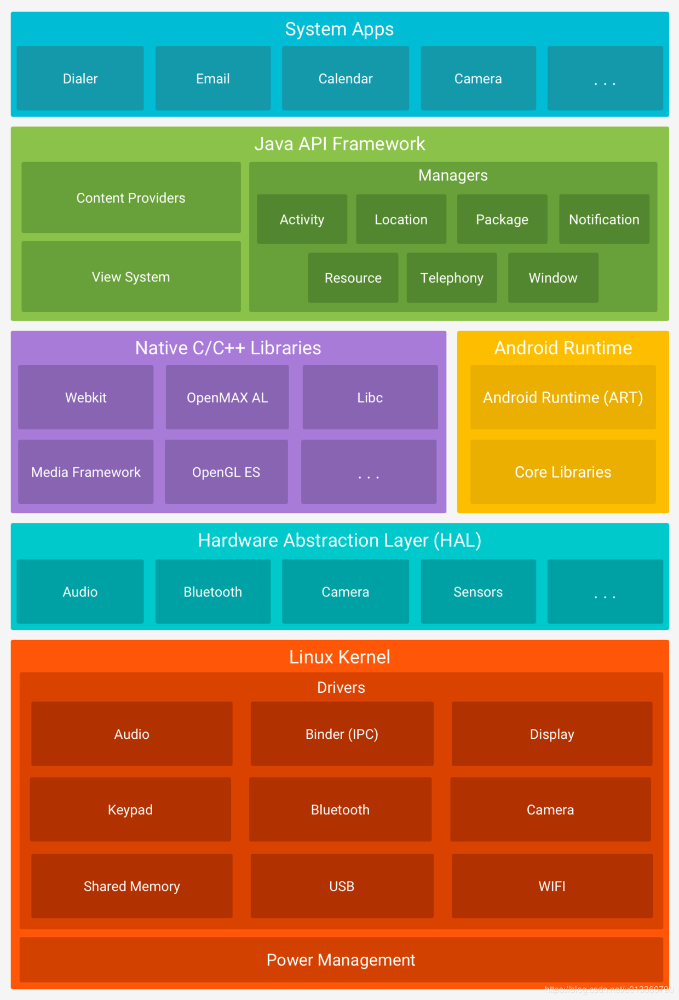
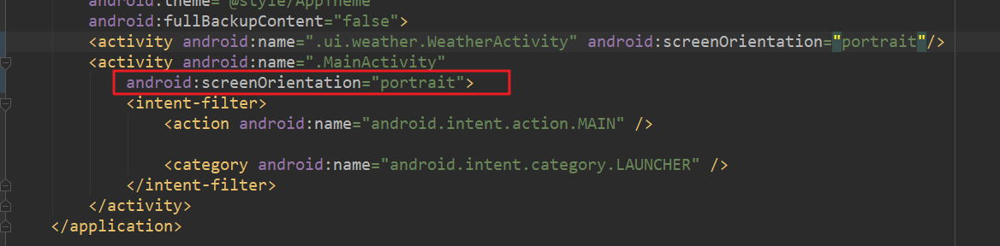
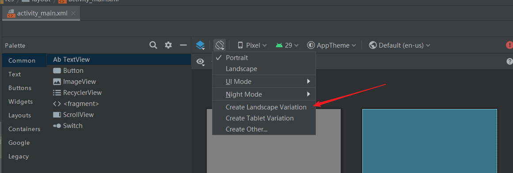
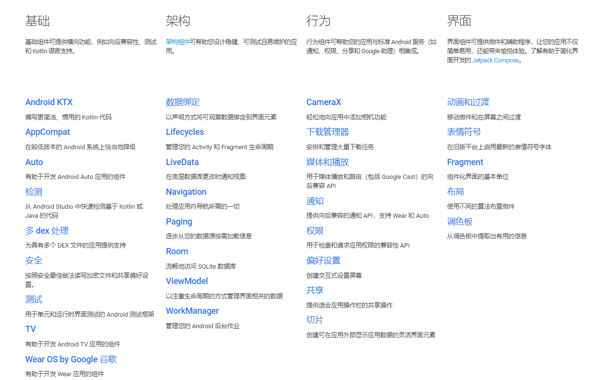
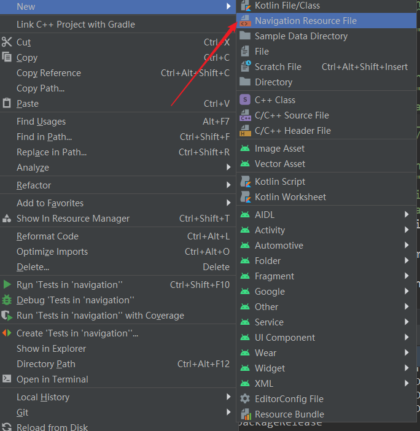
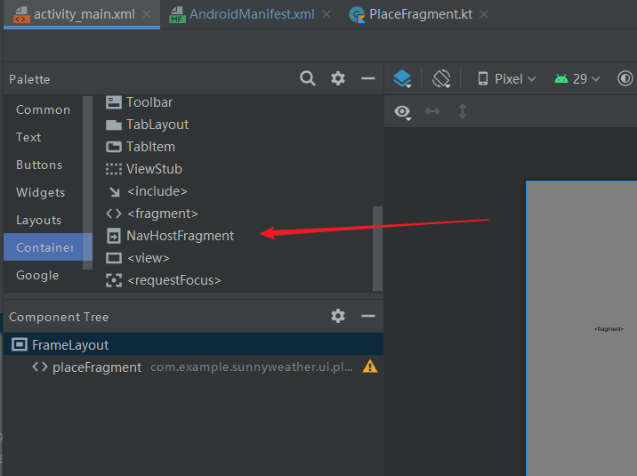
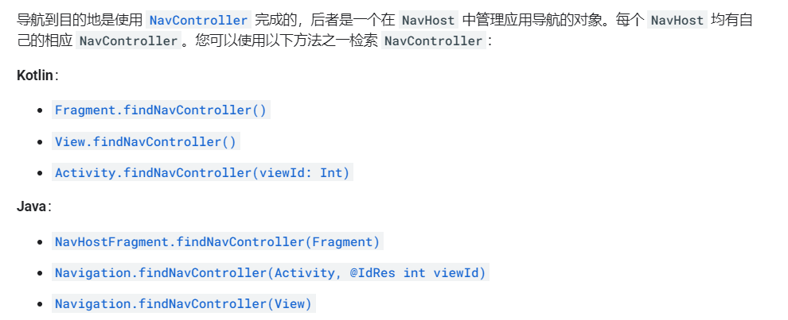
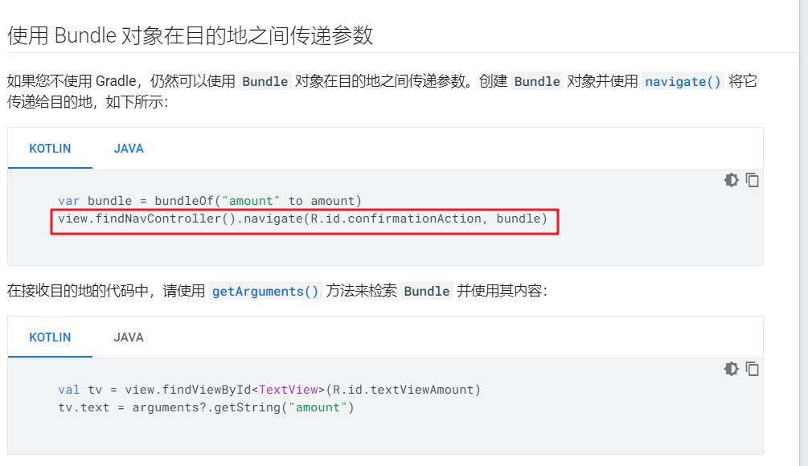

# Android概述

Android架构图



**Linux 内核**
Android 平台的基础是 Linux 内核。例如，Android Runtime (ART) 依靠 Linux 内核来执行底层功能，例如线程和低层内存管理。
使用 Linux 内核可让 Android 利用主要安全功能，并且允许设备制造商为著名的内核开发硬件驱动程序。

**硬件抽象层 (HAL)**
硬件抽象层 (HAL) 提供标准界面，向更高级别的 Java API 框架显示设备硬件功能。HAL 包含多个库模块，其中每个模块都为特定类型的硬件组件实现一个界面，例如相机或蓝牙模块。当框架 API 要求访问设备硬件时，Android 系统将为该硬件组件加载库模块。

**Android Runtime**
对于运行 Android 5.0（API 级别 21）或更高版本的设备，每个应用都在其自己的进程中运行，并且有其自己的 Android Runtime (ART) 实例。ART 编写为通过执行 DEX 文件在低内存设备上运行多个虚拟机，DEX 文件是一种专为 Android 设计的字节码格式，经过优化，使用的内存很少。编译工具链（例如 Jack）将 Java 源代码编译为 DEX 字节码，使其可在 Android 平台上运行。

ART 的部分主要功能包括：
==预先 (AOT) 和即时 (JIT) 编译==
优化的垃圾回收 (GC)
更好的调试支持，包括专用采样分析器、详细的诊断异常和崩溃报告，并且能够设置监视点以监控特定字段
在 Android 版本 5.0（API 级别 21）之前，==Dalvik== 是 Android Runtime。如果您的应用在 ART 上运行效果很好，那么它应该也可在 Dalvik 上运行，但反过来不一定。

Android 还包含一套核心运行时库，可提供 Java API 框架使用的 Java 编程语言大部分功能，包括一些 Java 8 语言功能。

**原生 C/C++ 库**
许多核心 Android 系统组件和服务（例如 ART 和 HAL）构建自原生代码，需要以 C 和 C++ 编写的原生库。Android 平台提供 Java 框架 API 以向应用显示其中部分原生库的功能。例如，您可以通过 Android 框架的 Java OpenGL API 访问 OpenGL ES，以支持在应用中绘制和操作 2D 和 3D 图形。

如果开发的是需要 C 或 C++ 代码的应用，可以使用 Android NDK 直接从原生代码访问某些原生平台库。

**Java API 框架**
您可通过以 Java 语言编写的 API 使用 Android OS 的整个功能集。这些 API 形成创建 Android 应用所需的构建块，它们可简化核心模块化系统组件和服务的重复使用，包括以下组件和服务：

丰富、可扩展的视图系统，可用以构建应用的 UI，包括列表、网格、文本框、按钮甚至可嵌入的网络浏览器
资源管理器，用于访问非代码资源，例如本地化的字符串、图形和布局文件
通知管理器，可让所有应用在状态栏中显示自定义提醒
Activity 管理器，用于管理应用的生命周期，提供常见的导航返回栈
内容提供程序，可让应用访问其他应用（例如“联系人”应用）中的数据或者共享其自己的数据
开发者可以完全访问 Android 系统应用使用的框架 API。

**系统应用**
Android 随附一套用于电子邮件、短信、日历、互联网浏览和联系人等的核心应用。平台随附的应用与用户可以选择安装的应用一样，没有特殊状态。因此第三方应用可成为用户的默认网络浏览器、短信 Messenger 甚至默认键盘（有一些例外，例如系统的“设置”应用）。

系统应用可用作用户的应用，以及提供开发者可从其自己的应用访问的主要功能。例如，如果您的应用要发短信，您无需自己构建该功能，可以改为调用已安装的短信应用向您指定的接收者发送消息。


# 界面布局

xml布局属性说明

| 属性                       | 作用                       | 值                                                           | 说明                                                         |
| -------------------------- | -------------------------- | ------------------------------------------------------------ | ------------------------------------------------------------ |
| android:gravity            | 指定文字在控件中对齐方式   |                                                              |                                                              |
| android:layout_gravity     | 指定控件在布局中对齐方式   |                                                              |                                                              |
| android:textColor          | 文字颜色                   |                                                              |                                                              |
| android:textSize           | 文字大小                   |                                                              |                                                              |
| android:textAllCaps        | 文字是否大写               | 默认true                                                     |                                                              |
| android:hint               | 提示性文字                 |                                                              |                                                              |
| android:maxLines           | 指定EditText输入时最多行数 |                                                              |                                                              |
| android:src                | 引入资源                   |                                                              |                                                              |
| android:visibility         | 控件可见性                 | visible 可见(默认)<br />invisible 不可见<br />gone 不可见且不占用屏幕 |                                                              |
| android:orientation        | 布局中控件的排列方式       | vertical 垂直<br />horizontal 水平(默认)                     | 如果排列方式为水平，则控件在布局中的对齐方式只在垂直方向上有效<br />反之亦然。因为水平方向上的长度会随着控件增长而改变 |
| android:layout_weight      | 按比例指定控件大小         |                                                              | 此大小使在布局的方向上的大小。如：布局是水平，则该属性只能指定水平方向上控件大小 |
| android:background         | 布局或控件背景             |                                                              |                                                              |
| android:layout_margin      | 控件在各个方向上的间距     |                                                              | android:layout_marginTop Bottom Left Right<br />Left和Right已经被Strat和End代替 |
| android:layout_marginStart |                            |                                                              | 由于某些语言是从右往左的，所以Google建议使用Start来兼容这两种顺序 |
| android:fitsSystemWindows  | 为系统状态栏留出空间       |                                                              | 设置在最顶端的布局中                                         |

**补充**

- 固定值
  - 给控件指定固定值，常用dp
  - 给文字指定固定值，常用sp
- 使用 `“|”` 可以给一个属性指定多个值


**每种控件还有自己特殊的属性**

ProgressBar

默认是圆形进度条

```xml
//水平进度条
style="?android:attr/progressBarStyleHorizontal"
android:max="100"
```


# 本地化

为了适应多语言版本，需要进行本地化适配

## 文字适配

右键strings.xml，选择Open Translation Editor


# 屏幕旋转

对于可以旋转的布局，其中的空间位置最好以百分比的方式设置

## 设置Activity固定

对于一些Activity，其方向应该是不变的。

如：微信竖屏，大部分游戏横屏




## 自定义旋转之后的布局

屏幕旋转时，会重启Activity，所以要在Activity销毁前保存数据

现在使用viewModel来保存数据，因为生命周期不一样




# Jetpack

Jetpack是一个开发组件工具集。这些组件大部分不依赖任何Android系统版本（定义在Andoirdx库中），拥有很好的向下兼容性

[参考网址](https://developer.android.google.cn/jetpack/)

**Jetpack架构图**




## ViewModel

**作用**

专门用于存放与界面相关的数据

**特点**

ViewModel的生命周期和Activity的生命周期不一样

由于其生命周期比Activity长，所以可以用于保存数据。例如：手机横竖屏旋转时，Activity会重建，存放在Activity中的数据会丢失，如果存放在ViewModel就不会丢失。只有Activity销毁，ViewModel才会销毁


### 引入ViewModel

```
dependencies{
	...
	implementation "androidx.lifecycle:lifecycle-extensions:2.1.0"
}
```


### 使用ViewModel

ViewModel不能够直接在Activity中创建，因为声明周期不一样

通过ViewModelProvider(Activity或Fragment).get(ViewModel::class.java)获取ViewModel实例

```kotlin
//自定义ViewModel
class MainViewModel: ViewModel(){
    var counter = 0
}
//使用ViewModel
class MainActivity: AppCompatActivity(){
    lateinit var viewModel: MainViewModel
    
    override fun onCreate(savedInstanceState: Bundle?){
        super.onCreate(savedInstanceState)
        ...
        viewModel = ViewModelProviders(this).get(MainViewModel::class.java)
    }
}
```

**ViewModel传参**

上面那种方式只能获取ViewModel，但不能够传入参数

传参需要借助ViewModelProvider.Factory实现

```kotlin
//自定义ViewModel
class MainViewModel(private val countReserved: Int): ViewModel(){
    var counter = countReserved
}
//自定义ViewModelProvider.Factory
class MainViewModelFactory(private val countReserved: Int): ViewModelProvider.Factory{
    override fun <T: ViewModel> create(modelClass: Class<T>): T{
        return MainViewModel(countReserved) as T
    }
}
//使用ViewModel
class MainActivity: AppCompatActivity(){
    lateinit var viewModel: MainViewModel
    lateinit var sp: SharedPreferences
    override fun onCreate(savedInstanceState: Bundle?){
        super.onCreate(savedInstanceState)
        ...
        sp = getPreferences(Context.MODE_PRIVATE)
        //恢复数据
        val countReserved = sp.getInt("count_reserved", 0)
        viewModel = ViewModelProviders.of(this,MainViewModelFactory(countReserved)).get(MainViewModel::class.java)
        ...
    }
    
    override fun onPause(){
        super.onPause()
        //Activity从前台退出时，保存数据到ViewModel
        sp.edit{
            putInt("count_reserved",viewModel.counter)
        }
    }
}
```


## Lifecycles

Lifecycles组件用于监听并获取Activity的生命周期

### 使用Lifecycles

使用**@OnLifecycleEvent注解**，并传入一种生命周期事件，来处理对应的生命周期

**共有7种生命周期事件**

ON_CREATE ON_START ON_RESUME ON_PAUSE ON_STOP ON_DESTROY ON_ANY(匹配任意生命周期，即前6种都可以匹配)


**注册监听器**

lifecycleOwner.lifercycle.addObserver(Observer())

Activity和Fragment本身就是LifecycleOwner的实例

```kotlin
//监听器LifecycleObserver 
class MyObserver: LifecycleObserver{
    @OnLifecycleEvent(Lifecycle.Event.ON_START)
    fun activityStart(){
        Log.d("MyObserver", "activityStart")
    }
    ...
}
class MainActivity: AppCompatActivity{
    ...
    override fun onCreate(savedInstanceState: Bundle?){
        ...
        //直接使用lifecycler函数获取当前Lifecycle实例，然后给实例注册监听器
        lifecycle.addObserver(MyObserver())
    }
}
```

上面这种方式只能被动接受生命周期变化，如果想要主动获取当前生命周期，可以将lifecycle实例传入监听器，然后使用**lifecycle.currentState**来主动获取生命周期状态

```kotlin
//监听器LifecycleObserver 
class MyObserver(val lifecycle: Lifecycle): LifecycleObserver{
    @OnLifecycleEvent(Lifecycle.Event.ON_START)
    fun activityStart(){
        Log.d("MyObserver", "activityStart")
    }
    ...
}
//主动获取生命周期状态
MyObserver().lifecycle.currentState
```


## LiveData

LiveData是一种响应式编程组件，它可以包含任何类型的数据，并且在**数据发生变化的时候通知给观察者**。

==数据变化：是要调用setValue()和postValue()方法，就触发数据变化事件，并不会判断即将设置数据和原有数据是否相同==

LiveData在绝大多数的情况下，都适合ViewModel一起使用


### LiveData类

LiveData 类是一个抽象类，所以无法直接创建。平时我们主要使用它的两个子类：MutableLiveData、MediatorLiveData

```java
LiveData 有以下 public 方法：
T getValue() 获取 LiveData 的值
observe(LifecycleOwner owner, Observer<? super T> observer) 添加观察者，绑定 Lifecycle 生命周期，当 Lifecycle 处于 STARTED 或者 RESUMED 时，认为此观察者是 active 的，否则认为此观察者是 inactive 的。只有处于 active 状态的观察者才会接收消息。
当 Lifecycle 状态变为 DESTROYED 时，此观察者会被自动移除，所以我们不必担心内存泄漏。
observeForever(Observer<? super T> observer) 添加观察者，不绑定生命周期。这样的观察者需要我们调用 removeObserver 手动移除，这样的观察者若没有手动移除，会导致内存泄漏。
removeObserver(Observer<? super T> observer) 移除观察者
removeObservers(LifecycleOwner owner) 移除绑定此 Lifecycle 的所有观察者
boolean hasActiveObservers() 是否有 active 的 observers
boolean hasObservers() 是否有 observers，无论 active 还是 inactive
    
LiveData 有以下 protected 方法：
void onActive() 当观察者数量从 0 变成 1 时，回调此方法
void onInactive() 当观察者数量从 1 变成 0 时，回调此方法
void setValue(T value) 设置 LiveData 的值，不允许在子线程中调用
void postValue(T value) post 一个 task 到主线程中，设置 LiveData 的值，所以可以在子线程中调用
如果我们需要这些 protected 方法，可以自定义类继承 LiveData 并重载他们。
```

#### MutableLiveData类

它相对于 LiveData 的区别就是：它不是抽象类，并且公开了 postValue、setValue 两个方法

```java
//这里也可以看出来，Kotlin还是基于Java开发的，底层的一些类都是利用Java实现
public class MutableLiveData<T> extends LiveData<T> {

    /**
     * Creates a MutableLiveData initialized with the given {@code value}.
     *
     * @param value initial value
     */
    public MutableLiveData(T value) {
        super(value);
    }

    /**
     * Creates a MutableLiveData with no value assigned to it.
     */
    public MutableLiveData() {
        super();
    }

    @Override
    public void postValue(T value) {
        super.postValue(value);
    }

    @Override
    public void setValue(T value) {
        super.setValue(value);
    }
}

```


#### MediatorLiveData 类

用来合并多个 LiveData 数据。设想一个场景，我们有两个 LiveData 数据，任何一个数据改变时，都要更新同一个 UI。此时我们就可以用 MediatorLiveData 将其合并。

相比 LiveData，MediatorLiveData 新增了两个公开方法：

- `addSource(LiveData<S> source, Observer<? super S> onChanged)` 开始观察此 LiveData，当 source 参数的值改变时，会回调这个 onChanged 函数

- `removeSource(LiveData<S> toRemote)` 移除一个 LiveData 类，停止观察此 LiveData

```java
@SuppressWarnings("WeakerAccess")
public class MediatorLiveData<T> extends MutableLiveData<T> {
    private SafeIterableMap<LiveData<?>, Source<?>> mSources = new SafeIterableMap<>();

    /**
     * Starts to listen the given {@code source} LiveData, {@code onChanged} observer will be called
     * when {@code source} value was changed.
     * <p>
     * {@code onChanged} callback will be called only when this {@code MediatorLiveData} is active.
     * <p> If the given LiveData is already added as a source but with a different Observer,
     * {@link IllegalArgumentException} will be thrown.
     *
     * @param source    the {@code LiveData} to listen to
     * @param onChanged The observer that will receive the events
     * @param <S>       The type of data hold by {@code source} LiveData
     */
    @MainThread
    public <S> void addSource(@NonNull LiveData<S> source, @NonNull Observer<? super S> onChanged) {
        Source<S> e = new Source<>(source, onChanged);
        Source<?> existing = mSources.putIfAbsent(source, e);
        if (existing != null && existing.mObserver != onChanged) {
            throw new IllegalArgumentException(
                    "This source was already added with the different observer");
        }
        if (existing != null) {
            return;
        }
        if (hasActiveObservers()) {
            e.plug();
        }
    }

    /**
     * Stops to listen the given {@code LiveData}.
     *
     * @param toRemote {@code LiveData} to stop to listen
     * @param <S>      the type of data hold by {@code source} LiveData
     */
    @MainThread
    public <S> void removeSource(@NonNull LiveData<S> toRemote) {
        Source<?> source = mSources.remove(toRemote);
        if (source != null) {
            source.unplug();
        }
    }

    @CallSuper
    @Override
    protected void onActive() {
        for (Map.Entry<LiveData<?>, Source<?>> source : mSources) {
            source.getValue().plug();
        }
    }

    @CallSuper
    @Override
    protected void onInactive() {
        for (Map.Entry<LiveData<?>, Source<?>> source : mSources) {
            source.getValue().unplug();
        }
    }

    private static class Source<V> implements Observer<V> {
        final LiveData<V> mLiveData;
        final Observer<? super V> mObserver;
        int mVersion = START_VERSION;

        Source(LiveData<V> liveData, final Observer<? super V> observer) {
            mLiveData = liveData;
            mObserver = observer;
        }

        void plug() {
            mLiveData.observeForever(this);
        }

        void unplug() {
            mLiveData.removeObserver(this);
        }

        @Override
        public void onChanged(@Nullable V v) {
            if (mVersion != mLiveData.getVersion()) {
                mVersion = mLiveData.getVersion();
                mObserver.onChanged(v);
            }
        }
    }
}

```

**示例**

```kotlin
class MainActivity : AppCompatActivity() {
    private val liveData1: MutableLiveData<Int> = MutableLiveData(0)
    private val liveData2: MutableLiveData<Int> = MutableLiveData(0)
    private val liveDataMerger: MediatorLiveData<Int> = MediatorLiveData<Int>().apply {
        this.value = 0
    }

    override fun onCreate(savedInstanceState: Bundle?) {
        super.onCreate(savedInstanceState)
        setContentView(R.layout.activity_main)
        // 
        liveDataMerger.addSource(liveData1) {
            //liveData1数据发生变化执行
            liveDataMerger.value = it
            // 红色表示此时为 LiveData1
            tv.setTextColor(Color.RED)
        }
        liveDataMerger.addSource(liveData2) {
            //liveData1数据发生变化执行
            liveDataMerger.value = it
            // 绿字表示此时为 LiveData2
            tv.setTextColor(Color.GREEN)
        }
        liveDataMerger.observe(this, Observer {
            //liveData1和liveData2其中一个发生变化执行
            tv.text = it.toString()
        })
        btn1.setOnClickListener {
            liveData1.value = liveData1.value?.plus(1)
        }
        btn2.setOnClickListener {
            liveData2.value = liveData2.value?.plus(2)
        }
    }
}

```


### 使用LiveData

LiveData提供了3种读写数据的方式

- getValue() 获取LiveData包含的数据
- setValue() 处于主线程时，给LiveData设置数据
- postValue() 处于子线程时，给LiveData设置数据

```kotlin
class MainViewModel(countReserved: Int): ViewModel(){
	val counter = MutableLiveData<Int>()
    init{
        counter.value = countReserved
    }
    fun plusOne(){
        //如果为空，则为0
        val count = counter.value ?:0
        counter.value = count + 1
    }
    fun clear(){
        counter.value = 0
    }
}
//使用ViewModel
class MainActivity: AppCompatActivity(){
    lateinit var viewModel: MainViewModel
    lateinit var sp: SharedPreferences
    override fun onCreate(savedInstanceState: Bundle?){
        super.onCreate(savedInstanceState)
        ...
        sp = getPreferences(Context.MODE_PRIVATE)
        //恢复数据
        val countReserved = sp.getInt("count_reserved", 0)
        viewModel = ViewModelProviders.of(this,MainViewModelFactory(countReserved)).get(MainViewModel::class.java)
        plusOneBtn.setOnClickListener{
            viewModel.plusOne()
        }
        clearBtn.serOnClickListener{
            viewModel.clear()
        }
        //给LiveData注册监听器，当ViewModel中counter(LiveData)发生变化，就会触发回调
        //这里Observer并没有使用函数式API
        viewModel.counter.observe(this, Observer{ count ->
                                                 infoText.text = count.toString()
                                                 })
    }
    
    override fun onPause(){
        super.onPause()
        //Activity从前台退出时，保存数据到ViewModel
        sp.edit{
            putInt("count_reserved",viewModel.counter)
        }
    }
}
```

 `viewModel.counter.observe(LifecycleOwner owner,  Observer<? super T> observer) `  该函数中由于两个参数都是单抽象方法接口

当一个Java方法同时接受两个单抽象方法接口时，要么同时使用函数式API，要么都不使用函数式API

由于传入的第一个参数是this，并没有使用函数式API，所以Observer也不能使用函数式API

**Kotlin语言扩展**

lifecycle-livedata-ktx用于为LiveData提供Kotlin语言扩展

```groovy
dependencies{
	...
    implementation "androidx.lifecycle:lifecycle-livedata-ktx:2.2.0"
}
```

然后就可以使用

```kotlin
viewModel.counter.observe(this){ count ->
                                infoText.text = count.toString()
                               }
```

**解决数据暴露问题**

```kotlin
//Lambda表达式中参数count是一个可变的LiveData，不能直接暴露给外界
viewModel.counter.observe(this){ count ->
                                infoText.text = count.toString()
                               }
```

**改进**

将LiveData对象的set()方法设置为私有

```kotlin
class MainViewModel(countReserved: Int): ViewModel(){
    val counter = MutableLiveData<Int>()
    	private set()
    init{
        counter.value = countReserved
    }
    fun plusOne(){
        //如果为空，则为0
        val count = counter.value ?:0
        counter.value = count + 1
    }
    fun clear(){
        counter.value = 0
    }
}
```


### Transformations转换类

#### map

对LiveData数据做一个映射操作

**原理**

给原LiveData对象添加一个监听器，如果改变，执行Lambda表达式，然后返回一个新的LiveData对象

```kotlin
public static <X, Y> LiveData<Y> map(
    @NonNull LiveData<X> source,            
    @NonNull final Function<X, Y> mapFunction) {
    //map函数实际上利用了MediatorLiveData类来实现
    final MediatorLiveData<Y> result = new MediatorLiveData<>();
    //给原对象添加一个监听器
    result.addSource(source, new Observer<X>() {
        @Override
        public void onChanged(@Nullable X x) {
            //原对象改变，调用onChanged，用apply()处理原对象返回新结果，更新result
            result.setValue(mapFunction.apply(x));   
        }
    });
    //返回一个MediatorLiveData
    return result;
}
```

**使用场景**

用户只需要结果中的某些字段，那就可以对结果进行映射，将需要的字段封装成新的结果返回

```kotlin
class MainViewModel(countReserved: Int):ViewModel(){
    val userLiveData = MutableLiveData<User>()
    //当userLiveData中的数据发生变化，监听函数就会执行，userName也随之变化
    val userName: LiveData<String> = Transformations.map(userLiveData){ user ->
                                                                      "${user.firstName} ${user.lastName}"}
}
```


#### switchMap

将一个不可观察的LiveData转换成一个可观察的LiveData

**原理**

使用一个中间LiveData来获取外界调用，然后对该LiveData进行监听，改变时执行对应逻辑操作，返回结果

```java
public static <X, Y> LiveData<Y> switchMap(
    @NonNull LiveData<X> source,
    @NonNull final Function<X, LiveData<Y>> switchMapFunction) {
    //map函数也是利用了MediatorLiveData类来实现
    final MediatorLiveData<Y> result = new MediatorLiveData<>();
    //给result添加一个源（source），当变化时执行Observer.onChanged()
    result.addSource(source, new Observer<X>() {
        LiveData<Y> mSource;

        public void onChanged(@Nullable X x) {
            //新的结果
            LiveData<Y> newLiveData = switchMapFunction.apply(x);
            //被使用过，已经存在，返回
            //注意第一次执行时，此处是执行不到的，因为mSource为null
            if (mSource == newLiveData) {return;} 
            //每次第一源的内容发生改变的时候，都会对第二源执行removeSource()并再addSource()。也就是进行替换
            if (mSource != null) { result.removeSource(mSource); }
            mSource = newLiveData;
            if (mSource != null) {
                //将新的结果作为第二个源添加到result
                //第二个源改变时，会将传递给result
                result.addSource(mSource, new Observer<Y>() {
                    @Override
                    public void onChanged(@Nullable Y y) {
                        result.setValue(y);
                    }
                });
            }
        }
    });

    return result;
}
```

**使用场景**

ViewModel中的某个LiveData对象是调用另外的方法获取的，借助switchMap()方法，将这个LiveData对象转换成另外一个可观察的LiveData对象

```kotlin
class MainViewModel(countReserved: Int):ViewModel(){
    //中间LiveData
    private val userIdLiveData = MutableLiveData<String>()
    
    //这里还可以利用上面的map函数，对结果进行一个映射(可选)
    val userName: LiveData<String> = Transformations.map(userLiveData){ user ->
                                                                      "${user.firstName} ${user.lastName}"}
    //监听中间LiveData，进行实际逻辑操作，返回一个可观察的LiveData对象
    private val userLiveData: LiveData<User> = Transformations.switchMap(userIdLiveData){ userId ->
                                                                                  Repository.getUser(userId)}
    //调用接口，将传入参数写到中间LiveData
    fun getUser(userId: String){
        userIdLiveData.value = userId
    }
}

class MainActivity: AppCompatActivity(){
    ...
    override fun onCreate(savedInstanceState: Bundle?){
       ...
        viewModel.userName.observe(this){ userName -> infoText.text = userName
        }
    }
}
```


## Navigation

[参考网址](https://developer.android.google.cn/guide/navigation/navigation-getting-started)

导航组件由以下三个关键部分组成：

- 导航图 `Nav graph`：在一个集中位置包含所有导航相关信息的 XML 资源。这包括应用内所有单个内容区域（称为*目标*）以及用户可以通过应用获取的可能路径(**fragment**之间跳转路径)。
- `NavHost`：显示导航图中目标的**空白容器**。导航组件包含一个默认 `NavHost` 实现 ([`NavHostFragment`](https://developer.android.google.cn/reference/androidx/navigation/fragment/NavHostFragment))，可显示 Fragment 目标。
- `NavController`：在 `NavHost` 中管理应用导航的对象。当用户在整个应用中移动时，`NavController` 会安排 `NavHost` 中目标**内容的交换**。`NavController`和 `NavHost` 一一对应

在应用中导航时，您告诉 `NavController`，您想沿导航图中的特定路径导航至特定目标，或直接导航至特定目标。`NavController` 便会在 `NavHost` 中显示相应目标

**创建导航图**



**给导航图添加节点(Fragment)**

1. 右击Fragment，设置默认的Fragment
2. 拖动Fragment边框上的锚点来描绘路径


**给导航图设置默认的NavHost**

创建一个主界面，然后选择Containers中的NavHostFragment，然后在主界面中设置NavHostFragment属性




**获取NavController**



执行Action并传参



# Android开发记录

## 错误

### Material组件报错

[参考网址](https://www.cnblogs.com/xiaolouxifeng/p/13063825.html)

Material升级到1.1.0以后，部分Material控件需要MaterialComponents包下的theme才支持，而新建项目默认使用的还是Theme.AppCompat包，我们手动改成Theme.MaterialComponents即可。

**错误**

`Error inflating class com.google.android.material.card.MaterialCardView` 或 `Error inflating class com.google.android.material.button.MaterialButton`等错误

**解决**

- 直接修改整个项目的主题

```xml
<!-- styles.xml-->
<!-- 默认-->
<style name="AppTheme" parent="Theme.AppCompat.Light.DarkActionBar">
<!-- 修改-->
<style name="AppTheme" parent="Theme.MaterialComponents.Light.DarkActionBar">  
```

弊端：MaterialComponents样式的弹窗、Snackbar等会和AppCompat样式有很大不同，随意修改可能达不到我们预期的效果

- 修改目标控件下的主题

```xml
<com.google.android.material.card.MaterialCardView
...
给布局添加主题
android:theme="@style/Theme.MaterialComponents.NoActionBar"/>
```


## 警告

### baselineAligned

[参考网址](https://www.jianshu.com/p/07ba80fdd86a)

### 不允许备份

[参考网址](https://blog.csdn.net/qq_17338093/article/details/55506543)