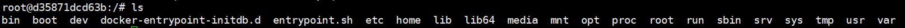

# Docker安装

[Docker使用参考网址](https://docs.docker.com/engine/install/centos/)

[docker 安装文件说明](https://www.cnblogs.com/imageSet/p/12771048.html)

安装前配置

```
# 删除旧版本
sudo yum remove docker \
                  docker-client \
                  docker-client-latest \
                  docker-common \
                  docker-latest \
                  docker-latest-logrotate \
                  docker-logrotate \
                  docker-engine

# 配置仓库
sudo yum install -y yum-utils
sudo yum-config-manager \
    --add-repo \
    https://download.docker.com/linux/centos/docker-ce.repo
```

- 直接安装（建议使用云服务器

```
# 安装引擎(如果是本地虚拟机很可能因为网络问题超时，如果想这样装，建议使用云服务器)
sudo yum install docker-ce docker-ce-cli containerd.io
# 启动docker
sudo systemctl start docker
# 检测docker是否开启
docker -v
# 设置开启自启动
sudo systemctl enable docker
```

- 手动安装

[docker rpm文件下载](https://download.docker.com/linux/centos/7/x86_64/stable/Packages/)

[container-selinux文件下载](https://centos.pkgs.org/7/centos-extras-x86_64/container-selinux-2.107-3.el7.noarch.rpm.html)

```
# 必须按照下面顺序依次安装，前面的软件都是后面软件安装所需要的依赖
yum -y install policycoreutils-python
rpm -ivh docker-ce-cli-19.03.9-3.el7.x86_64.rpm
rpm -ivh container-selinux-2.107-3.el7.noarch.rpm
rpm -ivh containerd.io-1.2.6-3.3.el7.x86_64.rpm
rpm -ivh docker-ce-19.03.9-3.el7.x86_64.rpm
# 启动docker
sudo systemctl start docker
# 检测docker是否开启
docker -v
# 设置开启自启动
sudo systemctl enable docker
```

**配置docker阿里云镜像加速**

[参考网址](https://www.runoob.com/docker/docker-mirror-acceleration.html)


# Docker常用命令及操作

## 镜像操作

| 操作 | 命令                                            | 说明                                                     |
| ---- | ----------------------------------------------- | -------------------------------------------------------- |
| 检索 | docker  search 关键字  eg：docker  search redis | 我们经常去docker  hub上检索镜像的详细信息，如镜像的TAG。 |
| 拉取 | docker pull 镜像名:tag                          | :tag是可选的，tag表示标签，多为软件的版本，默认是latest  |
| 列表 | docker images                                   | 查看所有本地镜像                                         |
| 删除 | docker rmi image-id                             | 删除指定的本地镜像                                       |

https://hub.docker.com/

## 容器操作

软件镜像（QQ安装程序）----运行镜像----产生一个容器（正在运行的软件，运行的QQ）；

| 操作             | 命令                                                         | 说明                               |
| ---------------- | ------------------------------------------------------------ | ---------------------------------- |
| 运行             | docker run 参数 镜像名\|镜像id <br />常用参数：<br />-d：后台运行<br />-p：端口映射<br />--name：命名，默认是镜像名<br />-v: 将本地目录挂载到容器的某个目录(即使用本地目录替换容器中目录)<br/>--name: 给容器命名<br/>-u: 指定容器用户<br />--restart= 自启动参数，always  容器随docker重启自启动，no表示不自启动 | 运行指定的镜像，生成容器并启动容器 |
| 启动             | docker start 容器id                                          | 重新启动容器                       |
| 停止             | docker stop 容器id                                           | 暂停正在运行的容器                 |
| 删除             | docker rm 容器id                                             | 删除指定容器                       |
| 查看             | docker ps<br />-a：所有容器                                  | 查看正在运行的容器                 |
| 进入容器         | docker exec -it (容器名/容器id)                              |                                    |
| 退出容器         | Ctrl + P + Q                                                 |                                    |
| 查看容器日志     | docker logs 容器id                                           |                                    |
| 检查端口是否开启 | curl 内网地址:端口号                                         |                                    |
| 修改容器配置     | docker update 参数 容器名                                    |                                    |


## 安装Tomcat

````shell
1、搜索镜像
[root@localhost ~]# docker search tomcat
2、拉取镜像
[root@localhost ~]# docker pull tomcat
3、根据镜像启动容器
docker run --name mytomcat -d tomcat:latest
4、docker ps  
查看运行中的容器
5、 停止运行中的容器
docker stop  容器的id
6、查看所有的容器（启动的与停止的）
docker ps -a
7、启动容器(没做端口映射)
docker start 容器id
8、删除一个容器
 docker rm 容器id
9、启动一个做了端口映射的tomcat
[root@localhost ~]# docker run -d -p 8888:8080 tomcat
-d：后台运行容器，并返回容器ID
-p: 将主机的端口映射到容器的一个端口    主机端口:容器内部的端口
10、测试该端口是否打开
[root@localhost ~]# curl 内网地址:8888
11、如果端口没打开，会显示拒绝连接，简单关闭了linux的防火墙或者打开对应端口
service firewalld status ；查看防火墙状态
service firewalld stop：关闭防火墙
12、如果端口打开，显示404异常
进入容器中
[root@VM_0_11_centos bin]# docker exec -it (容器名/容器id) /bin/bash
root@e9134a7df014:/usr/local/tomcat# mv webapps webapps2
root@e9134a7df014:/usr/local/tomcat# mv webapps.dist webapps
退出容器
Ctrl + P + Q
13、查看容器的日志
docker logs container-name/container-id
````

https://docs.docker.com/engine/reference/commandline/docker/

**启动tomcat命令**

```shell
docker run -d -p 8888:8080 tomcat(镜像名称)
```


## 安装MySQL

**下载mysql镜像**

```shell
docker pull mysql
```

**启动mysql命令**

```shell
# run 运行镜像，生成容器
# -p 端口映射 mysql容器本身就相当于一个小的linux系统，需要将该系统的端口映射到虚拟机的端口
# --name 容器名
# -v 挂载文件夹:mysql容器内部的文件夹   挂载文件就相当于容器内部文件的一个快捷方式 三个文件：日志文件，数据，配置文件
# -e 登录密码
# --restart docker启动时，自动重启
# -d 后台运行
# 最后选择要运行的镜像
sudo docker run -p 3306:3306 --name mysql \
-v /mydata/mysql/log:/var/log/mysql \
-v /mydata/mysql/data:/var/lib/mysql \
-v /mydata/mysql/conf:/etc/mysql \
-e MYSQL_ROOT_PASSWORD=root \
--restart=always \
-d mysql:5.7

# 查看运行docker容器
docker ps
# 进入mysql容器的控制台
docker exec -it id|name /bin/bash
# 退出容器
exit
```

==可以看到mysql容器内部就是一个小的linux系统==



**修改配置文件**

```
[client]
default-character-set=utf8
[mysql]
default-character-set=utf8
[mysqld]
init_connect='SET collation_connection = utf8_unicode_ci'
init_connect='SET NAMES utf8'
character-set-server=utf8
collation-server=utf8_unicode_ci
skip-character-set-client-handshake
skip-name-resolve
```

使用命令 `docker restart mysql`重启

进入容器查看配置：

```
docker exec -it mysql /bin/bash
cat /etc/mysql/my.cnf 
[client]
default-character-set=utf8
[mysql]
default-character-set=utf8
[mysqld]
init_connect='SET collation_connection = utf8_unicode_ci'
init_connect='SET NAMES utf8'
character-set-server=utf8
collation-server=utf8_unicode_ci
skip-character-set-client-handshake
skip-name-resolve
```


**本机连接linux服务器**

如果是云服务，还需要配置服务器，开放3306端口

然后使用数据库软件链接（如navicat）连接

用户名：root

密码：123456


## 安装redis

下载docker

```shell
[root@hadoop-104 ~]# docker pull redis
```

启动docker

```shell
# 为了防止挂载时将挂载文件../conf/redis.conf看做是目录，直接手动创建文件
mkdir -p /mydata/redis/conf
# 创建redis.conf文件，写入   appendonly no   ，表示开启aof备份，因为rdb备份可能不及时，造成最后一次备份丢失
vi /mydata/redis/conf/redis.conf
# 启动redis
docker run -p 6379:6379 --name redis \	
-v /mydata/redis/data:/data \
-v /mydata/redis/conf/redis.conf:/etc/redis/redis.conf \
-d redis redis-server /etc/redis/redis.conf
```

 连接redis客户端

```shell
[root@hadoop-104 ~]# docker exec -it redis redis-cli
127.0.0.1:6379> set key1 v1
OK
127.0.0.1:6379> get key1
"v1"
```