# JVM基础与调优

## JVM简介

### 跨语言的JVM

常见的语言，如Kotlin、Groovy、Scala、JRuby、JavaScript，都可以在JVM上运行

原因：

随着Java7的发布，Java虚拟机的设计者们通过JSR-292规范基本实现在Java虚拟机平台运行非Java语言编写的程序。

JVM不关系是何种语言，只关心字节码文件

### 三大主流JVM

Oracle公司

- HotSpot VM ：HotSpot指热点代码探测技术

- BEA JRockit：(BEA 已被Oracle收购) 专注于服务端应用，世界最快的jvm，完全依靠即时编译器编译后执行。其中的MissionControl服务套件，用来监控、管理和分析生产环境的应用程序工具，被引用到jdk中，即JDK Mission Control(JMC)。

  JMC主要有三大组件：内存泄露检测器、JVM运行时分析器、管理控制台

IBM公司

- J9

#### 其他虚拟机

- SUN Classic VM：世界上第一款商用虚拟机，只提供解释器。
- Exact VM：虚拟机可以知道内存中某个位置的数据具体是什么类型（是引用还是数据）。已经具备现代虚拟机的雏形：热点探测；编译与解释协同工作
- Taobao JVM: 不同虚拟机之间可以进行数据访问，目前已经在淘宝、天猫上线，替换了Oracle官方JVM
- Zing VM：低延迟、快速预热

#### Android虚拟机

- Dalvik VM

  基于java虚拟机，字节码文件由class变成dex

  基于==寄存器架构==，效率高，但是跟硬件耦合度比较高

  5.0使用支持提前编译(不经过字节码)的ART VM替换Dalvik VM

### java历程

JDK6，Java开源并建立OpenJDK，Hotspot称为OpenJDK中默认虚拟机

JDK 1.7u4，正式启用垃圾回收器G1

JDK8，将G1设置为默认的GC，代替CMS

JDK11，发布ZGC垃圾回收器

JDK12，加入了RedHat Shenandoah GC

### 虚拟机定义

虚拟机是用来执行一系列虚拟计算机指令的软件。大致可以分为系统虚拟机和程序虚拟机

系统虚拟机：Visual Box、VMWare，完全是对物理虚拟机的仿真

程序虚拟机：Java虚拟机，专门为执行单个计算机程序而设计

### Java虚拟机性质

Java虚拟机就是java二进制字节码的运行环境。

Java语言是解释性语言，因为java文件编译成字节码后，是由解释器一条一条解释执行

特点：

一次编译，到处运行（java语言可移植性

自动内存管理

自动垃圾回收机制

### Java架构图

Java SE

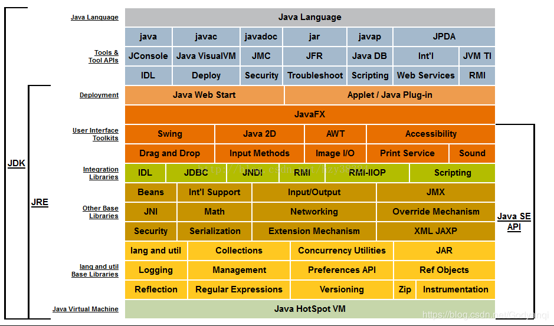

Java EE

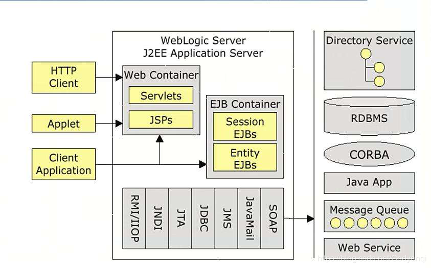

Java ME

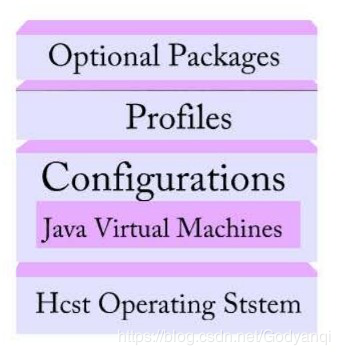

### JVM的组成

JVM被分为三个主要的子系统：类加载器、运行时数据区、执行引擎

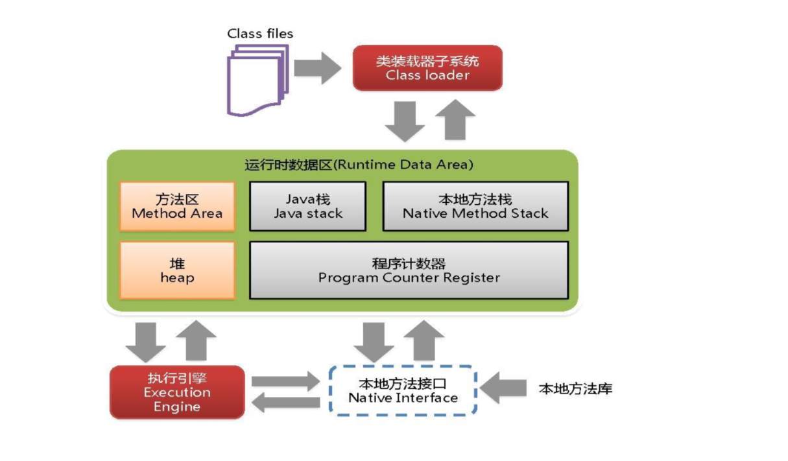

#### 运行时数据区

主要分为5个组件：方法区、堆区、jvm虚拟机栈、PC寄存器、本地方法栈

##### **方法区**

所有**类级别数据**将被存储在这里，包括**静态变量**。每个JVM只有一个方法区，它是一个共享的资源。

方法区（永久代）在jdk8中又叫做元空间Metaspace

- 方法区用于存储已被虚拟机加载的类信息、常量、静态变量、即时编译器（JIT编译器，英文写作Just-In-Time Compiler）编译后的代码等数据。虽然Java虚拟机规范把方法区描述为堆的一个逻辑部分，但是它却有一个别名叫做 Non-Heap（非堆），目的应该是与 Java 堆区分开来。
- 在JDK1.7之前运行时常量池逻辑包含字符串常量池存放在方法区, 此时hotspot虚拟机对方法区的实现为永久代
- 在JDK1.7 字符串常量池被从方法区拿到了堆中, 这里没有提到运行时常量池,也就是说字符串常量池被单独拿到堆,运行时常量池剩下的东西还在方法区, 也就是hotspot中的永久代
- 在JDK1.8之后JVM 已经将运行时常量池从方法区中移了出来，在 Java 堆（Heap）中开辟了一块区域存放运行时常量池。同时在 jdk 1.8中移除整个永久代，取而代之的是一个叫元空间（Metaspace）的区域

##### **堆区**

所有的**对象**和它们相应的**实例变量**以及**数组**将被存储在这里。每个JVM同样只有一个堆区。

==由于方法区和堆区的内存由多个线程共享，所以存储的数据不是线程安全的。==

##### **栈区**

Java栈又叫做jvm虚拟机栈。对每个线程会单独创建一个**运行时栈**。对每个**函数呼叫**会在栈内存生成一个**栈帧**(Stack Frame)。所有的**局部变量**将在栈内存中创建。栈帧被分为三个子实体：

1. **局部变量数组** – 包含多少个与方法相关的**局部变量**并且相应的值将被存储在这里。
2. **操作数栈** – 如果需要执行任何中间操作，**操作数栈**作为运行时工作区去执行指令。
3. **帧数据** – 方法的所有符号都保存在这里。在任意**异常**的情况下，catch块的信息将会被保存在帧数据里面。

##### **PC寄存器**

每个线程都有一个单独的**PC寄存器**来保存**当前执行指令**的地址，一旦该指令被执行，pc寄存器会被**更新**至下条指令的地址。

##### **本地方法栈**

本地方法栈保存本地方法信息。对每一个线程，将创建一个单独的本地方法栈。

==java栈、本地方法栈和程序员计数器是运行是线程私有的内存区域。==

#### 执行引擎

分配给运行时数据区的字节码将由执行引擎执行。执行引擎读取字节码并逐段执行。

##### **解释器**

 解释器能快速的解释字节码，但执行却很慢。 解释器的缺点就是,当一个方法被调用多次，每次都需要重新解释。

##### 编译器

JIT编译器消除了解释器的缺点。执行引擎利用解释器转换字节码，但如果是**重复的代码**（热点代码）则使用JIT编译器将全部字节码编译成本机代码。本机代码将直接用于重复的方法调用，这提高了系统的性能。

1. 中间代码生成器 – 生成中间代码（第一次编译）
2. 代码优化器 – 负责优化上面生成的中间代码
3. 目标代码生成器 – 负责生成机器代码或本机代码（第二次编译）
4. 探测器(Profiler) – 一个特殊的组件，负责寻找被多次调用的方法。

**不能完全使用编译器的原因**

程序开始会存在一定的暂停时间，所以混合使用时，刚加载字节码的时候编译器效率也不能过高，不然也会导致存在暂定时间

==当前Java虚拟机都是解释器和编译器协同工作，解析器负责提高响应时间，编译器负责提高执行性能==

##### 垃圾回收器

收集并删除未引用的对象。可以通过调用"System.gc()"来触发垃圾回收，但并不保证会确实进行垃圾回收。JVM的垃圾回收只收集哪些由new关键字创建的对象。所以，如果不是用new创建的对象，你可以使用finalize函数来执行清理。

#### Java本地接口 (JNI)

JNI 会与本地方法库进行交互并提供执行引擎所需的本地库。

#### 本地方法库

它是一个执行引擎所需的本地库的集合。


#### **详细架构图**

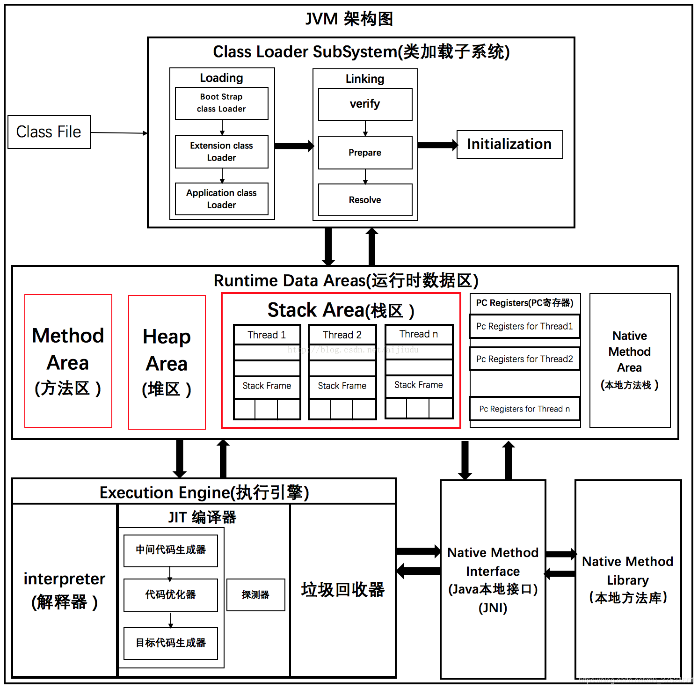

### Java代码的执行流程


#### 编译过程

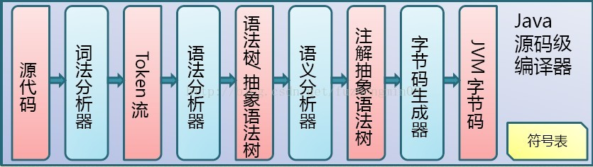

1）词法分析
读取源代码，一个字节一个字节的读进来，找出这些词法中我们定义的语言关键词如：if、else、while等，识别哪些if是合法的哪些是不合法的。这个步骤就是词法分析过程。

词法分析的结果：
就是从源代码中找出了一些规范化的token流，就像人类语言中，给你一句话你要分辨出哪些是一个词语，哪些是标点符号，哪些是动词，哪些是名词。

2）语法分析
就是对词法分析中得到的token流进行语法分析，这一步就是检查这些关键词组合在一起是不是符合Java语言规范。如if的后面是不是紧跟着一个布尔型判断表达式。

语法分析的结果：
就是形成一个符合Java语言规定的抽象语法树，抽象语法树是一个结构化的语法表达形式，它的作用是把语言的主要词法用一个结构化的形式组织在一起。这棵语法树可以被后面按照新的规则再重新组织。

3）语义分析
语法分析完成之后也就不存在语法问题了，语义分析的主要工作就是把一些难懂的，复杂的语法转化成更简单的语法。就如难懂的文言文转化为大家都懂的百话文，或者是注释一下一些不懂的成语。

语义分析结果：
就是将复杂的语法转化为简单的语法，对应到Java就是将foreach转化为for循环，还有一些注释等。最后生成一棵抽象的语法树，这棵语法树也就更接近目标语言的语法规则。

4）字节码生成：将会根据经过注释的抽象语法树生成字节码，也就是将一个数据结构转化为另外一个数据结构。就像将所有的中文词语翻译成英文单词后按照英文语法组装文英文语句。代码生成器的结果就是生成符合java虚拟机规范的字节码。

### JVM的架构模型

#### 基于栈式架构

特点

1. 设计和实现更简单，适用于资源受限的系统
2. 避开了寄存器的分配难题：使用零地址指令方式分配
3. 指令流中的指令大部分是**零地址指令**（只有操作码，没有操作数，每条指令占8bit），其执行过程依赖于操作栈，编译器容易实现，但是**指令集更大**。因为所有数据都在栈中，不需要去寄存区里面取值，只需要对栈中数据进行操作
4. 不需要硬件支持，可移植性更好

==Java编译器输入的指令流就是基于栈的指令集架构==

#### 基于寄存器架构

特点

1. 指令集架构完全依赖硬件，可移植性差
2. 性能优秀和执行更高效
3. 花费更少的指令（长地址指令）完成一项任务。在大部分情况下，指令集以**一地址指令、二地址指令和三地址指令**（每条指令占16bit）为主，**指令集更少**

应用：x86的二进制指令集，如传统PC以及Andoird的Davlik虚拟机

### JVM的生命周期

#### 虚拟机的启动

Java虚拟机的启动是通过引导类加载器(Bootstrap class loader)创建一个初始类(initial class)来完成，这个类是由虚拟机的具体实现指定

#### 虚拟机的执行

执行一个java程序，实际上是执行一个**java虚拟机进程**。

==程序运行，java虚拟机进行启动；程序结束，java虚拟机进程停止==

#### 虚拟机的退出

1. 程序正常执行结束
2. 程序因异常而终止
3. 操作系统出错导致Java虚拟机终止
4. 线程调用Runtime类或System类的exit方法，或Runtime类的halt方法（最终都调用Shutdowm类的halt方法），并且Java安全管理器也允许这次exit或halt操作


## 类加载子系统

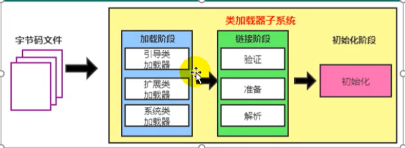

- 类加载子系统负责从文件系统或者网络中加载Class文件，class文件在文件开头有特定的文件标识
- ClassLoader只负责class文件的加载，至于是否可以运行，则由Execution Engine决定
- 加载的类信息存放于方法区。

Java的动态类加载功能是由类加载器子系统处理。当它在运行时（不是编译时）首次引用一个类时，它==加载、链接并初始化==该类文件

### **加载**


#### 类加载器的分类

JVM支持两种类型的加载器：引导类加载器和自定义类加载器（所有派生于抽象类ClassLoader的类加载器）

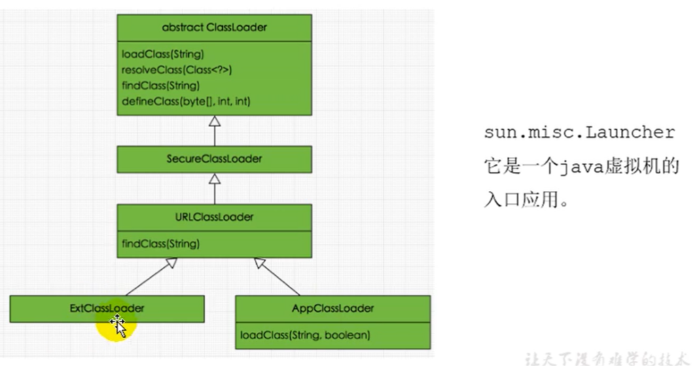

- 启动类加载器(BootStrap class Loader) – 负责从启动类路径中加载类，无非就是rt.jar。这个加载器会被赋予最高优先级。由C和C++代码编写

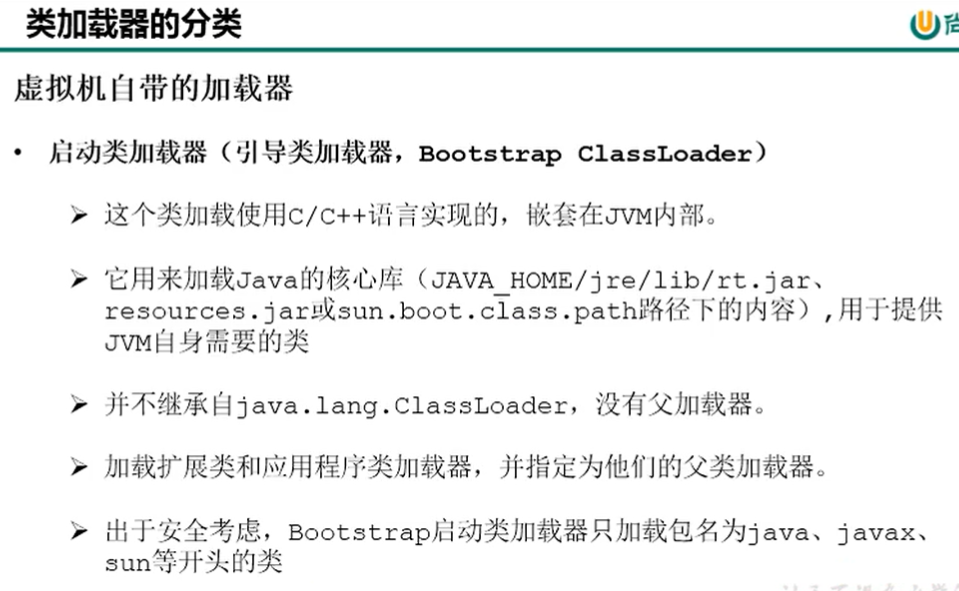

- 扩展类加载器(Extension class Loader) – 负责加载ext 目录(jre\lib)内的类.

  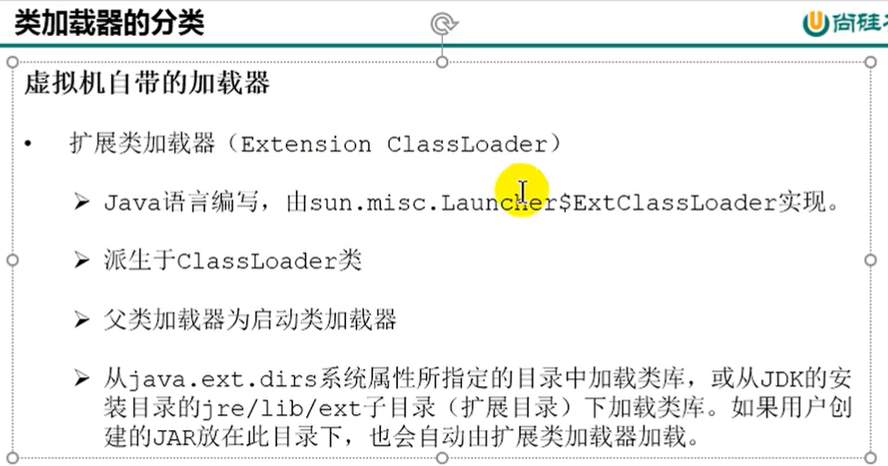

- 系统类加载器(Application class Loader) – 负责加载应用程序级别类路径，涉及到路径的环境变量等etc.

  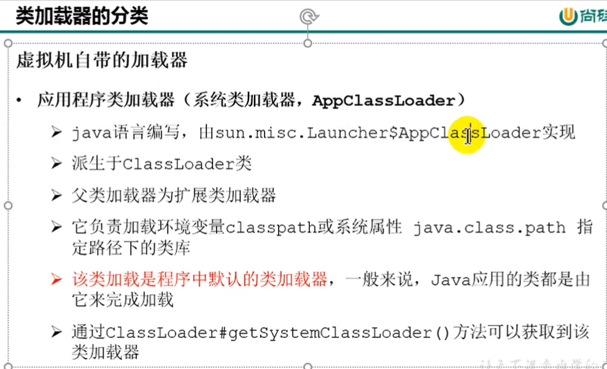

上述的类加载器会遵循委托层次算法（Delegation Hierarchy Algorithm）加载类文件

#### **加载过程**

1. 通过一个类的全限定名获取此类的二进制字节流
2. 将这个字节流所代表的静态存储结构转化为方法区的运行时数据结构
3. ==在内存中生成一个代表这个类的java.lang.Class对象==，作为方法区这个类的各种数据的访问入口

#### **加载.class文件的方式**

1. 从本地系统直接加载
2. 通过网络获取，如：Web Applet
3. 从压缩包中读取，如：jar、war
4. 运行时计算生成，如：动态代理
5. 由其他文件生成，如：JSP应用
6. 从加密文件获取，防止反编译

#### 获取ClassLoader的方法

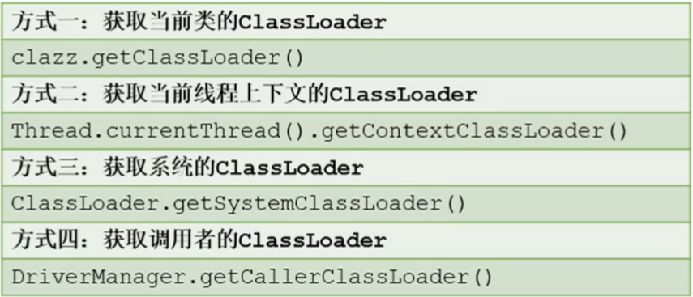

### **链接**

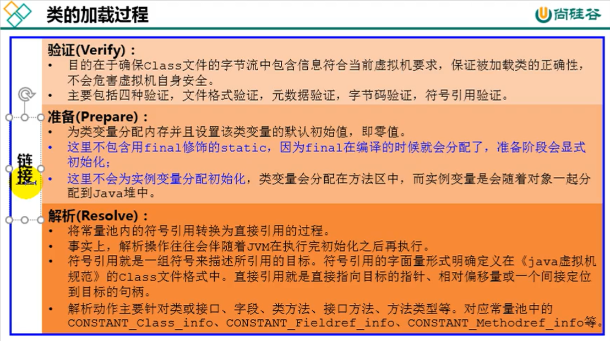

1. **校验** – 字节码校验器会校验生成的字节码是否正确，如果校验失败，我们会得到**校验错误**。

2. **准备** – 分配内存并初始化**默认值**给所有的静态变量。

3. **解析** – 所有**符号内存引用**被**方法区(Method Area)**的**原始引用**所替代。

### **初始化**

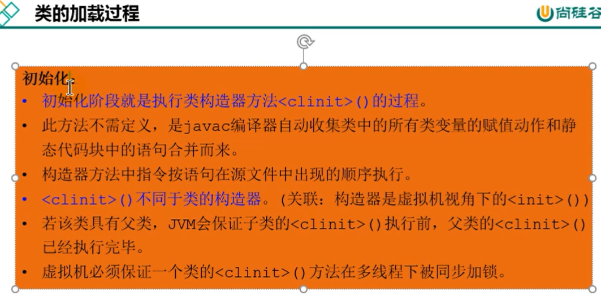

这是类加载的最后阶段，这里所有的**静态变量**会被赋初始值**,** 并且**静态块**将被执行。

**初始化过程**

- ==初始化阶段是执行类构造器<clinit>（）方法的过程==。此方法不需要定义，是由javac编译器自动收集类中的**所有类变量的赋值动作和静态代码块的语句合并产生**，构造器方法中指令按语句在源文件中出现的**顺序执行**

  注意：

  此时类变量已经赋默认值了，这里只是赋初值的过程

```java
/**
* 这段代码num的值是10
* 步骤：
* 	链接阶段：num=0
*	初始化阶段：num=2--->num=10)(按顺序执行)
**/
public class ClassInitTest{
	static{
        num = 2;//可以给num赋值
        System.out.println(num);//不可以调用num，报错：非法的前向引用。原因：下一步
    }
    private static int num = 10;
}
```

==<clinit>（）方法不是类的构造器，构造器在虚拟机视角是<init>（）==

<clinit>（）方法只用来给类变量或静态代码块赋初值，当不存在类变量或静态代码块，则不存在该方法

- 当初始化一个类的时候，如果发现其父类还没有进行过初始化，则先执行父类的<clinit>（）
- 虚拟机会保证一个类的<clinit>（）方法在多线程环境中被同步加锁，所以标明static代码块，其实已经是同步加锁了
- 当范围一个Java类的静态域时，只有真正声名这个域的类才会被初始化


### 自定义类加载器

为什么要自定义加载器

- 隔离加载类
- 修改类加载的方式
- 扩展加载源
- 防止源码泄露，对加密的字节码进行加载

**自定义类加载器的实现步骤**

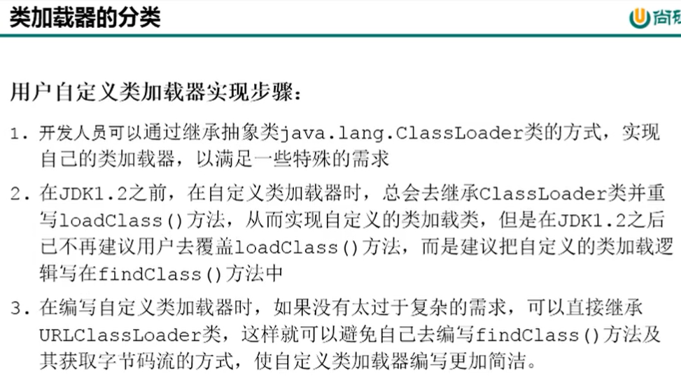


### 双亲委派机制

​	Java虚拟机对class文件采用的是==按需加载==的方式，也就是当需要使用该类时才会将它的class文件加载到内存生成class对象。

​	在加载类的class文件时，Java虚拟机采用的==双亲委派模式==，即把请求交由父类处理，它是一种任务委派模式

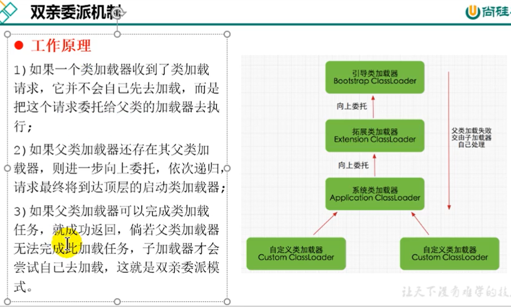

每个类加载器都有特定的加载路径，如果当前类不在该路径下，则类加载不能加载

```java
//加载过程：
//系统类加载器--委托-->扩展类加载器--委托-->引导类加载器-->引导类加载器完成加载
//此时，由于String是在java包下，所以由引导类加载器加载
java.lang.String str = new java.lang.String();
System.out.println(str);
//加载过程：
//系统类加载器--委托-->扩展类加载器--委托-->引导类加载器--无法处理-->扩展类加载器--无法处理-->系统类加载器-->系统类加载器完成加载
Person person = new Person();
System.out.println(person);//虽然
```

```java
package java.lang;
public class String{
    //此处会报错：找不到main方法
    //原因：虽然里面定义了main方法，但是引导类加载器加载的是java核心库中的String类
	public static void main(String[] args){
        System.out.println("hello");
    }
}
```

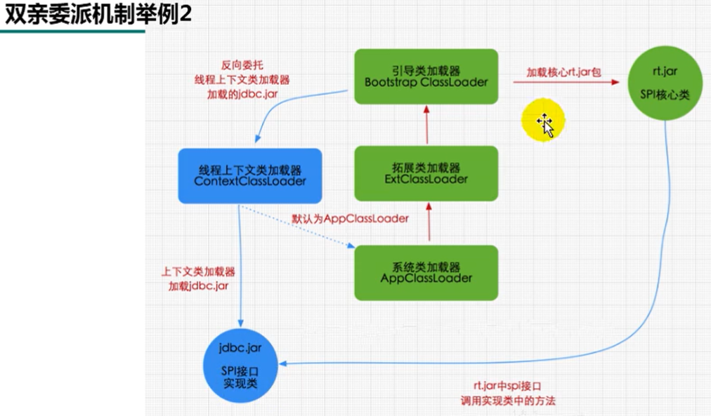

**双亲委派机制的优势**

- 避免类的重复加载

- 保护程序安全，防止核心API被随意篡改（沙箱安全机制

  比如想使用自定义的代码替换原来代码时，新建一个java.lang.String类，然后调用该类，由于双亲委派机制，该类最终是在引导类加载器加载，而不是系统类加载器加载。而引导类加载器只会在Java核心类库中加载，这就不会让自定义类替换核心类的情况出现。

### JVM判断不同class对象条件

1. 类得完整类名必须一致，包括包名

2. 加载这个类得ClassLoader必须相同

   实现原理：当一个类是由用户类加载器加载，JVM会将这个类的类加载器的一个引用作为类的类型信息保存在方法区。（如果是引导类加载器，则该属性值则为null）


### 初始化的时机

只有主动使用类才会导致类的初始化

#### 主动使用与被动使用

**主动使用**

1. 创建类的实例

2. 访问某个类或接口的静态变量

3. 调用类的静态方法

4. 反射

5. 初始化一个类的子类

6. Java虚拟机启动时被标明启动类的类

7. JDK 7 开始提供的动态语言支持

   java.lang.invoke.MethodHandle实例的解析结果

   REF_getStatic、REF_putStatic、REF_invokeStatic句柄对应的类没有初始化，则初始化

被动使用：除主动使用外的情况


## 运行时数据区

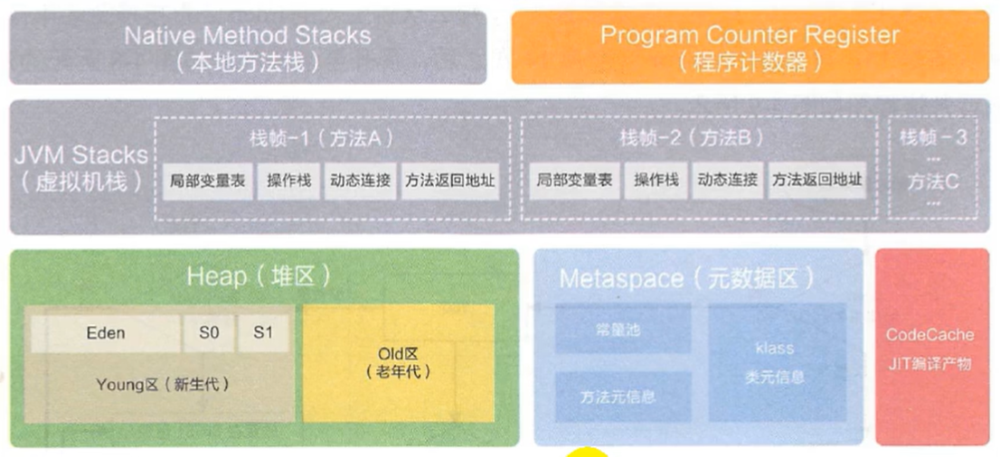

### 资源的线程分配

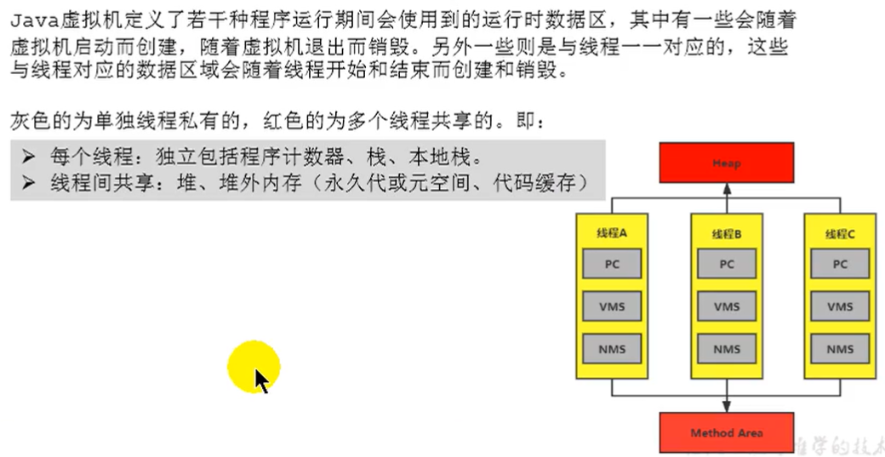

垃圾回收95%在堆，5%在方法区

### 运行时数据区对应类Runtime

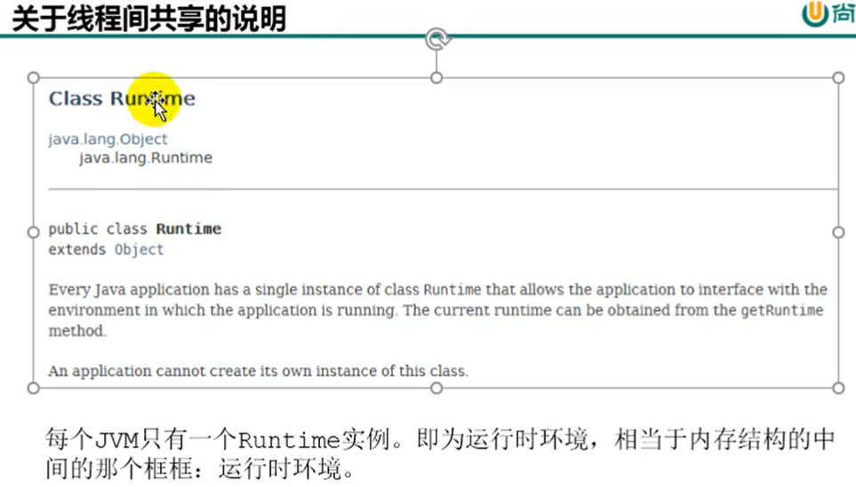

### JVM 系统线程

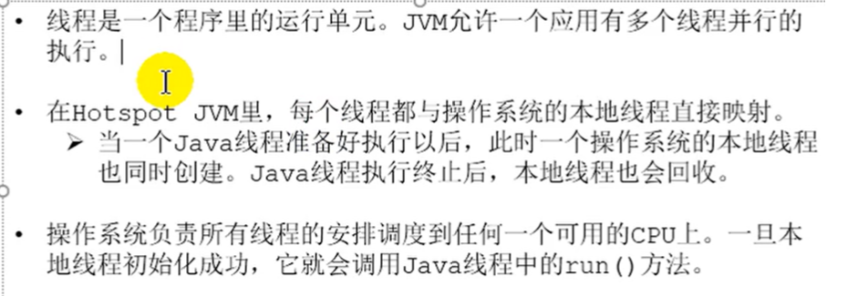

线程又分为守护线程和普通线程，如果程序只剩下守护线程，则程序结束

所以，如果当前线程是最后一个普通线程，当线程结束，不仅表示操作系统中的线程结束，也意味着当前进程结束。

#### 后台线程分类

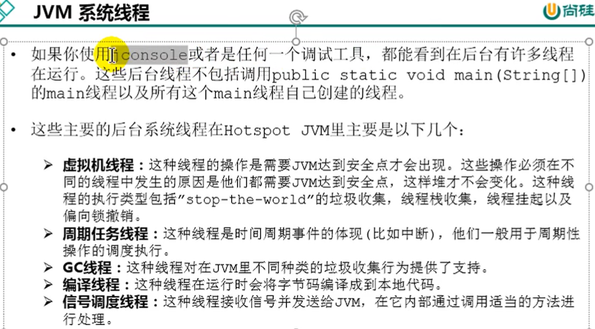


linux下分析线程的资源占用率

```shell
# 查看cpu所有进程信息
top
# ps -H 显示树状结构，表示程序间的相互关系
# 查看进程的所有线程的信息
ps H -eo pid,tid,%cpu | grep 进程id
# 使用java提供工具来分析jvm进程，利用上一步找到的线程id，来找到对应java代码
# 也可以用来分析死锁情况
jstack 进程id
```


### PC Register

- JVM中的PC是一块很小的内存区域，只是软件层面模拟的程序计数器，和CPU中的PC不是一个东西。
- 在JVM规范中，每个线程都有自己私有的PC，生命周期和线程周期保持一致。

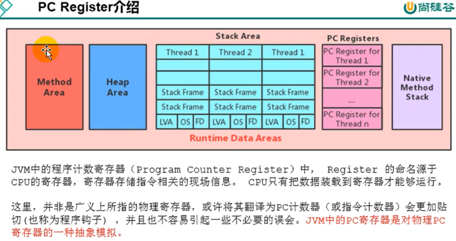

#### 作用

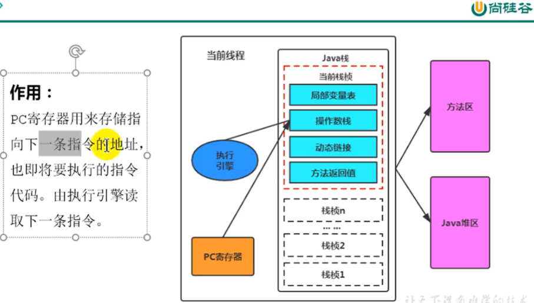

- 是程序控制流的指示器，分支、循环、跳转、异常处理、线程恢复等基础功能都需要依赖PC完成

- 字节码解释器工作时就是通过改变PC的值来选取下一条需要执行的字节码指令

- 它是唯一一个在Java虚拟机规范中没有规定任何OutOfMemoryError 情况的区域，因为就保存了一条地址

  


### 虚拟机栈

#### 出现背景

为了实现Java语言的跨平台性，Java采用**基于虚拟机栈的方式**来实现数据操作，而不是选择**基于寄存器的方式**来实现，这种方式也就决定了JVM的一些特性

优点：

1. 跨平台
2. 指令长度小，编译器容易实现

缺点：

1. 性能下降
2. 实现同样功能需要更多的指令

==Java中栈主要是用来进行程序执行（数据操作），堆主要是用来存储数据（栈也存储数据，如基本数据类型）==


#### 定义

Java虚拟机栈（Java Virtual Machine Stack），早期也叫Java栈，**每个线程在创建时都会创建一个虚拟机栈**，其内部保存的是一个个**栈帧**（Stack Frame），对应着一次次的方法调用

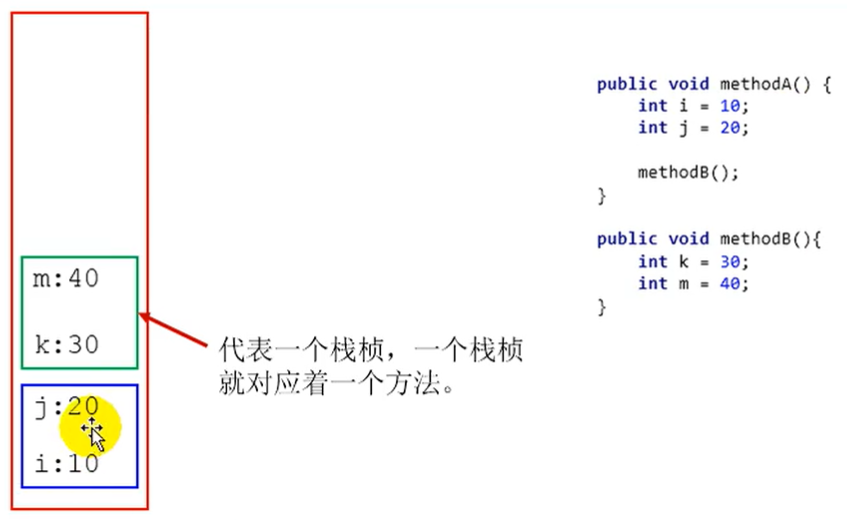

**生命周期**

和线程一致

**作用**

主管Java程序的运行，保存方法的局部变量（基本数据类型和对象的引用）、部分结果，并参与方法的调用和返回

**栈的特点**

栈是一种快读有效的分配存储方式，访问速度仅次于程序计数器

JVM直接对Java栈的操作只有两个：

- 每个方法执行，将对应栈帧入栈
- 执行结束，栈帧出栈

==对于栈来说，不存在垃圾回收问题==

#### 栈中可能出现的异常

Java虚拟机规范允许Java栈的大小是动态的或者是固定不变的

- 如果采用大小固定的虚拟机栈，那每个线程的Java虚拟机栈容量可以在线程创建的时候独立选定。一旦线程请求分配的容量超过Java虚拟机栈容量，就会抛出**StackOverflowError异常**、
- 如果虚拟机栈容量可以动态扩展，当线程虚拟机栈尝试扩展而无法申请到足够内存，或者在创建新线程时没有足够的内存去创建对应的虚拟机栈，就会抛出**OutOfMemoryError异常**

#### 设置栈内存大小

[java工具类参考网址](https://docs.oracle.com/en/java/javase/11/tools/tools-and-command-reference.html )

执行时通过参数-Xss选项来设置最大栈空间

```powershell
-Xss8m
```


#### 栈运行原理

- 不同线程中所包含的栈帧是不允许存在相互引用，栈帧是线程独立的

- 栈帧弹出（Java方法函数返回）的两种方式：

  1. 正常的函数返回，使用return指令，将数据返回给当前栈帧的上一个栈帧，即方法调用者；

     对于返回double类型数据的方法，实际生成字节码dreturn

     对于返回int类型数据的方法，实际生成字节码ireturn

     对于没有返回数据的方法，实际生成字节码return，所以即使没有声明return关键字，生成字节码时编译器也会自动加上

  2. 抛出异常(通过throw方式返回给调用者的异常)

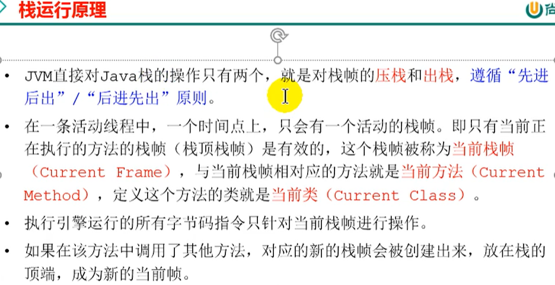


#### 栈帧

栈帧是虚拟机栈的基本数据单元，==线程执行的每个方法对应一个栈帧==

栈帧是一个内存区块，是一个数据集，维系着方法执行过程中的各种信息

每个栈帧中存储着：

- 局部变量表(Local Variables)
- 操作数栈(Operand Stack)，或表达式栈
- 动态链接(Dynamic Linking)，或指向运行时常量池的方法引用
- 方法返回地址(Return Address)，或方法正常退出或者异常退出的定义
- 一些附加信息

动态链接、方法返回地址、一些附加信息也统称帧数据区

#### 局部变量表

- 也被称为局部变量==数组==或者本地变量表
- 定义为一个**数组数组**，主要用于存储方法参数和定义在方法体内的局部变量，这些数据包括8种基本数据类型、对象引用，以及returnAddress类型
- 局部变量所需的容量大小是在**编译期确定**下来的，并保存方法的Code属性的maximum local variables数据项中。**在方法运行期间是不会改变局部变量表的大小**

##### **Slot**

局部变量表的基本存储单元是Slot（变量槽），也就是数组中的一个单元

在局部变量表中，32位以内的类型只占用一个slot（6种基本类型，引用类型，returnAddress类型），64位的类型（long和double）占用两个slot

- byte、short、char在存储前被转换为int；boolean也被转为int，0表示false，1表示true
- long和double占两个Slot

##### **Slot存放数据规范**

当方法被调用时，方法的参数和局部变量会**按照代码顺序存放**在局部变量表中的每一个Slot上

==如果当前帧是由构造方法或者实例方法创建的，那么该对象引用this将会存在index为0的slot处==

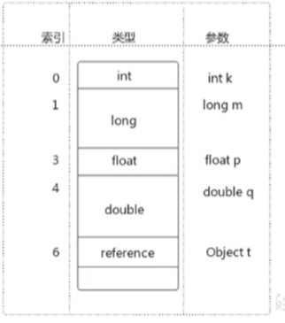


##### Slot重复利用

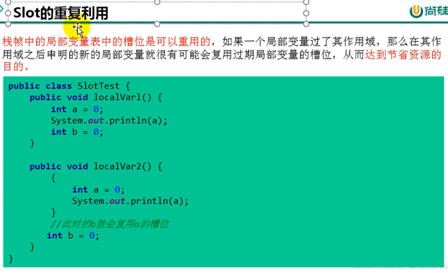

##### 局部变量和静态变量的区别

静态变量存在两次初始化

​	在链接环节的准备阶段，执行系统初始化，会对静态变量赋默认值（该过程一定存在

​	在初始化阶段，会根据代码中的初始值进行显示赋值（该过程可以没有

局部变量只会方法调用时，进行显示赋值。所以如果想调用局部变量，必须要显示初始化

##### 局部变量表与性能调优

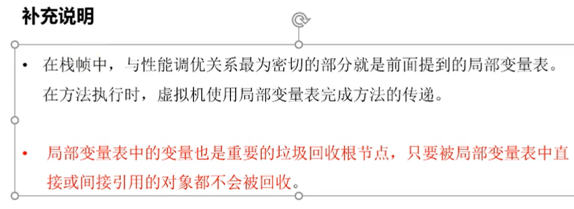

#### 操作数栈

- 主要用于保存计算过程的临时变量和中间结果，使用==数组实现==
- 和局部变量表类似，操作数栈的容量在编译器就已经确定，保存在方法的Code属性的max_stack数据项中
- 和局部变量表的Slot对应，32bit占用一个栈深度

##### 方法内执行过程

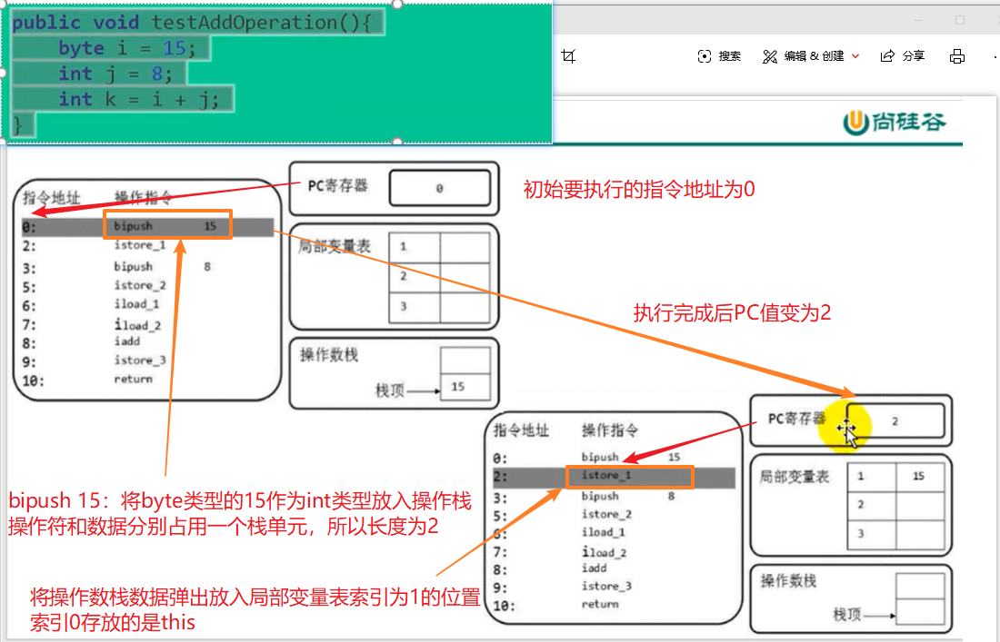

可以看出，局部变量并不是直接就放在局部变量表中了，而是先放入操作数栈，然后从操作数栈中取出。即**所有操作都必须要先经过操作数栈**

##### **方法调用的执行过程**

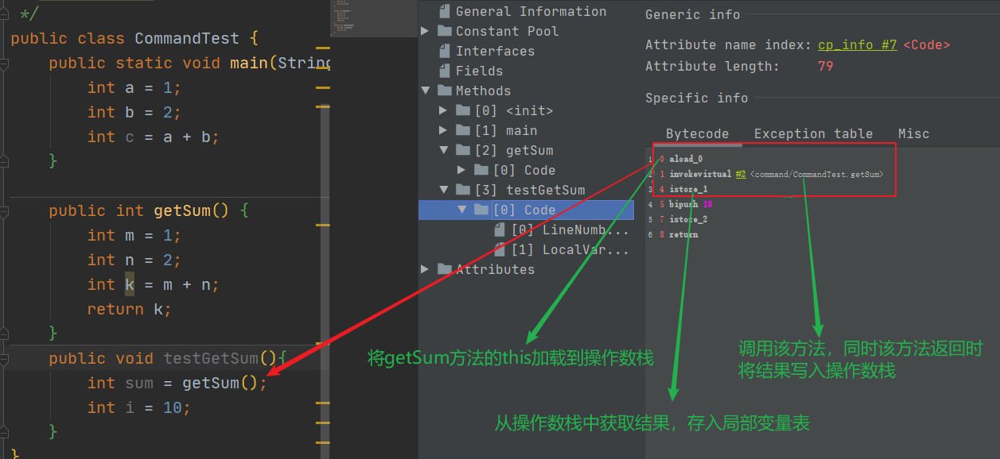

##### 栈顶缓存技术

HotSpot会将栈顶元素全部缓存到寄存器中，以此降低对于内存的读写次数，提升执行引擎的执行效率。

#### 动态链接

也叫指向运行时常量池的方法引用，==多态性就是利用动态链接实现==

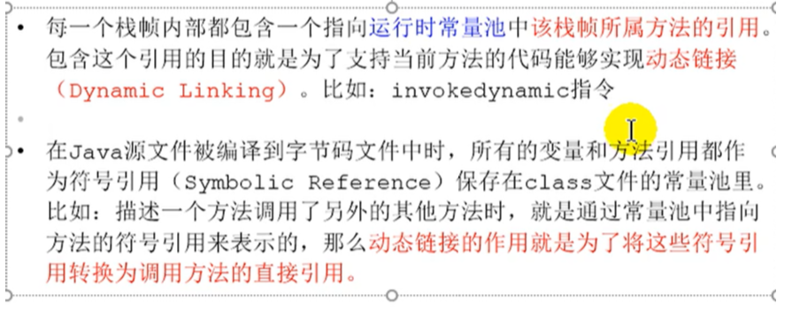


```java
public class DynamicLinkingTest{
	public static void main(String[] args){
		String s1 = "a";
		String s2 = "b";
		String s3 = "ab";
	}
}
```

对应字节码

类加载子系统中链接的解析阶段只是将常量池的符号引用变成真实地址

解释执行字节码时，才会根据动态链接，生成对象

```powershell
# 常量池中的信息都会被加载到运行时常量池中，这是 a b ab都是常量池的符号，还没有变为java 字符串对象

0:	ldc		#2		//String a
# 执行完ldc #2 会把a 符号变为 "a"字符串对象，即StringTable["a"]。这是一种懒加载方式，也就是动态链接。
2:	astore_1
3:	ldc		#3		//String b
# 执行完ldc #3 会把b 符号变为 "b"字符串对象，即StringTable["a","b"]。
5:	astore_2
6:	ldc		#4		//String ab
# 执行完ldc #4 会把ab 符号变为 "ab"字符串对象，即StringTable["a","b","ab"]。
8:	astore_3
9:	return
```

#### 方法的调用

字节码中的方法调用指令就是以常量池中指向方法的符号引用作为参数。

这些符号引用一部分会在**类加载阶段**或第一次使用时转化为直接引用，这种转化称为静态解析。

另一部分将在每一次**运行期间**转化为直接引用，这部分称为动态链接

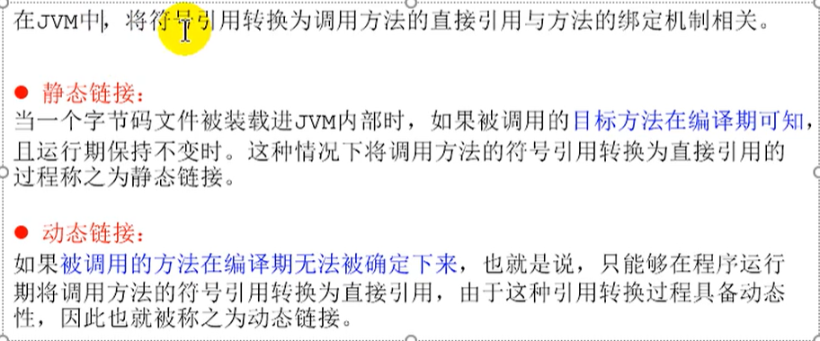

**绑定**的对象是字段、方法、类，功能就是将符号引用替换成直接引用

对于方法来说，早起绑定也就是静态链接，晚期绑定就是动态链接

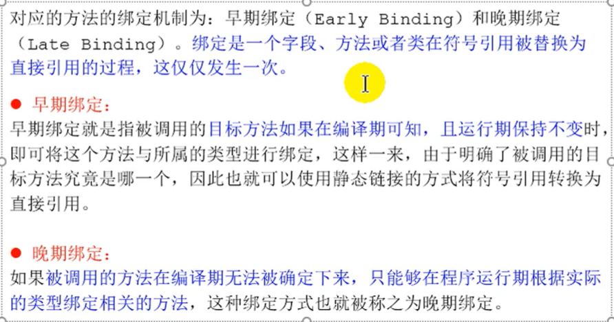

##### 虚函数与非虚函数

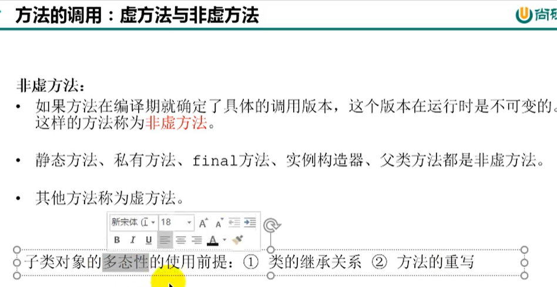

**Java和C++的不同**

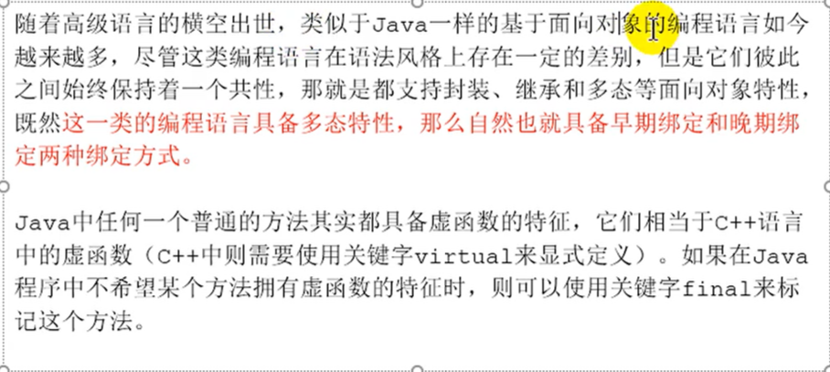

##### 方法重写的本质

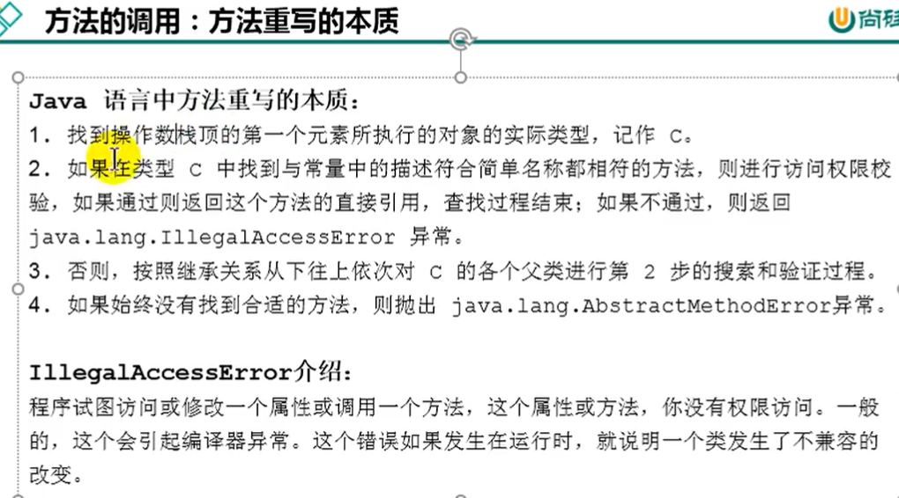

##### 虚方法表

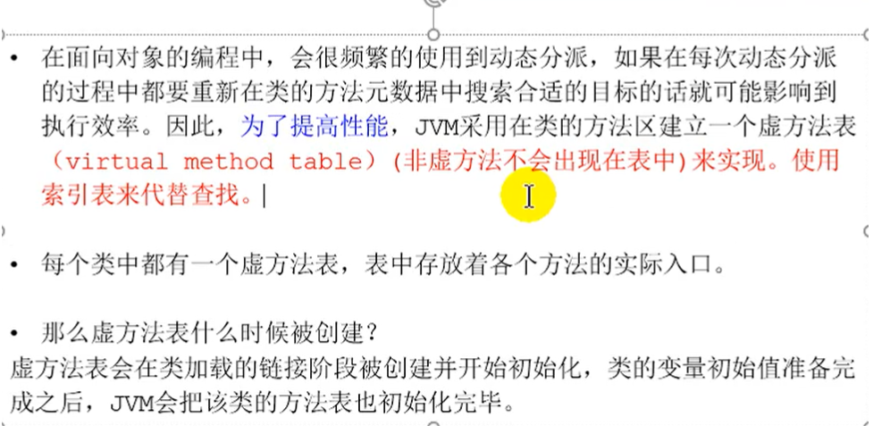


#### 方法返回地址

存放调用该方法的pc寄存器的值（类似操作系统的保存现场）

当方法正常退出时，返回调用者pc寄存器地址，还原现场；

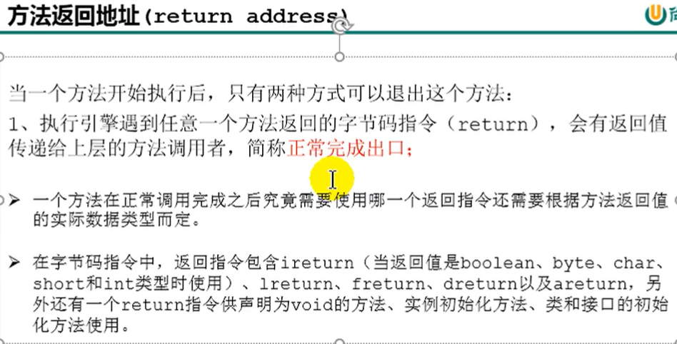

当方法异常退出时，返回地址需要根据异常表来确定，栈帧中一般不会保存这部分信息

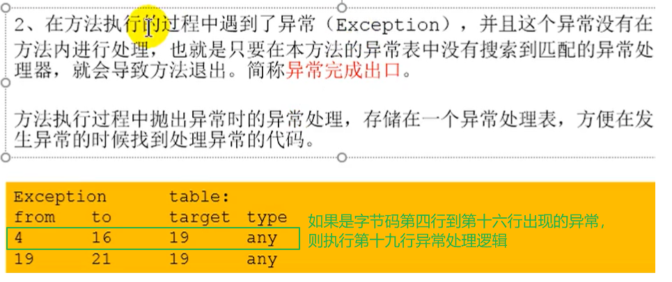

#### 一些附加信息

栈帧中可能携带与Java虚拟机实现的一些附加信息，如调试信息


#### 虚拟机栈常见面试题

**运行时数据区各部分中哪些有Error与GC垃圾回收**

程序计数器：没有Error与GC

虚拟机栈和本地方法栈：只有Error

方法区和堆：有Error和GC

**方法中的局部变量是否存在线程安全问题**

当局部变量的作用范围只在方法内，肯定是线程安全的	

### 堆

#### 定义

通过new关键字创建的对象都会放入堆

**特点**

- 堆是线程共享的，堆中的数据需要考虑线程安全的问题
- 存在垃圾回收机制
- 存在堆内存溢出

#### 堆中可能出现异常

OutOfMemoryError：Java heap space

```java
List<String> list = new ArrayList<>();
String str = "aaa";
while(true){
	list.add(str);
}
```

#### 设置堆内存大小

执行时通过参数-Xmx选项来设置最大堆空间，-Xms设置初始堆大小


### 方法区

#### 定义

主要存储class文件的信息和运行时常量池，class文件的信息包括类信息和class文件常量池。

#### 组成与实现

 jdk6（永久代实现）和jdk8（元空间实现）中方法区的最主要区别，在于jdk 8中将方法区转移到本地内存中，且常量池分为运行时常量池和字符串常量池；且字符串常量池被留在内存中的堆中。

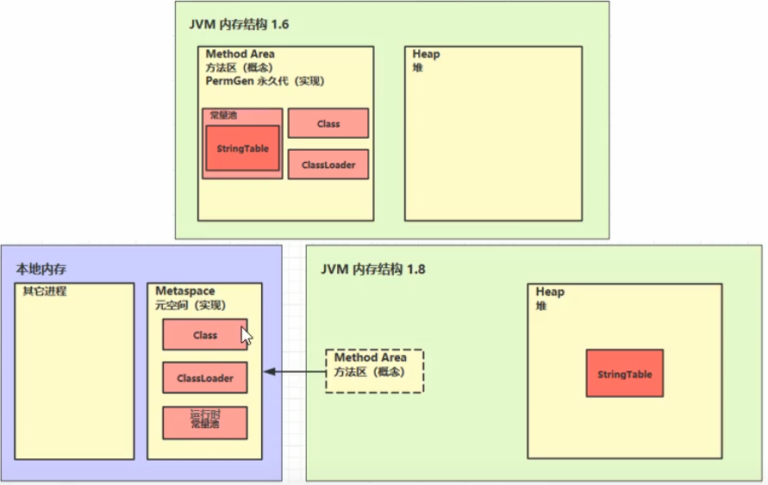


#### 方法区内存溢出

jdk8

OutOfMemoryError: Metaspace

jdk6

OutOfMemoryError: PermGen space

```java
/**
 * @Date: 2020/5/16 8:50
 * @author: fangjie
 * @version: 1.0
 * @Description 演示jdk8 元空间内存溢出情况
 *
 * 运行参数 -XX:MaxMetaspaceSize=8m
 */
public class ClassLoaderTest extends ClassLoader{
    public static void main(String[] args) {
        int count = 0;
        try {
            ClassLoaderTest test = new ClassLoaderTest();
            for(int i=0;i<10000;i++){
                //ClassWriter 用于生成类的二进制字节码
                ClassWriter writer = new ClassWriter(i);
                //版本号，访问限定修饰符，类名，包名，父类，接口
                writer.visit(Opcodes.V1_8, Opcodes.ACC_PUBLIC,"Class"+i, null, "java/lang/Object", null);
                //返回二进制字节码
                byte[] code = writer.toByteArray();
                //执行类的加载
                test.defineClass("Class"+i,code, 0, code.length);
            }
        }finally {
            System.out.println(count);
        }
    }
}
```

**异常出现场景**

- spring
- mybatis 都会产生大量的类，从而造成方法区内存溢出。
- 这些都是利用Cglib来实现动态代理的，而Cglib底层也是利用asm的ClassWriter来生成字节码文件

#### 设置方法区内存大小

jdk6是 -XX:MaxPermSize=8m

jdk8是 -XX:MaxMetaspaceSize=8m


#### 常量池

- class文件常量池（class constant pool）：class文件中除了包含类的版本、字段、方法、接口等描述信息外，还有一项信息就是常量池(constant pool table)，用于存放编译器生成的各种字面量(Literal)和符号引用(Symbolic References)。
  - 字面量就是我们所说的常量概念。
  - 符号引用是一组符号来描述所引用的目标，符号可以是任何形式的字面量，只要使用时能无歧义地定位到目标即可。

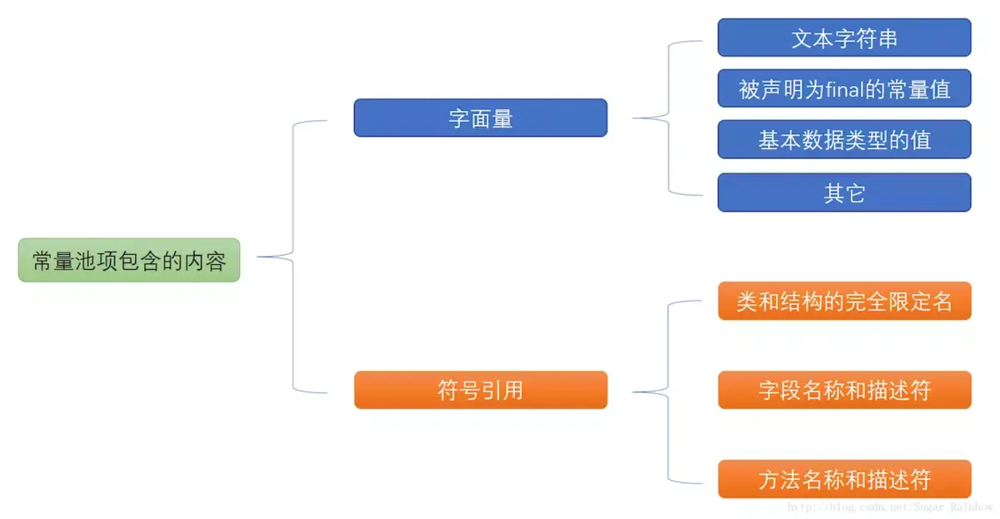

- 运行时常量池：

  当类被加载（在链接的解析阶段），它的常量池信息就会放入运行时常量池中，并将里面的符号地址修改为真实地址

  - 解析的过程会去查询全局字符串池，也就是我们上面所说的StringTable，以保证运行时常量池所引用的字符串与全局字符串池中所引用的是一致的。

- 全局字符串池（string pool也有叫做string literal pool）。
  - 全局字符串池里的内容是在类加载完成，经过验证，准备阶段之后在堆中生成字符串对象实例，然后将该字符串对象实例的引用值存到string pool中（记住：==string pool中存的是引用值而不是具体的实例对象，具体的实例对象是在堆中开辟的一块空间存放的==。）。
  - 在HotSpot VM里实现string pool功能的是一个==StringTable类==，它是一个哈希表，里面存的是驻留字符串(也就是我们常说的用双引号括起来的)的引用（而不是驻留字符串实例本身，真实对象还是存储在堆中），也就是说在堆中的某些字符串实例被这个StringTable引用之后就等同被赋予了”驻留字符串”的身份。这个StringTable在每个HotSpot VM的实例只有一份，被所有的类共享。
  - ==StringTable本质是一个HashTable结构，不能扩容，线程安全==
  - ==字符串池在jdk6中放入运行时常量池中，在jdk8放入堆空间==

**常量池的好处**

 常量池是为了避免频繁的创建和销毁对象而影响系统性能，其实现了对象的共享。
 例如字符串常量池，在编译阶段就把所有的字符串文字放到一个常量池中。
 （1）节省内存空间：常量池中所有相同的字符串常量被合并，只占用一个空间。
 （2）节省运行时间：比较字符串时，\=\=比equals()快。对于两个引用变量，只用\=\=判断引用是否相等，也就可以判断实际值是否相等。

#### StringTable特性

##### **字符串动态拼接后的结果并不会放入常量池**

```java
public class DynamicLinkingTest{
	public static void main(String[] args){
        //字符串懒加载，只有当解释器执行到当前的字节码，才会创建出String对象，即解析动态链接才会创建对象
		String s1 = "a";
		String s2 = "b";
		String s3 = "ab";
        //变量与变量或者变量与常量的拼接：实际执行 new StringBuilder().append("a").append("b").toString()
        //动态拼接的字符串，并不会放入常量池
        String s4 = s1 + s2;
        //javac 在编译期间的优化，常量之间的拼接是在常量池中完成
        String s5 = "a" + "b";
        System.out.println(s3 == s4);//false
        System.out.println(s3 == s5);//true
	}
}
```

##### **使用"str"创建字符串对象的过程**

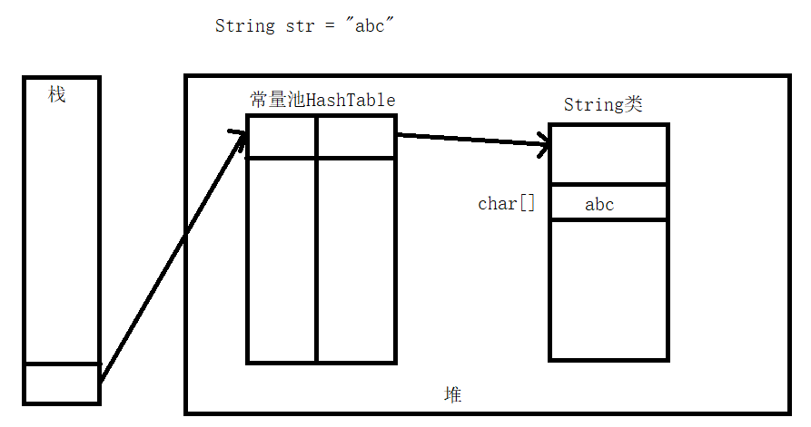

##### **使用new String("str")创建字符串对象的过程**


```java
/**
* String str = new String("ab")
* 使用这种方式会创建两个对象，先在常量池中创建，然后再堆中创建，再将常量池中对象的值赋给堆中对象
* 该方法步骤：
* String s1 = "ab";
* String s2 = new String(s1);//将s1里面的值赋值给s2
**/
public String(String original) {
    this.value = original.value;
    this.hash = original.hash;
}
```

##### **String类的intern方法**

- 在jdk1.6中，当一个String实例str调用intern()方法时，Java查找常量池中是否有相同Unicode的字符串常量
  - 如果有，则返回常量池中字符串常量的引用
  - 如果没有，则在常量池中新增一个Unicode等于str的字符串并返回它的引用

- 在jdk1.7之后，当一个String实例str调用intern()方法时，Java查找常量池中是否有相同Unicode的字符串常量
  - 如果有，则返回常量池中字符串常量的引用，这一点和jdk1.6没什区别。
  - 如果没有，则不会再在常量池中增加一个Unicode等于str的字符串，而只是在常量池中生成一个指向堆中的str对象的引用，并返回。就是将当前对象放入常量池中

```java
@Test
public void test1(){
    //在堆中创建字符串对象"ab"
    String s1 = new String("a")+new String("b");
    //由于常量池中没有"ab"，所以将s1的引用放入常量池，并返回给s2
    String s2 = s1.intern();
    //从常量池中取出字符串"ab"的引用就是s1的引用
    System.out.println(s1 == "ab");//true
    System.out.println(s2 == "ab");//true
}
@Test
public void test2(){
    //在常量池中添加"ab"
    String s1 = "ab";
    //在堆中创建新对象"ab"
    String s2 = s1 + "";
    //由于常量池中已经存在"ab"，所以将s1的引用给s3
    String s3 = s2.intern();
    System.out.println(s2 == "ab");//false
    System.out.println(s3 == "ab");//true
}
```


```java
public class HelloWorld {
    public static void main(String []args) {
		String str1 = "a";//StringPool	["a"]
        String str2 = "b";//StringPool	["a","b"]
        String str3 = "a" + "b";//StringPool	["a","b","ab"]
        String str4 = str1 + str2;
        String str5 = "ab";
        String str6 = str4.intern();

		System.out.println(str3 == str4);//false
		System.out.println(str3 == str5);//true
		System.out.println(str3 == str6);//true
        
        //情况1
        String x1 = new String("c") + new String("d");
        String x2 = "cd";
        x1.intern();
        System.out.println(x1 == x2);//false
        //情况2 jdk8
        String x1 = new String("c") + new String("d");
        x1.intern();//将x1的引用放入常量池
        String x2 = "cd";
        System.out.println(x1 == x2);//true
        //情况3 jdk6
        String x1 = new String("c") + new String("d");
        x1.intern();//新建一个字符串对象"cd"放入常量池
        String x2 = "cd";
        System.out.println(x1 == x2);//false        
    }
}
```


#### StringTable位置与溢出

- jdk1.6及之前，StringTable与方法区一同在永久代中。
- jdk1.8之后，方法区转移到本地内存中，但是将StringTable转移到堆内存中。
- 原因
  - StringTable中存在大量的字符串对象，运行时间增长永久代内存占用过多，且永久代只有在触发FULL GC时才进行垃圾回收，回收频率过慢。
  - 转移到堆中可以利用虚拟机在堆内存中频繁的垃圾回收(Minor GC)，处理StringTable中字符串对象过多情况

```java
//jdk6 
//-XX:MaxPermSize=10m	设置永久代大小
//jdk8 
//-Xmx10m 设置堆大小	
//-XX:-UseGCOverheadLimit	当使用98%的时间只会收了2%的内存，就会报错误GC overhead limit exceeded，使用该命令可以关闭检查
//-Xmx10m  -XX:+PrintStringTableStatistics 
//-XX:+PrintGCDetails -verbose:gc
public class stringTableGc {
    public static void main(String[] args) throws  InterruptedException{
        int i = 0;
        try {
            for (int j = 0;j< 10000; j++){
                String.valueOf(j).intern();
                i++;
            }
        }catch (Exception e){
            e.printStackTrace();
        }finally {
            System.out.println(i);
        }
    }
}
```


#### StringTable垃圾回收

```java
//-Xmx10m  设置堆内存大小
//-XX:+PrintStringTableStatistics 打印字符串表的统计信息：字符串的总数
//-XX:+PrintGCDetails -verbose:gc	打印垃圾回收的详细信息
public class stringTableGc {
    public static void main(String[] args) throws  InterruptedException{
        int i = 0;
        try {
            for (int j = 0;j< 10000; j++){
                String.valueOf(j).intern();
                i++;
            }
        }catch (Exception e){
            e.printStackTrace();
        }finally {
            System.out.println(i);
        }
    }
}
//由于堆内存不足，触发垃圾回收，将一些未使用的字符串常量回收
[GC (Allocation Failure) [PSYoungGen: 2048K->488K(2560K)] 2048K->777K(9728K), 0.0305935 secs] [Times: user=0.00 sys=0.00, real=0.03 secs] 

Heap
 PSYoungGen      total 2560K, used 815K [0x00000000ffd00000, 0x0000000100000000, 0x0000000100000000)
  eden space 2048K, 16% used [0x00000000ffd00000,0x00000000ffd51fa0,0x00000000fff00000)
  from space 512K, 95% used [0x00000000fff00000,0x00000000fff7a020,0x00000000fff80000)
  to   space 512K, 0% used [0x00000000fff80000,0x00000000fff80000,0x0000000100000000)
 ParOldGen       total 7168K, used 289K [0x00000000ff600000, 0x00000000ffd00000, 0x00000000ffd00000)
  object space 7168K, 4% used [0x00000000ff600000,0x00000000ff6486c0,0x00000000ffd00000)
 Metaspace       used 3083K, capacity 4496K, committed 4864K, reserved 1056768K
  class space    used 336K, capacity 388K, committed 512K, reserved 1048576K
-------------------------------------------------------------------
//符号表统计信息
SymbolTable statistics:
Number of buckets       :     20011 =    160088 bytes, avg   8.000
Number of entries       :     12922 =    310128 bytes, avg  24.000
Number of literals      :     12922 =    555888 bytes, avg  43.019
Total footprint         :           =   1026104 bytes
Average bucket size     :     0.646
Variance of bucket size :     0.645
Std. dev. of bucket size:     0.803
Maximum bucket size     :         6
--------------------------------------------------------------------
//字符串表统计信息
StringTable statistics:
// 哈希桶的个数，即数组的长度，不是数组的容量，长度=容量*负载因子
Number of buckets       :     60013 =    480104 bytes, avg   8.000
// 键值对个数
Number of entries       :      6426 =    154224 bytes, avg  24.000
// 字符串对象
Number of literals      :      6426 =    381360 bytes, avg  59.346
// 占用大小
Total footprint         :           =   1015688 bytes
Average bucket size     :     0.107
Variance of bucket size :     0.107
Std. dev. of bucket size:     0.326
Maximum bucket size     :         3

Process finished with exit code 0
```


#### StringTable性能调优

适用场景：

比如存储用户地址信息，许多用户的地址中存在大量重复信息，如：湖北省武汉市xxx，前面的湖北省武汉市就是重复字符串，如果对于每一个用户都存储这个信息，这就会占用过多的空间，因此使用字符串常量池来存储即可。

- 调整hash表中桶子个数，-XX:StringTableSize=桶个数

  通过调整hash表数组的长度，来保证链表不会过长，查询时间复杂度增加

```java
//-Xmx500m  设置最大堆内存大小
//-Xms500m	设置初始堆大小
//-XX:+PrintStringTableStatistics 打印字符串表的统计信息：字符串的总数
//-XX:StringTableSize 设置字符串常量表中桶个数，通过设置不同的值来观测运行时长，最小长度为1009

public class stringTableGc {
    public static void main(String[] args) throws  InterruptedException{
		try(BufferedReader reader = new BufferedReader(new InputStreamReader(new FileInputStream("file.txt"),"utf-8"))){
            String line = null;
            long start = System.nanoTime();
            while((line = read.readline())!=null){
                line.intern();
            }
            System.out.println("const"+(System.nanoTime()-start)/1000000);
        }
    }
}
```

- 考虑字符串是否入池

  对于文本读取时，如果文本中存在大量的重复字符串，建议将字符串放入常量池中，减少字符串对象的生成。


#### 本地方法栈

基本和虚拟机栈一样，唯一不同就是本地方法栈对应的是本地方法接口JNI

使用本地方法栈调用本地方法接口的过程：

Java虚拟机栈加载Java Native方法-->

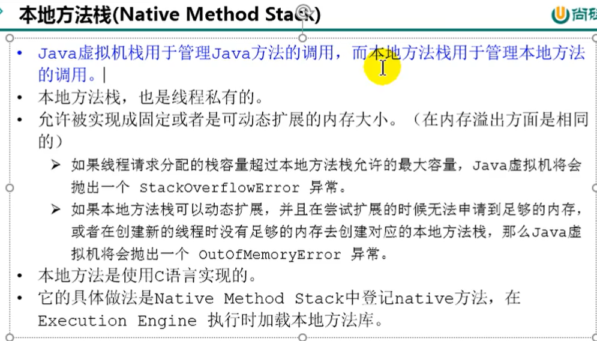

并不是所有的JVM都有本地方法栈

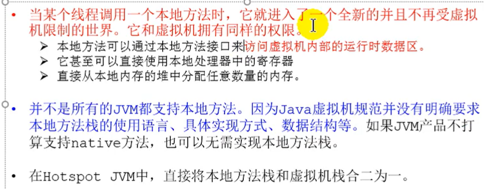


## 本地方法接口

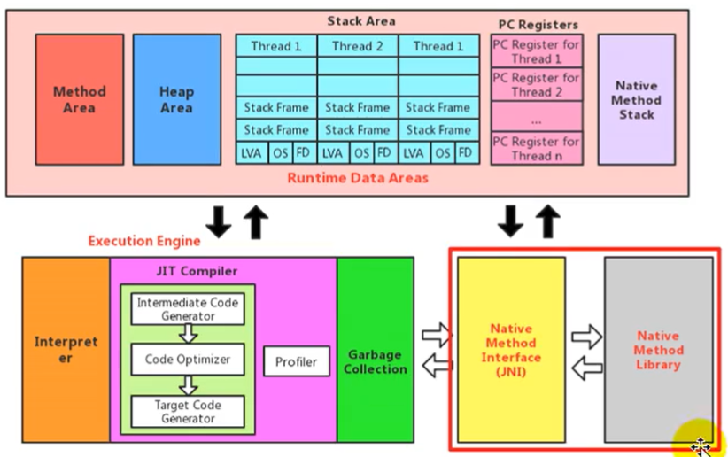

Native Method Interface(JNI)

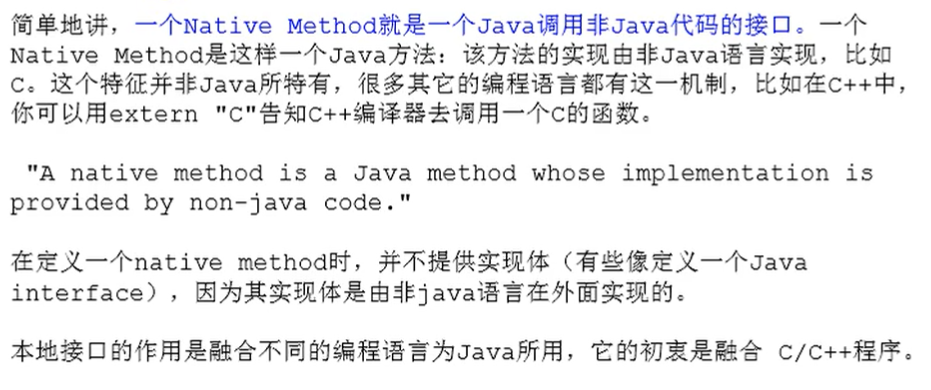

### 使用JNI的作用

需要与Java外面的环境交互，即调用本地方法库

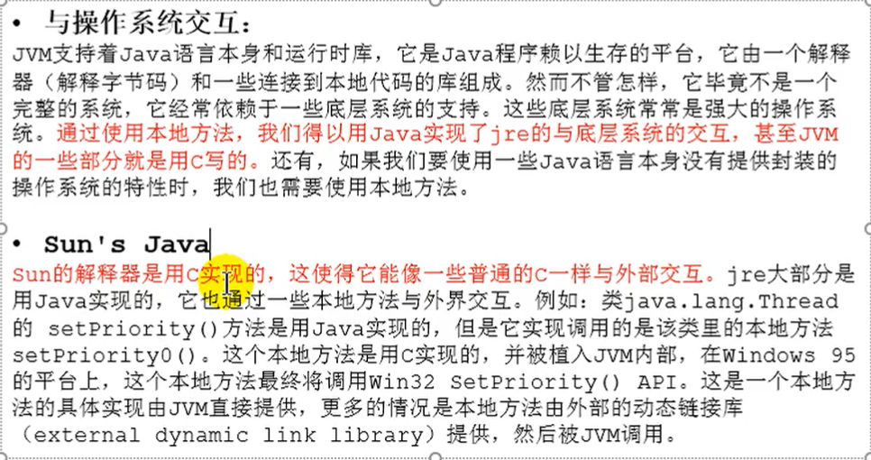

### 现状

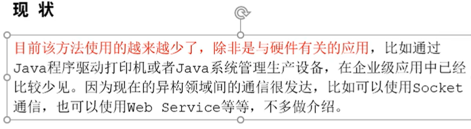


### Java调用JNI

1、编写带有native声明的方法的Java类（java文件）

```java
public class NativeTest {
    public native void hello(String name);
    static{
        System.loadLibrary("hello");//hello和生成动态链接库的hello.dll名字一致
    }
    public static void main(String[] args){
        new NativeTest().hello("jni");
    }
}
```

2、使用javac命令生成NativeTest.class字节码文件

```powershell
javac NativeTest.java
```

3、使用javah -jni 来生成后缀名为NativeTest.h的头文件，.h文件是头文件，内含函数声明、宏定义、结构体定义等内容

```powershell
javah -jni NativeTest
```

生成文件内容如下

```c
/*DO NOT EDI TTHIS FILE - it is mach inegenerated*/
#include<jni.h>
/*Header for class HelloWorld*/

#ifndef_Included_HelloWorld
#define_Included_HelloWorld
#ifdef__cplusplus
extern"C"{
#endif
/*
* Class:	NativeTest
* Method:	hello
* Signature: (Ljava/lang/String;)V
*/
JNIEXPORT void JNICALL Java_HelloWorld_displayHelloWorld(JNIEnv *, jobject, jstring);

#ifdef__cplusplus
}
#endif
#endif
```

4、使用其他语言（C、C++）实现本地方法，新建一个NativeTestImpl.c文件，.c文件是程序文件，内含函数实现，变量定义等内容

```c
#include <jni.h>
#include "NativeTest.h"
#include <stdio.h>
//实现头文件中声明的函数
JNIEXPORT void JNICALL Java_NativeTest_hello(JNIEnv *env,jobject obj, jstring name){
	printf("hello world");
}
```

5、将本地方法编写的文件生成动态链接库（dll文件）

```powershell
cl -I %java_home%\include -I%java_home%\include\win32 -LD  NativeTestImpl.c -Fe hello.dll
```

6、执行java程序

```powershell
java NativeTest
```


## 直接内存

Direct Memory，操作系统内存

- 常见于NIO操作中，用于数据缓冲。ByteBuffer
- 分配回收成本高，但读写能力强，对于大文件读写表现好
- 不受JVM内存回收管理

### 直接内存优势

**传统读写操作**

- 因为java无法操作本地文件，在java堆内存中划出java缓冲区；
- 从用户态转移到内核态，本地方法在系统内存中划出一段系统缓冲区，将磁盘文件分部分缓冲到系统缓冲区中，间接的将系统缓冲区中数据传输到java缓冲区中；
- 内核态转到用户态，调用输出流写入操作，将文件copy到另一个位置，循环copy，直到全部复制完成。

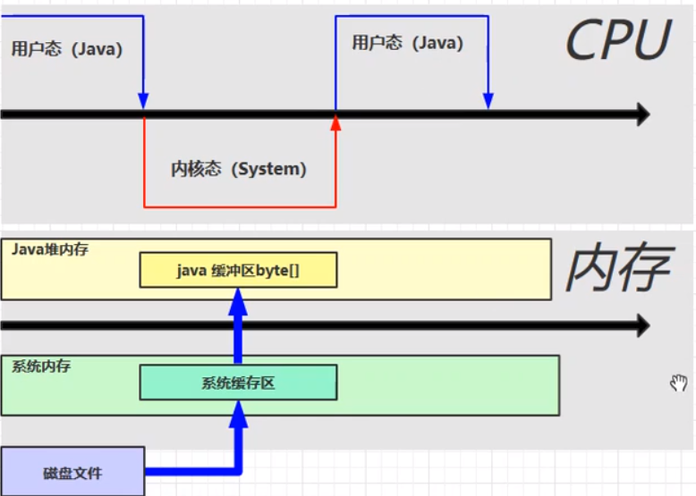

**使用直接内存读写操作**

- ByteBuffer.allocateDirect(_size)，在系统内存中分配直接内存；
- 系统方法和java方法都可以访问直接内存；
- ==与不使用直接内存相比，减少了一次从系统缓存区向java缓冲区复制的操作，复制效率成倍上升==。

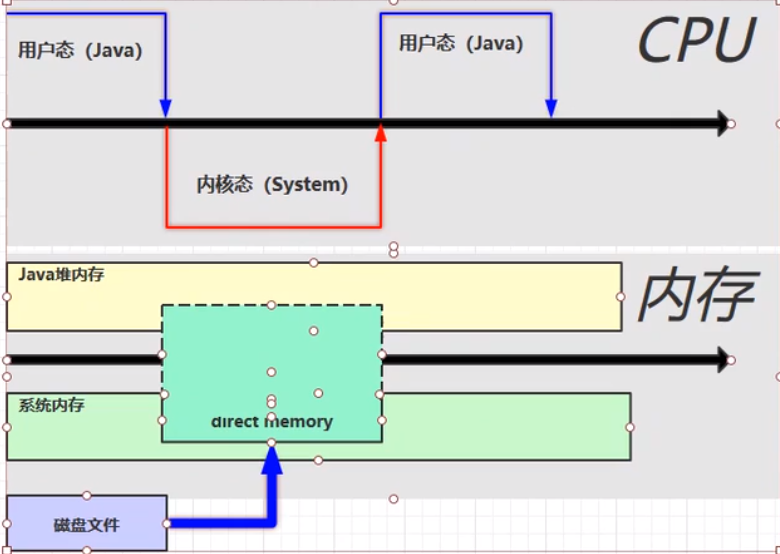


### 直接内存溢出

OutOfMemoryError: Direct buffer memory

```java
import java.nio.ByteBuffer;
import java.util.ArrayList;
import java.util.List;

public class Demo3 {
	static int _1G = 100*1024*1024;
    public static void main(String[] args) {
        List<ByteBuffer> list = new ArrayList<>();
        int i = 0;
        try {
            while(true){
                ByteBuffer byteBuffer = ByteBuffer.allocateDirect(_1G);
                list.add(byteBuffer);//防止垃圾回收
                i++;
            }
        }finally {
            System.out.println(i);
        }
    }
}

36  3.6G
Exception in thread "main" java.lang.OutOfMemoryError: Direct buffer memory
  at java.nio.Bits.reserveMemory(Bits.java:694)
  at java.nio.DirectByteBuffer.<init>(DirectByteBuffer.java:123)
  at java.nio.ByteBuffer.allocateDirect(ByteBuffer.java:311)
  at com.example.jvm.Demo3.main(Demo3.java:14)
```


### 直接内存分配和回收原理

需要注意：直接内存是不归JVM管的，所以不能使用JVM分析工具来分析，直接使用任务管理查看

- 使用Unsafe对象实现直接内存的分配回收，回收主要使用的是freeMemory方法

```java
public class Demo3 {
	static int _1G = 100*1024*1024;
    public static void main(String[] args) throws IOException{
        //分配内存
        Unsafe unsafe = getUnsafe();
        //base为内存首地址
        long base = unsafe.allocateMemory(_1G);
        unsafe.setMemory(base,_1G,(byte)0);
        System.in.read();
        //释放内存，需要主动调用freeMemory方法
        unsafe.freeMemory(base);
        System.in.read();
    }
    public static Unsafe.getUnsafe(){
        try{
            Field field = Unsafe.class.getDeclaredFiled("theUnsafe");
            field.setAccessible(true);
            Unsafe unsafe = (Unsafe)field.get(null);
            return unsafe;
        }
    }
}
```


- ByteBuffer类内部，使用了Cleaner（虚引用）来检测ByteBuffer对象，一旦对象被回收，就会由ReferenceHandler线程通过Cleaner的clean对象调用freeMenory来释放直接内存。

```java
public class Demo3 {
	static int _1G = 100*1024*1024;
    public static void main(String[] args) {
        //allocateDirect实际上也调用了unsafe类来创建直接内存，同时创建了一个任务对象(实现Runnable接口)，里面调用了freeMemory方法
        ByteBuffer byteBuffer = ByteBuffer.allocateDirect(_1G);
        System.out.println("分配完毕...");
        System.in.read();//读取一个字符输入
        

        System.out.println("开始释放...");
    	byteBuffer = null;
        //主动触发垃圾回收
        //实际上是回收了ByteBuffer对象，监听器监测到ByteBuffer对象被回收，间接触发了直接内存的回收
        System.gc();
        System.in.read();
    }

}
//------------------------------------
public static void allocateDirect(int capacity){
    return new DirectByteBuffer(capacity);
}
//------------------------------------
DirectByteBuffer(int cap){
    super(-1,0,cap,cap);
    boolean pa = VM.isDirectMemoryPageAligned();
    int ps = Bits.pageSize();
    long size = Math.max(1L, (long)cap + (pa ? ps : 0));
    Bits.reserveMemory(size, cap);
    

    long base = 0;
    try{
        //调用了allocateMemory方法分配直接内存
        base = unsafe.allocateMemory(size);
    }catch(OutOfMemoryError x){
        Bits.unreserveMemory(size, cap);
        throw x;
    }
    unsafe.setMemory(base, size, (byte) 0);
    if(pa && (base % ps != 0)){
        address = base + ps - (base & (ps - 1));
    }else{
        address = base;
    }
    //Cleaner是一个虚引用，JVM存在一个Reference Handler线程专门监控虚引用对象
    //一旦对象被回收（this表示当前对象），就会触发任务对象方法，从而释放直接内存
    cleaner = Cleaner.create(this, new Deallocate(base, size, cap));
    att = null;

}
//------------------------------------
private static class Deallocate implements Runnable{
    //...
    public void run(){
        //...
        //调用了freeMemory方法释放直接内存
        unsafe.freeMemory(address);
        //...
    }
}
```


- -XX:+DisableExplicitGC 禁用显式的垃圾回收System.gc()，一般JVM调优常常设置该参数

  因为System.gc()触发的是FULL GC，这是一种比较影响性能的垃圾回收，不仅回收新生代，也回收老年代，造成程序暂停之间较长

- 因为考虑到系统性能，FULL GC时间够长，会严重影响性能。所以涉及到直接内存的使用，==释放内存使用Unsafe.freeMemory==，不建议使用System.gc()。


## Java字节码

### class文件结构

存储了类基本信息，常量池，类方法定义（包含虚拟机指令）

- 最头的4个字节用于存储魔数Magic Number，用于确定一个文件是否能被JVM接受
- 接着4个字节用于存储版本号，前2个字节存储次版本号，后2个存储主版本号
- 再接着是用于存放常量的常量池，由于常量的数量是不固定的，所以常量池的入口放置一个U2类型的数据(constant_pool_count)存储常量池容量计数值
- 类信息
- 父类与接口数组
- 方法信息

JVM类文件信息

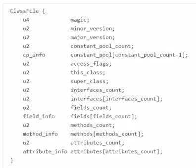

常量池表


```powershell
# 类基本信息：主版本号52表示jdk8
 MD5 checksum eea03e744fc6601496ec2c987e07d595
  Compiled from "Stringtable.java"
public class com.example.jvm.Stringtable
  minor version: 0
  major version: 52
  flags: ACC_PUBLIC, ACC_SUPER
----------------------------------------------------------------------------------------------------
# 常量池
Constant pool:
   #1 = Methodref          #12.#25        // java/lang/Object."<init>":()V
   #2 = String             #26            // a
   #3 = String             #27            // b
   #4 = String             #28            // ab
   #5 = Class              #29            // java/lang/StringBuilder
   #6 = Methodref          #5.#25         // java/lang/StringBuilder."<init>":()V
   #7 = Methodref          #5.#30         // java/lang/StringBuilder.append:(Ljava/lang/String;)Ljava/lang/StringBuilder;
   #8 = Methodref          #5.#31         // java/lang/StringBuilder.toString:()Ljava/lang/String;
   #9 = Fieldref           #32.#33        // java/lang/System.out:Ljava/io/PrintStream;
  #10 = Methodref          #34.#35        // java/io/PrintStream.println:(Z)V
  #11 = Class              #36            // com/example/jvm/Stringtable
  #12 = Class              #37            // java/lang/Object
  #13 = Utf8               <init>
  #14 = Utf8               ()V
  #15 = Utf8               Code
  #16 = Utf8               LineNumberTable
  #17 = Utf8               main
  #18 = Utf8               ([Ljava/lang/String;)V
  #19 = Utf8               StackMapTable
  #20 = Class              #38            // "[Ljava/lang/String;"
  #21 = Class              #39            // java/lang/String
  #22 = Class              #40            // java/io/PrintStream
  #23 = Utf8               SourceFile
  #24 = Utf8               Stringtable.java
  #25 = NameAndType        #13:#14        // "<init>":()V
  #26 = Utf8               a
  #27 = Utf8               b
  #28 = Utf8               ab
  #29 = Utf8               java/lang/StringBuilder
  #30 = NameAndType        #41:#42        // append:(Ljava/lang/String;)Ljava/lang/StringBuilder;
  #31 = NameAndType        #43:#44        // toString:()Ljava/lang/String;
  #32 = Class              #45            // java/lang/System
  #33 = NameAndType        #46:#47        // out:Ljava/io/PrintStream;
  #34 = Class              #40            // java/io/PrintStream
  #35 = NameAndType        #48:#49        // println:(Z)V
  #36 = Utf8               com/example/jvm/Stringtable
  #37 = Utf8               java/lang/Object
  #38 = Utf8               [Ljava/lang/String;
  #39 = Utf8               java/lang/String
  #40 = Utf8               java/io/PrintStream
  #41 = Utf8               append
  #42 = Utf8               (Ljava/lang/String;)Ljava/lang/StringBuilder;
  #43 = Utf8               toString
  #44 = Utf8               ()Ljava/lang/String;
  #45 = Utf8               java/lang/System
  #46 = Utf8               out
  #47 = Utf8               Ljava/io/PrintStream;
  #48 = Utf8               println
  #49 = Utf8               (Z)V
------------------------------------------------------------------------------------------------------
{
  public com.example.jvm.Stringtable();
    descriptor: ()V
    flags: ACC_PUBLIC
    Code:
      stack=1, locals=1, args_size=1
         0: aload_0
         1: invokespecial #1                  // Method java/lang/Object."<init>":()V
         4: return
      LineNumberTable:
        line 3: 0

  public static void main(java.lang.String[]);
    descriptor: ([Ljava/lang/String;)V
    flags: ACC_PUBLIC, ACC_STATIC
    Code:
      stack=3, locals=5, args_size=1
         0: ldc           #2                  // String a
         2: astore_1
         3: ldc           #3                  // String b
         5: astore_2
         6: ldc           #4                  // String ab
         8: astore_3
         9: new           #5                  // class java/lang/StringBuilder
        12: dup
        13: invokespecial #6                  // Method java/lang/StringBuilder."<init>":()V
        16: aload_1
        17: invokevirtual #7                  // Method java/lang/StringBuilder.append:(Ljava/lang/String;)Ljava/lang/StringBuilder;
        20: aload_2
        21: invokevirtual #7                  // Method java/lang/StringBuilder.append:(Ljava/lang/String;)Ljava/lang/StringBuilder;
        24: invokevirtual #8                  // Method java/lang/StringBuilder.toString:()Ljava/lang/String;
        27: astore        4
        29: getstatic     #9                  // Field java/lang/System.out:Ljava/io/PrintStream;
        32: aload         4
        34: aload_3
        35: if_acmpne     42
        38: iconst_1
        39: goto          43
        42: iconst_0
        43: invokevirtual #10                 // Method java/io/PrintStream.println:(Z)V
        46: return
      LineNumberTable:
        line 6: 0
        line 7: 3
        line 8: 6
        line 9: 9
        line 10: 29
        line 11: 46
      StackMapTable: number_of_entries = 2
        frame_type = 255 /* full_frame */
          offset_delta = 42
          locals = [ class "[Ljava/lang/String;", class java/lang/String, class java/lang/String, class java/lang/String, class java/l
ang/String ]
          stack = [ class java/io/PrintStream ]
        frame_type = 255 /* full_frame */
          offset_delta = 0
          locals = [ class "[Ljava/lang/String;", class java/lang/String, class java/lang/String, class java/lang/String, class java/l
ang/String ]
          stack = [ class java/io/PrintStream, int ]
}
```


### 常见字节码

#### 整型入栈操作

当int取值**-1~5**采用iconst指令，取值**-128~127**采用bipush指令，取值**-32768~32767**采用sipush指令，取值**-2147483648~2147483647**采用 ldc 指令，long使用ldc，**ldc指令是从常量池中取值的，ldc**指令用于将int、float、String类型常量从常量池中压到栈顶，在这段范围**（-2147483648~2147483647）**内的int值存储在常量池中

#### aload

从局部变量表的相应位置装载一个对象引用到操作数栈的栈顶

aload_0把this装载到了操作数栈中aload_0是一组格式为aload_的操作码中的一个，这一组操作码把对象的引用装载到操作数栈中标志了待处理的局部变量表中的位置，但取值仅可为0、1、2或者3。

#### 初始化

所有类变量和静态代码块合并成clinit

所有成员变量和代码块以及构造方法合并成init

#### 方法调用指令

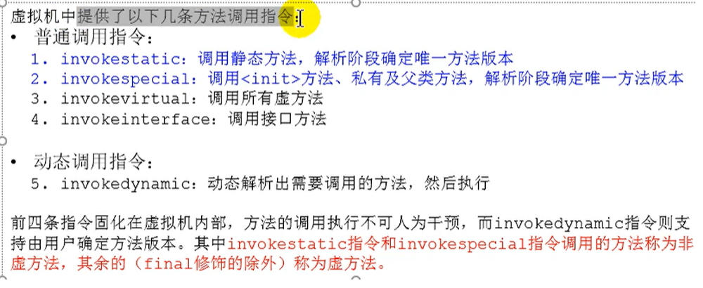

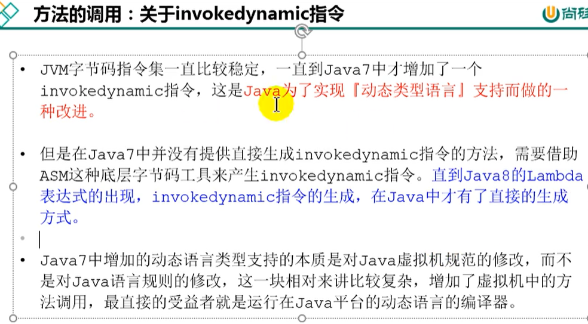


### 动态代理

1. Java Proxy（接口）
2. Cglib（父类继承）

---

1. Aspectj
2. javaagent

共同点：对JVM Class字节码进行操作

不同点：操作方式不一样，前两种是新增一个完整的Class字节码，后两种是修改现有的字节码（代价肯定更小一点，但是一般不会用）

```java
public static Object getProxyInstance(Object object) {
    /**
     * 类加载器，被代理类的接口，调用处理器
     */
    return Proxy.newProxyInstance(object.getClass().getClassLoader(), object.getClass().getInterfaces(), new InvocationHandler() {
        /**
         * @param proxy  代理类对象
         * @param method 被代理类的方法
         * @param args   被代理类的方法参数
         * @return 结果
         * @throws Throwable
         */
        @Override
        public Object invoke(Object proxy, Method method, Object[] args) throws Throwable {
            System.out.println("我是代理类");
            return method.invoke(object, args);
        }
    });
}
```


### jclasslib剖析方法字节码

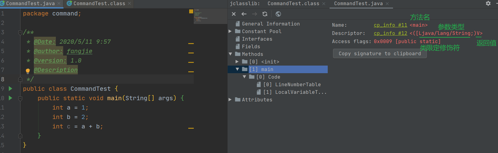


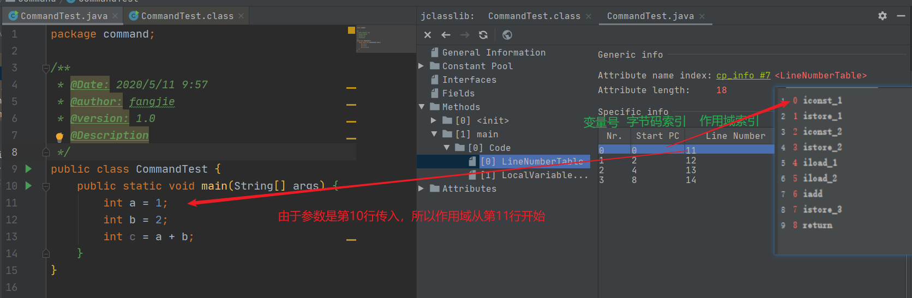

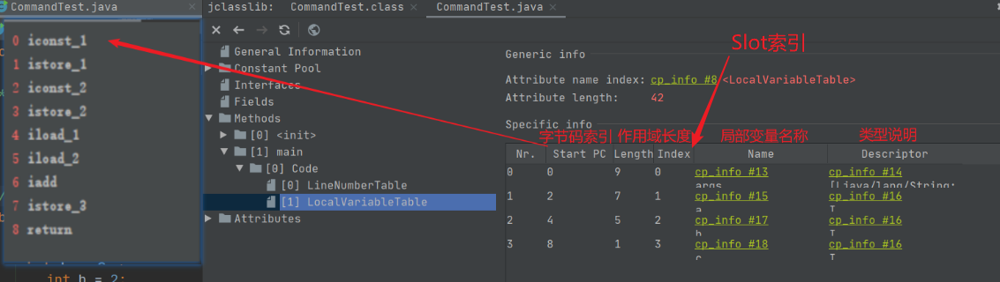


## 垃圾回收

[Oracle 垃圾回收官方文档](https://docs.oracle.com/en/java/javase/14/gctuning/introduction-garbage-collection-tuning.html#GUID-326EB4CF-8C8C-4267-8355-21AB04F0D304)

### 如何判断对象可以回收

1. 引用计数法
   - 如果两个对象互相引用，计数器都为1，即使他们都没有被使用，都不会被清理。
2. 可达性分析算法
   - ==Java虚拟机中的垃圾回收器采用可达性分析==来探索所有的对象
   - 扫描堆中的对象，判断是否能根据GC Root的引用链找到该对象，找不到则回收。
3. 五种引用
   - 强引用 软引用 弱引用 虚引用 终结器引用


#### 可达性分析算法

**哪些对象可以作为GC Root？**

1. 可以使用Eclipse开发的一款分析内存的软件Memory Analyzer分析堆内存快照[软件链接](https://www.eclipse.org/mat/downloads.php)

2. 使用jps命令查看线程id

3. jmap -dump:format=b,live,file=2.bin 线程ID ； 要使用jmap抓取堆内存快照

   -dump：将当前内存情况打包成一个文件，format=b文件格式为二进制格式

   live：主动触发一个垃圾回收，即只关心存活对象

   file=2.bin：文件名称为2.bin

4. mat打开2.bin（文件名）

```java
public class rootSearch {
    public static void main(String[] args) throws  InterruptedException , IOException {
        List<String> list = new ArrayList<>();
        list.add("a");
        list.add("a");
        System.out.println(1);
  //jmap -dump:format=b,live,file=1.bin 12436
        System.in.read();

        list = null;
        System.out.println(2);

//jmap -dump:format=b,live,file=2.bin 12436
        System.in.read();

        System.out.println("end结束。。。。");
    
    }

}
```

**使用Memory Analyzer查找GC Roots**

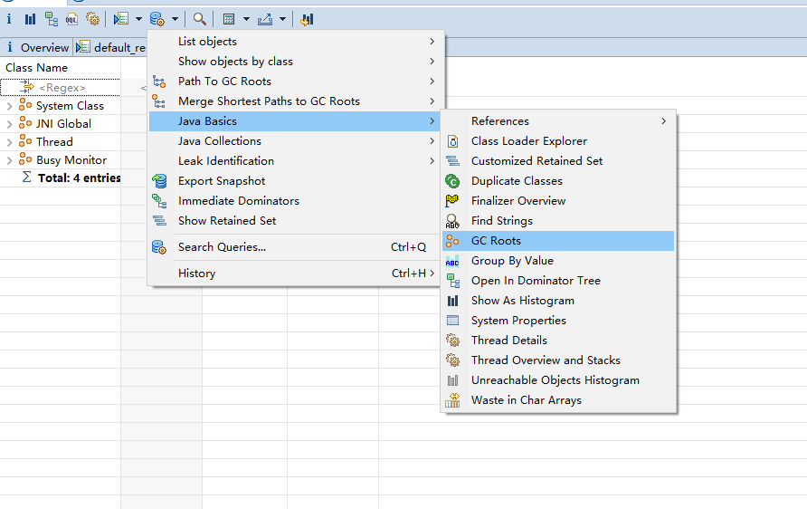

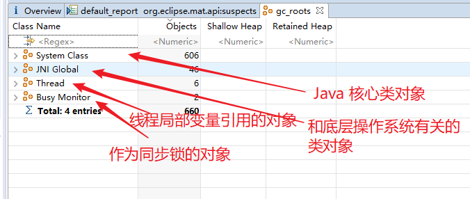

**注意根对象是堆中的对象，而不是栈内的引用**

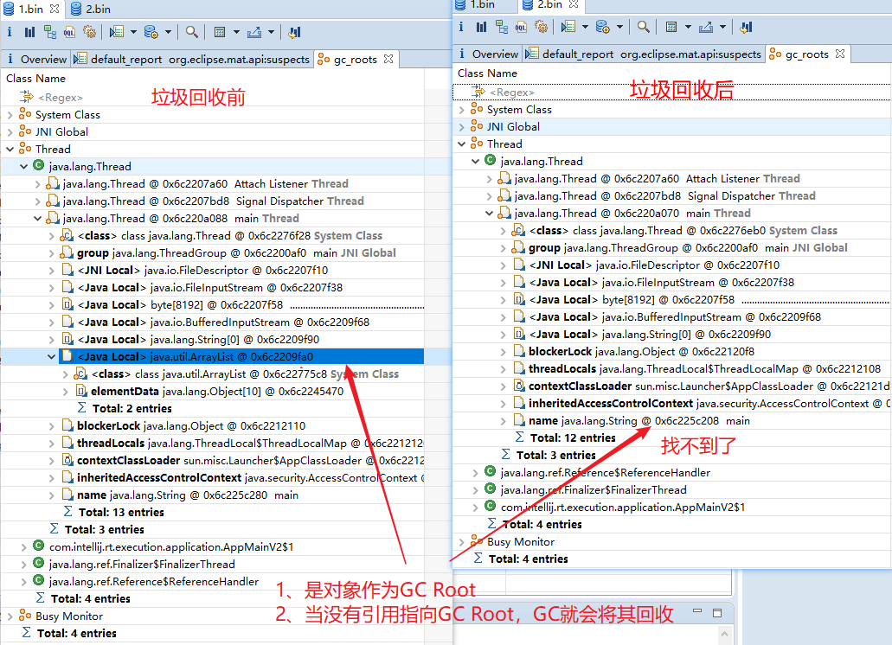


#### 五种引用

除强引用外，其他引用都是对象

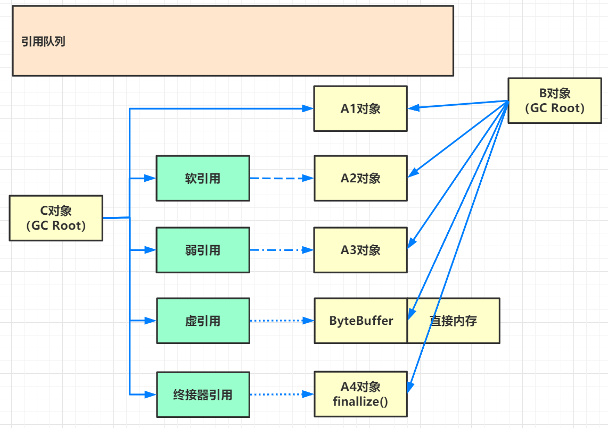

1. 强引用，指向某一对象的所有强引用都断开，该对象才能被回收。

2. 软、弱引用，指向某一被软、弱引用的对象的所有强引用都断开，该对象可能被回收。

   - 软引用：如果垃圾回收之后，**内存依然不足**，只被软引用的对象会被回收。
   - 弱引用：只要发生垃圾回收，只被弱引用的对象就会被回收。
   - 当A2、A3对象回收后，会将软弱引用本身转移到引用队列中，因为此时GC Root此时依然关联着软弱引用，但是软弱引用已经没有用了。
   - 遍历引用队列，释放引用。
   - 主要用途：用于解决OOM问题(OutOfMemory)，假如有一个应用需要读取大量的本地图片，如果每次读取图片都从硬盘读取，则会严重影响性能，但是如果全部加载到内存当中，又有可能造成内存溢出，此时使用软引用可以解决这个问题

   | 引用类型 | 被回收时间 |      用途      |   生存时间    |
   | :------: | :--------: | :------------: | :-----------: |
   |  强引用  |  从来不会  | 对象的一般状态 | JVM停止运行时 |
   |  软引用  | 内存不足时 |    对象缓存    |  内存不足时   |
   |  弱引用  |  gc运行时  |    对象缓存    |   gc运行时    |

3. 虚引用

   - 当ByteBuffer对象的强引用消失后，ByteBuffer对象会被垃圾回收，此时直接内存依然存在
   - 虚引用进入引用队列中，RefferenceHandler在队列中寻找到虚引用Cleaner
   - 调用Unsafe.freeMemory()方法释放直接内存；
   - 释放引用。
   - 这里的ByteBuffer和Cleaner只是举例

   ```java
   //Cleaner是一个虚引用，JVM存在一个Reference Handler线程专门监控虚引用对象
   //一旦对象被回收（this表示当前对象），就会触发任务对象方法，从而释放直接内存
   cleaner = Cleaner.create(this, new Deallocate(base, size, cap));
   ```

4. 终结器引用

   - 终结器对象引用的对象没有被强引用，**在被回收前**，终结器引用转移到引用队列，一个优先级较低的线程finallize在引用队列中寻找终结器引用；
   - 并找到**终结器引用的对象，调用finalize()方法**；
   - ==下次垃圾回收时，回收该对象。即两次GC才能回收终接器对象引用的对象==。
   - 建议不要使用终接器引用方式：
     - 会影响JVM的对象分配与回收速度
        在分配该对象时，JVM需要在垃圾回收器上注册该对象，以便在回收时能够执行该重载方法；在该方法的执行时需要消耗CPU时间且在执行完该方法后才会重新执行回收操作，即至少需要垃圾回收器对该对象执行两次GC。
     - 可能造成该对象的再次“复活”
        在finalize()方法中，如果有其它的强引用再次持有该对象，则会导致对象的状态由“收集阶段”又重新变为“应用阶段”。这个已经破坏了Java对象的生命周期进程，且“复活”的对象不利用后续的代码管理。

#### 引用举例

**强引用**

一般平常代码中大部分引用都是强引用

```java
//jvm运行参数设置：-Xmx20m
List<byte[]> list1 = new ArrayList<>();
for (int i = 0;i < 5;i++){
    list1.add(new byte[_4MB]);
}

+++++++++++++打印结果++++++++++++++
Exception in thread "main" java.lang.OutOfMemoryError: Java heap space
  at com.example.jvm.GC.softY.main(softY.java:12)

++++++++++++++++解释+++++++++++++++++++
-Xmx20m将堆内存最大设置为20m，强引用byte数组无法被回收，25m>20m，所以堆内存溢出。
```

**软引用**

软引用对象被会回收后，list中依然保留它的引用

```java
//jvm运行参数设置：-Xmx20m -XX:+PrintGCDetails -verbose:gc

public static  void soft(){
        List<SoftReference<byte[]>> list = new ArrayList<>();
        for (int i = 0;i < 5;i++){
            SoftReference<byte[]> ref = new SoftReference<>(new byte[_4MB]);
            System.out.println(ref.get());
            list.add(ref);
            System.out.println(list.size());
        }
        System.out.println("循环结束,"+ list.size());
        for (SoftReference<byte[]> ref:list){
            System.out.println(ref.get());
        }
    }

++++++打印结果++++++
[B@3fee733d
1
[B@5acf9800
2
[B@4617c264
3
++++++++++
//第4次循环时，程序运行内存不足，触发垃圾回收
[GC (Allocation Failure) [PSYoungGen: 1953K->496K(6144K)] 14241K->13133K(19968K), 0.0013159 secs] [Times: user=0.00 sys=0.00, real=0.00 secs] 
[B@36baf30c
4
 //第5次循环时，程序运行内存不足，触发垃圾回收
[GC (Allocation Failure) --[PSYoungGen: 4817K->4817K(6144K)] 17455K->17455K(19968K), 0.0008319 secs] [Times: user=0.00 sys=0.00, real=0.00 secs] 
//由于Minor GC回收无效（没有回收掉内存），触发Full GC回收
[Full GC (Ergonomics) [PSYoungGen: 4817K->4488K(6144K)] 
[ParOldGen: 12637K->12550K(13824K)] 17455K->17038K(19968K),
 [Metaspace: 3085K->3085K(1056768K)], 0.0054989 secs]
 [Times: user=0.00 sys=0.00, real=0.01 secs] 
//上一次垃圾回收失败，再次进行垃圾回收
[GC (Allocation Failure) --[PSYoungGen: 4488K->4488K(6144K)] 
17038K->17038K(19968K), 0.0009131 secs] [Times: user=0.00 sys=0.00, real=0.00 secs] 
//触发第二次Full GC，此时软引用对象被回收，当前list中存储的前四个元素全部为null
[Full GC (Allocation Failure) [PSYoungGen: 4488K->0K(6144K)] 
[ParOldGen: 12550K->637K(8704K)] 17038K->637K(14848K), 
[Metaspace: 3085K->3085K(1056768K)], 0.0076801 secs]
 [Times: user=0.02 sys=0.00, real=0.01 secs] 
[B@7a81197d
5
++++++++++++++++++++++
GC日志可以看出，Eden区内存不足触发的 minor GC只是将新生代对象转移到老年代，并没有回收。
在老年代内存不足时，触发FULL GC ，但是第一次触发并未回收，直到第二次触发再回收所有软引用对象。
++++++++++++++++
循环结束,5
null
null
null
null
[B@7a81197d
//程序结束时，内存占用情况
Heap
 PSYoungGen      total 6144K, used 4433K [0x00000000ff980000, 0x0000000100000000, 0x0000000100000000)
  eden space 5632K, 78% used [0x00000000ff980000,0x00000000ffdd4500,0x00000000fff00000)
  from space 512K, 0% used [0x00000000fff00000,0x00000000fff00000,0x00000000fff80000)
  to   space 512K, 0% used [0x00000000fff80000,0x00000000fff80000,0x0000000100000000)
 ParOldGen       total 8704K, used 637K [0x00000000fec00000, 0x00000000ff480000, 0x00000000ff980000)
  object space 8704K, 7% used [0x00000000fec00000,0x00000000fec9f660,0x00000000ff480000)
 Metaspace       used 3130K, capacity 4500K, committed 4864K, reserved 1056768K
  class space    used 341K, capacity 388K, committed 512K, reserved 1048576K
```

**软引用配合引用队列**
使用引用队列来保存无效的软引用，然后在list中移除无效的软引用

```java
 public static  void soft(){
     List<SoftReference<byte[]>> list = new ArrayList<>();
     //引用队列
     ReferenceQueue<byte[]> queue = new ReferenceQueue<>();

     for (int i = 0;i < 5;i++){
         //关联了引用队列，当软引用所关联的对象byte[]被回收时，软引用会被加入到引用队列
         SoftReference<byte[]> ref = new SoftReference<>(new byte[_4MB],queue);
         System.out.println(ref.get());
         list.add(ref);
         System.out.println(list.size());
     }
     //将无用的软引用全部移除
     Reference<? extends byte[]> poll = queue.poll();
     while(poll !=null){
         list.remove(poll);
         poll = queue.poll();
     }
     
     System.out.println("循环结束,"+ list.size());
     for (SoftReference<byte[]> ref:list){
         System.out.println(ref.get());
     }
 }
++++运行结果++++
1
[B@5acf9800
2
[B@4617c264
3
[B@36baf30c
4
[B@7a81197d
5
循环结束,1
[B@7a81197d
++++++软引用被清除 NULL消失++++++
```

**弱引用**

```java
  public static  void weak(){
        List<WeakReference<byte[]>> list = new ArrayList<>();
        for (int i = 0;i < 10;i++){
            WeakReference<byte[]> ref = new WeakReference<>(new byte[_4MB]);
            list.add(ref);
            for (WeakReference<byte[]> ref1:list){
                System.out.print(ref1.get()+" ");
            }
            System.out.println();
        }
    }
++++打印结果+++
[B@3fee733d 
[B@3fee733d [B@5acf9800 
[B@3fee733d [B@5acf9800 [B@4617c264 
//触发Minor GC垃圾回收，但此时并没有回收掉弱引用
[GC (Allocation Failure) [PSYoungGen: 1953K->488K(6144K)] 14241K->13069K(19968K), 0.0006807 secs] [Times: user=0.00 sys=0.00, real=0.00 secs] 
[B@3fee733d [B@5acf9800 [B@4617c264 [B@36baf30c 
//第5次循环，触发垃圾回收，回收掉了第4个弱引用
[GC (Allocation Failure) [PSYoungGen: 4809K->488K(6144K)] 17391K->13085K(19968K), 0.0005917 secs] [Times: user=0.00 sys=0.00, real=0.00 secs] 
[B@3fee733d [B@5acf9800 [B@4617c264 null [B@7a81197d 
//第5次循环，触发垃圾回收，回收掉了第5个弱引用
[GC (Allocation Failure) [PSYoungGen: 4751K->488K(6144K)] 17349K->13125K(19968K), 0.0004115 secs] [Times: user=0.00 sys=0.00, real=0.00 secs] 
[B@3fee733d [B@5acf9800 [B@4617c264 null null [B@5ca881b5 
[GC (Allocation Failure) [PSYoungGen: 4731K->488K(6144K)] 17369K->13133K(19968K), 0.0004320 secs] [Times: user=0.00 sys=0.00, real=0.00 secs] 
[B@3fee733d [B@5acf9800 [B@4617c264 null null null [B@24d46ca6 
[GC (Allocation Failure) [PSYoungGen: 4718K->504K(6144K)] 17363K->13157K(19968K), 0.0003284 secs] [Times: user=0.00 sys=0.00, real=0.00 secs] 
[B@3fee733d [B@5acf9800 [B@4617c264 null null null null [B@4517d9a3 
[GC (Allocation Failure) [PSYoungGen: 4725K->488K(5120K)] 17379K->13173K(18944K), 0.0003207 secs] [Times: user=0.00 sys=0.00, real=0.00 secs] 
[B@3fee733d [B@5acf9800 [B@4617c264 null null null null null [B@372f7a8d 
[GC (Allocation Failure) [PSYoungGen: 4690K->160K(5632K)] 17376K->13276K(19456K), 0.0003747 secs] [Times: user=0.00 sys=0.00, real=0.00 secs] 
[Full GC (Ergonomics) [PSYoungGen: 160K->0K(5632K)] [ParOldGen: 13116K->714K(8192K)] 13276K->714K(13824K), [Metaspace: 3159K->3159K(1056768K)], 0.0045601 secs] [Times: user=0.02 sys=0.00, real=0.00 secs] 
//第10次循环，触发Full GC将前面的弱引用全部回收
null null null null null null null null null [B@2f92e0f4 

+++++++++++++++结论++++++++++++++++
弱引用对象在首次触发minor GC时，将弱引用对象转移到老年代中，再次触发 minor GC时，回收在Eden中的新生对象。
因为软引用占用内存，在没有及时回收引用时，老年代内存逐渐被软引用占用，直到内存不足，触发FULL GC ，回收所有的弱引用对象。
+++++++++++++++问题++++++++++++++++++
这样弱引用未被回收，还是会一直占用内存，所以还是需要配合引用队列回收弱引用，具体操作参考软引用。
```


### 垃圾回收算法

#### 标记清除

清除：将要回收的内存起始地址和结束地址放入空闲地址列表

- 速度较快
- 会造成内存碎片化


#### 标记整理

整理：内存紧凑

- 速度慢
- 不会有内存碎片


#### 复制

标记->复制->交换FROM和TO空间

- 不会有内存碎片
- 需要占用双倍内存空间
- 复制算法回收速度与存活对象数量相关，数量越少，速度越快，如果存活对象过多，速度可能会比标记整理速度要慢。


### 分代垃圾回收

实际JVM回收算法是结合前面三种算法的


新生代：使用次数少，朝生夕死的对象，垃圾回收频繁

- 伊甸园：新创建的对象放入伊甸园，当伊甸园内存不足时，就会触发Minor GC
- 幸存区From：存放幸存者对象的区域
- 幸存区To：用于存放幸存者对象时交换的区域

老年代：长期使用的对象，垃圾回收执行频率低

**回收过程**

1. 对象首先分配在Eden区内；

2. 在新生代空间不足时，触发*Minor GC*，将*Eden*和*From*中存活的对象复制到*To*中，存活的对象年龄加1，并且交换*To*和*From*；

   - *Minor GC*触发 *STOP THE WORLD(STW)*，暂停其他用户线程，直到垃圾回收完毕，才回复线程运行。
   - 当对象寿命超过阈值时，会晋升至老年代，默认阈值为15(4bit)。
   - 设置-XXPretenureSizeThreshold=3145728（3M）大对象会直接进入老年代，

3. 如果创建一个大对象，Eden区域当中放不下这个大对象，尝试*Minor GC*。空间仍不足，会直接保存在老年代当中。当老年代空间不足，触发*Full GC*，触发 *STW*，时间相比于*Minor GC*会长的多，因为新生代和老年代回收算法不同，且老年代中对象多，回收较为复杂。

   

#### 垃圾回收触发条件

**触发MinorGC(Young GC)**

  虚拟机在进行minorGC之前会判断老年代最大的可用连续空间是否大于新生代的所有对象总空间

  1、如果大于的话，直接执行minorGC

  2、如果小于，判断是否开启HandlerPromotionFailure，没有开启直接FullGC

  3、如果开启了HanlerPromotionFailure, JVM会判断老年代的最大连续内存空间是否大于历次晋升的平均大小，如果小于直接执行FullGC

  4、如果大于的话，执行minorGC

**触发FullGC**

- 老年代空间不足

   如果创建一个大对象，Eden区域当中放不下这个大对象，会直接保存在老年代当中，如果老年代空间也不足，就会触发Full GC。为了避免这种情况，最好就是不要创建太大的对象。

- 持久代空间不足

   如果有持久代空间的话，系统当中需要加载的类，调用的方法很多，同时持久代当中没有足够的空间，就出触发一次Full GC

- YGC出现promotion failure

  promotion failure发生在Young GC, 如果Survivor区当中存活对象的年龄达到了设定值，会就将Survivor区当中的对象拷贝到老年代，如果老年代的空间不足，就会发生promotion failure， 接下去就会发生Full GC.

- 统计YGC发生时晋升到老年代的平均大小大于老年代的空闲空间

   在发生YGC是会判断，是否安全，这里的安全指的是，当前老年代空间可以容纳YGC晋升的对象的平均大小，如果不安全，就不会执行YGC,转而执行Full GC。

- 显示调用System.gc

==OOM(OutOfMemory)只是对于一个线程而言的，即当子线程报错后，并不会影响主线程的运行。同时，当一个线程出现OOM，JVM会回收该线程的所有资源==


### 垃圾回收器

- 串行
  - 单线程
  - 堆内存较小，适用于个人电脑
- 吞吐量优先
  - 多线程
  - 堆内存大，多核cpu
  - 单位时间内STW时间最小 0.2+0.2 = 0.4（单位时间响应2次，每次0.2秒）
- 响应时间优先
  - 多线程
  - 堆内存大，多核cpu
  - 尽可能STW单次时间减小 0.1+0.1+0.1+0.1+0.1=0.5（单位时间响应5次，每次0.1秒）

#### 串行垃圾回收器

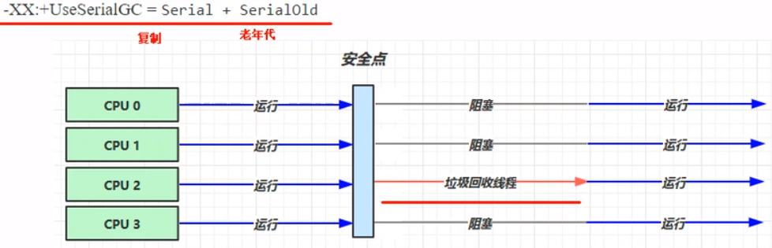


使用参数-XX:+UseSerialGC = Serial +SerialOld，开启新生代和老年代的串行垃圾回收器

- 新生代使用的垃圾回收算法是**复制**

- 老年代使用的垃圾回收算法是**标记整理**


#### 吞吐量优先回收器

并行垃圾回收器

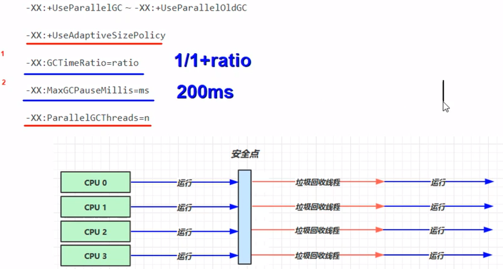

-XX:+UseParallelGC ~ -XX:+UseParallelOldGc

- jdk8 默认此选项
- 新生代使用的垃圾回收算法是**复制**

- 老年代使用的垃圾回收算法是**标记整理**
- 开启一个，另一个也自动开启
- 垃圾回收线程个数，默认等于CPU核数
- 也可以通过-XX:ParallelGCThreads=n，来手动设置垃圾回收线程数
- -XX:+UseAdaptiveSizePolicy
  - 系统会根据系统运行情况修改新生代大小(-Xmn),Eden和Survivor比例(-XX:SurvivorRatio)，晋升老年代对象年龄(-XX:PretenureSizeThreshold)等参数；来提供最合适的停顿时间和最大吞吐量。
- -XX:GCTimeRatio=ratio
  - MaxGCPauseMillis设置==回收停顿==的最大时间。收集器尽可能将垃圾回收消耗时间保持在这个数值之下；但是并不是把这个数设置越小，垃圾收集就越快
  - 停顿时间减少是以牺牲吞吐量和新生代空间换来的，系统会将新生代内存降低--->回收停顿时间缩小--->停顿次数增加，总停顿时间增加，吞吐量减小
- -XX:MaxGCPauseMillis=ms
  - 设置一个1-99的整数X，*1/(1+X)*表示垃圾回收时间占总时间的比率，整数设置越大，==吞吐量==越大
  - 整数设置越大相当于停顿时间减少，系统会增加新生代内存--->吞入量变大--->回收停顿时间变长
- 上面两参数是相互制约
- 对于不是很了解收集器运作的开发人员来说，*ParallelGC*是个更好的选择。事先设置好堆大小-Xmx，然后设置 *MaxGCPauseMillis*（重视停顿时间）或者*GCTimeRatio*（重视吞吐量）；设置完优化目标，剩下的具体参数修改交给系统自己。
  这也是*ParallelGC*和*ParNew*一个重要的区别


#### 响应时间优先垃圾回收器

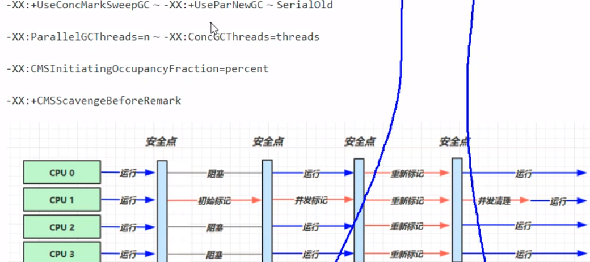

- 老年代使用*CMS*（Concurrent Mark Sweep）垃圾回收器，使用的是**标记清除算法**。
  - 并发的垃圾回收器，和之前并行垃圾回收器区别在于：
    - 并行垃圾回收器，在多个垃圾回收线程运行时，不允许用户线程运行
    - 并发垃圾回收器，垃圾回收线程可以和用户线程一起并发执行，减少了STW时间
  - **存在并发失败情况（内存碎片过多），此时CMS会退化到SerialOld串行垃圾回收器，响应时间变长**
  - 工作流程：
    - 进行初始标记，此时会STW
    - 并发标记剩余垃圾，此时用户线程可以并发运行
    - 重新标记，消除前一步中并发运行的用户线程对标记造成的干扰，STW
    - 并发回收垃圾，此时用户线程可以并发运行
- 新生代*ParNewGC*垃圾收集器，**复制**算法(*ParNewGC*是多线程版本的*Serial*)。
- -XX:ParallelGCThread=n，并行线程数，一般为cpu核心数，图中N=4。
- -XX:ConcGCThreads=threads，一般设置为n/4，并发垃圾回收线程数。如n为1，其余3个线程留给用户线程
  - 由于全程占用了线程，对于整个程序而言，占用线程数变少，吞吐量会降低
- -XX:CMSInitiatingOccupancyFraction=percent，达到比例就会触发老年代垃圾回收。
  - jdk1.6将这一值从1.5中的68改为92，为了防止频繁的触发老年代垃圾回收；
  - 为什么要设置这一比例？
    - 因为在并发垃圾清理的同时，其它用户线程也在运行，**产生的浮动垃圾*CMS*当前批次中难以处理，只能留到下次GC**。比如有10M内存，之前的垃圾回收器会在内存不足时进行垃圾回收，垃圾回收时STW；而使用CMS垃圾回收器，如果在内存不足时才进行垃圾回收，而回收时用户线程还在运行，如果不预留空间，就会造成OOM
  - 如何设置最好？
    - 在内存无法满足运行需要时，会出现*Concurrent Mode Failure*失败，VM会使用*Serial Old*代替*CMS*对老年代中垃圾对象进行整理，停顿时间更长，比例设置过高，更加容易触发*Concurrent Mode Failure*失败，影响性能（*Serial Old*暂停所有用户线程防止产生更多的对象，同时可以清理内存碎片）。
    - 所以项目产生对象不是很快可以将这一比例设置高一点，这样既不会很快出现*Concurrent Mode Failure*失败，也不会太容易触发GC。
  - 因为*CMS*老年代使标记-清除算法，会产生很多碎片内存，会给大对象分配内存带来麻烦，则会出现老年代内存很充裕，但是大对象放不进去，不得不触发FULL GC；-XX:+UseCMSCompactAtFullCollection默认开启，在CMS要开始FULL GC时，开启内存碎片的合并，无法并发，**响应时间变长**。
  - -XX:CMSFullGCsBeforeCompaction，设置执行多少次不压缩的FULL GC后，执行一次带压缩的FULL GC。
- -XX:+CMSScavengeBeforeRemark
  - 重新标记时，由于对所有对象进行可达性分析，而在新生代中包含了许多对象，其中大部分都是需要马上回收的垃圾，所以再重新标记之前可以将这些垃圾回收。该参数就是指明在重新标记之前，触发一次ParallelNewGC，来回收掉新生代中无用的对象，减轻重新标记代价


#### G1垃圾回收器

Garbage First，jdk9后默认垃圾收集器，代替了CMS

**适用场景**

- 同时注重吞吐量和低延迟，默认暂停目标时200ms。
- 超大堆内存会将内存划分为多个相等的Region。
- 整体上使用标记-整理算法，不会产生内存碎片，两个区域使用复制算法。

**相关VM参数**

- -XX:UseG1GC
- -XX:G1HeapRegionSize=size
- -XX:MaxGCPauseMillis=time

**垃圾回收阶段**

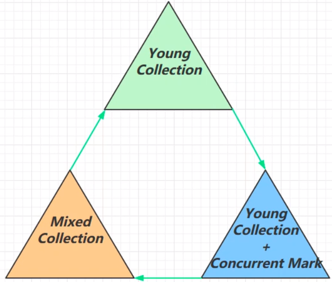

- Young Collection
- Young Collection + Concurrent Mark
- Maxed Collection

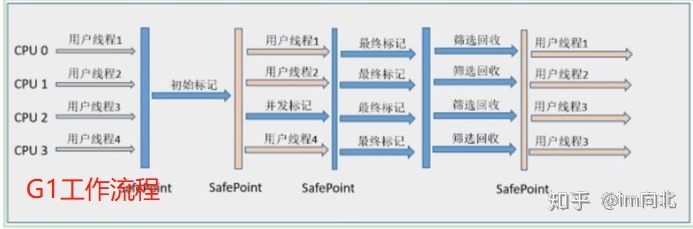

##### Young Colletion

- 内存被分为很多个大小相等的区域。
- **E(Eden)区内存不足**时触发minor GC（存在STW），将存活对象**复制**到S(Surviror)区（To），From中存活对象转移到To*中(S->S)，*From和To调换位置(minor GC后Surviror中对象存在于From中)。
- S->O,幸存区对象晋升到老年代。

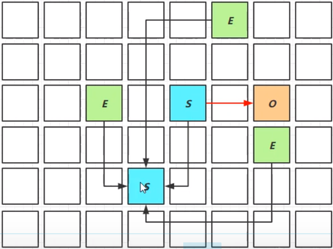

**跨代引用**

- 场景：新生代垃圾回收时，要进行可行性分析，查找新生代对象的根对象，大多根对象都存活在老年代中

- 将老年代划分为许多区域，如果区域中有对象引用了新生代对象，就将其标记为脏卡，然后新生代对象通过Remmember Set记录对应脏卡。查找根对象时，就只需要遍历脏卡区域查找GC Root
- 在对象引用变更时，就需要去更新脏卡
  - 通过post-write barrier（写屏障）将更新脏卡指令放入dirty card queue队列中，等待线程执行。
- current refinement threads 更新 Remmember Set


##### Young Collection + CM

- 在Young GC 时，会进行GC Root的**初始标记** 
- 老年代占用堆空间比例达到阈值时，进行**并发标记**（不会STW）
  - 阈值由-XX:InitiatingHeapOccupancyPercent=percent（默认45%）

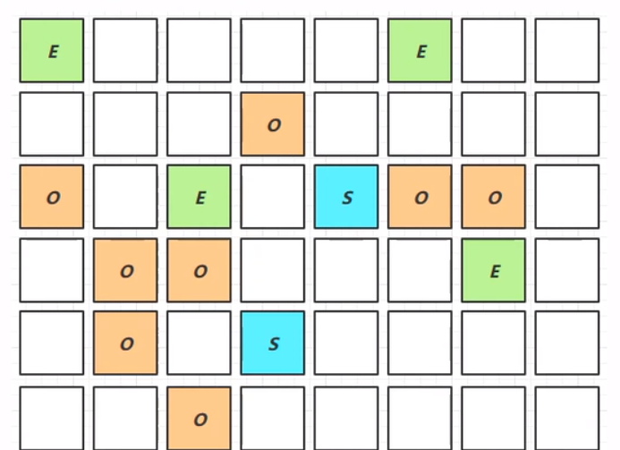


##### Mixed Collection

会对E、S、O进行全面垃圾回收

- 最终标记（Remark）会STW
- 拷贝存活（Evacuation）会STW
- -XX:MaxGCPauseMillis=ms

**回收过程**

- 最终标记，需要STW，避免其他用户线程在标记过程中，产生浮动垃圾。

- *O->O*，回收老年代中的垃圾使用复制算法，将一个老年代区域中存活的对象复制到另一个老年代区域。
- G1垃圾收集器选择回收价值高的老年代区域(可回收空间更多的区域)，为了在MaxGCPauseMillis时间内完成垃圾回收
  - Garbage First，就是对可回收垃圾最多的区域进行回收

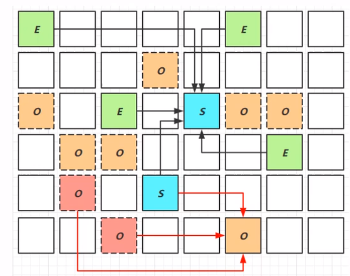


#### Full GC

- SerialGC串行垃圾回收
  - 新生代内存不足 **minor GC**
  - 老年代内存不足 **Full GC**
- ParallelGC并行垃圾回收
  - 新生代内存不足 **minor GC**
  - 老年代内存不足 **Full GC**
- CMS并发垃圾回收
  - 新生代内存不足 **minor GC**
  - 老年代内存不足
    - 老年代占用达到阈值时，若垃圾回收大于垃圾产生速度，处于**并发收集阶段**
    - 并发失败，退化为SerialOld **FULL GC**
- G1
  - 新生代内存不足 **minor GC**
  - 老年代内存不足
    - 老年代占用达到阈值时，若垃圾回收大于垃圾产生速度，处于**并发收集阶段**
    - 并发失败，退化为ParallelGC **FULL GC**


#### Remark

CMS和G1的并行标记阶段

**并发标记阶段**

- 图中黑色表示已经处理完毕，灰色表示正在处理，白色表示还未处理。
- 则在并发收集时，存在这样的情况：
  - 用户线程取消了灰色到白色的引用，然后标记线程将白色区域标记为垃圾，并置为黑色，表示处理完。这个过程是正确的
  - 在上一种情况的基础上，如果用户线程又重新使用灰色到白色的引用，但标记线程已经处理完成了，回收时会将白色区域回收
- 为了解决用户线程改变引用的情况，CMS和G1都采取一种方式Write barrier+log
  - ==per-write barrior （写屏障）：用于监听用户修改引用关系，当引用关系改变，就会将对象放入satb_mark_queue队列，重新标记阶段再处理队列中的对象==


#### JDK 8u20 字符串去重

- 优点：节约大量内存
- 缺点：略微多占用cpu运行时间，新生代回收时间略微增加

-XX:+UseStringDEduplication 开启去重

```
String s1 = new String("hello");//char[]{'h','e','l','l','o'}
String s1 = new String("hello");//char[]{'h','e','l','l','o'}
```

- 将所有新分配的字符串放入一个队列
- 当新生代回收时，检查是否有重复的字符串
- 相同的字符串指向同样的字符数组char[]
- **注意** 与String.intern（）不同
  - String.intern（）注重的时字符串对象
  - 字符串去重更加注重char[]
  - JVM内部使用不同的字符串去重


#### JDK 8u40 并发标记类卸载

所有对象在并发标记后，就知道哪些类不在被使用，**当类的实例被回收，且类所在的类加载器中的所有的类都不再被使用，则卸载类加载的所有类。**主要用于回收自定义类加载器
-XX:+ClassUnloadingWithConcurrentMark 默认开启


#### JDK 8u60 回收巨型对象

- 一个对象大于region的一半时，被称为巨型对象。
- G1不会对巨型对象进行复制（太大，复制算法好费时间）
- 回收优先考虑。
- G1会跟踪老年代对于新生代的引用，当老年代引用为0时的巨型对象就可以在新生代的垃圾回收中被处理。


#### JDK9并发标记起始时间调整

- 并发标记必须在堆空间占满之前完成，否则触发FULL GC
- JDK9之前使用-XX:InitiatingHeapOccupancyPercent来设置老年代阈值
- JDK9 可以去**动态调整**
  - -XX:InitiatingHeapOccupancyPercent设置初始值阈值
  - 进行数据采样并动态调整
  - 总会添加一个安全的空档空间


### 垃圾回收调优

- 掌握GC相关的JVM参数，会基本的空间调整
- 掌握相关工具
- 重点：调优与应用和环境有关，没有统一的规则

**查看虚拟机运行参数**
"jdk下bin目录下java命令的绝对地址" -XX:+PrintFlagFinal -version | findstr "GC"


#### 调优领域

- 内存
- 锁竞争
- cpu占用
- io

#### 调优目标

- **低延迟**还是**高吞吐量**，选择合适收集器
  - 对于科学运算，追求的是高吞吐量，可以使用Parallel GC
  - 对于互联网项目，追求的是低延迟，可以选择 G1、Z GC(超低延迟)
- Zing VM，号称0延迟

#### 最快的GC是不发生GC

查看FULL GC前后的内存占用，考虑下面几个问题

- 数据是不是太多
  - result = statement.Query("select * from bigTable ==limit n==");//可以限制查询条数
- 数据表示太臃肿
  - 对象图，尽量从数据库中取出自己需要数据，而不是将所有数据取出
  - 对象大小 
    - 一个最小的Object占16字节
    - Integer 24字节，而int 4字节
- 是否存在内存泄漏
  - static Map map 不断加入对象，强引用不得回收
  - 对于一些缓存数据，可以使用软、弱引用
  - 或者使用一些第三方缓存产品 redis等，不是使用JVM垃圾回收，而是第三方产品自己来管理内存

#### 新生代调优

- 新生代特点
  - 所有new操作分配的内存都是廉价的
    - 每个线程会在伊甸园中分配一块内存 TLAB thread local allocation buffer，每个线程创建对象都会放在自己的TLAB中，防止线程之间造成干扰
  - 死亡对象回收代价是0
    - 垃圾回收将Eden和From中存活的对象复制到To中，剩下的垃圾对象直接全部删除，代价很小。
  - 大部分对象用过即死
  - *Minor GC*比*Full GC* 时间小很多。

**新生代是否越大越好**

- 新生代过小，会频繁触发*Minor GC*
- 新生代过大，老年代相应的变小，*Full GC* 门槛变低，Full GC代价更大
- Oracle建议：大于25%，小于50%
- 在新生代变大的过程中，吞吐量首先是增长的，之后会下降，不过还是需要给新生代尽可能大的空间。
- 新生代垃圾回收分为：标记+复制
  - 标记过程其实代价很小，可以忽略
  - 由于新生代对象大多数都是用过即死，存活的对象极少，在新生代内存增大后，复制过程代价也不会受太多影响。
- 新生代能够容纳所有【并发量*(请求-响应)】的数据。
- 如果一次请求产生512k的对象，同一时间有1000个并发用户，则要保证新生代要能够存储512M的对象，可以保证一次请求中不会触发Minor GC

**幸存区大到能保留（存储的是当前活跃对象 和 需要晋升的对象）**

- 这样能保证用不着的垃圾对象下次就能被回收
- 如果幸存区比较小，JVM就会动态调整晋升阈值，那么对象就会被提前转移到老年代，变相延长对象生存时间

**晋升阈值配置得当，使长时间存活对象尽快晋升**

- 可以减少复制代价

- -XX:MaxTenuringThreshold=threshold 配置阈值
- -XX:+PrintTenuringDistribution 打印晋升细节


#### 老年代调优

以*cms*为例。

- 老年代内存越大越好，可以预留更多的空间，避免浮动垃圾造成退化成Serial Old
- 先尝试不要做调优，如果没有FULL GC，那么已经满足需求，否则先尝试新生代调优
- 实在不行，再观察发生FULL GC时老年代的内存占用，将老年代的内存提高1/4-1/3
- -XX:CMSInitialOccupancyFraction = percent 推荐设置为70-80

#### 案例

- 案例一：*FULL GC*和*Minor GC*都很频繁

首先分析可能原因，先做新生代调优，新生代内存过小，对象放不下直接进入老年代，不仅*Minor GC*频繁，老年代中也会存入大量垃圾对象，*FULL GC* 也会频繁发生。

所以，适当增大新生代内存大小，使得*Eden*可以存下新生的多个对象，不会过于频繁触发*Minor GC*，幸存区存下幸存对象能够使幸存对象在新存区中保存，不会过早进入老年代，老年代内存占用减轻。

- 案例二：请求高峰期发生*FULL GC*，单次暂停时间过长（要求低延迟，选择CMS）

分析：请求高峰，并发用户很多，产生的新对象很多，堆中对象数目较大。CMS中**重新标记**会扫描整个堆内存来标记对象，所以会耗用大量时间。

调优：-XX:+CMSScavengeBeforeRemark 设置在**重新标记**前对**新生代**进行一次**垃圾清理**，会大大减少**重新标记**的时间。

- 案例三 老年代充裕情况下，发生FULL GC（cms jdk1.7）

在jdk1.7及以前，方法区以永久代方式实现，永久代内存不足时，也会发生*FULL GC* ，增加
jdk1.8及以后，利用元空间实现，使用的是系统内存，内存充裕，很少会触发*FULL GC*。


## 常用JVM分析工具

**查看当前运行的java进程**

jps

**查看堆内存占用情况**

jmap -heap 进程id

**可视化连续监测工具**

jconsole

==jvisualvm，更高级==


## 常用命令：

[java工具类参考网址](https://docs.oracle.com/en/java/javase/11/tools/tools-and-command-reference.html )

**java VM参数**

| 含义                 | 参数                                                        | 说明                                         | 举例                                                      |
| -------------------- | ----------------------------------------------------------- | -------------------------------------------- | --------------------------------------------------------- |
| 初始堆大小           | -Xms                                                        |                                              | -Xms1024m                                                 |
| 最大堆大小           | -Xmx(-XX:MaxHeapSize)                                       | 一般将初始堆大小和最大堆大小设置相同         | -Xmx1024m                                                 |
| 线程虚拟机栈大小     | -Xss                                                        |                                              | -Xss8m                                                    |
| 方法区大小           | -XX:MaxPermSize<br />-XX:MaxMetaspaceSize                   | jdk6 方法区在永久代<br />jdk8 方法区在元空间 | -XX:MaxPermSize=8m<br />-XX:MaxMetaspaceSize=8m           |
| 新生代大小           | -Xmn<br />(-XX:NewSize + -XX:MaxNewSize)                    |                                              |                                                           |
| 幸存区比例（动态）   | -XX:InitialSurvivorRatio和<br />-XX:+UserAdaptiveSizePolicy | 默认值为8                                    | 假如新生代有10M内存，则8M为<br />伊甸园，1M为From，1M为To |
| 幸存区比例（静态）   | -XX:SurvivorRatio                                           |                                              |                                                           |
| 晋升阈值             | -XX:MaxTenuringThreshold                                    | 当寿命超过该阈值，则假如老年代               |                                                           |
| 晋升详情             | -XX:+PrintTenuringDistribution                              |                                              |                                                           |
| FullGC前 MinorGC     | -XX:+ScavengeBeforeFullGC                                   |                                              |                                                           |
| GC详情               | -XX:+PrintGCDetails -verbose:gc                             |                                              |                                                           |
| 字符串常量表统计信息 | -XX:+PrintStringTableStatistics                             |                                              |                                                           |
| 打开串行回收器       | -XX:+UseSerialGC=Serial + SerialOld                         | 开启新生代和老年代串行回收器                 |                                                           |

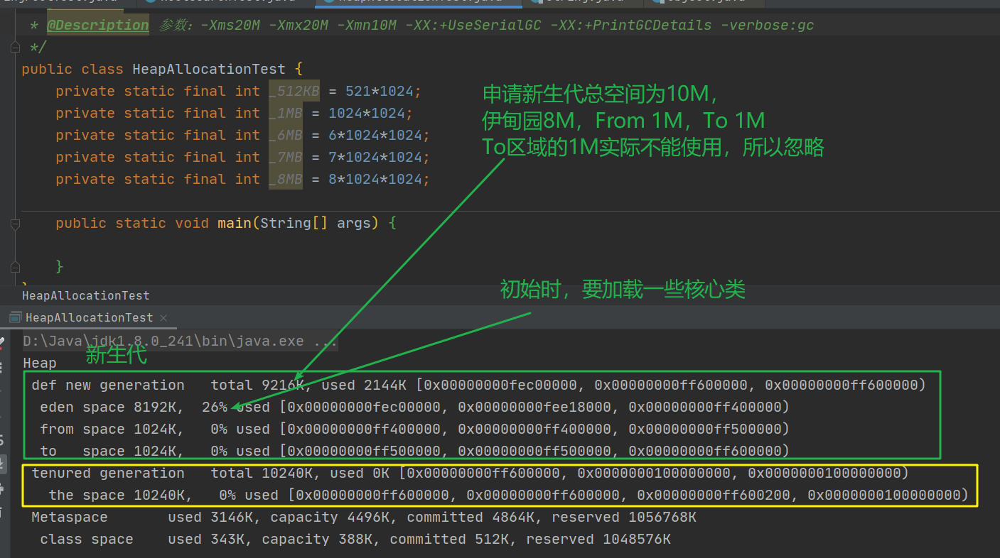

**javap -v classxx**

不仅会输出行号、本地变量表信息、反编译汇编代码，还会输出当前类用到的常量池等信息

**javap -c**

对当前class字节码进行反编译生成汇编代码

**jps**	

java提供的一个显示当前所有java进程pid的命令，适合在linux/unix平台上简单察看当前java进程的一些简单情况。

