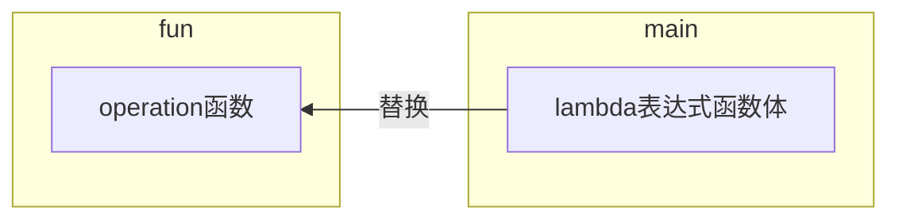

# 目录

[TOC]


# Kotlin介绍

## Kotlin发展史

Kotlin语言是由JetBrains公司开发，2011年就公布了第一个版本，2016年Kotlin发布了1.0正式版本，2017年Google宣布Kotlin正式成为Andorid一级开发语言。

## Kotlin工作原理

编程语言一般分为编译型语言和解释性语言。

编译型语言：将源代码一次性编译成为计算机可识别的二进制文件，然后计算机直接执行二进制文件。先编译后执行

​	C、C++

解释性语言：解释器一行行地读取源代码，实时地将源代码解释成二进制文件，再执行。边解释边执行

​	Java、Python、JavaScript

**Java是解释性语言的原因：**

​	Java使用javac命令的编译，是将.java文件编译成.class文件，这个.class文件才对应的是C++中的源代码。然后==Java虚拟机再边解释边执行.class文件==。

**Kotlin产生**

​	由于java虚拟机执行的是.class文件，而不在乎.class文件的来源，==Kotlin就是实现了一个新的编译器，然后将Kotlin语言编写的文件编译成同样规格的.class文件==

**Kotlin的优势**

1. 语法简洁。同样功能，代码量较Java开发减少50%以上
2. 语法更高级
3. 语言安全性更高，几乎杜绝了空指针
4. 与Java是100%兼容。Kotlin可以执行调用Java编写的代码，也可以无缝使用Java第三方的开源库

**运行Kotlin代码**

1、使用IDE

​	IntelliJ IDEA、Android Studio

2、在线工具

​	https://try.kotlinlang.org


# Kotlin语法

## 编码规范

Kotlin每一行代码末尾不需要加分号

## 变量

**关键字**

==val==(value简写) 用来声明**只读变量**

==var==(variable简写)用来声明**可变变量**

**语法**

val|var 变量名：变量类型 = 变量值

```kotlin
//直接赋值
//完整形式
val a:Int = 10
println("a="+a)
//不显示声明变量类型,Kotiln具有自动类型推导机制
var b = 10

//延迟赋值,延迟赋值必须要显式声明变量类型
var c:Int
c = 10
```

**val和var需要注意的地方**

val 只读变量并不代表是常量

对于普通变量来说，不可变（ immutable ）和只读（ read-only ）之间没什么区别。因为你没有办法复写一个 val 变量，所以在这时确实是不可变的。

但如果是对于类的成员变量来说，那只读和不可变的区别可就大了。

在 Kotlin 的类中，val 和 var 是用于表示属性是否有 getter/setter：

- var：同时有 getter 和 setter。

  ```java
  //对应的JVM字节码(不是真正的，只用来说明)
  //从这里可以看出var就是一个变量
  private static Type valueName
  public final Type getValue()
  public final setValue(Type value)
  ```

- val：只有 getter

  ```java
  //虽然变量被声明为static，但是如果get方法被修改，获取的值还是会变化，但是不能给变量赋值
  private final static Type valueName
  public final Type getValue()
  ```

- const val 常量

  ```java
  //字节码中没有get set方法，就是一个普通常量
  private final static Type valueN
  ```

Kotlin中都是类，虽然使用val声明，但是只是引用地址不可变，堆空间的内容还是可以变化


**Kotlin类型推导机制**

当显示赋值时，Kotlin会根据值的类型来推导变量或方法返回值的类型


## Kotlin中8种数据类型

Kotlin完全抛弃了Java中的基本数据类型，全部使用对象数据类型

Byte Short Int Long 

Float Double 

Char 

Boolean

## 字符串内嵌表达式

${}

```kotlin
val a = 1
val b = 2
println("${a + b}, world")
//当表达式只有一个变量时
println("$a, world")
```


## 函数

**语法**

不带返回值：

​	fun 函数名(参数名:参数类型，...){}

带返回值

​	fun 函数名(参数名:参数类型，...): 返回值类型{return 0}

```kotlin
fun largerNumber(num1:Int,num2:Int): Int{
 return max(num1,num2)
}
```


### 主函数

```kotlin
fun main(){
	...
}
```


### 键值对传值(参数默认值)

Kotlin支持键值对传值，同时还可以给参数设置默认值

```kotlin
fun printParams(num: Int, str: String="hello") {
	println("num is $num , str is $str")
}
fun main() {
	printParams(123)
}

fun printParams(num: Int=123, str: String) {
	println("num is $num , str is $str")
}
fun main() {
 	//键值对传值
	printParams(str = "world")
}
```


**缩写**

Kotlin语法糖：当函数中只存在简单的代码（一行代码或者if when条件语句只存在一行代码）时，可以缩写

```kotlin
fun largerNumber(num1:Int,num2:Int): Int = max(num1,num2)
//利用自动类型推导，进一步缩写
fun largerNumber(num1:Int,num2:Int) = max(num1,num2)
```


### 标准函数

#### let

Object.let(Lambda表达式)

表达式中的代码会立即执行（给代码块加锁），**没有返回值**

```kotlin
var study: Study? = null
//此时不能使用if判断不为空，再进行操作
//因为study是全局变量，可能会被其他线程修改
fun doStudy() {
	study?.let {
        it.readBooks()
        it.doHomework()
    }
}
```


#### with

with(Object object,Lambda表达式)

with函数会在lambda表达式中提供object的上下文(相当于引入这个对象，然后就可以直接使用这个对象的方法进行操作)，并使用lambda表达式**最后一行代码最为返回值**返回

```kotlin
val result = with(StringBuilder()){
	append("hello\n")
    toString()
}
println(result)
```


#### run

Object.run(Lambda表达式)

run函数是通过某个对象来调用的，使用方式和with函数一样

```kotlin
val result = StringBuilder().run{
	append("hello\n")
    toString()
}
println(result)
```


#### apply

Object.apply(Lambda表达式)

apply函数和run函数相似，区别在于默认**返回调用对象本身**

```kotlin
val result = StringBuilder().apply{
	append("hello\n")
}
println(result.toString())
```


#### repeat

循环函数

```kotlin
repeat(n){
	println(str)	
}
```


### 扩展函数

扩展函数就是对已有的类动态添加一个自定义函数，对于Java而言，JDK中的工具类都已经声明为了final，是不可以通过继承来扩展的，而Kotlin提供这样的功能

==扩展的函数中自动拥有了被扩展类实例的上下文==

对于扩展函数，最好定义为**顶层方法**，让扩展函数拥有**全局访问域**

```kotlin
//统计字母数量
fun String.lettersCount(): Int{
	var count = 0
    for(char in this){
        if(char.isLetter()){
            count++
        }
    }
    return count
}
//调用
val count = "ABC123xyz!@#".lettersCount()
```


### 高阶函数

如果一个函数接受另一个函数作为参数，或者返回值的类型是另一个函数，则该函数就是**高阶函数**

```kotlin
//func 表示函数名
//括号内容表示函数参数
//Unit 表示没有返回值，如果有返回值，写返回值类型
fun example(func: (String,Int) -> Unit){
    func("hello",123)
}
```

高阶函数中的参数函数还可以**自动获取类的上下文环境**，在该函数中调用类的方法时直接调用即可

在函数类型前加上==ClassName.== 就表示这个函数类型是定义在哪个类中。调用时，**Lambda表达式**会自动拥有Class的上下文

```kotlin
//StringBuilder. 表示自动获取StringBuilder的上下文
fun StringBuilder.builder(func: StringBuilder.() -> Unit): StringBuilder {
    func()
    return this
}

fun main(){
    val list = listOf("Apple","Banana","Orange")
    val result = StringBuilder().builder{
        append("Start eating fruits.\n")
        for (fruit in list){
            append(fruit).append("\n")
        }
        append("Ate all fruits.")
    }
    println(result.toString())
}
```


#### 高阶函数应用

**简化SharedPreferences用法**

```kotlin
//传统方式
//getSharedPreferences要获得Context上下文
val editor = getSharedPreferences("data",Context.MODE_PRIVATE).edit()
editor.putString("name","Tom")
editor.putString("age",28)
editor.apply()
// -----------------------------------
fun SharedPreferences.open(block:SharedPreferences.Editor.() -> Unit){
    val editor = edit()
    editor.block()
    editor.apply()
}

getSharedPreferences("data",Context.MODE_PRIVATE).open(){
    editor.putString("name","Tom")
	editor.putString("age",28)
}
```

Google提供的KTX扩展库已经包含了该用法，Android项目只需导入依赖

```json
implementation 'androidx.core:core-ktx:1.0.2'
//使用
getSharedPreferences("data",Context.MODE_PRIVATE).edit(){
    editor.putString("name","Tom")
	editor.putString("age",28)
}
```


**简化ContentValues的用法**


```kotlin
//传统方式
val values = ContentValues()
values.put("name","Tom")
values.put("age",23)
db.insert("Student",null,values)
// -----------------------------------
//改进
fun cvOf(vararg pairs: Pairs<String,Any?>) = ContentValues().apply{
    for(pair in pairs){
        val key = pair.first
        val value = pair.second
        when(value){
            is Int -> put(key,value)
            is Long -> put(key,value)
            is Short -> put(key,value)
            is Float -> put(key,value)
            is Double -> put(key,value)
            is Boolean -> put(key,value)
            is String -> put(key,value)
            is Byte -> put(key,value)
            is ByteArray -> put(key,value)
            null -> putNull(key)
        }
    }
}

val values = cvOf("name" to "Tom","age" to 23)
db.insert("Student",null,values)
```

**解释**

在Kotlin中 A to B 这样的语法会创建一个Pair对象

==vararg== 对应Java中的可变参数列表==...==

==Any==是Kotlin所有类的基类，对应Java中的==Object==，**Any?**表示可以传入空值


### 内联函数

消除lambda表达式使用时**创建匿名类的开销**

只需要在高阶函数前面使用==inline关键字==

```kotlin
inline fun numOp(num1:Int,num2:Int,operation:(Int,Int) -> Int):Int{
    val result = operation(num1,num2)
    return result
}

fun main(){
    val result = numOp(num1,num2){n1,n2 ->
        n1+n2
    }
}
```

**内联函数原理**

将lambda表达式中函数体替换operation方法，得到一个完整的方法，然后将方法体中的内容替换到main函数中。

所以内联函数实际上就是**将代码动态添加到调用处运行**



```kotlin
//第一步
inline fun numOp(num1:Int,num2:Int):Int{
    val result = num1+num2
    return result
}

fun main(){
    val result = numOp(num1,num2){n1,n2 ->
        n1+n2
    }
}

//第二步
fun main(){
    //
    val result = num1+num2
}
```

#### 排除内联功能

使用inline关键字后，Kotlin编译器会自动将所有引用的Lambda表达式全部进行内联。==noinline关键字==排除内联功能

```kotlin
inline fun inlineTest(block1:() -> Unit,noinline block2:() -> Unit){
    ...
}
```

**内联函数与非内联函数的区别**

根据内联函数的运行原理，我们可以知道

- 函数返回区别
  - 内联函数的Lambda表达式中，是可以使用**return关键字**来直接结束来直接进行**函数返回**
  - 非内联函数只能进行局部返回，即结束Lambda表达式所表示的函数，因为**匿名类**（Lambda表达式）中不允许使用return关键字进行函数返回，可以使用**return@非内联函数名**进行**局部返回**
- 参数作用域不同
  - 内联函数的参数只允许传递给另外一个内联函数
  - 非内联函数的参数可以自由传递

#### 解决return冲突

对于下面这段代码，由于内联函数可以使用return关键字进行函数返回，而Runnable匿名类只能使用局部返回，所以Kotlin编译器会检测报错。为了解决这种问题， 使用==crossinline关键字==，声明该关键字就是**保证内联函数中不会使用return关键字**

```kotlin
inline fun runRunnable(block:() -> Unit){
    val runnable = Runnable{
        block()
    }
}
```


## 程序逻辑控制

### if条件语句

**语法**

语法基本与Java中if类似

```kotlin
fun largerNumber(num1:Int,num2:Int): Int {
    if(num1>num2){
        return num1
    }else{
        return num2
    }
}
```

**Kotlin中==if==语句是可以有返回值的，返回值是条件最后一行代码的返回值**

```kotlin
fun largerNumber(num1:Int,num2:Int): Int {
    return if(num1>num2){
        num1
    }else{
        num2
    }
}
```

**缩写**

根据返回值进行类型推断，利用语法糖缩写

```kotlin
fun largerNumber(num1:Int,num2:Int) = if(num1>num2){
    num1
}else{
    num2
}
```

进一步精简

```kotlin
fun largerNumber(num1:Int,num2:Int) = if(num1>num2) num1 else num2
```


### when条件语句

==when==是用来替代Java中switch

java switch局限性

1. java中switch只支持三类类型：整型（4种）、枚举类型、字符串类型
2. 每个case后面都需要主动加上break

**语法**

带参数形式

```kotlin
when(变量){
	匹配值 -> {
	
	}
	匹配值 -> {
	
	}
	else -> {
	
	}
}
```

实现

```kotlin
fun getScore(name:String) = when(name){
	"Tom" -> {
        86
    }
    "Jim" -> {
        77
    }
    else -> {
        0
    }
}
```

不带参数形式 感觉等同于if吧

```kotlin
when{
	表达式 -> {
	
	}
	表达式 -> {
	
	}
	else -> {
	
	}
}
```

实现

```kotlin
fun getScore(name:String) = when{
    //匹配以Tom开头
    name.startsWith("Tom") -> 86
    name == "Jim" -> 77
    else -> 0
}
```


#### 类型匹配

Number是Kotlin内置的抽象类，和数字有关的类都是它的子类

==is==关键字相当于java中的instanceof

当变量进入分支后，该变量会被自动转化为判断的类型

```kotlin
fun checkNumberType(num:Number){
	when(num){
        //is关键字相当于java中instanceof
        //条件分支中的num已经被自动转化为了Int类型
        is Int -> println(num)
        is Double -> println("number is Double")  
        else -> println("number not support")
    }
}
```


**缩写**

当语句中只有一行时，可以不需要括号

```kotlin
fun getScore(name:String) = when(name){
	"Tom" -> 86
    "Jim" -> 77
    else -> 0
}
```


### 循环语句

Kotlin提供了==for==和==while==两种方式，while语法与Java中没有任何区别

**for循环语法**

Java中存在两种for循环方式:for-i 、for-each

Kotlin舍弃了for-i方式，增强了for-each方式，变成了for-in，和python类似

```kotlin
fun main(){
	for (i in 0..10){
        println(i)
    }
}
```

for-in方式默认步长为1，即i++，如果想自定义步长，需要使用==step==关键字

```kotlin
fun main(){
	for (i in 0 until 10 step 2){
        println(i)
    }
}
```


**区间定义**

升序闭区间

​	==..==是创建升序闭区间的关键字，在..两边指定左右端点就可以创建一个升序闭区间

```kotlin
val range = 0..10
```

升序左闭右开区间

​	==until==是创建升序左闭右开区间的关键字，在until两边指定左右端点就可以创建一个升序左闭右开区间

```kotlin
val range = 0 until 10
```

降序闭区间

​	==downTo==是创建降序闭区间的关键字，在downTo两边指定左右端点就可以创建一个降序闭区间

```kotlin
val range = 0 downTo 10
```


## 面向对象编程

### 基本定义

与java基本类似，但是**实例化时省略了new关键字**

```kotlin
class Person{
	var name = ""
	var age = 0
	fun eat(){
		println(name+"is eating.He is "+age+"years old.")
	}
}
//省略new关键字
val p = Person()
```


### 构造函数

**主构造函数**

Kotlin中主构造函数是没有函数体的，直接定义在类名的后面，如果不显示声明，默认主构造函数为无参构造函数

```kotlin
//默认声明无参构造函数
class Person{
	var name = ""
    var age = 0
}
```

有参主构造函数,使用==init关键字==编辑主构造函数逻辑

**在主构造器（次构造器不行）中该参数声明为val或var，会自动将参数添加为类的属性**

```kotlin
class Person(val name:String,val age:Int){
	init{
		println("name is "+name)
		println("age is "+age)
	}
}
//传入父类的参数，就不需要给变量加上修饰符了
class Student(val sno:String,val grade:Int,name:String,age:Int):Person(name,age){
    
}
```


**次构造函数**

**Kotlin规定，当一个类既有主构造函数，又有次构造函数时，所有次构造函数必须调用主构造函数（包括间接调用）**

次构造函数使用==constructor关键字==声明

```kotlin
class Person(name:String,age:Int){
	init{
		println("name is "+name)
		println("age is "+age)
	}
	constructor(name:String):this(name,0){
	}
}
```

Kotlin规定，当一个类没有显示声明主构造函数而声明次构造函数时，该类就只有次构造函数

```kotlin
class Person{
	constructor(name:String,age:Int){
	}
}
```


### 属性

**定义属性**

其初始器`（initializer）`、`getter`和 `setter`都是可选的

```kotlin
var <propertyName>[: <PropertyType>] [= <property_initializer>]
    [<getter>]
    [<setter>]
```

**使用和设置属性**

对于属性的操作就是调用他们的get() set()方法，如果不设置，会自动添加默认方式

自定义方式

```kotlin
var stringRepresentation: String
    get() = this.toString()
    set(value) {
        setDataFromString(value) // 解析字符串并赋值给其他属性
    }
```

改变一个访问器的可见性或者对其注解，但不改变默认的实现

```kotlin
var setterVisibility: String = "abc"
    private set // 此 setter 是私有的并且有默认实现

var setterWithAnnotation: Any? = null
    @Inject set // 用 Inject 注解此 setter
```


### 继承

Kotlin中所有的类**默认都是不可继承的**，相当于java中给类声明了final，想要继承需要使用==open关键字==让类可以被继承，然后使用==:关键字==继承父类

```kotlin
open class Person{
	...
}
//注意这里的Person还添加了一对括号
class Student : Person(){
	
}
```

解释为什么要加一对括号：

根据继承特性，子类的构造函数必须调用父类的构造函数，由于父类主构造函数没有函数体


### 接口

Kotlin接口部分与Java中基本一致

```kotlin
interface Study{
	fun readBooks()
    fun doHomework()
}
```

Kotlin接口也可以提供默认实现，有默认实现的方法是可选择重写的

```kotlin
interface Study{
	fun readBooks()
    fun doHomework(){
    	println("do homework default implementation")
    }
}
```


### 函数可见修饰符

| 修饰符类型 | Java                             | Kotlin             |
| ---------- | -------------------------------- | ------------------ |
| public     | 所有类                           | 所有类（默认选项） |
| private    | 当前类                           | 当前类             |
| default    | 当前包路径下所有类（默认选项）   | 无                 |
| protected  | 当前类、子类和当前包路径下所有类 | 当前类和子类       |
| internal   | 无                               | 当前模块下所有类   |


### 特殊类

#### 数据类

Kotlin通过数据类减少了一个必要但是没有逻辑意义的代码，如equals()、hashCode()、toString()等方法

```kotlin
data class Department(val departmentId: Int, val name: String)
```

在Json和Object相互转换的过程中，如果json中字段名和数据类中字段名不一致，可以使用==@SerializedName注解== 来解决

```
data class Department(@SerializedName("department_id") val departmentId: Int, val name: String)
```


#### 单例类

Kotlin通过==object关键字==来简化单例类的实现，同时调用方法时简化为类似Java的静态方法

```kotlin
object Singleton{
	fun singletonTest(){
		println("singletonTest is called")
	}
}
//调用
Singleton.singletonTest()
```

#### 匿名类

使用object关键字

```kotlin
Thread(object: Runnable{
	override fun run(){
		println("Thread is running")
	}
}).start()
```

#### 密封类

当要判断类的类型时，使用传统when-is方式总会要添加一个不必要的else

使用==sealed class关键字==创建密封类，判断密封类子类类型时，强制要求检查所有子类，并且消除不必要的else

**注意：密封类及其所有子类只能定义在同一个文件的顶层位置，不能嵌套在其他类中**

```kotlin
interface Result
class Success(val msg:String):Result
class Failure(val error:String):Result
fun getResultMsg(result:Result) = when(result){
    is Success -> result.msg
    is Failure -> result.error
    else -> throw IllegalArgumentException()
}

sealed class Reuslt
class Success(val msg:String):Result
class Failure(val error:Exception):Result
fun getResultMsg(result:Result) = when(result){
    is Success -> result.msg
    is Failure -> result.error.message
}
```


### 定义静态方法

Kotlin中弱化了静态方法这个概念


**利用语法特性来创建类似静态方法的方法**

#### 使用单例类

```kotlin
object Util{
	fun doAction() {
		println("do action")
	}
}
//调用
fun main() {
    Util.doAction()
}
```

局限：类中所有的方法都类似静态调用


#### 使用companion object关键字

==companion object关键字==会在类中创建唯一一个伴生类

```kotlin
class Util{
    fun doAction1() {
        println("do action1")
    }
    companion object {
        fun doAction2() {
            println("do action2")
        }
    }
}
//调用
fun main() {
    val util = Util()
    util.doAction1()
    //Utils.doAction2()方法就是调用Util类中伴生对象的doAction2()方法
    Util.doAction2()
}
```


**创建真正的静态方法**

#### 注解@JvmStatic

注解只能加载单例类和companion object中的方法上，不常用

  ```kotlin
  object Util{
  	@JvmStatic
  	fun doAction() {
  		println("do action")
  	}
  }
  //调用
  fun main() {
      Util.doAction()
  }
  ```

#### 顶层方法

顶层方法：没有定义在类中的方法，Kotlin实际上根据文件名Singleton.kt创建了一个类SingletonKt

创建顶层方法的步骤：

- 创建一个Kotlin文件

  - 对着任意包名右击->New->Kotlin File/Class，输入文件名，选择File类型

- 在文件中直接定义方法

  ```kotlin
  //文件名Helper.kt
  fun singletonFunction(){
  	println("this is a singleton function")
  }
  ```

- 调用方法

  - Kotlin中，任何位置都可以直接调用

    ```kotlin
    fun main() {
    	singletonFunction()
    }
    ```

  - Java中，使用文件名.静态方法调用

    ```java
    public void static main(String[] args){
    	HelperKt.singletonFunction()
    }
    ```


## 集合的创建和遍历

**List**

```kotlin
//创建不可变list
val list = listOf("aa","bb")
//创建可变list
val list = mutableListOf("aa","bb")
//遍历
for(str in list){
    println(str)
}
```

**Set**

```kotlin
//创建不可变set
val set = setOf("aa","bb")
//创建可变set
val set = mutableSetOf("aa","bb")
//遍历
for(str in set){
    println(str)
}
```

**Map**

```kotlin
//val map = HashMap<String,Int>()
//创建不可变map
val map = mapOf("Applt" to 1,"Banana" to 2)
//创建可变map
val map = mutableMapOf("Applt" to 1,"Banana" to 2)
//遍历
for((fruit,number) in list){
    println("fruit is ${fruit}, number is ${number}.")
}
//Kotlin不建议使用put和set方法，推荐使用数组下标的方式来操作map，赋值。原理：Kotlin使用了infix来简化调用，实际还是调用了put和set方法
map["Apple"] = 1
//取值
val number = map["Apple"]
```


## Lambda编程

### Lambda表达式原理

实际通过匿名类来实现

缺陷：每次使用lambda表达式都会创建一个匿名类，造成额外内存和性能开销。使用**内联函数**来解决

```kotlin
fun numOp(num1:Int,num2:Int,operation:(Int,Int) -> Int) = operation(num1,num2)

fun main(){
    val result = numOp(num1,num2){n1,n2 ->
        n1+n2
    }
}

public static int numOp(int num1,int num2,Function operation){
    int result = (int) operation.invoke(num1,num2);
    return result;
}
public static void main(String[] args){
    val result = numOp(num1,num2,new Function(){
        @Override
        public Integer invoke(Integer n1,Integer n2){
            return n1+n2;
        }
    })
}
```


### Kotlin中Lambda表达式

==it关键字==

```kotlin
val maxLengthFruit = list.maxBy({ fruit: String -> fruit.length })
//当Lambda表达式是最后一个参数时，可以将其移到函数括号外面
val maxLengthFruit = list.maxBy(){ fruit: String -> fruit.length }
//当Lambda参数是函数唯一一个参数时，可以将函数的括号省略
val maxLengthFruit = list.maxBy{ fruit: String -> fruit.length }
//Kotlin的类型推导机制
val maxLengthFruit = list.maxBy{ fruit -> fruit.length }
//当Lambda表达式只有一个参数时，不必声明参数名，可以it关键字代替
val maxLengthFruit = list.maxBy{ it.length }
```


### 常见的几个函数式API（针对集合）

```kotlin
//找出最大数
val maxLengthList = list.maxBy{ it.length }
//由一个集合映射生成另一个集合
val newList = list.map{ it.toUpperCase() }
//过滤集合数据
val newList = list.filter{ it.length <= 5 }
//判断集合是否存在一个元素满足指定条件
val anyResult = list.any{ it.length <= 5 }
//判断集合是否所有元素都满足指定条件
val allResult = list.all{ it.length <= 5 }
```


## 空指针检查

Kotlin中默认所有参数和变量都是**不可为空**，其将空指针的检查提前到了**编译期**

**用于空指针的几种操作符**

？

数据类型后加上?表示**可为空类型**

?.

对象调用时使用?.表示对象不为空才调用该方法，为空时返回空

```kotlin
fun main() {
    doStudy(null)
}
fun doStudy(study: Study?) {
    study?.readBooks()
}
```


### 变量延迟初始化

由于Kotlin默认所有参数都不同为空，对于类变量而言，其赋值常常在该类被调用时，这样就不得不将其定义为可为空类型，后面使用还需要额外增加判空操作。

Kotlin使用==lateinit关键字==来对变量进行延迟初始化，搭配==::variables.isInitialized判断变量是否已经初始化==

使用延迟初始化后Kotlin不会再对变量进行检查，所以空指针问题需要自己注意

```kotlin
class Person{
    private var name:String? = null
    fun setName(name:String){
        this.name = name
    }
    fun getNameSize() = name?.length()
}
//使用延迟初始化
class Person{
    private lateinit var name:String
    fun setName(name:String){
        if(!::name.isInitialized){
            this.name = name
        }
    }
    fun getNameSize() = name.length()
}

```


## 运算符重载

在Kotlin中，所有数据类型都是类。因此数据的加减乘除等运算，实际上都是调用的方法实现。

使用==operator关键字==，就可以实现重载运算符

| 语法糖表达式             | 实际调用函数   |
| ------------------------ | -------------- |
| a + b                    | a.plus(b)      |
| a - b                    | a.minus(b)     |
| a * b                    | a.times(b)     |
| a / b                    | a.div(b)       |
| a % b                    | a.rem(b)       |
| a ++                     | a.inc()        |
| a --                     | a.dec()        |
| +a                       | a.unaryPlus()  |
| -a                       | a.unaryMinus() |
| !a                       | a.not()        |
| a == b                   | a.equals(b)    |
| a > b、a < b、a>=b、a<=b | a.compareTo(b) |
| a .. b                   | a.rangeTo(b)   |
| a[b]                     | a.get(b)       |
| a[b] = c                 | a.set(b,c)     |
| a in b                   | b.contains(a)  |

**示例**

```kotlin
//给字符串添加乘法
operator fun String.times(n:Int):String{
    val builder = StringBuilder()
    repeat(n){
        builder.append(this)
    }
    return builder.toString()
}
```


## 泛型

### 使用泛型

Kotlin利用类型推导机制，可以根据传入参数推荐泛型类型

```kotlin
class MyClass{
    fun <T> method(param: T): T{
        return param
    }
}
val myClass = MyClass()
//val result = myClass.method<Int>(123)
//类型推导
val result = myClass.method(123)
```

Kotlin允许通过**指定上界**来对泛型的类型进行限制

```kotlin
class MyClaa{
    //泛型上界设置为Number，method方法的参数只能是数字类型
    fun <T : Number>method(param: T): T{
        return param
    }
}
```

默认情况下，Kotlin中的泛型都可以指定为**可空类型**，因为泛型默认上界是**Any?**，如果想让泛型不可为空，指定泛型上界为**Any**即可

**特殊的泛型**

用\*号表示泛型，`<*>`，表示不知道或不关心泛型类型

所有基于JVM的语言，其泛型功能都是通过**类型擦除机制**实现的，**泛型对于类型的约束只在编译期存在**。

例如：List<String>  编译时期我们只能向List中添加字符串，但是在运行期，JVM并不知道List包含的类型，只能识别出它是一个List


### 泛型实化

泛型原理中说到，泛型的约束只存在编译期，但是Kotlin的内联函数实现了在编译器动态替换代码的功能，这就成为了泛型实化的基础

```kotlin
//内联函数泛型替换
fun foo(){
    method<String>()
}
inline fun <T> method(){
    // do something with T type
}
----------------
//替换后
fun foo(){
    // do something with String type
}
```

**泛型实化条件**

1. 函数必须是内联函数
2. 泛型前面加上==reified关键字==修饰

泛型实化后就可以获取泛型的类型，也就可以使用 a is T ，T::class.java 

```kotlin
//获取泛型的类型
inline fun <reified T> getGenericType() = T::class.java
```


**泛型实化的应用**

```kotlin
//启动Activity
val intent = Intent(context, TestActivity::class.java)
intent.putExtra("param1","data")
intent.putExtra("param2",123)
context.startActivity(intent)
-----------------------
//替换
inline fun <reified T> startActivity(context: Context,block: Intent.() -> Unit){
    val intent = Intent(context, T::class.java)
    intent.block()
    context.startActivity
}
fun mian(){
    startActivity<TestActivity>(context){
        putExtra("param1","data")
        putExtra("param2",123)
    }
}
//---------------------
//创建Retrofit的ServiceCreator
object ServiceCreator{
    ...
    fun <T> create(serviceClass: Class<T>): T = retrofit.create(serviceClass)
    
    inline fun <reified T> create(): T = create(T::class.java)
}
//调用
val placeService = ServiceCreator.create<PlaceService>()
```


### 泛型协变

在Java中，List<SubClass>并不是List<SuperClass>的子类

```java
//如果是子类，就会存在这样的错误情况
public static void main(String[] args){
    List<SubClass1> list = new ArrayList<>();
    list.add(new SubClass1());
    func(list);
    //这里就会出现类型转换异常，因为SubClass1和SubClass2之间并不是父子关系，而是并列关系，不存在多态性
    SubClass1 subClass = list.get(1);
}
//多态性，使用父类接受子类参数
public static void func(List<SuperClass> list){
    list.add(new SubClass2());
}
```

如果传入方法的list是**只读**的，那就不存在这个安全隐患

在Kotlin中，使用**in位置和out位置来描述方法的参数区域和返回值区域**。也就是说，当泛型只能出现在**out位置**上时，是不存在安全隐患的。

**泛型协变**

对于MyClass<T>的泛型类，如果**B是A的子类型**，同时**MyClass<B>是MyClass<A>的子类型**，则MyClass在T这个泛型上是**协变**的

MyClass<B>是MyClass<A>的子类型的意思，就是**使用时不存在安全隐患**，即**限制泛型只读**，上并不是真正的子类型

Kotlin使用==in和out两个关键字==来限制泛型出现的位置

```kotlin
//限制泛型参数只能出现在返回值区域
//构造函数的泛型其实也在in位置，但是使用了val修饰为不可变变量，所以合法，因为总得将泛型传入到函数，不然就没有意义了
//也可以写成var，但是需要使用private修饰
//class SimpleData<out T>(private var data: T?)
class SimpleData<out T>(val data: T?){
    fun get(): T?{
        return data
    }
}
```

使用out关键字后，就说明类在泛型T上协变的，那么泛型就只能出现在out位置上(除了主构造函数那)，如果想要在in位置使用泛型（一些查找函数，不会对泛型修改），就要使用**@UnsafeVariance注解**，建议谨慎使用，否则就会出现转换异常

Kotlin已经给许多内置API添加了协变声明

```kotlin
//简化List源码
public interface List<out E> : Collection<E>{
    override val size: Int
    override fun isEmpty(): Boolean
    override fun contains(element: @UnsafeVariance E): Boolean
    override fun iterator(): Iterator<E>
    public operator fun get(index: Int): E
}
```


### 泛型逆变


## 委托模式

操作对象不会自己去执行逻辑，而是会把工作委托给另外一个对象去执行

**分类**

- 类委托
- 属性委托

```kotlin
class MySet<T>(val helperSet: HashSet<T>): Set<T>{
    override fun comtains(element: T) = helperSet.contains(element)
    override fun isEmpty() = helperSet.isEmpty()
    ...
}
```

从上面可以看出，委托类实际上就是调用了原对象的方法

**这种模式的好处**

我们既可以使用原对象中的方法，又可以重写一些方法，还可以添加一些方法

**弊端**

对于Java语言而言，必须要实现接口中所有的方法，过于复杂

Kotlin提供==by关键字==来实现委托

**类委托**

只需要编写有需要的方法，不再需要实现所有方法

```kotlin
class MySet<T>(val helperSet: HashSet<T>): Set<T> by helperSet{
    //添加一个方法
    fun helloworld() = println("Hello world")
    //重写方法
    override fun isEmpty() = false
}
```

**属性委托**

如果属性声明为val，那就可以不用实现 `setValue()` 方法

```kotlin
class MyClass{
    //将属性p的具体实现交给Delegate类完成
    var p by Delegate()
}
//Delegate类中必须实现getValue()和setValue()方法，并且都要使用operator关键字声明操作符重载
class Delegate{
    var propValue: Any? = null
    operator fun getValue(myClass: MyClass, prop: KProperty<*>): Any? {
        return propValue
    }
    //第一个参数 用于声明该Delegate类的委托功能可以在什么类中使用
    //第二个参数KProperty<*> KProperty<*>是Kotlin中一个属性操作类，可以用于获取各种属性相关的值
    //<*>表示不关心泛型类型
    //第三个参数表示具体要赋值给委托属性的值
    operator fun setValue(myClass: MyClass, prop: KProperty<*>, value: Any?){
        propValue = value
    }
}
```


### 懒加载

**启动的时候不会加载，调用的时候才加载，且只会执行一次**

Kotlin懒加载是依靠属性委托实现

**基本语法结构**

`val p by lazy {...}`

其中by就是委托关键字，lazy是一个高阶函数

**原理**

lazy函数会创建并返回一个Delegate对象，当调用p属性时，其实调用的是Delegate对象的getValue()方法，而getValue()方法中又调用了传入的lambda表达式，最后返回Lambda表达式的最后一行

1. ```kotlin
   fun <T> later(block: ()-> T) = Later(block)
   
   class Later<T>(val block: () -> T){
       var value: Any? = null
       operator fun getValue(any: Any?, prop: KProperty<*>): T{
           if(value == null){
               value = block()
           }
           return value as T
       }
   }
   
   //使用
   //使用懒加载技术获取viewModel
   val viewModel by lazy { ViewModelProviders.of(this).get(PlaceViewModel::class.java) }
   ```


## infix函数构建更可读语法

之间的mapOf函数中 A to B，to其实并不是关键字，而是使用infix简化的函数调用

```kotlin
if ("Hello Kotlin".startsWith("Hello")){
    ...
}
//使用infix函数简化函数调用
infix fun String.beginsWith(prefix: String) = startsWith(prefix)
//简化后
if("Hello Kotlin" beginsWith "Hello"){
    ...
}
```

使用infix函数限制

1. 必须是某个类的成员函数，也可以使用扩展函数的方式将它定义到某个类中
2. infix函数只能接受一个参数

to函数的实现方式

```
infix fun <A,B> A.to(param: B):Pair<A,B> = Pair(this,param)
```


## 协程

协程就是在单线程模式下模拟多线程编程，它在编译语言的层面实现了不同协程之间的切换

### 引入协程

```groovy
dependencies{
    ...
    //kotlin程序使用
    implementation "org.jetbrains.kotlinx:kotlinx-coroutines-core:1.1.1"
    //安卓项目另外添加
    implementation "org.jetbrains.kotlinx:kotlinx-coroutines-android:1.1.1"
}
```

### 使用协程

协程作用域构建器

| 作用域构建函数     | 调用位置               | 作用                         | 说明                                                         |
| ------------------ | ---------------------- | ---------------------------- | ------------------------------------------------------------ |
| GlobalScope.launch | 任意地方               | 创建顶层协程                 | 顶层协程会随着**应用程序**结束而一起结束(一般不使用)         |
| runBlocking        | 任意地方               | 创建协程                     | 保证协程作用域内所有代码和子协程没有全部执行完之前**一直阻塞当前线程**(调用runBlocking的线程)（一般不使用，性能低） |
| launch             | 协程作用域中           | 创建子协程                   | 子协程会随着**当前协程**(调用launch的协程)结束而结束         |
| coroutineScope     | 协程作用域和挂起函数中 | 创建子协程                   | 该函数本身就是一个挂起函数<br />保证协程作用域内所有代码和子协程没有全部执行完之前**一直阻塞当前协程**(调用runBlocking的协程)<br />该函数会**继承外部协程作用域并创建一个子协程作用域** |
| async              | 协程作用域中           | 创建子协程并返回Deferred对象 | 调用Deferred对象的await()方法可以**获取执行结果**。调用await()方法时，如果协程还没执行完，**一直阻塞当前协程** |
| withContext()      | 协程作用域中           | 创建子协程并返回结果         | 可以看成async函数简化版<br />该函数本身就是一个挂起函数<br /><br />需要制定线程参数 |

**线程参数**

- Dispatchers.Default 低并发的**线程**策略，适合计算密集型任务
- Dispatchers.IO 高并发的**线程**策略，适合执行阻塞和等待任务，如网络请求
- Dispatchers.Main  表示不会开启子线程，而在安卓主线程运行，仅安卓程序使用
- 上述协程构建函数都可以使用线程参数，但是withContext()函数是强制指定


**示例**

==suspend关键字== 将函数声明为挂起函数

也可以声明在函数参数的类型前面，表明该函数参数也是拥有挂起函数上下文的

**挂起函数**之间可以互相调用，如在挂起函数中调用delay()、suspendCoroutine函数，但是**挂起函数中没有协程作用域，不能在里面创建子协程**

为了在挂起函数中使用launch等函数，可以利用coroutineScope来创建一个协程作用域

```kotlin
fun main(){
    GlobalScope.launch{
        println("codes run in coroutine scope")
        //挂起当前协程，只能在协程作用域中调用
        delay(500)
        println("codes run in coroutine scope finished")
    }
    //使主线程阻塞，否则主线程结束，协程也就会结束
    Thread.sleep(1000)
}

fun main(){
    //runBlocking会一直阻塞主线程直到协程结束
    runBlocking{
        println("codes run in coroutine scope")
        delay(500)
        println("codes run in coroutine scope finished")
    }
}

//要想让方法可以拥有协程作用域，使用suspend关键字
suspend fun printDot() = corountineScope{
    launch{
        println(".")
        delay(1000)
    }
}

fun main(){
    runBlocking{
        //创建子协程，返回Deferred对象
        //调用Deferred对象的await()函数获取结果，如果子协程未运行完，阻塞当前协程
        val result = async{
            5 + 5
        }.await()
        println(result)
    }
}

fun main(){
    runBlocking{
        //需要传入线程参数，这里使用Dispatchers.Default使用低并发线程策略
        //不再需要调用函数，直接返回结果
        val result = withContext(Dispatchers.Default){
            5 + 5
        }
        println(result)
    }
}
```


**不建议使用GlobalScope.launch创建顶层协程的原因**

GlocalScope.launch和launch函数都会返回一个Job对象，调用Job对象的cancel()方法可以取消协程。

场景：Activity中使用协程，但是协程还未执行完成，Activity就结束了，此时就需要取消协程。

如果使用GlobalScope.launch创建多个协程，就需要一个一个地取消协程，过于复杂。

```kotlin
//实际常用
val job = Job()
//CoroutineScope()函数会返回一个CoroutineScope对象
val scope = CoroutineScope(job)
scope.launch{
	...
}
scope.launch{
	...
}
//一次调用结束所有协程
job.cancel()
```


**正确使用async**

```kotlin
fun mian(){
    runBlocking{
        val deferred1 = async{
            delay(1000)
            5 + 5
        }
        val deferred2 = async{
            delay(1000)
            4 + 6
        }
        //在真正需要使用结果的时候调用，这样可以让两个协程并发(不是并行)工作
        //最终运行时间刚超过1000ms
        println("result is ${deferred1.await() + deferred2.await()}")
    }
}
```


### 使用协程简化回调

使用传统方式时，每次发送网络请求，都需要编写复杂的匿名类

```kotlin
//使用传统网络连接方式
HttpUtil.sendHttpRequest(address: String,object: HttpCallbackListener{
    override fun onFinsh(response: String){
        ...
    }
    override fun onError(e: Exception){
        ...
    }
})
```

可以使用`suspendCoroutine`函数来简化回调方式

`suspendCoroutine`函数作用：将当前协程(调用挂起函数的协程)挂起，然后在普通的线程中执行Lambda表达式中的代码

Lambda表达式的参数列表上传入了一个Continuation参数，调用它的`resume()`方法或`resumeWithException()`方法可以让协程恢复执行

```kotlin
suspend fun request(address: String): String {
	return suspendCoroutine{ continuation ->
                            HttpUtil.sendHttpRequest(address: String,object: HttpCallbackListener{
                                override fun onFinsh(response: String){
                                    //子线程运行
                                    ...
                                    continuation.resume(response)
                                }
                                override fun onError(e: Exception){
                                    //子线程运行
                                    ...
                                    continuation.resumeWithException(e)
                                }
                            })
                           }	
}
//调用时也只能在其他协程作用域或挂起函数中调用
suspend fun getBaiduResponse(){
    try{
        val response = request("https://www.baidu.com/")
        ...
    }catch(e: Exception){
        ...
    }
}
```

**简化Retrofit网络请求**

```kotlin
//之前的方式
val appService = ServiceCreator.create<AppService>()
appService.getAppData().enqueue(object: Callback<List<App>>{
    override fun onResponse(call: Call<List<App>>,response: Response<List<App>>){
        //主线程运行
        val body = response.body()
        if(body != null) continuation.resume(body)
        else continuation.resumeException(RuntimeException("response body is null"))
    }
    override fun onFailure(call: Call<List<App>>,t: Throwable){
        //主线程运行
        continuation.resumeException(t)
    }
})

//简化后
suspend fun <T> Call<T>.await(): T {
    return suspendCoroutine{ continuation ->
                            enqueue(object: Callback<T>{
                                override fun onResponse(call: Call<T>,response: Response<T>){
                                    //主线程运行
                                    val body = response.body()
                                    if(body != null) continuation.resume(body)
                                    else continuation.resumeException(RuntimeException("response body is null"))
                                }
                                override fun onFailure(call: Call<T>,t: Throwable){
                                    //主线程运行
                                    continuation.resumeException(t)
                                }
                            })
                           }
}
suspend fun getAppData(){
    try{
        val appService = ServiceCreator.create<AppService>()
        val appData = appService.getAppData().await()
    }
}
```

### 案例 

上面虽然使用挂起函数简化了回调函数的使用，但是挂起函数只能在**协程作用域**和**挂起函数**中使用

这就需要结合特定的方式来使用

==liveData()== 函数是由lifecycle-livedata-ktx 库提供的函数。

**该函数可以自动构建并返回一个LiveData对象，同时在代码块中提供挂起函数的上下文**。因为就可以在这里面使用挂起函数

感觉这个函数就是事先创建一个LiveData对象，然后在子线程执行Lambda表达式，最后通过emit()方法通知数据变化，将结果传回LiveData对象

```kotlin
object Repository {
    //返回一个LiveDate数据
    fun searchPlaces(query: String) = liveData(Dispatchers.IO) {
        val result = try {
            //从网络数据源获取数据
            val placeResponse = SunnyWeatherNetwork.searchPlaces(query)
            if (placeResponse.status == "ok") {
                val places = placeResponse.places
                Result.success(places)
            } else {
                Result.failure(RuntimeException("response status is ${placeResponse.status}"))
            }
        } catch (e: Exception) {
            Result.failure<List<Place>>(e)
        }
        //将结果发射出去，类似调用LiveData对象的setValue()方法通知数据变化
        emit(result as Result<List<Place>>)
    }
}
```

进一步简化调用

```kotlin
object Repository {
    /**
     * 获取地址的具体地址信息
     * @param query String 要查询的地址
     * @return LiveData<Result<List<Place>>>
     */
    fun searchPlaces(query: String) = fire(Dispatchers.IO) {
        //从网络数据源获取数据
        val placeResponse = SunnyWeatherNetwork.searchPlaces(query)
        if (placeResponse.status == "ok") {
            val places = placeResponse.places
            Result.success(places)
        } else {
            Result.failure(RuntimeException("response status is ${placeResponse.status}"))
        }
    }

    fun refreshWeather(lng: String, lat: String) = fire(Dispatchers.IO) {
        coroutineScope {
            val deferredRealtime = async { SunnyWeatherNetwork.searchRealtimeWeather(lng, lat) }
            val deferredDaily = async { SunnyWeatherNetwork.searchDailyWeather(lng, lat) }
            val realtimeResponse = deferredRealtime.await()
            val dailyResponse = deferredDaily.await()
            if (realtimeResponse.status == "ok" && dailyResponse.status == "ok") {
                val weather =
                    Weather(realtimeResponse.result.realtime, dailyResponse.result.daily)
                Result.success(weather)
            } else {
                Result.failure(
                    RuntimeException(
                        "realtime response status is ${realtimeResponse.status}"
                                + "daily response status is ${dailyResponse.status}"
                    )
                )
            }
        }
    }

    //封装一个统一的入口函数
    //在函数类型前面使用suspend关键字，表明Lambda表达式也拥有挂起函数上下文
    private fun <T> fire(context: CoroutineContext, block: suspend () -> Result<T>) =
        liveData<Result<T>>(context) {
            val result = try {
                block()
            } catch (e: java.lang.Exception) {
                Result.failure<T>(e)
            }
            emit(result)
        }
}
```


## Kotlin开发错误记录

### 版本不匹配

安卓开发时，使用Lambda表达式报错

Cannot inline bytecode built with JVM target 1.8 into bytecode that is being built with JVM target 1.6. Please specify proper ‘-jvm-target’ option

**解决**

在模块的依赖中添加

```groovy
android {
    ...
    compileOptions {
        sourceCompatibility JavaVersion.VERSION_1_8
        targetCompatibility JavaVersion.VERSION_1_8
    }
    kotlinOptions {
        jvmTarget = "1.8"
    }
	...
}
```

