# 目录

[TOC]

# Mysql基础

## 数据库相关概念

### 数据库的好处
1. 持久化数据到本地
2. 可以实现结构化查询，方便管理

### 数据库常见名词解释
1. DB：数据库，保存一组有组织的数据的容器
2. DBMS：数据库管理系统，又称为数据库软件（产品），用于管理DB中的数据
3. SQL:结构化查询语言，用于和DBMS通信的语言，不是某个数据库软件特有的，而是几乎所有的主流数据库软件通用的语言

### 数据库存储数据的特点
1. 将数据放到表中，表再放到库中
2. 一个数据库中可以有多个表，每个表都有一个的名字，用来标识自己。表名具有唯一性。
3. 表具有一些特性，这些特性定义了数据在表中如何存储，类似java中 “类”的设计。
4. 表由列组成，我们也称为字段。所有表都是由一个或多个列组成的，每一列类似java 中的”属性”
5. 表中的数据是按行存储的，每一行类似于java中的“对象”。

### 常见数据库

mysql、oracle、db2、sqlserver


## MySQL产品的介绍和安装

### MySQL背景

前身属于瑞典的一家公司，MySQL AB
08年被sun公司收购
09年sun被oracle收购

### MySQL的优点

1、开源、免费、成本低
2、性能高、移植性也好
3、体积小，便于安装


### Windows上使用

#### 安装

如果之前没有安装的mysql，则可以直接在官网上下载，使用exe安装。建议下载版本mysql5.5

[下载网址](https://downloads.mysql.com/archives/community/)

#### MySQL数据库管理系统的卸载

如果以前安装过mysql，虽然卸载了，但是安装时出现问题，尝试按下面步骤

1. 卸载程序
2. 删除安装目录
3. 删除C:/ProgramData目录下mysql文件夹
4. 卸载服务
   1. 删除注册表中以下文件夹，如果没有相关的注册表信息可以直接忽略
      HKEY_LOCAL_MACHINE\SYSTEM\ControlSet001\Services\Eventlog\Application\MySQL文件夹；HKEY_LOCAL_MACHINE\SYSTEM\ControlSet002\Services\Eventlog\Application\MySQL文件夹。HKEY_LOCAL_MACHINE\SYSTEM\CurrentControlSet\Services\Eventlog\Application\MySQL的文件夹。
   2. 卸载服务
      1. win7系统，以管理员方式，执行命令 sc delete 服务名
      2. win10系统，删除注册表中 HKEY_LOCAL_MACHINE\SYSTEM\CurrentControlSet\Services 目录下对应服务名文件夹
   3. 重启电脑


#### MySQL服务的启动和停止
- 计算机——右击管理——服务
- 通过**管理员身份**运行
  ​	net start 服务名（启动服务）
  ​	net stop 服务名（停止服务）


#### 登录和退出   
- 通过mysql自带的客户端
  	只限于root用户
- 通过windows自带的客户端

```
登录：参数后面没有空格
mysql 【-h主机名 -P端口号 】-u用户名 -p密码

退出：
exit或ctrl+C
```


#### 自定义MySQL的配置

修改MySQL安装目录下的my.ini文件，并重启服务

常见的配置有字符集


### Linux上使用

以Centos7举例

#### 安装

**检查是否安装过mysql**

```shell
rpm -qa|grep mysql
rpm -qa|grep mariadb
```

默认 Linux（CentOS7） 在安装的时候， 自带了 mariadb(mysql 完全开源版本)相关的组件。


**如果系统中存在软件，强制卸载**

```shell
rpm -e --nodeps mysql-libs  
rpm -e --nodeps mariadb-libs
```

**更改/tmp文件夹权限**

mysql安装时，会通过mysql用户在/tmp目录下新建一个tmp_db文件，所以需要给/tmp文件夹赋予更大的权限

```shell
chmod -R 777 /tmp
```

**下载rpm安装包到/opt目录下**

建议下载版本mysql5.5，注意linux是32位还是64位

[下载网址](https://downloads.mysql.com/archives/community/)

**在/opt目录下执行安装**

```shell
# 客户端和服务端
rpm -ivh MySQL-client-5.5.54-1.linux2.6.x86_64.rpm
rpm -ivh MySQL-server-5.5.54-1.linux2.6.x86_64.rpm
```

**检查是否安装成功**

```shell
mysqladmin --version
```

**设置mysql密码**

```shell
/user/bin/mysqladmin –u root password 123456
```

**查看安装目录**

```
ps -ef|grep mysql
```

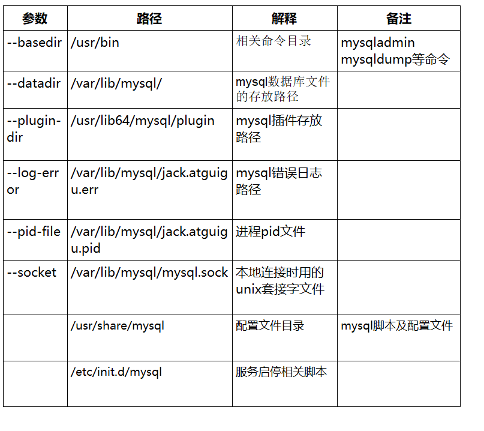

#### 启动和关闭服务

```shell
# 查看服务状态
service mysql status
# 启动服务
service mysql start
# 停止服务
service mysql stop
# 重启服务
service mysql restart
# 开机自启动
chkconfig mysql on
# 关闭开启自启动
ntsysv
使用空格键取消，使用Enter键确认
```


#### 登录和退出

```shell
# 登录
mysql -uroot -p123456
# 退出
exit或ctrl+C
```


#### 自定义Mysql配置

在/usr/share/mysql/ 中找到 my-huge.cnf 的配置文件， 拷贝到 /etc/ 并命名为 my.cnf ，mysql优先选择/etc/下的配置文件。 添加以下内容后再重启服务。  

```
[client]
default-character-set=utf8
[mysqld]
character_set_server=utf8
character_set_client=utf8
collation-server=utf8_general_ci
[mysql]
default-character-set=utf8
```

注意： **已经创建的数据库**的设定不会发生变化， 参数修改只对新建的数据库有效！  

**修改已创建库、 表字符集**
修改数据库的字符集

```mysql
alter database mydb character set 'utf8';
```

修改数据表的字符集

```mysql
alter table mytbl convert to character set 'utf8';  
```

**修改已经乱码数据**

无论是修改 mysql 配置文件或是修改库、 表字符集， 都**无法改变**已经变成乱码的数据。
只能删除数据重新插入或更新数据才可以完全解决  


### MySQL的常见命令 

	1.查看当前所有的数据库
	show databases;
	mysql:保存用户信息(身份信息,自定义函数、存储过程)
	information_schema:保存元数据信息
	test:测试信息
	performance_schema:监控mysql内部运行情况
	
	2.打开指定的库
	use 库名
	
	3.查看当前库的所有表
	show tables;
	
	4.查看其它库的所有表
	show tables from 库名;
	
	5.创建表
	create table 表名(
	
		列名 列类型,
		列名 列类型，
		。。。
	);
	
	6.查看表结构
	desc 表名;
	
	7.查看服务器的版本
	方式一：登录到mysql服务端
	select version();
	方式二：没有登录到mysql服务端
	mysql --version
	或
	mysql --V


### MySQL的语法规范
1. 不区分大小写,但建议关键字大写，表名、列名小写
2. 每条命令最好用分号结尾
3. 每条命令根据需要，可以进行缩进 或换行
4. 注释
   1. 单行注释：#注释文字
   2. 单行注释：-- 注释文字
   3. 多行注释：/* 注释文字  */

​	

### SQL的语言分类
​	DQL（Data Query Language）：数据查询语言
​		select 
​	DML(Data Manipulate Language):数据操作语言
​		insert 、update、delete
​	DDL（Data Define Languge）：数据定义语言
​		create、drop、alter
​	TCL（Transaction Control Language）：事务控制语言
​		commit、rollback
​	


### SQL的常见命令

	show databases； 查看所有的数据库
	use 库名； 打开指定 的库
	show tables ; 显示库中的所有表
	show tables from 库名;显示指定库中的所有表
	create table 表名(
		字段名 字段类型,	
		字段名 字段类型
	); 创建表
	
	desc 表名; 查看指定表的结构
	select * from 表名;显示表中的所有数据


## DQL语言的学习

Database Query Language

### 进阶1：基础查询
**语法**

- SELECT 要查询的东西 FROM 表名;
- 类似于Java中 :System.out.println(要打印的东西);

**特点**

1. 通过select查询完的结果，是一个虚拟的表格，不是真实存在
2. 要查询的东西 可以是常量值、可以是表达式、可以是字段、可以是函数

==建议再编写sql脚本时，在最前面先写上切换库命令 USE myDataBase==

**示例**

```
1、查询单个字段
	select 字段名 from 表名;
2、查询多个字段
	select 字段名，字段名 from 表名;
3、查询所有字段
	select * from 表名
4、查询常量
	select 常量值;
	注意：字符型和日期型的常量值必须用单引号引起来，数值型不需要
5、查询函数
	select 函数名(实参列表);
6、查询表达式
	select 100/1234;
7、起别名
	as
	空格
8、去重distinct
	select distinct 字段名 from 表名;
9、+
	作用：做加法运算
	select 数值+数值 直接运算
	select 字符+数值 先试图将字符转换成数值，如果转换成功，则继续运算；否则转换成0，再做运算
	select null+值  结果都为null
10、concat函数
	功能：拼接字符
	select concat(字符1，字符2，字符3,...);
11、ifnull函数
	功能：判断某字段或表达式是否为null，如果为null 返回指定的值，否则返回原本的值
	select ifnull(commission_pct,0) from employees;
12、isnull函数
	功能：判断某字段或表达式是否为null，如果是，则返回1，否则返回0
```


### 进阶2：条件查询
条件查询：根据条件过滤原始表的数据，查询到想要的数据

```
语法：
	select 
		要查询的字段|表达式|常量值|函数
	from 
		表
	where 
		条件 ;

一、条件表达式
	条件运算符：
		> < >= <= = != <>
			a >= 100
		between...and...  表示[left,right] 等价于 >=left&<=right
			id between left and right 
		in
			id in('item1','item2',...)
			列表中元素类型一致(相同或者兼容)
			元素不能使用通配符
		exists
		is null/is not null
		<=>
			兼容了=和is null
二、逻辑表达式
	示例：salary>10000 && salary<20000
	逻辑运算符：
		and（&&）:两个条件如果同时成立，结果为true，否则为false
		or(||)：两个条件只要有一个成立，结果为true，否则为false
		not(!)：如果条件成立，则not后为false，否则为true
三、模糊查询
	支持正则表达式
		last_name like '%a%'
	自定义转义字符
		last_name like '$%a%' ESCAPE '$'
```


### 进阶3：排序查询	

	语法：
	select
		要查询的东西
	from
		表
	where 
		条件
	order by 
		排序的字段|表达式|函数|别名 【asc升序|desc降序】
		
	SELECT * FORM Employee order by LENGTH(last_name) DESC;

案例

```sql
# 查询员工的姓名、部门号和年薪，按年薪降序，按姓名升序
SELECT last_name,department_id,salary*12*(IFNULL(commission_pct,0)) 年薪 FROM employees ORDER BY 年薪 DESC,last_name ASC;
# 选择工资不在8000到170000的员工姓名和工资，按工资降序
SELECT last_name,salary FROM employees WHERE salary NOT BETWEEN 8000 AND 17000 ORDER BY salary DESC;
# 查询邮箱中包含e的员工信息，并先按邮箱的字节数降序，再按部门号升序
SELECT * FROM employees WHERE email like '%e%' ORDER BY LENGTH(email) DESC,department_id ASC;
```


### 进阶4：常见函数

使用函数时，首先要保证有数据，如果没有数据，函数不会执行了

```sql
# 这里查询了一条不能存在的数据,由于数据不存在,所以即使salary为null,最终结果还是null,因为函数就没执行
    select ifnull(salary,0)
    from employees
    where employee_id=-1
```


#### 单行函数

```sql
1、字符函数
	length 获取字节个数
	concat(a,b)拼接
	substr
		substr(str,index)截取从index开始的子串,mysql字符串索引从1开始
		substr(str,startIndex,endIndex)
	upper转换成大写
	lower转换成小写
	trim去前后指定的空格和字符
		trim(特定字符串 FROM 原始串)去除原始串前后的特定字符串
	ltrim去左边空格
	rtrim去右边空格
	replace替换
	lpad左填充
		lpad(原始串,目标长度,填充串)
	rpad右填充
	instr返回子串第一次出现的索引
	ascii(ch)获取ch的ascii码值
	char(num)根据ascii码值获取字符
	cast (expression AS data_type) 数据类型转换函数
2、数学函数
	round 四舍五入
	rand 随机数[0,1) 生成[a,b]=floor(a+(b-a+1)*rand())
	floor向下取整
	ceil向上取整
	mod取余
	truncate截断
		truncate(num,len) num取小数点后len位
3、日期函数
	now当前系统日期+时间
	curdate当前系统日期
	curtime当前系统时间
	year 从时间中解析出年
	month
	...
	str_to_date 将字符转换成日期
		str_to_date(str,format)
	date_format将日期转换成字符
	datediff(time1,time2)计算日期之差
4、流程控制函数
	if 处理双分支
		if(条件表达式，表达式1，表达式2)：如果条件表达式成立，返回表达式1，否则返回表达式2
	case语句 处理多分支
    	情况1：处理等值判断
            case 变量或表达式
            when 常量1 then 值1|语句1
            when 常量2 then 值2|语句2
            ...
            else 值n|语句n
            end
            	举例
                select salary 原始工资,department_id, 
                case department_id
                when 30 then salary*1.1
                when 40 then salary*1.2
                else salary
                end as 新工资
                from employees;
            
		情况2：处理多分支
            case 
            when 条件1 then 值1|语句1
            when 条件2 then 值2|语句2
            ...
            else 值n|语句n
            end
            	select salary,
            	case
            	when salary>20000 then 'A'
            	when salary>15000 then 'B'
            	else 'C'
            	end as 级别
            	from employee;
            
5、其他函数
    version 当前数据库服务器的版本
    database 当前打开的数据库
    user当前连接用户
    password('字符')：返回该字符的密码形式
    md5('字符'):返回该字符的md5加密形式
```

**日期格式化取值范围**

|          | 值        | 含义                                                  |
| -------- | --------- | ----------------------------------------------------- |
| 秒       | %S、%s    | 两位数字形式的秒（ 00,01, ..., 59）                   |
| 分       | %I、%i    | 两位数字形式的分（ 00,01, ..., 59）                   |
| 小时     | %H        | 24小时制，两位数形式小时（00,01, ...,23）             |
|          | %h        | 两位数形式小时（00,01, ...,12）                       |
|          | %k        | 24小时制，数形式小时（0,1, ...,23）                   |
|          | %l(L小写) | 12小时制，数形式小时（0,1, ...,12）                   |
|          | %T        | 24小时制，时间形式（HH:mm:ss）                        |
|          | %r        | 12小时制，时间形式（hh:mm:ss AM 或 PM）               |
|          | %p        | AM上午或PM下午                                        |
| 周       | %W        | 一周中每一天的名称（Sunday,Monday, ...,Saturday）     |
|          | %a        | 一周中每一天名称的缩写（Sun,Mon, ...,Sat              |
|          | %w        | 以数字形式标识周（0=Sunday,1=Monday, ...,6=Saturday） |
|          | %U        | 数字表示周数，星期天为周中第一天                      |
|          | %u        | 数字表示周数，星期一为周中第一天                      |
| 天       | %d        | 两位数字表示月中天数（01,02, ...,31）                 |
|          | %e        | 数字表示月中天数（1,2, ...,31）                       |
|          | %D        | 英文后缀表示月中天数（1st,2nd,3rd ...）               |
|          | %j        | 以三位数字表示年中天数（001,002, ...,366）            |
| 月       | %M        | 英文月名（January,February, ...,December）            |
|          | %b        | 英文缩写月名（Jan,Feb, ...,Dec）                      |
|          | %m        | 两位数字表示月份（01,02, ...,12）                     |
|          | %c        | 数字表示月份（1,2, ...,12）                           |
| 年       | %Y        | 四位数字表示的年份（2015,2016...）                    |
|          | %y        | 两位数字表示的年份（15,16...）                        |
| 文字输出 | 文字      | 直接输出文字内容                                      |

#### 多行函数


```sql
sum 求和
	sum(item)
max 最大值
min 最小值
avg 平均值
count 计数
	count(字段):统计表中该字段非空的行数
	count(*):统计表的行数
	count(常量):就相当于在表中加了一列常量，返回的就是表的行数，常用count(1)
	MYISAM存储引擎下，count(*)的效率高
	INNODB存储引擎下，count(*)和count(1)的效率差不多，都比count(字段)效率高

特点：
1、以上五个分组函数都忽略null值，除了count(*)
2、sum和avg一般用于处理数值型
    max、min、count可以处理任何数据类型
3、都可以搭配distinct使用，用于统计去重后的结果
    sum(distinct salary)
```

案例

```sql
1、查询公司员工工资的最大值、最小值、平均值、总和
select max(salary) max_salary,min(salary) min_salary,round(avg(salary)) avg_salary,sum(salary) sum_salary from employees;
2、查询员工表中的最大入职时间和最小入职时间的相差天数
select datediff(max(hiredate),min(hiredate)) diffrence from employees;
```


### 进阶5：分组查询

```sql
语法：
	select 分组后依然存在的字段，分组函数
	from 表
	[where 筛选条件]
	group by 分组依据字段
	[order by 分组后依然存在的字段]
执行顺序：
	from-> where->group by->having->select->order by(针对分组后的数据进行排序)

特点：
1、可以按单个字段分组
2、和分组函数一同查询的字段最好是分组依据字段
3、分组筛选
			针对的表			位置				关键字
分组前筛选：	原始表				group by的前面		where
分组后筛选：	分组后的结果集		group by的后面		having
分组函数做筛选条件，肯定是分组后筛选
优先使用分组前筛选，避免两次数据处理

4、可以按多个字段分组，字段之间用逗号隔开
5、可以支持排序
6、having后可以支持别名
```

案例

```sql
1、查询每个部门中邮箱包含'a'的员工数
select count(*),department_id
from employees
where email like '%a%'
group by department_id
2、查询部门中员工数量大于2的部门
select count(*),department_id
from employees
group by department_id
having count(*)>2
3、查询领导编号>102的每个领导手下的最低工资>5000的领导编号，以及其最低工资
select min(salary),manager_id
from empolyees
where manager_id>102
group by manager_id
having min(salary)>5000
```


### 进阶6：多表连接查询

连接类型

```
内连接
    等值
    非等值
    自连接
外连接
    左外
    右外
    全外
交叉连接
```

一、传统模式下的连接 ：等值连接——非等值连接


```sql
1.等值连接的结果 = 多个表的交集
2.n表连接，至少需要n-1个连接条件
3.多个表不分主次，没有顺序要求
4.一般为表起别名，提高阅读性和性能
```

案例

```sql
# 查询有奖金的每个部门的部门名和部门的领导编号和该部门的最低工资
select department_name,dept.manager_id,min(salary)
from departments dept,employees emp
where dept.department_id=emp.department_id
and commission is not null
group by department_name,dept.manager_id;

# 查询每个工种的工种名和员工数量，并且按员工数量降序
select job_title,count(*)
from employees e,jobs j
where e.job_id=j.job_id
order by count(*) desc;

# 已知 表student(id,name,gradeId),表grade(id,name),表result(id,score,studentId)
# 查询所有学生姓名、年级名、成绩
select s.name 姓名,g.name 年级名,r.score 成绩
from student s,grade g,result r
where s.gradeId=g.id
and s.id=r.studentId
```

二、sql92语法和sql99语法(使用join关键字实现连接)

```sql
sql92：
    等值
    非等值
    自连接
也支持一部分外连接（用于oracle、sqlserver，mysql不支持）

sql99【推荐使用】
    内连接
        等值
        非等值
        自连接
    外连接
        左外
        右外
        全外（mysql不支持）
    交叉连接

语法：
    select 字段，...
    from 表名 别名
    【inner|left outer|right outer|cross】 join 表2 on  连接条件
    【inner|left outer|right outer|cross】 join 表3 on  连接条件
    【where 筛选条件】
    【group by 分组字段】
    【having 分组后的筛选条件】
    【order by 排序的字段或表达式】
    【limit 返回条件】

好处：语句上，连接条件和筛选条件实现了分离，简洁明了！
```

三、自连接

案例：查询员工名和直接上级的名称

```sql
# sql92
SELECT e.last_name,m.last_name
FROM employees e,employees m 
WHERE e.manager_id=m.employee_id;

# sql99
SELECT e.last_name,m.last_name
FROM employees e
JOIN employees m ON e.manager_id=m.employee_id;
```

四、外连接


```sql
# 外连接=内连接+主表中有而从表中没有的记录，一般用于查询除了交集部分的剩余的不匹配的行（A-A∩B）
# left join 左边的就是主表
# right join 右边的就是主表
# full join 两边都是主表(mysql不支持)
```

案例

```sql
# 查询没有员工的部门
select department.*,employee_id
from departments
left outer join employees
on department.department_id=employees.department_id
where employees.employee_id is null;
```


### 进阶7：子查询

含义：

	一条查询语句中又嵌套了另一条完整的select语句，其中被嵌套的select语句，称为子查询或内查询
	在外面的查询语句，称为主查询或外查询

特点：

```sql
1、子查询都放在小括号内
2、子查询可以放在from后面、select后面、where后面、having后面，但一般放在条件的右侧
3、子查询优先于主查询执行，主查询使用了子查询的执行结果
4、子查询分类
根据查询结果的行数不同分为以下两类：
    单行子查询
        结果集只有一行
        细分为：
            标量子查询(结果集只有一行一列)
            行子查询(结果集一行多列)
        一般搭配单行操作符使用：> < = <> >= <= 
        非法使用子查询的情况：
        a、子查询的结果为一组值
        b、子查询的结果为空

    多行子查询
        结果集有多行
        细分为：
            列子查询(结果集一列多行)
            表子查询(结果集多行多列)
        一般搭配多行操作符使用：any、all、in、not in
        in|not in : 等于列表中任意一个|不在列表中
        	先执行子查询，再执行主查询
        any|some : 条件满足列表中任意一项即可
        	salary>any('10','15','20')
        all : 条件必须对于列表中所有元素成立
        any|some和all都不常用，因为可以使用标量子查询来替换这些多行查询
        	salary>any('10','15','20')  <==> salary>(min(salary))
        	salary>all('10','15','20')  <==> salary>(max(salary))
根据子查询出现的位置
	select后面：
		标量子查询
    from后面：
    	表子查询 将结果集作为新表,新表必须起别名★
    where或having后面(重要)：
    	标量子查询(单行子查询)
    	列子查询(多行子查询)
    	行子查询
    exists后面
   		表子查询，先执行主查询，再执行子查询
根据查询的数据耦合情况分为
	嵌套子查询：查询语句的执行不依赖外部的查询,执行顺序：子查询->主查询
	相关子查询：查询语句的执行依赖外部的查询,执行顺序：主查询->子查询->主查询
```

#### in和exists的区别

[参考网址](https://blog.csdn.net/wqc19920906/article/details/79800374?utm_medium=distribute.pc_relevant.none-task-blog-BlogCommendFromMachineLearnPai2-4.nonecase&depth_1-utm_source=distribute.pc_relevant.none-task-blog-BlogCommendFromMachineLearnPai2-4.nonecase)

1. 从表小，主表大且又有索引时应该用in
2. 主表小，从表大且又有索引时使用exists

```sql
select *
from employees emp1
where emp1 in(
    select emp1.id
    from employees emp2
    where emp1.id>emp2.id
)
执行顺序:
	1、执行子查询
		将结果与主表进行笛卡尔积
	2、执行主查询
------------------------
select *
from employees emp1
where exists(
    select emp1.id
    from employees emp2
    where emp1.id>emp2.id
)
执行顺序:
	1、执行主查询
		select * from employees
		将结果与子表进行笛卡尔积
	2、执行子查询
		exists(
            select emp1.id
            from employees emp2
            where emp1.id>emp2.id
        )
--------------------------
not in 和not exists
	如果查询语句使用了not in 那么内外表都进行全表扫描，且没有用到索引；而not extsts 的子查询依然能用到表上的索引。
	所以无论那个表大，用not exists都比not in要快。
```

案例

```sql
# --------------------标量子查询--------------------
# 查询141号员工的job_id 
# 查询143号员工的salary
# 查询员工的姓名，job_id和工资，要求job_id=141号员工的job_id，salary>143号员工的salary
select last_name,job_id,salary
from employees
where job_id=(
	select job_id
    from employees
    where employee_id=141
) and salary>(
	select salary
    from employees
    where employee_id=143
);

# 返回公司工资最少的员工last_name,job_id,salary
select last_name,job_id,salary
from employees
where salary=(
	select min(salary)
    from employees
);

# 查询最低工资大于50号部门最低工资的部门id,最低工资
select department_id,min(salary)
from departments
group by department_id
having min(salary)>(
	select min(salary)
    from departments
    where department_id=50
);

# --------------------------列子查询--------------
# 查询location_id是1400或1700的部门编号
select last_name
from departments
where location_id in (
	select distinct department_id
    from departments
    where location_id in(1400,1700)
);

# 返回其他部门中比job_id为'IT_PROG'部门任意工资低的员工的员工号、姓名、job_id、salary
select last_name,employees,job_id,salary
from employees
where salary<(
	select max(salary)
    from employees
    where job_id='IT_PROG'
) and job_id<>'IT_PROG';

# --------------------------表子查询----------------
# from后面
# 查询学生id为001的选课名单及各科成绩
select 
from(
	select student.id,sc
)
# exsits
# 查询有员工的部门名
select department_name
from departments dept
where exists(
	select *
    from employees emp
    where dept.department_id=emp.department_id
)


# 查询工资最低的员工信息last_name、salary
select last_name,salary
from employees
where salary=(
	select min(salary)
    from employees
)
等价于------
select last_name,salary
from employees
where salary=min(salary)

# 查询平均工资最低的部门信息
select *
from departments
having department_id = (
    # 最小平均工资的部门
	select department_id
    from departments
    group by department_id
    having avg(salary) = (
        # 最小平均工资
        select min(avg_salary) min_avg_salary
        from (
            # 平均工资
            select avg(salary) avg_salary,department_id
            from employees
            group by department_id
        ) avg_department
    )
)
等价于------
select *
from departments
where department_id = (
	select department_id
    from employees
    group by department_id
    order by avg(salary) asc
    limit 1
)

# 查询平均工资最低的部门信息和该部门的平均工资
select departments.*,avg_dept
from (
    select department_id,avg(salary)
    from employees
    group by department_id
    order by avg(salary) asc
    limit 1
) as avg_dept
left join departments 
on avg_dept.department_id = departments.department_id


```

### 进阶8：分页查询

应用场景：

	实际的web项目中需要根据用户的需求提交对应的分页查询的sql语句

语法：

	select 字段|表达式,...
	from 表
	【where 条件】
	【group by 分组字段】
	【having 条件】
	【order by 排序的字段】
	limit 【起始的条目索引，】条目数;
	条目数=-1表示遍历到结束

特点：

```sql
1.起始条目索引从0开始

2.limit子句放在查询语句的最后

3.公式：select * from  表 limit （page-1）*sizePerPage,sizePerPage
假如:
每页显示条目数sizePerPage
要显示的页数 page
```

==mysql 中，limit 后面不能带运算符，只能是常量==

案例

```sql
# 一、查询每个专业的学生人数
SELECT COUNT(*)
FROM major
GROUP BY majorid
# 二、查询参加考试的学生中，每个学生的平均分、最高分
SELECT studentno,AVG(score),MAX(score)
FROM result
GROUP BY studentno
# 三、查询姓张的学生中，最低分大于60的学生的学号、姓名
SELECT newStudent.studentno 学号,newStudent.studentname 姓名,MIN(score) 平均成绩
FROM (
	SELECT studentno,studentname
	FROM student
	WHERE studentname LIKE '张%'
) newStudent
left join result on newStudent.studentno=result.studentno
GROUP BY newStudent.studentno
HAVING MIN(score)>60
# 四、查询生日在“1988-1-1”后的学生姓名、专业名称
SELECT ns.studentname,borndate,ns.majorid,mj.majorname
FROM(
	SELECT studentname,majorid,borndate
	FROM student
	WHERE borndate>'1988-1-1'
) ns
LEFT JOIN major mj on ns.majorid=mj.majorid

# 五、查询每个专业的男生人数和女生人数分别是多少
-- SELECT majorid,sex,COUNT(*) 人数
-- FROM student
-- GROUP BY majorid,sex
SELECT majorid,
(SELECT COUNT(*) FROM student WHERE majorid=stu.majorid and sex='男') 男,
(SELECT COUNT(*) FROM student WHERE majorid=stu.majorid and sex='女') 女
FROM student as stu
GROUP BY majorid
# 六、查询专业和张翠山一样的学生的最低分
SELECT MIN(score)
FROM result
WHERE studentno in (
	SELECT studentno
	FROM student
	WHERE majorid = (
		SELECT majorid
		from student
		WHERE studentname='张翠山'
	)
)
# 七、查询大于60分的学生的姓名、密码、专业名
SELECT studentname 姓名,loginpwd 密码,
(SELECT DISTINCT majorname FROM major WHERE major.majorid=stu.majorid) 专业名
from student stu
WHERE studentno in(
	SELECT DISTINCT studentno
	FROM result
	WHERE score>60
)
# 八、按邮箱位数分组，查询每组的学生个数
SELECT COUNT(*) 人数,LENGTH(email) 邮箱位数
FROM student
GROUP BY LENGTH(email)
# 九、查询学生名、专业名、分数
SELECT studentname,majorname,score
FROM student
JOIN major on student.majorid=major.majorid
LEFT JOIN result on student.studentno=result.studentno
# 十、查询哪个专业没有学生，分别用左连接和右连接实现
SELECT majorname,studentno
FROM major
LEFT JOIN student on major.majorid=student.majorid
WHERE studentno is NULL
# 十一、查询没有成绩的学生人数
SELECT COUNT(*)
FROM student
LEFT JOIN result on student.studentno=result.studentno
WHERE score is NULL
```


### 进阶9：联合查询

引入：
	union 联合、合并

语法：

	select 字段|常量|表达式|函数 【from 表】 【where 条件】 union 【all】
	select 字段|常量|表达式|函数 【from 表】 【where 条件】 union 【all】
	select 字段|常量|表达式|函数 【from 表】 【where 条件】 union  【all】
	.....
	select 字段|常量|表达式|函数 【from 表】 【where 条件】

特点：

	1、多条查询语句的查询的列数必须是一致的
	2、多条查询语句的查询的列的类型几乎相同
	3、union代表去重，union all代表不去重
	4、最终结果表的字段名是第一条查询的字段名

案例

```sql
# 查询部门编号>90或邮箱包含a的员工信息
select * from employees where email like '%a%' or departmentId>90
<==>
select * from employees where email like '%a%'
union
select * from employees where departmentId>90

# 查询中国用户中男性信息和外国用户中男性信息
select id,cname from t_ca where csex='男'
union
select t_id,tname from t_ua where usex='male'
```


### 单引号和双引号的区别

[参考网址](https://www.cnblogs.com/yulinlewis/p/9404508.html)


## DML语言

Database Manipulation Language

### 插入

语法：

```
方式一：
	insert into 表名(字段名,...) values(值1,...),(值1,...),...;
	支持子查询
		insert into 表名(字段名,...)
		select 字段名,...
		from 任意表名
		where ...
	支持多条数据插入
		insert into 表名(字段名,...) values(值1,...),(值1,...),...;
方式二：
	insert into 表明 set 列名=值,列名=值
```

特点：

	1、字段类型和值类型一致或兼容，而且一一对应
	2、可以为空的字段，可以不用插入值，或用null填充
	3、不可以为空的字段，必须插入值
	4、字段个数和值的个数必须一致
	5、字段可以省略，但默认所有字段，并且顺序和表中的存储顺序一致

### 修改

修改单表语法：

	update 表名 set 列名=新值,列名=新值
	【where 条件】
	# 修改满足条件的数据的字段
修改多表语法：

	update 表1 别名1 
	join|left join|right join|cross 表2 别名2
	on 连接条件
	set 字段=新值，字段=新值
	where 筛选条件;
	
	# 修改张无忌的女朋友的手机号为114
	update boys bo
	inner join  beauty be on bo.id=be.boyfriend_id
	set be.phone='114'
	where bo.boyName='张无忌'

### 删除

方式1：delete语句：清空表或数据

```
单表的删除： ★
	delete from 表名 【where 筛选条件】

多表的删除：
	delete 别名1(删除表1中的数据)，别名2(删除表2中的数据)
	from 表1 别名1 
	join|left join|right join|cross 表2 别名2
	on 连接条件
	where 筛选条件;
```


方式2：truncate语句：清空表

	truncate table 表名


两种方式的区别【面试题】
	#1.truncate不能加where条件，而delete可以加where条件
	
	#2.truncate的效率高一丢丢
	
	#3.truncate 删除带自增长的列的表后，如果再插入数据，数据从1开始
	# delete 删除带自增长列的表后，如果再插入数据，数据从上一次的断点处开始
	
	#4.truncate删除没有返回值
	# delete删除会返回数据的行数
	
	#4.truncate删除不能回滚，delete删除可以回滚

**注意**

```
delete from Person 
where id not in (
    select min(Id) id from Person group by Email having count(Email) > 1
) or Email not in (
    select Email from Person group by Email having count(Email) = 1
)
```


执行这条语句时会报错：You can't specify target table 'Person' for update in FROM clause

这是因为==MySQL不允许同时查询和删除一张表==(MSSQL和Oracle不会出现此问题)，我们可以通过子查询的方式包装一下即可避免这个报错

```sql
delete from Person 
where id not in (
    select id from (
    	select min(Id) id from Person group by Email having count(Email) > 1
    ) a
) and Email not in (
    select Email from (
    	select Email from Person group by Email having count(Email) = 1
    ) b
)
```


## DDL语言

Database Definition Language

### 定义数据库和表
库的定义

```sql
一、创建库
create database 库名
二、删除库
drop database [if exists] 库名
三、修改库的字符集
alter database 库名 character set 字符集类型;
```
表的定义	

```sql
#1.创建表
CREATE TABLE IF NOT EXISTS stuinfo(
	stuId INT,
	stuName VARCHAR(20),
	gender CHAR,
	bornDate DATTIME
	);
# 显示表结构
desc stuinfo;
#2.修改表 alter
	ALTER TABLE 表名 ADD|DROP|RENAME|CHANGE|MODIFY COLUMN 字段名 【字段类型，字段约束】;
        #添加字段
        ALTER TABLE 表名 ADD COLUMN 字段名 字段类型 【字段约束】;
        	ALTER TABLE studentinfo ADD COLUMN email VARCHAR(20) first;
        #删除字段
        ALTER TABLE 表名 DROP COLUMN 字段名;
        	ALTER TABLE studentinfo DROP COLUMN email;
        #修改表名
        ALTER TABLE 表名 RENAME [TO]  新表名;
        	ALTER TABLE stuinfo RENAME [TO]  studentinfo;
        #修改字段名
        ALTER TABLE 表名 CHANGE COLUMN 旧字段名 新字段名 字段类型;
        	ALTER TABLE studentinfo CHANGE COLUMN sex gender CHAR;
        #修改字段类型和列级约束
        ALTER TABLE 表名 MODIFY COLUMN 字段名 新字段类型 【字段约束】;
        	ALTER TABLE studentinfo MODIFY COLUMN borndate DATE;
#3.删除表
	DROP TABLE IF EXISTS studentinfo;
#4.复制表结构
	create table 新表名 like 旧表名
#5.复制表结构和数据
	复制全部数据
        create table 库名.新表名
        select *
        from 库名.旧表名
    复制部分数据
    	create table 库名.新表名
    	select 字段1,字段2,...
    	from 库名.旧表名
    	where ...
    复制部分表结构，且不要数据
    	create table 库名.新表名
    	select 字段1,字段2,...
    	from 库名.旧表名
    	where 0
```


### 数据类型

```sql
整型：
	tinyint、smallint、mediumint、int/integer、bigint
    1B         2        3          4            8

    特点：
    ①都可以设置无符号和有符号，默认有符号，通过unsigned设置无符号
    ②如果超出了范围，会报out or range异常，插入临界值
    ③长度可以不指定，默认会有一个长度
     长度代表显示的最小宽度，如果不够则左边用0填充，但需要搭配zerofill，使用zerofill类型默认为无符号整型
    	id int(7) zerofill <==> id int(7) zerofill unsigned
小数：
    定点数：decimal(M,D)
    浮点数:
        float(M,D)   4
        double(M,D)  8
    特点：
    ①M代表整数部位+小数部位的个数，D代表小数部位
    ②如果超出范围，则报out or range异常，并且插入临界值
    ③M和D都可以省略，但对于定点数，M默认为10，D默认为0
    ④如果精度要求较高，则优先考虑使用定点数
字符型：
    较短的文本:char、varchar、binary(较短的二进制)、varbinary、enum、set
    	char：固定长度的字符，写法为char(M)，最大长度不能超过M，其中M可以省略，默认为1。
    		最终存储的长度=M。效率相对高。对于一些长度固定的数据，使用char
    	varchar：可变长度的字符，写法为varchar(M)，最大长度不能超过M，其中M不可以省略。
    		最终存储的长度=字符数。效率相对低。对于一些长度不固定的数据，使用varchar
        Enum:
            create table person(
                sex ENUM('男','女','f','m')
            )
            insert into person(sex) values('男')
        Set:
        	create table book(
        		type SET('动作','喜剧','悬疑','爱情')
        	)
        	insert into book(type) values('动作,喜剧')
    较长的文本:text()、blob(较大的二进制,图片) 	
日期型：
	year年
    date日期
    time时间
    datetime 日期+时间          8      
    timestamp 日期+时间         4   比较容易受时区、语法模式、版本的影响，更能反映当前时区的真实时间,范围较小(1970-2038)
    	create table tab_date(
        	t1 datetime,
            t2 timestamp
        )
        insert into tab_date values(now(),now());
        set time_zone='+9:00' #设置为东9区,timestamp类型的数据就会受到影响，自动加一个小时
Blob类型：
```


### 常见约束

**六种约束类型**

```
NOT NULL：非空，该字段的值必填
UNIQUE：唯一，该字段的值不可重复，可以为空，自动添加索引
DEFAULT：默认，该字段的值不用手动插入有默认值
CHECK：检查，mysql不支持
PRIMARY KEY：主键，该字段的值不可重复并且非空  unique+not null
FOREIGN KEY：外键，该字段的值引用了另外的表的字段
```

可以分为：

- 列级约束：除了外键的所有约束
- 表级约束：除了非空和默认的所有约束，可以给约束命名(主键除外，主键命名固定为PRIMARY)

==唯一，主键，外键都是键，创建后会自动添加索引==

**注意**

主键与唯一键的异同

|        | 是否唯一 | 是否允许为空 | 表中键的数量 | 是否允许组合键 |
| ------ | -------- | ------------ | ------------ | -------------- |
| 主键   | 是       | 否           | 至多1个      | 是             |
| 唯一键 | 是       | 是           | 没有限制     | 是             |

外键

1. 用于限制两个表的关系，从表的字段值引用了主表的某字段值

2. 外键列和主表的被引用列要求类型一致，意义一样，名称无要求

3. 主表的被引用列要求是一个key（一般就是主键）

4. 插入删除时存在规则

   1. 插入数据，先插入主表

   2. 删除数据，先删除从表

      可以通过以下两种方式来删除主表的记录
      级联删除
       	ALTER TABLE stuinfo ADD CONSTRAINT fk_stu_major FOREIGN KEY(majorid) REFERENCES major(id) ON DELETE CASCADE;
      级联置空
       	ALTER TABLE stuinfo ADD CONSTRAINT fk_stu_major FOREIGN KEY(majorid) REFERENCES major(id) ON DELETE SET NULL;

### 定义约束

**创建表时添加约束**

```sql
推荐写法
    create table 表名(
        字段名 字段类型 not null,#非空
        字段名 字段类型 primary key,#主键
        字段名 字段类型 unique,#唯一
        字段名 字段类型 default 值,#默认
        [constraint 约束名] foreign key(字段名,推荐fk_表1_表2) references 主表（被引用列）
    )
	
添加列级约束
    create table student(
        id int primary key,#主键
        name varchar(20) not null,#非空
        gender char(1) check(gender='男' or gender='女'),#检查
        seat int unique,#唯一
        age int default 18,#默认
        majorid int references major(id)#外键,并没有添加外键，外键必须由表级约束添加，并且对于外键添加的约束都无效
    )
    create table major(
        id int primary key,
        majorname varchar(20)
    )
添加表级约束
    create table student(
        id int,
        name varchar(20),
        gender char(1),
        seat int,
        age int,
        majorid int,
        # constraint PRIMARY primary key(id),
        constraint PRIMARY primary key(id,name),#组合主键
        constraint uq unique(seat),
        constraint ck check(gender='男' or gender='女'),
        constraint fk_student_major foreign key(majorid) references major(id)
    )
```

**修改表时添加或删除约束**

```sql
1、非空
添加非空(列级约束)
alter table 表名 modify column 字段名 字段类型 not null;
删除非空
alter table 表名 modify column 字段名 字段类型 ;

2、默认
添加默认(列级约束)
alter table 表名 modify column 字段名 字段类型 default 值;
删除默认
alter table 表名 modify column 字段名 字段类型 ;

3、主键
添加主键
	列级约束
		alter table 表名 modify column 字段名 类型 primary key;
	表级约束
		alter table 表名 add【 constraint 约束名】 primary key(字段名);
删除主键
alter table 表名 drop primary key;

4、唯一
添加唯一
	列级约束
		alter table 表名 modify column 字段名 类型 unique;
	表级约束
		alter table 表名 add【 constraint 约束名】 unique(字段名);
删除唯一
alter table 表名 drop index 索引名;

5、外键
添加外键(表级约束)
alter table 表名 add【 constraint 约束名】 foreign key(字段名) references 主表（被引用列）;
删除外键
alter table 表名 drop foreign key 约束名;
```

### 自增长列

1. 不用手动插入值，可以自动提供序列值，默认从1开始，步长为1
       auto_increment_increment步长
       auto_increment_offset起始值(mysql中不能修改)
       如果要更改起始值：第一次插入时，手动插入值
       如果要更改步长：更改系统变量
       	set auto_increment_increment=值;
2. 一个表**至多有一个自增长列**
3. 自增长列只能支持**数值型**
4. ==自增长列必须为一个key==

```sql
一、创建表时设置自增长列
    create table 表(
        字段名 字段类型 约束 auto_increment
    )
二、修改表时设置自增长列
	alter table 表 modify column 字段名 字段类型 约束 auto_increment
三、删除自增长列
	alter table 表 modify column 字段名 字段类型 约束 
```


## DTL语言

Database Transaction Language

### 含义
​	通过一组逻辑操作单元（一组DML-sql语句），将数据从一种状态切换到另外一种状态

### 特点(ACID)

- 原子性(Atomicity)：要么都执行，要么都回滚
- 一致性(Consistency)：保证数据的状态操作前和操作后保持一致(保证数据准确)
- 隔离性(Isolation)：多个事务同时操作相同数据库的同一个数据时，一个事务的执行不受另外一个事务的干扰
- 持久性(Durability)：一个事务一旦提交，则数据将持久化到本地，除非其他事务对其进行修改

相关步骤：

	1、开启事务
	2、编写事务的一组逻辑操作单元（多条sql语句）
	3、提交事务或回滚事务

### 事务的分类

隐式事务，没有明显的开启和结束事务的标志

	insert、update、delete语句本身就是一个事务


显式事务，具有明显的开启和结束事务的标志

	1、禁用自动提交事务的功能,开启事务
		set autocommit=0;# 只针对当前事务
		start transaction;# 也可以不写
	2、编写事务的一组逻辑操作单元（select,insert,update,delete）
		DDL并不是事务
	3、提交事务或回滚事务(回滚操作不能单纯在mysql上使用,必须结合实际应用,如jdbc)
		commit;
		rollback;
### 使用到的关键字

	set autocommit=0;
	start transaction;
	commit;
	rollback;
	
	savepoint  断点
	commit to 断点
	rollback to 断点


### 事务的隔离级别

事务并发问题如何发生？

	当多个事务同时操作同一个数据库的相同数据时
事务的并发问题有哪些？

	丢失更新：多个事务对相同数据操作时，最后的更新覆盖了由其他事务所做的更新
	（事务1开启事务，事务2在开启并提交事务，事务1回滚，导致事务2的提交被覆盖；
	  事务1开启事务，事务2在开启并提交事务，事务1提交，导致事务2的提交被覆盖；）
	脏读：事务1读取到了事务2已修改但未提交的数据。(如果事务2回滚,则事务1读取的数据就是脏数据)
	不可重复读：相同事务，读取结果(数据本身)不一样。(事务1读取数据并未结束，事务2更新数据并提交，事务1再次读取数据，两次读取的数据就不一样了。)
	幻读：相同事务，读取结果(数据条数)不一样。(事务1读取数据并未结束，事务2插入或删除数据并提交，事务1再次读取数据，两次读取的数据就不一样了。)

如何避免事务的并发问题？

==对于mysql来说，通常采用前三种隔离级别加上相应的并发锁的机制来控制对数据的访问==

**事务隔离级别**

丢失更新只能通过并发锁来实现

|                  | 说明                                                         | 脏读   | 不可重复读 | 幻读   |
| ---------------- | ------------------------------------------------------------ | ------ | ---------- | ------ |
| READ UNCOMMITTED |                                                              | 允许   | 允许       | 允许   |
| READ COMMITTED   | 事务的更新操作结果只有在该事务提交之后，才能对另一个事务可见 | 不允许 | 允许       | 允许   |
| REPEATABLE READ  | 保证在整个事务的过程中，对同一笔数据的读取结果是相同的       | 不允许 | 不允许     | 允许   |
| SERIALIZABLE     | 所有事务必须依次执行，性能差                                 | 不允许 | 不允许     | 不允许 |

- oracle只支持READ COMMITED(默认)、SERIALIZABLE
- mysql支持四种，默认REPEATABLE READ

设置隔离级别：

	set session(当前会话)|global(全局)  transaction isolation level 隔离级别名;
查看隔离级别：

	select @@tx_isolation;


### 设置保存点

savepoint+rollback搭配使用实现回滚到固定位置

```
set autocommit=0;
start transacation;
delete from account where id=25;
savepoint a;# 设置保存点
delete from account where id=16;
rollback to a;# 回滚到保存点
```

### delete和truncate在事务中区别

- delete支持回滚
- truncate不支持回滚


## 视图
含义：理解成一张虚拟的表

### 视图和表的区别

|      | 关键字 | 作用     | 占用物理空间                  |
| ---- | ------ | -------- | ----------------------------- |
| 视图 | view   | 用于查询 | 占用较小，仅仅保存的是sql逻辑 |
| 表   | table  | 增删改查 | 保存实际数据                  |

视图的好处：

- sql语句提高重用性，效率高
- 和表实现了分离，提高了==安全性==


### 定义视图

**视图结构的查看**

```
DESC test_v7;
SHOW CREATE VIEW test_v7;
```

**视图的创建**

```
语法：
	CREATE VIEW 视图名
	AS
	查询语句;
```

**视图的修改**

```
#方式一：
	CREATE OR REPLACE VIEW test_v7
	AS
	SELECT last_name FROM employees
	WHERE employee_id>100;
#方式二:
	ALTER VIEW test_v7
	AS
	SELECT employee_id FROM employees;
	SELECT * FROM test_v7;
```

**视图的删除**

```
DROP VIEW test_v1,test_v2,test_v3;
```


### 视图的操作

对于视图数据的操作，**如果数据变化，会自动同步到原始表中**

```sql
1、查看视图的数据 ★
	SELECT * FROM my_v4;
	SELECT * FROM my_v1 WHERE last_name='Partners';
2、插入视图的数据
	INSERT INTO my_v4(last_name,department_id) VALUES('虚竹',90);
3、修改视图的数据
	UPDATE my_v4 SET last_name ='梦姑' WHERE last_name='虚竹';
4、删除视图的数据
	DELETE FROM my_v4;
```

**某些视图数据不能操作**(几乎所有视图都不允许操作)

1. 包含以下关键字的sql语句：分组函数、distinct、group  by、having、union或者union all
2. 常量视图
3. Select中包含子查询
4. join
5. from一个不能更新的视图
6. where子句的子查询引用了from子句中的表

==按照规范来讲，视图就是用于查询，所以应该是只读的，对于一些可以更新的视图，应该给视图加上权限，防止对原始表修改==

**案例**

```sql
# 创建视图emp_v2,查询最高工资高于12000的部门信息
create view emp_v2
as
select department.*
from department
where Id in (
	select DepartmentId
    from employees
    group by DepartmentId
    having max(Salary)>12000
)
```


## 变量

### 系统变量
**全局变量**

作用域：针对于所有会话（连接）有效，但**重启后，配置失效**

	查看所有全局变量
		SHOW GLOBAL VARIABLES;
	查看满足条件的部分系统变量
		SHOW GLOBAL VARIABLES LIKE '%char%';
	查看指定的系统变量的值
		SELECT @@global.autocommit;
	为某个系统变量赋值
		SET @@global.autocommit=0;
		SET GLOBAL autocommit=0;

**会话变量**

作用域：针对于当前会话（连接）有效

	如果不写SESSION，默认为当前会话
	查看所有会话变量
		SHOW [SESSION] VARIABLES;
	查看满足条件的部分会话变量
		SHOW [SESSION] VARIABLES LIKE '%char%';
	查看指定的会话变量的值
		SELECT @@[session].tx_isolation;
	为某个会话变量赋值
		SET @@[session].tx_isolation='read-uncommitted';
		SET SESSION tx_isolation='read-committed';


### 自定义变量

**用户变量--@变量名**

声明并初始化

	SET @变量名=值;
	SET @变量名:=值;
	SELECT @变量名:=值;
赋值

	方式一：一般用于赋简单的值
	    SET @变量名=值;
	    SET @变量名:=值;
	    SELECT @变量名:=值;
	方式二：一般用于赋表中的字段值(只能是标量子查询)
	    SELECT 字段名或表达式 INTO @变量名
	    FROM 表;

用户变量赋值没有固定类型，即该变量类型定义为弱定义


**局部变量--变量名**

声明并初始化

	declare 变量名 类型 【default 值】;
赋值

	方式一：一般用于赋简单的值
	    SET 变量名=值;
	    SET 变量名:=值;
	    SELECT 变量名:=值;
	方式二：一般用于赋表 中的字段值
	    SELECT 字段名或表达式 INTO 变量名
	    FROM 表;


**用户变量与局部变量的区别**

|          | 作用域              | 定义位置            | 语法                      |
| -------- | ------------------- | ------------------- | ------------------------- |
| 用户变量 | 当前会话            | 会话的任何地方      | @变量名，不用指定类型     |
| 局部变量 | 定义它的BEGIN END中 | BEGIN END的第一句话 | 一般不用加@，需要指定类型 |


**案例**

```
# 声明两个变量并赋初值，求和并打印
# 用户变量
set @m=1;
set @n=2;
set @sum=@m+@n;
select @sum;
```


## 存储过程

### 定义

一组经过预先编译的sql语句的集合，类似java中的方法

**作用**

- 提高了sql语句的重用性，减少了开发程序员的压力
- 提高效率
  - 减少编译次数（初次编译，之后使用无需重复编译）
  - 减少数据库服务器连接次数（将sql语句进行打包，在一次连接中执行）


### 创建存储过程

**语法**

	create procedure 存储过程名(参数模式 参数名  参数类型,...)
	begin
		存储过程体
	end

**参数模式**

- in：该参数作为传入参数，调用时需要传参
- out：该参数作为返回参数
- inout：该参数即作为传入参数，又作为返回参数
- ==这些参数就是局部变量，赋值方式参考局部变量赋值方式==

**注意**

- 存储过程体中只有一条sql语句，则可以省略begin end
- 存储过程体中每条sql语句结果必须加分号

### 结束标记delimiter

使用delimiter关键字来设置结束标记

```
语法:
	delimiter 新的结束标记
示例:
	delimiter $
    CREATE PROCEDURE 存储过程名(IN|OUT|INOUT 参数名  参数类型,...)
    BEGIN
        sql语句1;
        sql语句2;
        ...
    END $
```


### 调用存储过程

```sql
语法:
	call 存储过程名(实参列表) 结束标记
示例:
---------------------------------------------------------
# 空参类型存储过程
	# 创建
	delimiter $
	# 功能:数据插入
    CREATE PROCEDURE store1()
    BEGIN
    	DECLARE i INT DEFAULT 0;
    	# 关闭自动提交
    	SET autocommit = 0;
    	REPEAT
    		set i=i+1
    		insert into admin(username,'password')
   			values('John','0001'),('Mary','0002'),('Tom','0003'),('Alice','004');
        UNTIL i = max_num
        END REPEAT;
        COMMIT;
    END $
    
    # 调用
    call myp1()$
 ----------------------------------------------------------   
#  带in模式参数的存储过程
	# 创建
	delimiter $
	# 功能:查询选课的学生信息
	create procedure store2(in majorName varchar(20))
	begin
		select *
		from student
		where majorId = (
        	select id
            from major
            where name=majorName
        )
    end $
    
    # 调用
    call store2('计算机体系结构')$
    
# 创建存储过程实现，用户是否登录成功
	create procedure store3(in username varchar(20),in password varchar(20))
	begin
		declare result varchar(20) default '';
		select count(*) into result
		from admin
		where admin.username=username
		and admin.password=password;
		select if(result>0,'成功','失败');
    end $
    
    call store3$
-------------------------------------------------------------
# 创建带out模式的存储过程
	create procedure store4(in studentName varchar(20),out majorName varchar(20),out majorCredit int)
	begin
		select major.Name,major.credit into majorName,majorCredit
		from student
		join major on student.majorId=major.id
		where student.name=studentName;
	end $
	# 使用用户变量来接受局部变量
	call store4('张三',@majorName,@majorCredit)$
	
```

**删除存储过程**

```
drop procedure 存储过程名;
```

**查看存储过程**

```
show create procedure 存储过程名;
```

**修改存储过程**

不能修改


## 函数

### 函数和存储过程的区别

|          | 关键字    | 调用语法 | 返回值       | 应用场景         |
| -------- | --------- | -------- | ------------ | ---------------- |
| 函数     | function  | select   | 有且仅有一个 | 查询结果为一个值 |
| 存储过程 | procedure | call     | 0个或多个    | 更新             |

存储过程中可以直接使用函数

### 创建函数

学过的函数：LENGTH、SUBSTR、CONCAT等
语法：

	delimiter $
	CREATE FUNCTION 函数名(参数名 参数类型,...) RETURNS 返回类型
	BEGIN
		函数体,必须包含return语句
	END
	select 函数名(参数)$

当函数体只有一条语句时，BEGIN END可以省略

### 调用函数

```sql
SELECT 函数名（实参列表）

---------------------
# 无参函数
delimiter $
create function countEmp() returns int
begin
	return(
    	select count(*)
        from employees
    );
end $

select countEmp()$
```

查看函数

```
show create function 函数名;
```

删除函数

```
drop function 函数名;
```

==函数和存储过程的定义，实际存储在数据库名为mysql数据库中proc表下==


## 流程控制结构

### 分支

**分类**

- if函数，简单双分支
- case结构，等值判断的多分支
- if elseif结构，区间判断的多分支

**if**

```
语法
	if(条件，值1，值2)
特点
	可以用在任何位置
```

**case**

	语法
	    情况一：类似于switch
	        case 表达式
	        when 值1 then 结果1或语句1(如果是语句，需要加分号) 
	        when 值2 then 结果2或语句2(如果是语句，需要加分号)
	        ...
	        else 结果n或语句n(如果是语句，需要加分号)
	        end 【case】（如果是放在begin end中需要加上case，如果放在select后面不需要）
	
	        select (case
	        when id%2=0 then id-1
	        when id=(select max(id) from seat) then id
	        else id+1 end) as id ,student
	        from seat 
	        order by id;
	
	    情况二：类似于多重if
	        case 
	        when 条件1 then 结果1或语句1(如果是语句，需要加分号) 
	        when 条件2 then 结果2或语句2(如果是语句，需要加分号)
	        ...
	        else 结果n或语句n(如果是语句，需要加分号)
	        end 【case】（如果是放在begin end中需要加上case，如果放在select后面不需要）
	特点
		then 后面结果是值时，可以在任何地方使用
		then 后面结果是语句时，只能在begin-end作用范围内使用

**if elseif**

	语法
	    if 情况1 then 语句1;
	    elseif 情况2 then 语句2;
	    ...
	    else 语句n;
	    end if;
	特点：
		只能在begin-end作用范围内使用

**案例**

```sql
delimater $
create function judge_grade(score int) returns char
begin
	if(score>=90) then return 'A';
	elseif(score>=80) then return 'B';
	elseif(score>=70) then return 'C';
	else return 'D';
	end if;
end $

select judge_grade(80)$
```


### 循环

循环结构只能在begin-end作用范围内使用

**分类**

- loop 死循环
- while 类似java中while
- repeat 类似java中do-while

**循环控制语句关键字**

- iterate 类似java中continue
- leave 类似java中break

**loop**

```
语法
	【标签:】 loop
            循环体
    end loop 【标签】;
```

**while**


	语法
	    【标签:】 WHILE 循环条件 DO
	        循环体
	        【iterate 标签】
	    END WHILE 【标签】;

repeat

```
语法:
    【名称:】repeat
            循环体
    until 结束条件 
    end repeat 【名称】
```

**案例**

```sql
# 根据传入的参数n，批量插入n次
delimiter $
create procedure insert(in time int)
begin
	declare i int default 0;
	while i<time do
		insert into admin('username','password') values(concat('admin',i),'1234');
		set i=i+1;
	end while;
end $
call insert(5)$

# 根据传入的参数n，批量插入n次，批量插入最多允许20次
delimiter $
create procedure insert(in time int)
begin
	declare i int default 0;
	a:while i<time do
		insert into admin('username','password') values(concat('admin',i),'1234');
		set i=i+1;
		if i==20 then leave a;
	end while;
end $
call insert(21)$

# 已知表stringcontent
# 其中字段:
# id 自增长
# content varchar(20)
# 向该表插入指定长度的随机字符串
delimiter $
create procedure insert_random_str(in length int)
begin
	declare i int default 0;# 循环变量
	declare idx int default 0;# 随机值
	declare str varchar(20) default "";# 插入字符串
	while i<length do
		set idx=floor(rand()*26+1)+97;# ascii码
		set str=concat(str,char(idx));
	end while;
	insert into stringcontent(content) values(str);
end $

call insert_random_str(20)$
```


# Mysql高级

## Mysql逻辑架构图

和其它数据库相比， MySQL 有点与众不同， 它的架构可以在**多种不同场景**中应用并发挥良好作用。 主要体现在存储引擎的架构上， **插件式的存储引擎架构**将查询处理和其它的系统任务以及数据的存储提取相分离。 这种架构可以根据业务的需求和实际需要选择合适的存储引擎  


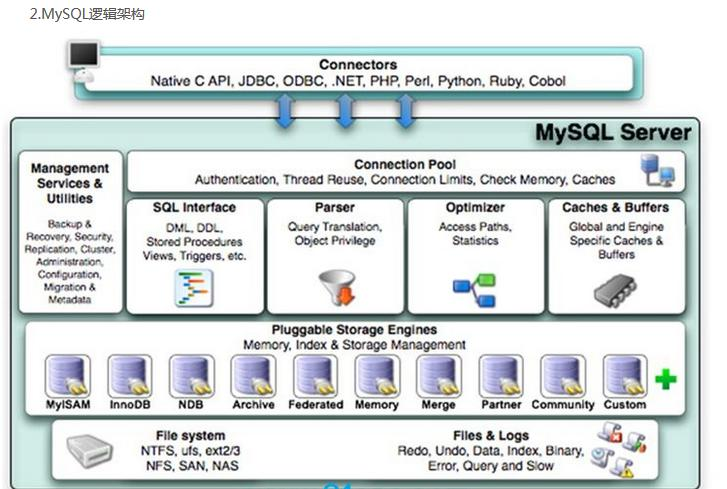

### 连接层

最上层是一些客户端和连接服务， 包含本地 sock 通信和大多数基于客户端/服务端工具实现的类似于 tcp/ip 的通信。 主要完成一些类似于连接处理、 授权认证、 及相关的安全方案。 在该层上引入了线程池的概念， 为通过认证安全接入的客户端提供线程。 同样在该层上可以实现基于 SSL 的安全链接。 服务器也会为安全接入的每个客户端验证它所具有的操作权限。  


### 服务层

| 组件                             | 功能                                                         |
| -------------------------------- | ------------------------------------------------------------ |
| Management Serveices & Utilities | 系统管理和控制工具                                           |
| SQL Interface:                   | SQL 接口。 接受用户的 SQL 命令， 并且返回用户需要查询的结果。 比如 select from 就是调用 SQL Interface |
| Parser                           | 解析器。 SQL 命令传递到解析器的时候会被解析器进行语法规则验证和解析 |
| Optimizer                        | 查询优化器。 SQL 语句在查询之前会使用查询优化器对查询进行优化， 比如有 where 条件时， 优化器来决定先投影还是先过滤。 |
| Cache 和 Buffer                  | 查询缓存。 如果查询缓存有命中的查询结果， 查询语句就可以直接去查询缓存中取 数据。 这个缓存机制是由一系列小缓存组成的。 比如表缓存， 记录缓存， key 缓存， 权限缓存等 |


### 引擎层

存储引擎层， 存储引擎真正的负责了 MySQL 中数据的存储和提取， 服务器通过 API 与存储引擎进行通信。 不同的存储引擎具有的功能不同， 这样我们可以根据自己的实际需要进行选取。 

#### MySql和InnoDB区别

| 对比项 | MyISAM                                                     | InnoDB                                                       |
| ------ | ---------------------------------------------------------- | ------------------------------------------------------------ |
| 外键   | 不支持                                                     | 支持                                                         |
| 事务   | 不支持                                                     | 支持                                                         |
| 行表锁 | 表锁， 即使操作一条记录也会锁住整个表， 不适合高并发的操作 | 行锁,操作时只锁某一行， 不对其它行有影响， 适合**高并发**的操作 |
| 缓存   | 只缓存索引， 不缓存真实数据                                | 不仅缓存索引还要缓存真实数据， 对内存要求较高， 而且内 存大小对性能有决定性的影响 |
| 关注点              | 读**性能** | 并发写、 事务、 资源 |
| 默认安装            | Y      | Y                    |
| 默认使用            | N      | Y                    |
| 自 带 系 统 表 使用 | Y      | N                    |
| 是否支持MVCC | N | 支持应对高并发事务, MVCC比单纯的加锁更高效;MVCC只在 `READ COMMITTED` 和 `REPEATABLE READ` 两个隔离级别下工作;MVCC可以使用 乐观(optimistic)锁 和 悲观(pessimistic)锁来实现 |

```sql
# 查看所有数据库引擎
show engines
# 查看默认数据库引擎
show variables like '%storage_engine%'
```


### 存储层

数据存储层， 主要是将数据存储在运行于裸设备的文件系统之上， 并完成与存储引擎的交互。


## Mysql查询与执行流程

### 查询流程

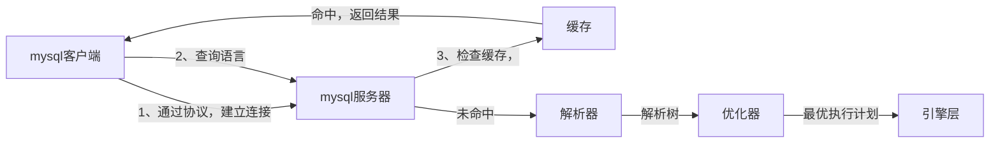
```mermaid
graph LR
A["mysql客户端"]--"1、通过协议，建立连接"-->B["mysql服务器"]
A--"2、查询语言"-->B
B--"3、检查缓存，"-->C["缓存"]
C--"命中，返回结果"-->A
B--"未命中"-->D["解析器"]
D--"解析树"-->E["优化器"]
E--"最优执行计划"-->F["引擎层"]
```

### mysql执行顺序

sql编码顺序

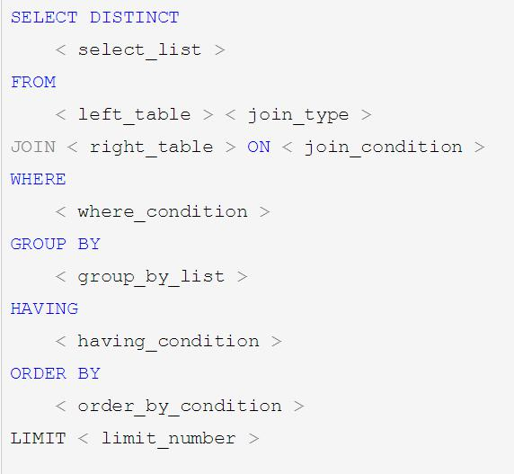

sql执行顺序

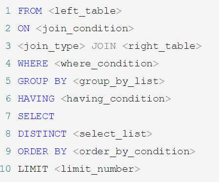

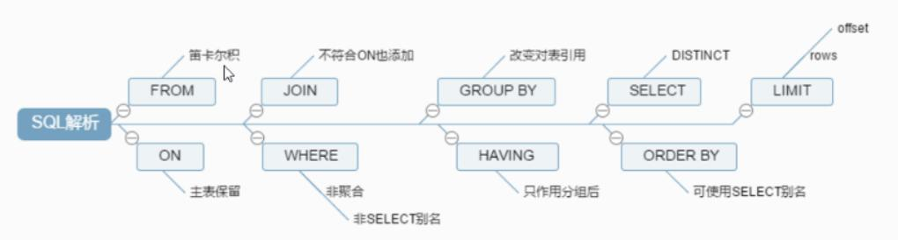


## 常见低性能原因及处理

**常见原因**

- 查询数据过多
- 关联过多的表，即使用太多Join
- 没有利用索引，或没有利用好索引
- 服务器调优及各个参数设置没有设置适当
  - top，free，iostat，vmstat查看系统性能状态
- 内存不足，导致产生大量IO操作
- 锁设置不适当
  - 线程阻塞
  - 死锁


**发现解决问题步骤**

1. 观察，至少跑1天，看看生产的慢SQL情况
2. 开启慢查询日志，设置阈值，比如超过5s的就是慢SQL，记录在日志中
3. 使用Explain分析
4. show profile 查询SQL在Mysql服务器中的执行细节和生命周期情况
5. 运维或DBA，进行数据库服务器的参数调优


## 索引

帮助Mysql高效获取数据的**数据结构**

一般而言，对于数据库索引都是B树索引。聚集索引、次要索引、复合索引、前缀索引、唯一索引都默认使用B+树索引。

除B树索引外，也有Hash索引

==虽然可以在表上建立很多个索引，但是查询时，只会使用表中的一个索引==

### 索引的优缺点

**优点**

- 降低数据库的IO成本，提高数据**检索**的效率
- 索引列对数据进行排序， 降低数据**排序**的成本， 降低了CPU的消耗

**缺点**

- 数据**更新**时，索引需要重新建立，增加时间开销
- 索引以文件方式存储在磁盘，带来额外空间开销


### 索引分类

- 单值索引：一个索引只包含一个列
- 复合索引：一个索引包含多个列，符合索引优先与单值索引
- 唯一索引：值必须唯一，允许有空值。自动在添加唯一约束的列上建立
- 主键索引：设置主键后，默认在主键上建立主键索引。innodb中主键索引为**聚集索引**


### 索引操作

| 操作             | 命令                                                         |
| ---------------- | ------------------------------------------------------------ |
| 创建             | CREATE [UNIQUE ] INDEX [indexName] ON table_name(column))    |
| 删除             | DROP INDEX [indexName] ON mytable;                           |
| 查看             | SHOW INDEX FROM table_name                                   |
| 使 用 Alter 命令 | ALTER TABLE tbl_name ADD PRIMARY KEY (column_list) : 该语句添加一个主键， 这意味着索引值必须是唯一 的， 且不能为 NULL。 |
|                  | ALTER TABLE tbl_name ADD UNIQUE index_name (column_list)     |
|                  | ALTER TABLE tbl_name ADD INDEX index_name (column_list): 添加普通索引， 索引值可出现多次。 |
|                  | ALTER TABLE tbl_name ADD FULLTEXT index_name (column_list):该语句指定了索引为 FULLTEXT ， 用于全文索 引。 |

**创建索引**

```mysql
# 创建表时添加索引
# 以列级方式
CREATE TABLE customer (
    id INT(10) UNSIGNED AUTO_INCREMENT PRIMARY KEY,
    customer_no VARCHAR(200) UNIQUE,
    customer_name VARCHAR(200),
    customer_age int,
);
# 以表级方式
CREATE TABLE customer (
    id INT(10) UNSIGNED AUTO_INCREMENT ,
    customer_no VARCHAR(200),
    customer_name VARCHAR(200),
    customer_age int,
    # 对于普通索引还是以表级方式建立
    # 普通索引--单值索引
    KEY(customer_name),
    # 普通索引--复合索引
    KEY(customer_name,customer_age),
    # 唯一索引
    UNIQUE (customer_no)
    # 主键索引
    PRIMARY KEY(id)
);
```


### 索引结构

#### BTree索引

数据存储在所有节点

MyISAM引擎使用


#### B+Tree索引

真实数据值存储在叶子节点

InnoDB引擎使用


B+树相比B树的优势

1. 磁盘读写代价更低
   - 非叶子节点不存储数据，只有索引，所以一个盘块中能存储的索引更多，B+树的高度减小，IO次数更少
2. 查询效率更加稳定
   - 每次查询都要经历等于B+树高度的IO次数，时间一致


#### Hash索引

键值对方式，Memory和NDB引擎支持，Nosql采用此种索引结构


#### RTree索引

相比BTree，RTree优势在于范围查找。

RTree在mysql中很少使用，仅支持geometry数据类型。支持该数据类型的存储引擎有：MyISAM、InnbDB、BDB、NDB、Archive


#### full-text索引

全文检索，支持分词技术

这种方式不再使用，目前都是用专门的搜索引擎代替，如ElasticSearch，Solr

```mysql
CREATE TABLE article (
    id INT(10) UNSIGNED AUTO_INCREMENT ,
    title VARCHAR(200),
    content VARCHAR(200),
   	PRIMARY KEY(id),
   	FULLTEXT KEY()
);

# 传统方式
select * from article where content like "%要查询的字符串%"
# 全文索引查询方式
select * from article where match(title,content) against ("要查询的字符串")
```


#### 聚集索引和非聚集索引

- 聚集索引不仅是索引，它也是一种数据存储方式。默认在主键上创建

  对于聚集索引而言，数据行在**磁盘上的排列方式和在索引上排序一致**。

  聚集索引字段可以不唯一

- 非聚集索引，也就是普通索引，辅助索引。

  如果给表中多个字段加上非聚集索引 ， 那么就会出现多个独立的索引结构，每个索引（非聚集索引）互相之间不存在关联


**聚集索引与非聚集索引的区别**

==通过聚集索引可以查到需要查找的数据 而通过非聚集索引可以查到记录对应的主键值 ， 再使用主键的值通过聚集索引查找到需要的数据==

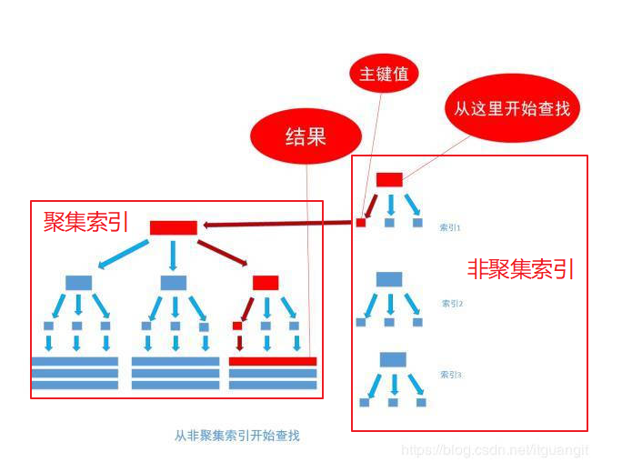

**总结**

==不管以任何方式查询表， 最终都会利用主键通过聚集索引来定位到数据， 聚集索引（主键）是通往真实数据所在的唯一路径。==


##### 覆盖索引

**特殊情况**

有一种例外可以不使用聚集索引就能查询出所需要的数据， 这种非主流的方法 称之为「**覆盖索引**」查询， 也就是平时所说的**复合索引**或者**多字段索引**查询。

由于复合索引会将多个字段添加到索引中，那检索一个字段，不仅会得到主键id，还会得到其他字段的值，如果结果就是这些字段，则不需要再使用主键进行检索

```mysql
# 建立索引
create index index_birthday on user_info(birthday);
# 查询生日在1991年11月1日出生用户的用户名
select user_name from user_info where birthday = '1991-11-1'

首先，通过非聚集索引 index_birthday 查找 birthday 等于1991-11-1的所有记录的主键ID值
然后，通过得到的主键ID值执行聚集索引查找，找到主键ID值对就的真实数据（数据行）存储的位置
最后，从得到的真实数据中取得user_name字段的值返回，也就是取得最终的结果

# 复合索引
create index index_birthday_and_user_name on user_info(birthday, user_name);
select user_name from user_info where birthday = '1991-11-1'
直接通过非聚集索引 index_birthday 查找 birthday 等于1991-11-1的所有记录的user_name字段的值并返回
```


### 索引创建条件

**索引适合的情况**

1. 主键自动建立唯一索引
2. 频繁作为查询条件的字段应该创建索引
3. 查询中与其它表关联的字段，外键自动建立索引
4. 单键/组合索引的选择问题，组合索引性价比更高
5. 查询中排序的字段，排序字段若通过索引去访问将大大提高排序速度
   - group by 和order by后面的字段，并且组合索引字段顺序应该和排序字段顺序一致
6. 查询中统计或者分组字段  


**不需要创建索引的情况**

1. 表记录很少
2. 经常修改的表
3. 数据重复且分布平均的表字段
   - 例如：性别、国籍，这些字段重复率很高
   - **索引的选择性**：索引列中不同值的数目/总列数。索引值越接近1，这个索引的效率就越高


### Explain性能分析

使用 EXPLAIN 关键字可以模拟优化器执行 SQL 查询语句， 从而知道 MySQL 是如何处理你的 SQL 语句的。 分析你的查询语句或是表结构的性能瓶颈。  


#### 作用

- 表的读取顺序--explain结果字段id
- 数据读取操作的操作类型--explain结果字段select_type
- 哪些索引可以使用--explain结果字段possible_keys
- 哪些索引被实际使用--explain结果字段key
- 表之间的引用--explain结果字段ref
- 每张表有多少行被优化器查询


#### Explain使用

**语法**

Explain + SQL语句

**返回结果**

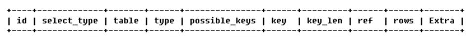

##### 字段说明

- **id**：select 查询的序列号，包含一组数字，表示查询中执行 select 子句或操作表的顺序。  

  - id 相同， 执行顺序由上至下 ，t1->t2->t3

  

  - id 不同， 如果是子查询， id 的序号会递增， id 值越大优先级越高， 越先被执行，t3->t2->t1

    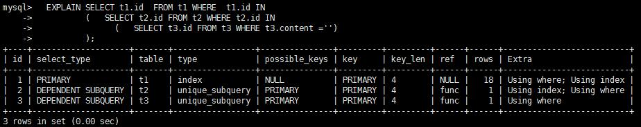

  - id 如果相同，从上往下顺序执行；id 值越大， 优先级越高， 越先执行,t3->==derived2（由id为2的查询衍生得到的一张虚表）==->t2

    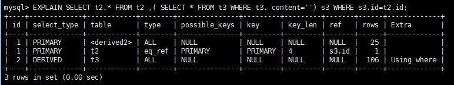

- **select_type**：用于区别普通查询、 联合查询、 子查询等的复杂查询  

| select_type 属性     | 含义                                                         |
| -------------------- | ------------------------------------------------------------ |
| SIMPLE               | 简单的 select 查询,查询中不包含子查询或者 UNION，即单表查询  |
| PRIMARY              | 查询中若包含任何复杂的子部分， 最外层查询则被标记为 Primary  |
| DERIVED              | 在 FROM 列表中包含的子查询被标记为 DERIVED(衍生) MySQL 会递归执行这些子查询, 把结果放在临时表里。 |
| SUBQUERY             | 在SELECT或WHERE列表中包含了子查询                            |
| DEPEDENT SUBQUERY    | 在SELECT或WHERE列表中包含了子查询,子查询基于外层             |
| UNCACHEABLE SUBQUERY | 无法使用缓存的子查询                                         |
| UNION                | 若第二个SELECT出现在UNION之后， 则被标记为UNION； 若UNION包含在FROM子句的子查询中,外层SELECT将被标记为： DERIVED |
| UNION RESULT         | 从UNION表获取结果的SELECT                                    |

- **table**：这个数据是基于哪个表
- **type**：查询的访问类型
  - 结果值从最好到最坏依次是：  
  - **system** > **const** > **eq_ref** > **ref** > fulltext > ref_or_null > index_merge > unique_subquery > index_subquery > **range** > index > **ALL**  
  - ==一般来说， 得保证查询至少达到 range 级别， 最好能达到 ref。==

| type   | 含义                                                         |
| ------ | ------------------------------------------------------------ |
| system | 表只有**一行记录**（等于系统表）， 这是 const 类型的特列， 平时不会出现， 这个也可以忽略不计 |
| const  | 通常情况下，如果将一个主键放置到where后面作为条件查询，mysql优化器就能把这次查询优化转化为一个常量<br />select * from department where id = 1; |
| eq_ref | 主键唯一性索引扫描， 对于每个索引键， 表中**只有一条记录**与之匹配，常出现在**多表连接**中，外表只有一条数据的情况。对于单表，优化器直接转化成const<br />select stu.name,sc.grade from student stu,score sc where stu.sid= sc.id;每个学生只有一条成绩信息 |
| ref    | 查找条件列使用了索引而且不为主键和unique，即**索引查询结果不唯一**<br />select * from person department where name='张三';叫张三的人可能有很多 |
| range  | 指的是有范围的**索引扫描**(对于表上的扫描不是range)，相对于index的全索引扫描，它有范围限制，因此要优于index。<br />一般就是where后面条件在key上使用了between，and以及'>','<'外，in和or等方式扫描 |
| index  | 在**索引上进行全表扫描**，没有在索引进行过滤                 |
| all    | 直接**进行全表扫描**                                         |

- **possible_keys**：查询涉及到的字段上若存在索引，则该索引将被列出，**但不一定被查询实际使用**。

- **key**：实际使用的索引，如果为NULL，则表示没有索引或索引没使用(索引失效)。只会选择一个
  - possible_keys中mysql推测使用的索引和key中实际使用的索引并没有任何关系
  - 这里mysql认为是全表扫描，并没有使用key，但是实际上使用了主键索引

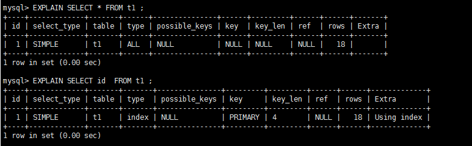

- **key_len**：where后面的筛选字段命中复合索引的长度。**长度越长，索引利用率越大，效率越高**。可以用来检查是否充分利用索引

  - 对于复合索引(deptno,ename)，下面分别为全命中和部分命中的情况
  - 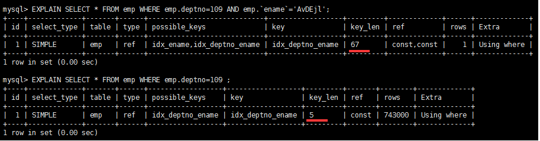

  - 计算长度
  - 类型长度int=4B，varchar(20)=20，varchar和char字符串类型，长度需要考虑具体字符集，utf8 要乘3，GBK要乘2，varchar作为动态字符串类型还需要额外添加2B，允许为空的类型需要额外加上1B
  - 所以5=4+1，67=(20*3+2)+5
- **ref**：查询时索引匹配的字段或者常量。当在索引列上进行**等值匹配**时，也就是type字段是const、eq_ref、ref、ref_or_null、unique_subquery、index-subquery其中之一时，ref列展示的是与索引列作等值匹配的**条件**，如常数或者某个字段
  - 根据sql语句，在emp表上与ename索引列做等值匹配的是"AvDEjl"，即一个常量，所以ref为const
  - 在dept表上与deptno索引列做等值匹配的是emp.'deptno'，即emp中的一个字段，所以ref为mytest.emp.deptno，即数据库名.表名.字段名
  - 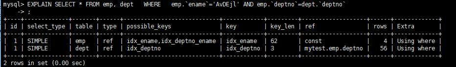
- **rows**：rows 列显示 MySQL 认为它执行查询时必须检查的行数。 越少越好！  
- **Extra**

| Extra                        | 含义                                                         |
| ---------------------------- | ------------------------------------------------------------ |
| Using filesort               | **排序时，MySQL 中无法利用索引或字段上没有索引**，会对数据使用一个外部的索引排序。 这种不是基于已建立索引的外部索引排序操作称为“文件排序”。**需要优化** |
| Using temporary              | MySQL 在对查询结果**排序**时使用**临时表**。**需要优化**     |
| Using index                  | 表示相应的 select 操作中使用了**覆盖索引**(Covering Index)， 避免访问了表的数据行，即**查询的数据都在辅助索引中，没有再根据主键id查找实际数据**<br/>如果同时出现 using where， 表明索引被用来执行索引键值的查找;<br />如果没有同时出现 using where， 表明索引只是用来读取数据而非利用索引执行查找。 |
| Using where                  | 表明使用了 where 过滤                                        |
| Using join buffer            | 多表连接时使用了连接缓存                                     |
| impossible where             | where 子句的值总是 false， 不能用来获取任何元组。            |
| select tables optimized away | 在没有 GROUPBY 子句的情况下，对一些多行函数进行优化          |
| distinct                     | 优化distinct操作，找到第一个匹配的元组就停止                 |

#### 案例

```mysql
select d1.name,(select id from t3) d2
from (select id,name from t1 where other_column='') d1
union
(select name,id from t2)
```

| id   | select_type  | table                          | type                           | possible_keys | key                        | key_len       | ref                    | rows | Extra       |
| ---- | ------------ | ------------------------------ | ------------------------------ | ------------- | -------------------------- | ------------- | ---------------------- | ---- | ----------- |
| 1    | PRIMARY      | derived 3                      | system<br />临时表只有一行数据 | NULL          | NULL<br />临时表上没有索引 | NULL          | NULL                   | 1    |             |
| 3    | DERIVED      | t1                             | ALL                            | NULL          | NULL                       | NULL          | NULL<br />没有索引匹配 | 1    | Using where |
| 2    | SUBQUERY     | t3                             | index                          | NULL          | PRIMARY                    | 4（id为主键） | NULL                   | 1    | Using index |
| 4    | UNION        | t2                             | ALL                            | NULL          | NULL                       | NULL          | NULL                   | 1    |             |
| NULL | UNION RESULT | <union1,4><br />操作1和4的结果 | ALL                            | NULL          | NULL                       | NULL          | NULL                   | NULL |             |


### 索引失效原因及解决

建表sql

```mysql
CREATE TABLE staffs (
  id INT PRIMARY KEY AUTO_INCREMENT,
  NAME VARCHAR (24)  NULL DEFAULT '' COMMENT '姓名',
  age INT NOT NULL DEFAULT 0 COMMENT '年龄',
  pos VARCHAR (20) NOT NULL DEFAULT '' COMMENT '职位',
  add_time TIMESTAMP NOT NULL DEFAULT CURRENT_TIMESTAMP COMMENT '入职时间'
) CHARSET utf8 COMMENT '员工记录表' ;
 
 
INSERT INTO staffs(NAME,age,pos,add_time) VALUES('z3',22,'manager',NOW());
INSERT INTO staffs(NAME,age,pos,add_time) VALUES('July',23,'dev',NOW());
INSERT INTO staffs(NAME,age,pos,add_time) VALUES('2000',23,'dev',NOW());
INSERT INTO staffs(NAME,age,pos,add_time) VALUES(null,23,'dev',NOW());
SELECT * FROM staffs;
 
ALTER TABLE staffs ADD INDEX idx_staffs_nameAgePos(name, age, pos);
```


#### 全值匹配

按照复合索引顺序进行匹配

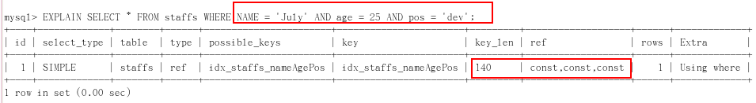

删除第一个条件

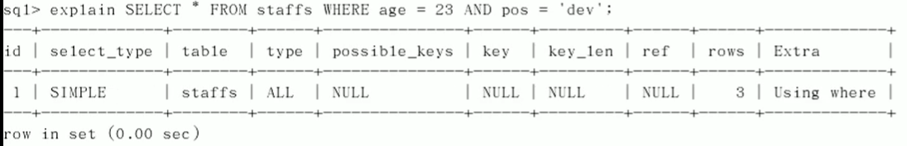


原因：使用复合索引，查询字段与索引字段顺序的不同会导致， 索引无法充分使用， 甚至索引失效。

==解决：应遵从最左前缀原则==

==注意:mysql5.5.62实测，where后面条件是不需要满足最左前缀==


##### 最左前缀原则

查询时，过滤条件应该**从索引的最左前列开始**并且**不跳过索引中的列**。  


#### 在索引列上操作

在索引列上进行操作后，索引列会失效

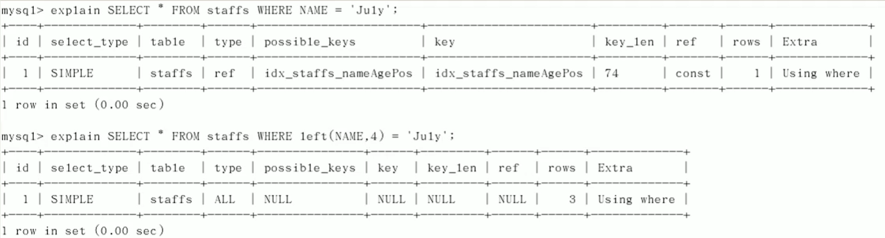

==解决：解决不了，尽量少使用吧==


#### 在复合索引上进行范围查找

若有索引则能使用到索引，范围条件右边的索引(复合索引)会失效

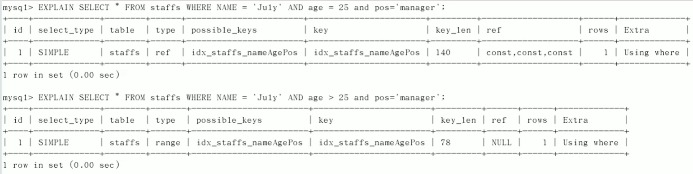

==解决：避免将要进行范围查找的索引列添加到复合索引中，或者将其放在复合索引的最后一项中==

**范围查找导致索引失效的原因**

```
举例
下面是按照三个字段（id,comments,type）建立的索引排序
1 1 1
1 2 2
2 1 3
2 1 4
2 2 1
2 2 4
2 3 0
2 4 1
先查找id=2的，得到
2 1 3
2 1 4
2 2 1
2 2 4
2 3 0
2 4 1
在查找comments>1的，得到
2 2 1
2 2 4
2 3 0
2 4 1
此时第三个索引项中数据是无序的
```

**结论**

对于复合索引而言，后一项索引有效的基础是前一项索引值唯一


#### 使用不等于进行过滤

使用 != 和 <> 的字段索引失效（!= 针对数值类型。 <> 针对字符类型）

原因：对于索引而言，就是一些有序的数据结构，而**不等于就是排除了指定条件的范围查找**，上面说明了范围查找导致索引失效的原因。

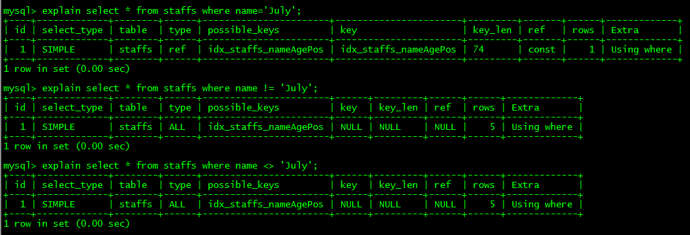

==解决：解决不了，尽量少使用吧==


#### 不为空判断

is not null无法使用索引，is null可以使用索引

is not null也相当于使用了不等于

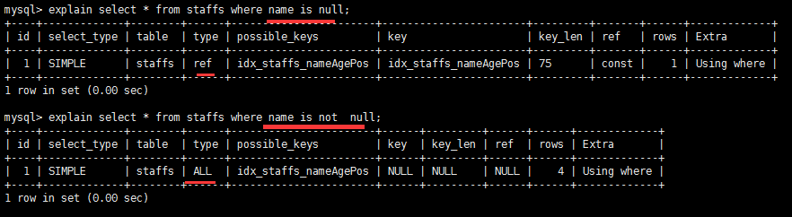

==解决：解决不了，尽量少使用吧==


#### 通配符匹配以%开头

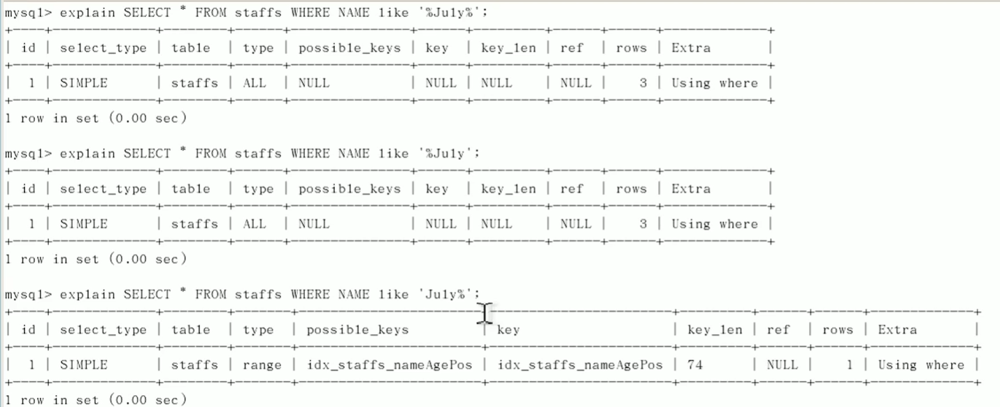

可以看出，如果%在正则表达式最前面，会导致索引失效。

==解决：==

1. ==使用reverse反转函数，将索引中字段反转，然后查询时也使用reverse将条件反转，这样就可以将'%s'变成's%'==
2. ==使用覆盖索引。将条件中的字段和要查询的字段联合，建立复合索引==


#### 数据隐形转换

存在索引列的数据类型隐形转换，则用不上索引。比如列类型是字符串，那一定要在条件中将数据使用引号引用起来,否则不使用索引

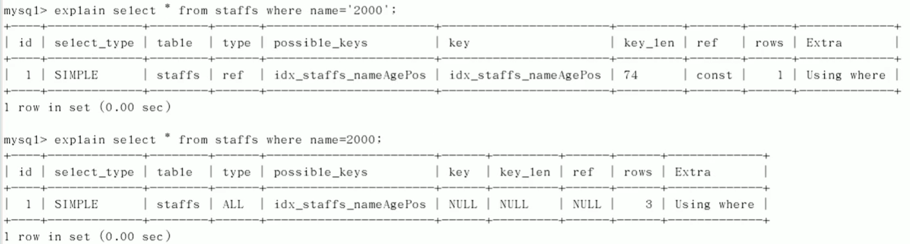


#### 条件中有or

使用or连接时，如果其中一个字段没有索引，则不会使用索引

==解决：要想使用or，又想让索引生效，只能将or条件中的每个列都加上索引==


### 案例

**案例1**

假设 index(a,b,c)；  

| Where 语句                                              | 索引是否被使用                                               |
| ------------------------------------------------------- | ------------------------------------------------------------ |
| where a = 3                                             | Y,使用到 a                                                   |
| where a = 3 and b = 5                                   | Y,使用到 a， b                                               |
| where a = 3 and b = 5 and c = 4                         | Y,使用到 a,b,c                                               |
| where b = 3 或者 where b = 3 and c = 4 或者 where c = 4 | N，不符合最左原则。                                          |
| where a = 3 and c = 5                                   | 使用到 a， 但是 c 不可以， b 中间断了(mysql5.5.62是可以的)   |
| where a = 3 and b > 4 and c = 5                         | 使用到 a 和 b， c 不能用在范围之后， b 断了                  |
| where a is null and b is not null                       | is null 支持索引 但是 is not null 不支持,所 以 a 可以使用索引,但是 b 不可以使用 |
| where a <> 3                                            | 不能使用索引                                                 |
| where abs(a) =3                                         | 在索引列上操作，不能使用 索引                                |
| where a = 3 and b like 'kk%' and c = 4                  | Y,使用到 a,b,c                                               |
| where a = 3 and b like '%kk' and c = 4                  | Y,只用到 a                                                   |
| where a = 3 and b like '%kk%' and c = 4                 | Y,只用到 a                                                   |
| where a = 3 and b like 'k%kk%' and c = 4                | Y,使用到 a,b,c                                               |


**案例2**

建表sql

```mysql
create table test03(
 id int primary key not null auto_increment,
 c1 char(10),
 c2 char(10),
 c3 char(10),
 c4 char(10),
 c5 char(10)
);
 
insert into test03(c1,c2,c3,c4,c5) values('a1','a2','a3','a4','a5');
insert into test03(c1,c2,c3,c4,c5) values('b1','b2','b3','b4','b5');
insert into test03(c1,c2,c3,c4,c5) values('c1','c2','c3','c4','c5');
insert into test03(c1,c2,c3,c4,c5) values('d1','d2','d3','d4','d5');
insert into test03(c1,c2,c3,c4,c5) values('e1','e2','e3','e4','e5');
```

建索引

```
create index idx_test03_c1234 on test03(c1,c2,c3,c4);
show index from test03;
```


查询

```
1）explain select * from test03 where c1='a1' and c2='a2' and c3='a3' and c4='a4'; 
使用复合索引全部字段
2）explain select * from test03 where c1='a1' and c2='a2' and c4='a4' and c3='a3'; 
使用符合索引全部字段，mysql会根据复合索引顺序进行优化
3）explain select * from test03 where c1='a1' and c2='a2' and c3>'a3' and c4='a4';
使用复合索引前三个字段
4）explain select * from test03 where c1='a1' and c2='a2' and c4>'a4' and c3='a3';
使用复合索引全部字段，Mysql优化顺序select * from test03 where c1='a1' and c2='a2' and c3='a3' and c4>'a4';
5）explain select * from test03 where c1='a1' and c2='a2' and c4='a4' order by c3;
使用c1,c2,c3字段索引
6） explain select * from test03 where c1='a1' and c2='a2' order by c3;
使用c1,c2字段索引，但是c3用于排序,无filesort
7） explain select * from test03 where c1='a1' and c2='a2' order by c4;
出现了filesort
8） 
8.1 explain select * from test03 where c1='a1' and c5='a5' order by c2,c3; 
 只用c1一个字段索引，但是c2、c3用于排序,无filesort
8.2 explain select * from test03 where c1='a1' and c5='a5' order by c3,c2;
 只用c1一个字段索引，出现了filesort，我们建的索引是1234，它没有按照顺序来，3 2 颠倒了
9） explain select * from test03 where c1='a1' and c2='a2' order by c2,c3;
 使用c1,c2字段索引，但是c2、c3用于排序,无filesort
10）
 explain select * from test03 where c1='a1' and c2='a2' and c5='a5' order by c2,c3;       
 用c1、c2两个字段索引，但是c2、c3用于排序,无filesort。c2已经在where部分匹配固定值，order by后再根据c2排序，其实是没用的，忽略
 explain select * from test03 where c1='a1' and c2='a2' and c5='a5' order by c3,c2;             
 用c1、c2两个字段索引，但是c2、c3用于排序,无filesort。c2已经在where部分匹配固定值，order by后再根据c2排序，其实是没用的，忽略
 explain select * from test03 where c1='a1' and c5='a5' order by c3,c2;
 filesort。这里只有c1字段索引，order by 部分和索引顺序不匹配
11）explain select * from test03 where c1='a1' and c4='a4' group by c2,c3;
 用c1索引，但是c2、c3用于排序,
12）explain select * from test03 where c1='a1' and c4='a4' group by c3,c2;
 用c1索引，有Use temporary,filesort
 Using where; Using temporary; Using filesort 

```

## 查询优化

### 使用覆盖索引

查询时应该避免使用select *

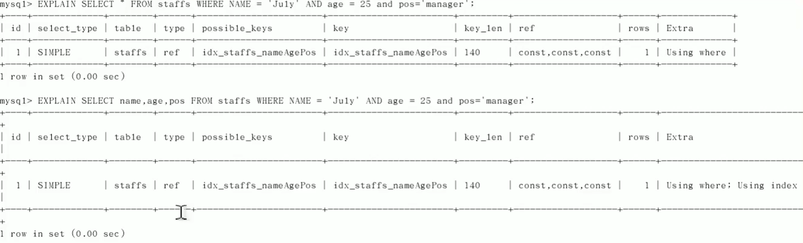

可以看出，第二条查询Extra字段多了Using index，即覆盖索引


### 单表查询优化

**建表sql**

```mysql
CREATE TABLE IF NOT EXISTS `article` (
`id` INT(10) UNSIGNED NOT NULL PRIMARY KEY AUTO_INCREMENT,
`author_id` INT(10) UNSIGNED NOT NULL,
`category_id` INT(10) UNSIGNED NOT NULL,
`views` INT(10) UNSIGNED NOT NULL,
`comments` INT(10) UNSIGNED NOT NULL,
`title` VARBINARY(255) NOT NULL,
`content` TEXT NOT NULL
);
 
INSERT INTO `article`(`author_id`, `category_id`, `views`, `comments`, `title`, `content`) VALUES
(1, 1, 1, 1, '1', '1'),
(2, 2, 2, 2, '2', '2'),
(1, 1, 3, 3, '3', '3');
 
SELECT * FROM article;
```

**查询**

`EXPLAIN SELECT id,author_id FROM article WHERE category_id = 1 AND comments > 1 ORDER BY views DESC LIMIT 1;`

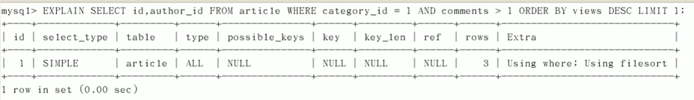

type=ALL，Extra中Using filesort都需要优化

**第一步：建立索引**

建立三个字段复合索引`create index idx_article_ccv on article(category_id,comments,views);`

此时查询分析

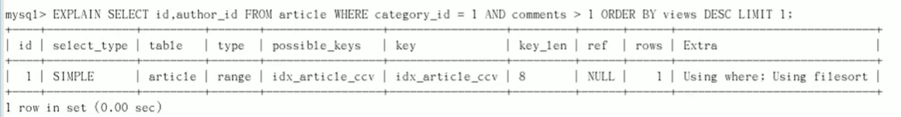

可以发现虽然使用了复合索引，但是type是range，且Extra中还有Using filesort

==原因：范围查找会导致索引失效。后面的索引只能建立在前面索引列的**单条数据**基础上==

**第二步：修改索引**

只建立两个字段的复合索引`create index idx_article_cv on article(category_id,views);`，舍弃了范围查找对应的索引

此时查询分析

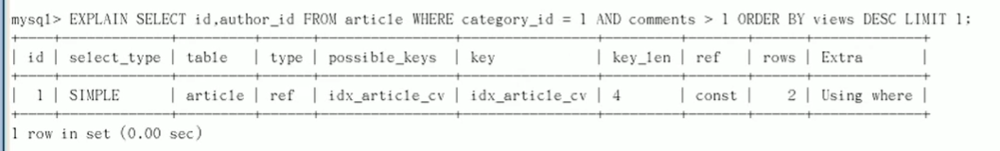

可以看出type已经是ref，且Extra中filesort消失

#### 方法

不要在要进行范围查询的字段上建立复合索引，不然会导致后面的索引字段失效


### 多表查询优化

建表sql

```mysql
CREATE TABLE IF NOT EXISTS `class` (
`id` INT(10) UNSIGNED NOT NULL AUTO_INCREMENT,
`card` INT(10) UNSIGNED NOT NULL,
PRIMARY KEY (`id`)
);
CREATE TABLE IF NOT EXISTS `book` (
`bookid` INT(10) UNSIGNED NOT NULL AUTO_INCREMENT,
`card` INT(10) UNSIGNED NOT NULL,
PRIMARY KEY (`bookid`)
);
 
INSERT INTO class(card) VALUES(FLOOR(1 + (RAND() * 20)));
INSERT INTO class(card) VALUES(FLOOR(1 + (RAND() * 20)));
 
INSERT INTO book(card) VALUES(FLOOR(1 + (RAND() * 20)));
INSERT INTO book(card) VALUES(FLOOR(1 + (RAND() * 20)));
INSERT INTO book(card) VALUES(FLOOR(1 + (RAND() * 20)));
```

**查询**

`EXPLAIN SELECT * FROM class LEFT JOIN book ON class.card = book.card;`
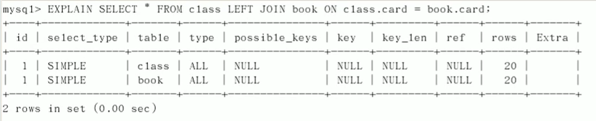

两个查询type都是ALL

**第一步：尝试给右表建索引**

`alter table book add index idx_card(card)`

此时查询分析

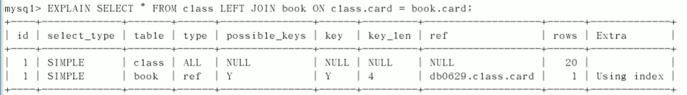

可以看到在book上使用到了索引，总共查询行数21行

**第二步：尝试给左表建索引**

删除右表索引，然后在左表上建立索引 `drop index idx_card on book ` `create index on class(card)`

此时查询分析

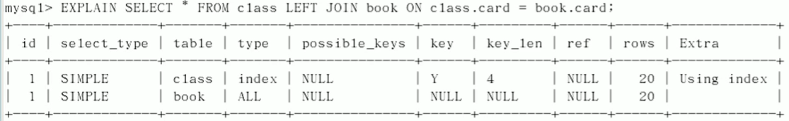

可以看到class表上查询type是index，也就是对索引进行全局扫描，总共查询行数和未加索引之前一样，40行

==原因：左连接会对左表进行全局扫描，所以不管有没有索引，都会遍历。==


#### 方法

- 多表查询时，在从表建立索引

- 主表为小表，从表尾大表。小表驱动大表

  - ```kotlin
    for(i in 0...1000){
        主表
    	for(i in 0...5){
            从表
        }
    }
    //------------
    for(i in 0...5){
        主表
        for(i in 0...1000){
            从表
        }
    }
    //上面两种方式虽然执行次数都是5000次，但是对于mysql而言，二者效率是不一样的
    外层循环其实就相当于连接join操作，内存循环就是遍历操作
    而连接操作往往都是十分耗时的，所以这就是小表驱动大表的原因
    ```

    

- 优先优化内层循环，即子查询这些

- 多表查询时，可以设置较大的JoinBuffer


### Order By优化

建表

```mysql
CREATE TABLE tblA(
  id int primary key not null auto_increment,
  age INT,
  birth TIMESTAMP NOT NULL,
  name varchar(200)
);
 
INSERT INTO tblA(age,birth,name) VALUES(22,NOW(),'abc');
INSERT INTO tblA(age,birth,name) VALUES(23,NOW(),'bcd');
INSERT INTO tblA(age,birth,name) VALUES(24,NOW(),'def');
 
CREATE INDEX idx_A_ageBirth ON tblA(age,birth,name);
```

查询

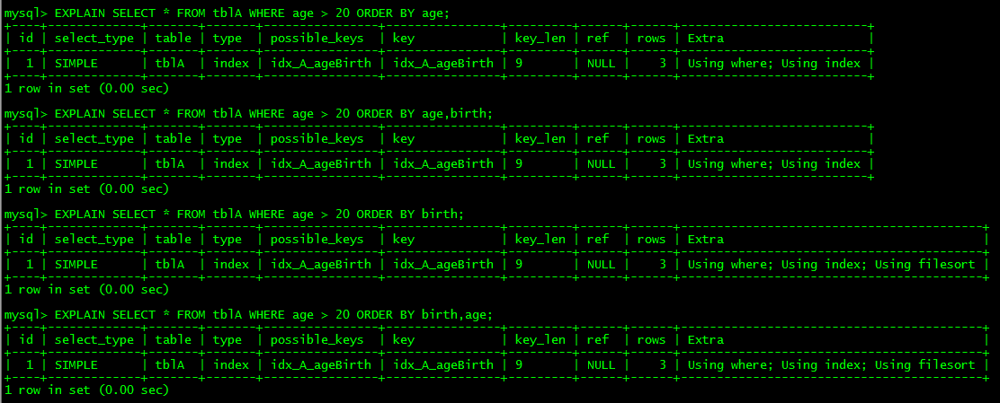

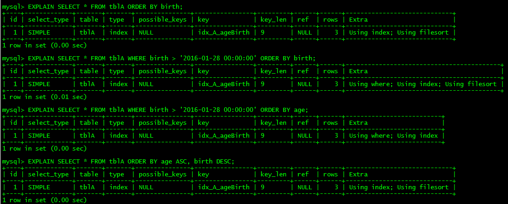

说明：

1. **MySQL在查询时最多只能使用一个索引。因此，如果WHERE条件已经占用了索引，那么在排序中就不使用索引了。**

   上面查询中 `where age > 20` 已经使用了索引 `idx_A_ageBirth`

2. **Where和Order by子句组合满足最佳左前缀原则**

   如果左边在某一列上使用范围查询，则order by就要从该列开始；

   如果左边在某一列上使用精确查询，则order by就要从下一列开始；

3. Order by子句**所有列的排序方向（升序或者降序）应该一样**


**如果order by后面列不在索引列中，使用filesort时有两种排序方式**

- 双路排序
  - Mysql4.1之前仅支持双路排序，两次IO操作
  - 过程：从表中读取行指针和ORDER BY列，对他们进行排序，一次IO；然后根据排好序的ORDER BY列，从表中读取所需要的字段，返回，一次IO。
- 单路排序
  - MySQL4.1之后，主要通过比较我们所设定的系统参数 max_length_for_sort_data的大小和Query 语句所取出的字段类型大小总和来判定需要使用哪一种排序算法。如果 max_length_for_sort_data更大，则使用第二种优化后的算法，反之使用第一种算法。
  - 过程：一次性取出满足条件行的所有字段，然后在sort buffer中进行排序，直接返回，一次IO。


### Group BY优化

- Group By实质是先排序后分组，分组部分没有太大影响，重要的还是排序。所以其实Group By优化和Order By优化类似
- 对于能放在where后面的条件，就不要放在having后面。

### limit优化


## 日志分析

### 慢查询日志

MySQL的慢查询日志是MySQL提供的一种日志记录，它用来记录在MySQL中响应时间超过阀值的语句，具体指运行时间超过(大于)**long_query_time**值的SQL，则会被记录到慢查询日志中。long_query_time的默认值为10s

#### 开启慢查询日志

默认情况下，MySQL数据库没有开启慢查询日志，需要我们手动来设置这个参数。

注意：如果不是调优需要的话，一般不建议启动该参数，因为开启慢查询日志会或多或少带来一定的性能影响。

```mysql
# 查看慢查询日志配置信息
SHOW VARIABLES LIKE '%slow_query_log%';
# 修改全局变量，重启后失效
set global slow_query_log=1
# 永久生效：linux下修改my.cnf，windows下修改my.ini
# 在[mysqld]下增加或修改参数
slow_query_log =1
# 如果没有指定参数slow_query_log_file的话，系统默认会给一个缺省的文件host_name-slow.log
slow_query_log_file=/var/lib/mysql/atguigu-slow.log

# 查看阈值时间
SHOW VARIABLES LIKE 'long_query_time%';
# 修改阈值
set global long_query_time=5
# 或在配置文件中添加
long_query_time=5
```

模拟查询

```mysql
select sleep(4);
```

然后打开日志文件，就可以看到记录

直接查询慢日志条数

```mysql
show global status like '%Slow_queries%';
```


#### 慢日志分析工具

mysql提供慢日志分析工具mysqldumpslow

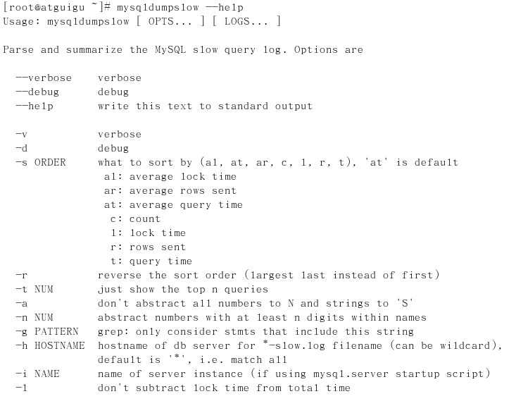

```
常用命令
得到返回记录集最多的10个SQL
mysqldumpslow -s r -t 10 /var/lib/mysql/atguigu-slow.log
 
得到访问次数最多的10个SQL
mysqldumpslow -s c -t 10 /var/lib/mysql/atguigu-slow.log
 
得到按照时间排序的前10条里面含有左连接的查询语句
mysqldumpslow -s t -t 10 -g "left join" /var/lib/mysql/atguigu-slow.log
 
另外建议在使用这些命令时结合 | 和more 使用 ，否则有可能出现爆屏情况
mysqldumpslow -s r -t 10 /var/lib/mysql/atguigu-slow.log | more
```


### 批量数据脚本

使用存储过程实现

**建表**

```mysql
# 新建库
create database bigData;
use bigData;
 
 
#1 建表dept
CREATE TABLE dept(  
id INT UNSIGNED PRIMARY KEY AUTO_INCREMENT,  
deptno MEDIUMINT UNSIGNED NOT NULL DEFAULT 0,   
dname VARCHAR(20) NOT NULL DEFAULT "",  
loc VARCHAR(13) NOT NULL DEFAULT ""  
) ENGINE=INNODB DEFAULT CHARSET=UTF8 ;  
 
 
#2 建表emp
CREATE TABLE emp  
(  
id INT UNSIGNED PRIMARY KEY AUTO_INCREMENT,  
empno MEDIUMINT UNSIGNED NOT NULL DEFAULT 0, /*编号*/  
ename VARCHAR(20) NOT NULL DEFAULT "", /*名字*/  
job VARCHAR(9) NOT NULL DEFAULT "",/*工作*/  
mgr MEDIUMINT UNSIGNED NOT NULL DEFAULT 0,/*上级编号*/  
hiredate DATE NOT NULL,/*入职时间*/  
sal DECIMAL(7,2) NOT NULL,/*薪水*/  
comm DECIMAL(7,2) NOT NULL,/*红利*/  
deptno MEDIUMINT UNSIGNED NOT NULL DEFAULT 0 /*部门编号*/  
)ENGINE=INNODB DEFAULT CHARSET=UTF8 ; 
```


**创建函数**

可能会报错

```
“ERROR 1418 (HY000): This function has none of DETERMINISTIC, NO SQL, or READS SQL DATA in its declaration and binary logging is enabled (you *might* want to use the less safe log_bin_trust_function_creators variable)”
```

这是由于启动了二进制日志，mysql会根据log_bin_trust_function_creators变量来表示是否可以信任存储函数创建者，不会创建写入二进制日志引起不安全事件的存储函数。默认值为0，用户不得创建或修改存储函数。因此，需要修改该变量

```
set global log_bin_trust_function_creators=1;
```

创建函数

```mysql
DELIMITER $$
# 生成指定长度的随机字符串，用于ename
CREATE FUNCTION rand_string(n INT) RETURNS VARCHAR(255)
BEGIN    ##方法开始
 DECLARE chars_str VARCHAR(100) DEFAULT 'abcdefghijklmnopqrstuvwxyzABCDEFJHIJKLMNOPQRSTUVWXYZ'; 
 ##声明一个 字符串长度为 100 的变量 chars_str ,默认值 
 DECLARE return_str VARCHAR(255) DEFAULT '';
 DECLARE i INT DEFAULT 0;
 ##循环开始
 WHILE i < n DO
  ##concat 连接函数  ，substring(a,index,length) 从index处开始截取
  # mysql字符串索引从1开始
  SET return_str =CONCAT(return_str,SUBSTRING(chars_str,FLOOR(1+RAND()*52),1));
  SET i = i + 1;
 END WHILE;
 RETURN return_str;
END $$

# 生成随机101-110的数字，用于部门标号
DELIMITER $$
CREATE FUNCTION rand_num() RETURNS INT(5)  
BEGIN   
 DECLARE i INT DEFAULT 0;  
 SET i = FLOOR(101+RAND()*10);
 RETURN i;  
END $$
```

创建存储过程

```mysql
# 从empno=START开始，向emp表插入max_num条数据
DELIMITER $$
CREATE PROCEDURE insert_emp(IN START INT(10),IN max_num INT(10))  
BEGIN  
 DECLARE i INT DEFAULT 0;   
 #把当前会话的autocommit设置成0  ；提高执行效率
 SET autocommit = 0;    
 REPEAT  ##重复
  # 存储过程中可以直接使用函数
  INSERT INTO emp10000 (empno, ename ,job ,mgr ,hiredate ,sal ,comm ,deptno ) VALUES ((START+i)     ,rand_string(6),'SALESMAN',0001,CURDATE(),FLOOR(1+RAND()*20000),FLOOR(1+RAND()*1000),rand_num());
  SET i = i + 1;
 UNTIL i = max_num   ##循环max_num次
 END REPEAT;  ##满足条件后结束循环
 COMMIT;   ##执行完成后一起提交
END $$

# 从deptno=START开始，向dept表插入max_num条数据
DELIMITER $$
CREATE PROCEDURE insert_dept(IN START INT(10),IN max_num INT(10))  
BEGIN  
DECLARE i INT DEFAULT 0;   
 SET autocommit = 0;    
 REPEAT    
  INSERT INTO dept (deptno ,dname,loc) VALUES (START +i ,rand_string(10),rand_string(8));
  SET i = i + 1;
 UNTIL i = max_num  
 END REPEAT;  
 COMMIT;  
END $$
```

使用存储过程

```
# 员工编号100001-600001
CALL insert_emp(100001,500000);
# 部门编号101-110
CALL insert_dept(101,10); 
```


### Show Profile

mysql提供用来分析当前会话中语句执行的资源消耗情况，用于SQL调优的测量。相比于慢查询日志设置阈值，profile可以查看一段时间sql查询情况。

默认处于关闭状态。

#### 使用

```mysql
# 查看状态
Show  variables like 'profiling';
# 开启当前会话的profiles，默认保存最近15条记录
set profiling=1;

# 运行sql
...

# 查看结果
show profiles;
# 根据query_id查看单条记录具体信息(cpu,io)
show profile cpu,block io for query n
```

查询时参数

| parameters       | function                                                     |
| ---------------- | ------------------------------------------------------------ |
| ALL              | 显示所有的开销信息                                           |
| BLOCK IO         | 显示块IO相关开销                                             |
| CONTEXT SWITCHES | 上下文切换相关开销                                           |
| CPU              | 显示CPU相关开销信息                                          |
| IPC              | 显示发送和接收相关开销信息                                   |
| MEMORY           | 显示内存相关开销信息                                         |
| PAGE FAULTS      | 显示页面错误相关开销信息                                     |
| SOURCE           | 显示和Source_function，Source_file，Source_line相关的开销信息 |
| SWAPS            | 显示交换次数相关开销的信息                                   |


所有结果

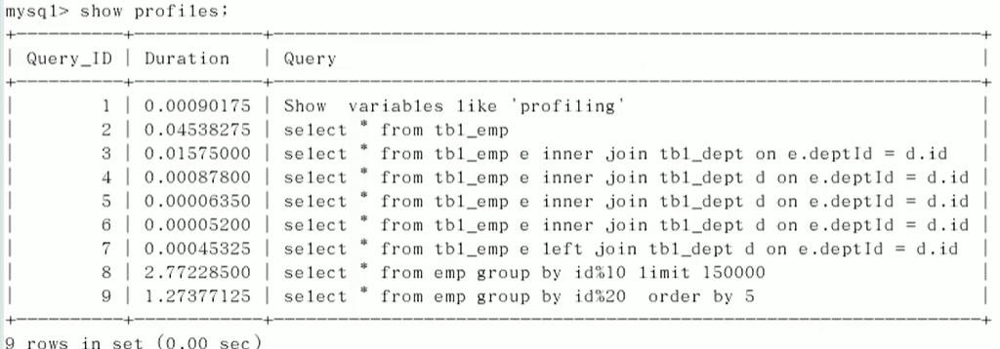

单条查询

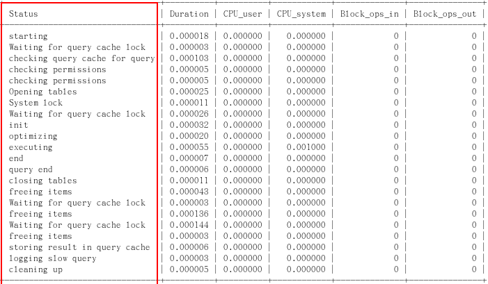

#### 需要注意的状态

- `converting HEAP to MyISAM` 查询结果过大，内存不足，将堆转移到磁盘
- `Creating temp table` 创建临时表
- `Copying to tmp table on disk` 把内存中临时表复制到磁盘。**十分耗时**
- `locked` 锁


### 全局查询日志

不要用于生产环境。**了解即可，使用上面的profiles可以更好地分析**

```mysql
set global general_log=1;
# 直接存放到Mysql系统数据库的general_log表中
set global log_output='TABLE'
# 或者修改配置文件my.inf，在[mysqld]下添加
general_log=1
# 存放在文件中，性能更好
general_log_file=/path/logfile
log_output=TABLE

# 从表中查看日志
select * from mysql.general_log;
```

查询结果

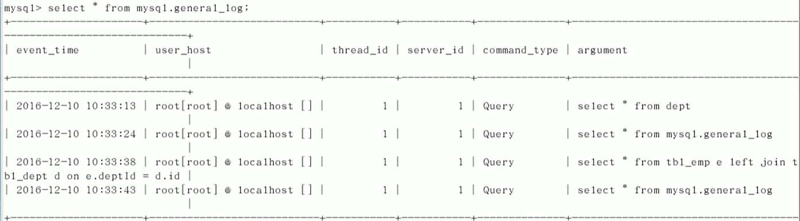


## Mysql锁

锁是计算机协调多个进程或线程并发访问某一资源的机制。

在数据库中，除传统的计算资源（如CPU、RAM、I/O等）的争用以外，数据也是一种供许多用户共享的资源。如何保证数据并发访问的一致性、有效性是所有数据库必须解决的一个问题，锁冲突也是影响数据库并发访问性能的一个重要因素。从这个角度来说，锁对数据库而言显得尤其重要，也更加复杂。


### 数据库锁的分类

#### 按数据操作类型分类

- 读锁（共享锁）：针对同一份数据，多个会话的读操作可以同时进行，但不允许写操作
- 写锁（排它锁）：当前会话写操作未完成前，不允许其他会话同时进行其他操作

#### 按操作粒度分类

粒度使用越细，锁住的数据越少，并发度越高

- 行锁
- 表锁


### 表锁

偏向**MyISAM存储引擎**，开销小，加锁快，无死锁，锁定粒度大，**发生锁冲突的概率最高**，并发度低。

#### 案例说明

```mysql
# 建表
drop table if exists mylock;
CREATE TABLE mylock (
    id INT PRIMARY KEY auto_increment,
    name VARCHAR (20) NOT NULL
) ENGINE MyISAM DEFAULT charset = utf8;
insert into mylock (name) values ('a');
insert into mylock (name) values ('b');
insert into mylock (name) values ('c');
insert into mylock (name) values ('d');
insert into mylock (name) values ('e');
# 增加表锁(读锁或写锁)
lock table tablename1 read(write),tablename2 read(write);
# 查看所有表上的锁
show open tables;
# 释放所有表上的锁
unlock tables;
```

**情况1：**会话A上给表A上加读锁

会话A只能在表A上进行**读**操作，**写**操作会**报错**。如果要对其他表操作，必须先释放锁。

会话B可以在表A上进行**读**操作，**写**操作会**阻塞**，当会话A释放表锁，写操作才能执行。


**情况2：**会话A上给表A上加写锁

会话A可以在表A上进行**读写**操作。如果要对其他表操作，必须先释放锁。

会话B对于表A的**读写**操作都**阻塞**。如果操作成功，可能是mysql缓存原因，修改下sql语句即可。


**分析表锁**

```
show status like 'table%';
```

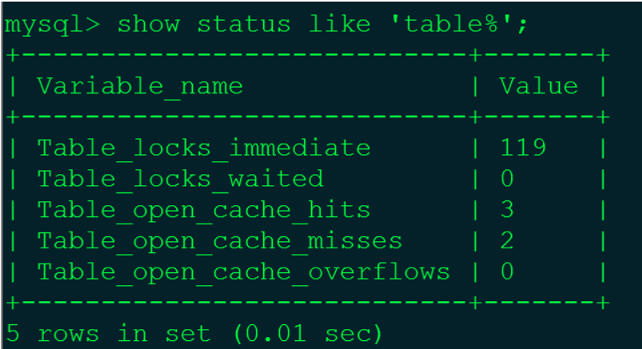

1. Table_locks_immediate：立即获取锁的查询次数
2. Table_locks_waited：不能获取表锁而发生等待的次数，此值高则说明存在较严重的表级锁争用情况。

MyISAM的读写锁调度是写优先，这也是MyISAM不适合做**写为主**的表的引擎，因为写锁后，其他线程不能做任何操作，大量的更新会使查询很难得到锁，从而造成长时间阻塞。


### 行锁

偏向**InnoDB存储引擎**，开销大，加锁慢，会出现死锁，锁定粒度小，发生锁冲突的概率低，但并发度高。

InnoDB与MyISAM的最大不同：

1. 支持事务
2. ==采用行锁(写操作时默认加锁)==。 InnoDB行锁是**通过索引上的索引项来实现的**，这一点ＭySQL与Oracle不同，后者是通过在数据中对相应数据行加锁来实现的。InnoDB这种行锁实现特点意味者：只有通过索引条件检索数据，InnoDB才会使用行级锁。**没有索引或者索引失效**，InnoDB将使用表锁！


建表

```mysql
drop table if exists test_innodb_lock;
# 使用innodb引擎创建数据库
CREATE TABLE test_innodb_lock (
    a INT (11),
    b VARCHAR (20) 
) ENGINE INNODB DEFAULT charset = utf8;
insert into test_innodb_lock values (1,'a');
insert into test_innodb_lock values (2,'b');
insert into test_innodb_lock values (3,'c');
insert into test_innodb_lock values (4,'d');
insert into test_innodb_lock values (5,'e');

create index idx_lock_a on test_innodb_lock(a);
create index idx_lock_b on test_innodb_lock(b);
```

#### 案例1-innodb默认事务级别

```mysql
# 关闭自动commit
set autocommit=0
```

可以看到

- 左边事务修改但未提交，右边事务并不能获取到左边事务未提交的数据。
- 左边事务commit之后，右边事务还是不能获取左边事务提交的数据
- 因为innodb默认支持的事务级别REPEATABLE READ，避免了脏读和不可重复读

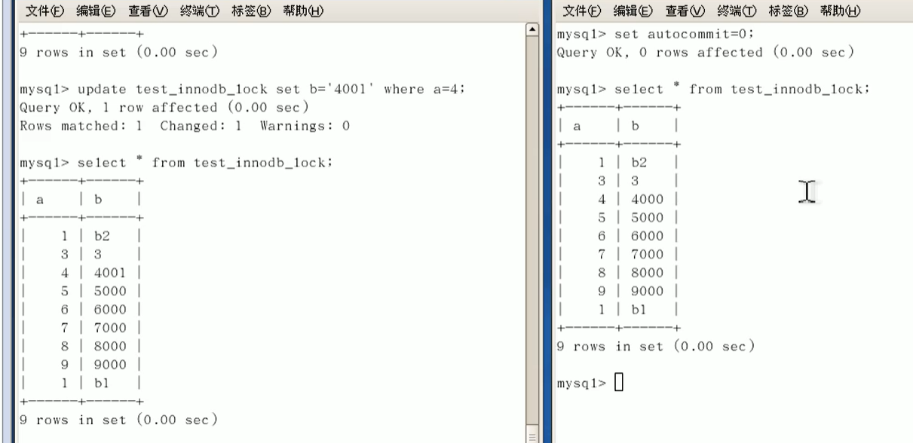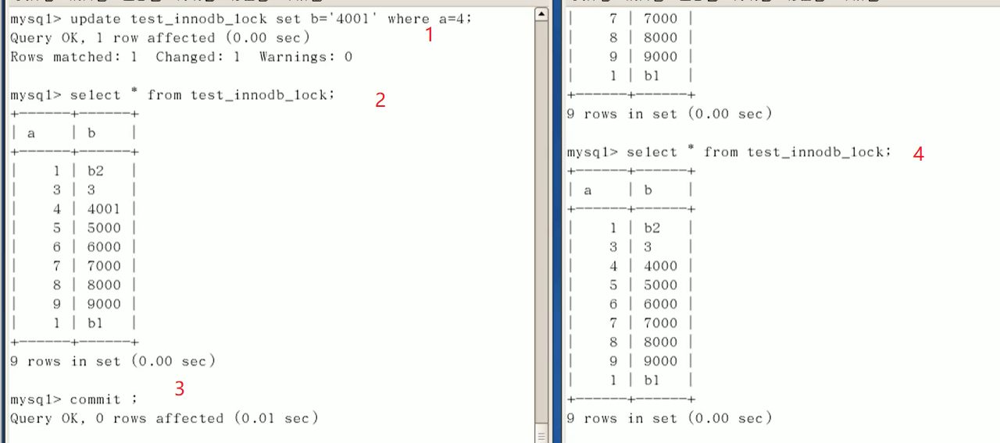

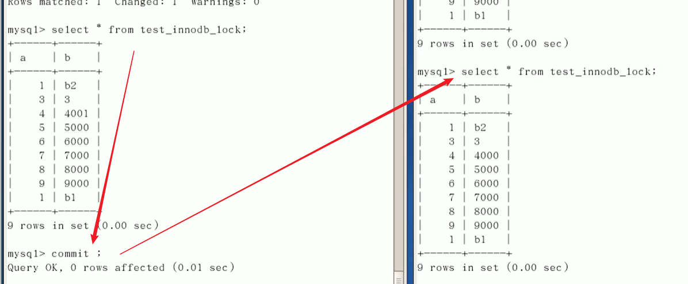

必须要在右边事务commit之后，才能获取左边事务提交的新数据

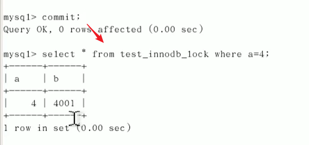

#### 案例2-行锁

可以看到使用行锁后(写操作时Innodb引擎默认加锁)

- 不同事务对于同一张表同一数据行的操作进行加锁。右边事务必须等待左边事务提交后，才能提交

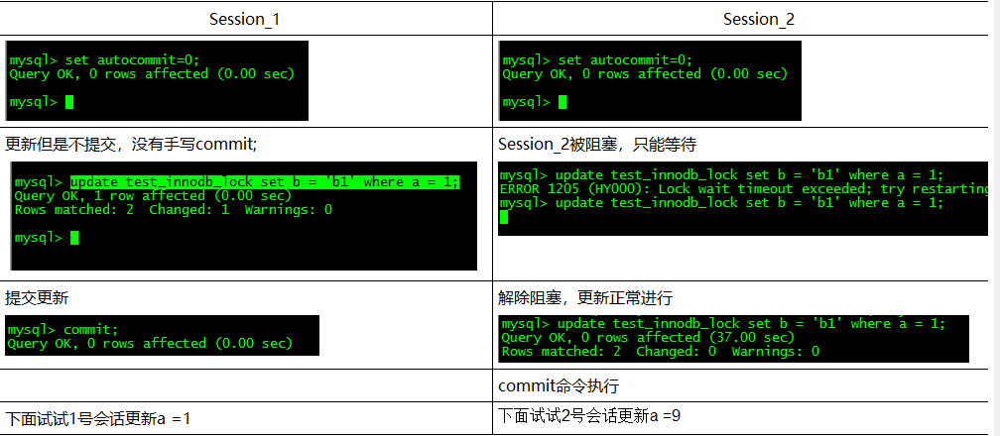


#### 案例3-行锁失效

可以看到虽然AB两个事务操作的是不同的数据行

- 由于A事务发生了隐式数据转换（字符串没有加引号），**导致索引失效，锁的级别从行锁升级为表锁**

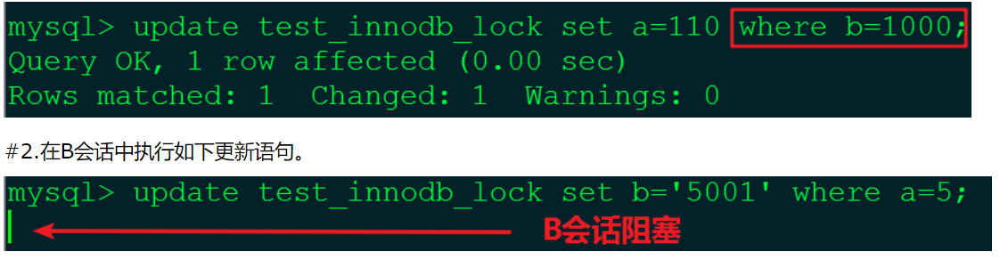


#### 案例4-间隙锁

当我们用范围条件而不是相等条件检索数据，并请求共享或排他锁时，InnoDB会给符合条件的已有数据记录的索引项加锁，对于键值在条件范围内但不存在的记录，叫作“间隙（GAP）”。

间隙锁是为了解决幻读而产生的。当进行范围查询时，为了不产生幻读，即两次读取数据条数不一致，对范围内所有数据加锁。

对于事务A，where条件匹配数据库中的项应该是a=3,a=4,a=5

但是事务B在插入a=2时，依然会被锁住。

因为间隙锁实际锁住了a∈[2,5]，即使a=2并不存在，此时a=2就叫“间隙”

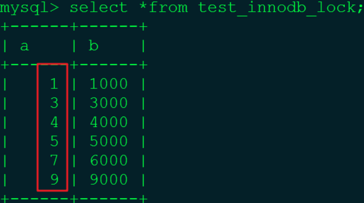

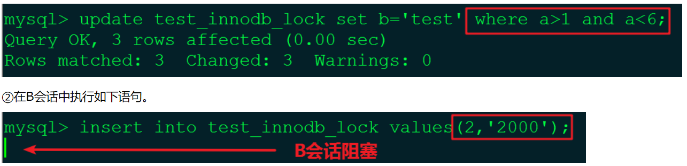


#### 案例5-主动添加行锁

```mysql
# 添加共享锁
SELECT * FROM table_name WHERE ... LOCK IN SHARE MODE
# 锁住sno=1的行
select * from student where sno=1 lock in share mode;
# 添加排它锁
SELECT * FROM table_name WHERE ... FOR UPDATE
```


#### 案例6-行锁分析

```mysql
show status like 'innodb_row_lock%';
```

各个状态量说明：

1. Innodb_row_lock_current_waits：当前正在等待锁定的数量。
2. **Innodb_row_lock_time**：从系统启动到现在锁定的时长。
3. **Innodb_row_lock_time_avg**：每次等待锁所花平均时间。
4. Innodb_row_lock_time_max：从系统启动到现在锁等待最长的一次所花的时间。
5. **Innodb_row_lock_waits**：系统启动后到现在总共等待锁的次数。

这个五个状态量中，比较重要的是：

Innodb_row_lock_time、Innodb_row_lock_time_avg和Innodb_row_lock_waits。尤其是等待次数很高，而且每次等待时长不小时，就可以使用profiles进行分析。

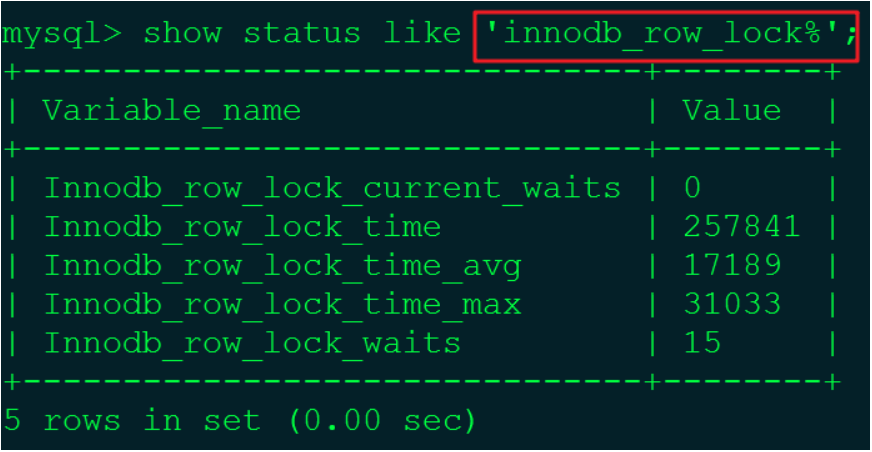

#### 总结

innodb使用更细粒度的行锁，更加适合高并发的场景，但是如果使用不当，当时行锁失效，转换表锁，效率可能比MyISAM更低。


#### 优化建议

1. 尽可能让所有数据都通过索引来完成，避免无索引行升级为表锁。
2. 合理设计索引，尽量缩小锁的范围。
3. 尽可能使用较少的检索条件，避免间隙锁。
4. 尽量控制事务大小，减少锁定资源量和时间长度。
5. 尽可能降低事务隔离级别


### 页锁

- 锁的粒度介于表锁和行锁之间，开销和加锁时间介于表锁和行锁之间，并发度一般

- 会出现死锁

  


## 主从复制

### 基本步骤

slave会从master读取binlog来进行数据同步。主要有以下三个步骤：

1. master将改变记录到二进制日志（binary log），这些记录过程叫做二进制日志事件（binary log events）。
2. slave开启一个I/O Thread，将master的binary log events拷贝到中继日志（relay log）。
3. slave重做中继日志中的事件，将改变应用到自己的数据库中。MySQL的复制是**异步且串行化**的。

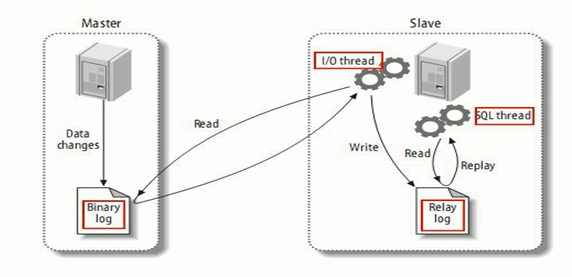

### 原则

1. 每个slave只能有一个master。（一对一）
2. 每个slave只能有一个唯一的服务器ID。
3. 每个master可以有多个slave。（一对多）


### 问题

在主从复制过程中，最大的问题就是延时。


### 一主一从的常见配置

#### 基本要求

- MySQL版本最好一致且后台以服务运行。
- 保证主机与从机互相ping通。
- 主从配置都在配置文件的[mysqld]结点下，都是小写
- 修改配置文件之后，要重启服务
- 主机和从机都要关闭防火墙，其实也可以配置ip规则。
  - windows，手动关闭
  - linux，使用命令 `service iptables stop` 

#### 主机配置

修改my.ini配置文件(windows)

1. 设置主机服务器id，`server-id=1` （必须）

2. 启用二进制文件。（必须）

   ```
   log-bin="D:/MySQL/MySQL Server 5.5/data/mysqlbin"
   ```

   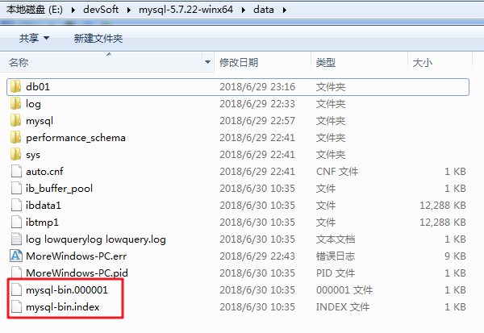

3. 启动错误日志（optional)

   ```
   log_error ="D:/MySQL/MySQL Server 5.5/data/mysqlerr"
   ```

4. 设置根目录、数据目录(optional)

   修改数据文件位置会导致启动报错，解决方式就是将原先的data文件夹中文件全部拷贝到当前data目录中

   ```
   #mysql安装根目录
   basedir="D:/MySQL/MySQL Server 5.5/"
    
   #mysql数据文件所在位置
   datadir="D:/MySQL/MySQL Server 5.5/data/"
   
   #mysql临时目录
   tmpdir  ="D:/MySQL/MySQL Server 5.5/"
   ```

5. 关闭只读(optional)

   ```
   read-only=0
   ```

6. 设置不需要复制的数据库（optional)

   ```
   binlog-ignore-db=mysql
   ```

7. 设置需要复制的数据库（optional)

   ```
   binlog-do-db=databasename
   ```

8. 重启服务，使用管理员方式执行

   ```
   net stop mysql
   net restart mysql
   ```

9. 关闭防火墙

   

   

#### 从机配置

修改my.cnf配置文件(linux)

1. 设置从服务器ID（necessary）

   ```
   #linux中 存在该项配置，只需要取消注释，同时注释掉server-id=1
   server-id=2
   ```

2. 启用二进制日志（necessary)

   ```
   # 配置中已经存在，不需要修改
   log-bin=mysql-bin
   ```

3. 关闭防火墙

   ```
   # 检查防火墙状态
   service iptables status
   # 关闭防火墙
   service iptables stop
   ```


#### 主机建立账户并授权给slave

1. 创建一个有复制权限的用户

   ```shell
   GRANT REPLICATION SLAVE ON *.* TO 'slaveaccount（用户名）'@'从机数据库ip' IDENTIFIED BY '密码'
   ```

2. 再次刷新权限表

   ```
   # 在windows中mysql命令行中执行
   flush privileges;
   ```

3. 查询主机状态(要保证是最新的)

   File告诉从机需要从哪个文件进行复制，Position告诉从机从文件的哪个位置开始复制，在从机上配置时需用到。

   执行完此操作后，尽量不要在操作主服务器MySQL，防止主服务器状态变化（File和Position状态变化）。

   

   

#### 从机连接主机

1. 从机中配置主机信息(上一步中账户信息和主机状态）

   ```mysql
   # 在mysql命令中执行
   CHANGE MASTER TO MASTER_HOST='主机IP',
   MASTER_USER='salveaccount',
   MASTER_PASSWORD='密码',
   MASTER_LOG_FILE='File名字',
   MASTER_LOG_POS=Position数字;
   ```

2. 启动从机复制功能

   ```
   #启动复制
   start slave;
   # 关闭复制
   stop slave;
   ```

3. 查看复制状态

   ```
   show slave status\G;
   ```

   只有当Slave_IO_Running:Yes和Slave_SQL_Running:Yes，这两个都为Yes的时候，主从复制配置才成功。

   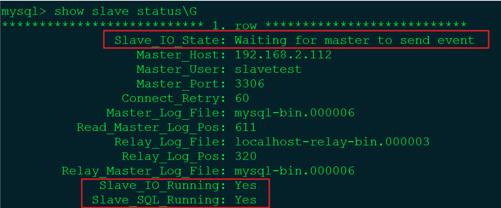


#### 测试

在主机建立数据库并插入数据

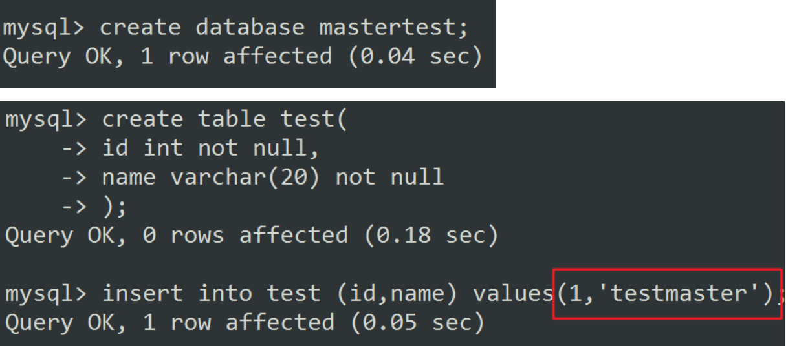

检查从机是否包含刚刚创建的数据库

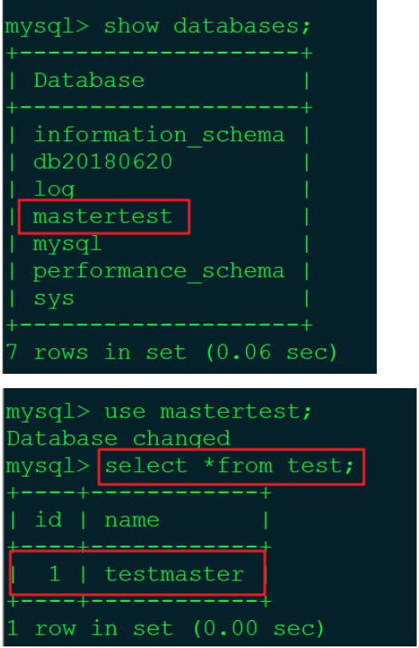


# MySQL之MVVC简介

## 一丶什么是MVCC？

　　MVCC (Multi-Version Concurrency Control) (注：与MVCC相对的，是基于锁的并发控制，Lock-Based Concurrency Control)是一种基于多版本的并发控制协议，只有在InnoDB引擎下存在。MVCC是为了实现事务的隔离性，通过版本号，避免同一数据在不同事务间的竞争，你可以把它当成基于多版本号的一种乐观锁。当然，这种乐观锁只在事务级别未提交锁和已提交锁时才会生效。MVCC最大的好处，相信也是耳熟能详：读不加锁，读写不冲突。在读多写少的OLTP应用中，读写不冲突是非常重要的，极大的增加了系统的并发性能。具体见下面介绍。

## 二丶MVCC的实现机制

　　InnoDB在每行数据都增加两个隐藏字段，一个记录创建的版本号，一个记录删除的版本号。

　　在多版本并发控制中，为了保证数据操作在多线程过程中，保证事务隔离的机制，降低锁竞争的压力，保证较高的并发量。在每开启一个事务时，会生成一个事务的版本号，被操作的数据会生成一条新的数据行（临时），但是在提交前对其他事务是不可见的，对于数据的更新（包括增删改）操作成功，会将这个版本号更新到数据的行中，事务提交成功，将新的版本号更新到此数据行中，这样保证了每个事务操作的数据，都是互不影响的，也不存在锁的问题。

## 三丶MVCC下的CRUD

**SELECT：**
　　当隔离级别是REPEATABLE READ时select操作，InnoDB必须每行数据来保证它符合两个条件：
　　1、InnoDB必须找到一个行的版本，它至少要和事务的版本一样老(也即它的版本号不大于事务的版本号)。这保证了不管是事务开始之前，或者事务创建时，或者修改了这行数据的时候，这行数据是存在的。
　　2、这行数据的删除版本必须是未定义的或者比事务版本要大。这可以保证在事务开始之前这行数据没有被删除。
符合这两个条件的行可能会被当作查询结果而返回。


**INSERT：**

　　InnoDB为这个新行记录当前的系统版本号。
**DELETE：**

　　InnoDB将当前的系统版本号设置为这一行的删除ID。
**UPDATE：**

　　InnoDB会写一个这行数据的新拷贝，这个拷贝的版本为当前的系统版本号。它同时也会将这个版本号写到旧行的删除版本里。


　　这种额外的记录所带来的结果就是对于大多数查询来说根本就不需要获得一个锁。他们只是简单地以最快的速度来读取数据，确保只选择符合条件的行。这个方案的缺点在于存储引擎必须为每一行存储更多的数据，做更多的检查工作，处理更多的善后操作。
　　MVCC只工作在REPEATABLE READ和READ COMMITED隔离级别下。READ UNCOMMITED不是MVCC兼容的，因为查询不能找到适合他们事务版本的行版本；它们每次都只能读到最新的版本。SERIABLABLE也不与MVCC兼容，因为读操作会锁定他们返回的每一行数据。