# 目录

[TOC]


# 23种设计模式

## GOF

在 1994 年，由 Erich Gamma、Richard Helm、Ralph Johnson 和 John Vlissides 四人合著出版了一本名为 **Design Patterns - Elements of Reusable Object-Oriented Software（中文译名：设计模式 - 可复用的面向对象软件元素）** 的书，该书首次提到了软件开发中设计模式的概念。

四位作者合称 **GOF（四人帮，全拼 Gang of Four）**。他们所提出的设计模式主要是基于以下的面向对象设计原则。

- 对接口编程而不是对实现编程。
- 优先使用对象组合而不是继承。


## 设计模式简介

[参考网址](https://www.runoob.com/design-pattern/design-pattern-intro.html)

| 模式类型   |                         模式 & 描述                          | 包括                                                         |
| :--------- | :----------------------------------------------------------: | :----------------------------------------------------------- |
| 创建型模式 | 这些设计模式提供了一种在创建对象的同时隐藏创建逻辑的方式，<br />而不是使用 new 运算符直接实例化对象。这使得程序在判断针对某个给定实例需要创建哪些对象时更加灵活。 | 单例模式（Singleton Pattern）<br />原型模式（Prototype Pattern）<br />工厂模式（Factory Pattern）<br />抽象工厂模式（Abstract Factory Pattern）<br />建造者模式（Builder Pattern） |
| 结构型模式 | 这些设计模式关注类和对象的组合。继承的概念被用来组合接口和定义组合对象获得新功能的方式。 | 代理模式（Proxy Pattern）<br />适配器模式（Adapter Pattern）<br />桥接模式（Bridge Pattern）<br />组合模式（Composite Pattern）<br />装饰器模式（Decorator Pattern）<br />外观模式（Facade Pattern）<br />享元模式（Flyweight Pattern） |
| 行为型模式 |             这些设计模式特别关注对象之间的通信。             | 模板模式（Template Pattern）<br />策略模式（Strategy Pattern）<br />命令模式（Command Pattern）<br />责任链模式（Chain of Responsibility Pattern）<br />状态模式（State Pattern）<br />观察者模式（Observer Pattern）<br />中介者模式（Mediator Pattern）<br />迭代器模式（Iterator Pattern）<br />访问者模式（Visitor Pattern）<br />备忘录模式（Memento Pattern）<br />解释器模式（Interpreter Pattern）<br /> |
| J2EE 模式  | 这些设计模式特别关注表示层。这些模式是由 Sun Java Center 鉴定的。 | MVC 模式（MVC Pattern）<br />业务代表模式（Business Delegate Pattern）<br />组合实体模式（Composite Entity Pattern）<br />数据访问对象模式（Data Access Object Pattern）<br />前端控制器模式（Front Controller Pattern）<br />拦截过滤器模式（Intercepting Filter Pattern）<br />服务定位器模式（Service Locator Pattern）<br />传输对象模式（Transfer Object Pattern） |


## 设计模式七大原则

### 单一职责原则

**定义**

一个类应该只负责一项职责

**目的**

- 降低类的复杂度
- 提高类的可读性，可维护性


### 接口隔离原则

**定义**

一个类对另一个类的依赖应该建立在最小接口上。

**目的**

降低类之间的耦合度

**实现**

尽可能对接口进行拆分


### 依赖倒转原则

**定义**

**面向接口编程**，针对接口编程，依赖于抽象而不依赖于具体。

**目的**

编程时，制定好规范，而不涉及具体实现操作，增加代码通用性和稳定性。

**实现**

利用了多态性


### 里式替换原则

**定义**

**继承必须确保超类所拥有的性质在子类中仍然成立**。里式替换原则说明继承实际上让两个类的耦合程度增加，在适当情况下，应该使用聚合，组合，依赖等形式组织类之间的关系。

**目的**

- 类的扩展不会给已有的系统引入新的错误，降低了代码出错的可能性
- 里氏替换原则是实现开闭原则的重要方式之一

**实现**

子类尽量不要重写父类中的方法


### 开闭原则

**定义**

**对扩展开放，对修改关闭**。在程序需要进行拓展的时候，不能去修改原有的代码，实现一个热插拔的效果

**目的**

- 提高代码复用能力
- 提高软件可维护性，方便进行软件测试。后期扩展只需要测试新添加部分，因为原有代码未受到影响

**实现**

使用接口和抽象类


### 迪米特原则

**定义**

又称最小知道原则，**一个类只与直接朋友通信**，即一个实体应当尽量少地与其他实体之间发生相互作用，使得系统功能模块相对独立

直接朋友：成员变量，方法参数，方法返回值中的类。局部变量中的类不是直接朋友

**目的**

- 减少类之间的耦合度，提高模块独立性
- 提高类的可复用率和系统的扩展性

**实现**

使用中介类来解耦


### 合成复用原则

**定义**

通过将已有的对象纳入新对象中，作为新对象的成员对象来实现的，新对象可以调用已有对象的功能，从而达到复用

继承复用破坏了类的封装性，将父类的实现细节暴露给子类，也称“白箱复用”。

**目的**

- 维持类的封装性，合成复用也称“黑箱复用”
- 降低耦合度
- 复用更加灵活，针对接口进行编程。

**实现**

**尽量使用合成/聚合的方式，而不是使用继承**

**示例**


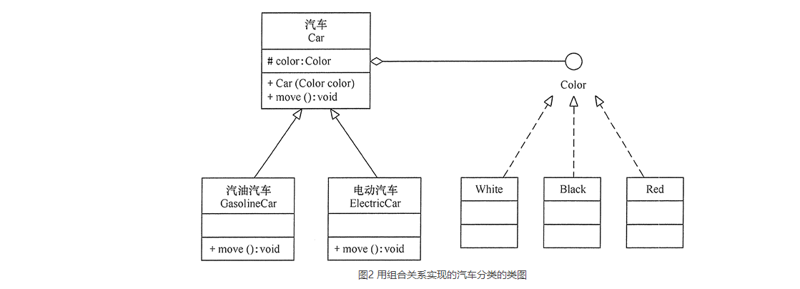


## 创建型模式(5种)

创建型模式的主要关注点是“怎样创建对象？”，它的主要特点是“将对象的创建与使用分离”。这样可以降低系统的耦合度，使用者不需要关注对象的创建细节，对象的创建由相关的工厂来完成。就像我们去商场购买商品时，不需要知道商品是怎么生产出来一样，因为它们由专门的厂商生产。

### 单例模式

一个类只有一个实例，且该类能自行创建这个实例的一种模式。

**作用**

节省内存资源、保证数据内容的一致性

**示例**

静态内部类式单例

```java
public class SingleTon{
  private SingleTon(){}
 
  private static class SingleTonHoler{
     private static SingleTon INSTANCE = new SingleTon();
 }
 
  public static SingleTon getInstance(){
    return SingleTonHoler.INSTANCE;
  }
}
```

枚举单例

- 反序列化后生成对象和原来对象是同一个对象
- 避免反射攻击（因为枚举类的构造方法继承自Enum类，在newInstance时，会检查当前类是不是Enum类，如果是则抛出异常）

```java
enum Singleton implements xx{
	INSTANCE("1","fj");
    private String id;
    private String name;
    private Singleton(String id,String name){
        this.id = id;
        this.name = name;
    }
    public Singleton getInstance(){
        return INSTANCE;
    } 
}
```


### 原型模式

用一个已经创建的实例作为原型，通过复制该原型对象来创建一个和原型相同或相似的新对象，即**克隆**。

**作用**

在有些系统中，存在大量相同或相似对象的创建问题，如果用传统的构造函数来创建对象，会比较复杂且耗时耗资源，用原型模式生成对象就很**高效**


#### 浅度克隆

**定义**

只负责克隆按值传递的数据（比如基本数据类型、String类型），而不复制它所引用的对象，换言之，所有的对其他对象的引用都仍然指向原来的对象。

**示例**

Java中clone函数就是一个浅度克隆

```java
public class Monkey implements Cloneable {
    ...
    /**
     * 浅克隆
     */
    public Object clone(){
        Object temp = null;
        try {
            temp = super.clone();
        } catch (CloneNotSupportedException e) {
            e.printStackTrace();
        } finally {
            return temp;
        }
    }
}
...
public static void main(String[] args){
    Monkey monkey = new Monkey();
    Monkey copyMonkey = (Monkey)monkey.clone();
    System.out.println("大圣本尊的生日是：" + monkey.getBirthDate());
    System.out.println("克隆的大圣的生日是：" + monkey.getBirthDate());
    System.out.println("大圣本尊跟克隆的大圣是否为同一个对象 " + (monkey == copyMonkey));
    System.out.println("大圣本尊持有的金箍棒 跟 克隆的大圣持有的金箍棒是否为同一个对象？ " + (monkey.getStaff() == copyMonkey.getStaff()));
}
```

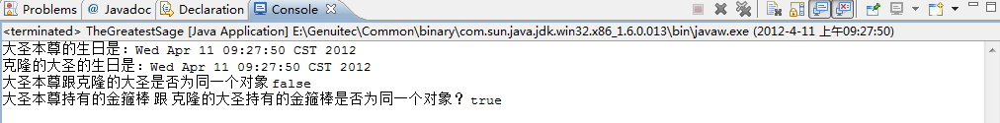


#### 深度克隆

**定义**

既克隆的值，还克隆引用类型的数据。那些引用其他对象的变量将指向被复制过的新对象，而不再是原有的那些被引用的对象。

换言之，**深度克隆把要复制的对象所引用的对象都复制了一遍**，而这种对被引用到的对象的复制叫做**间接复制**。

**注意**

- **深度克隆要深入到多少层，是一个不易确定的问题**。在决定以深度克隆的方式复制一个对象的时候，必须决定对间接复制的对象时采取浅度克隆还是继续采用深度克隆。因此，在采取深度克隆时，需要决定多深才算深。此外，在深度克隆的过程中，很可能会出现**循环引用**的问题，必须小心处理
- ==一般使用序列化和反序列机制来实现深度克隆==
- **对象以及对象内部所有引用到的对象都是可序列化的**，否则，就需要仔细考察那些不可序列化的对象可否设成transient，从而将之排除在复制过程之外。
- 有一些对象，比如线程(Thread)对象或Socket对象，是不能简单复制或共享的。不管是使用浅度克隆还是深度克隆，只要涉及这样的间接对象，就必须把间接对象设成transient而不予复制；或者由程序自行创建出相当的同种对象，权且当做复制件使用

**示例**

```java
//实现序列化接口
public class Monkey implements Serializable  {
    ...
    /**
     * 深克隆
     */
    public  Object deepClone() throws IOException, ClassNotFoundException{
        //将对象写到流里
        ByteArrayOutputStream bos = new ByteArrayOutputStream();
        ObjectOutputStream oos = new ObjectOutputStream(bos);
        oos.writeObject(this);
        //从流里读回来
        ByteArrayInputStream bis = new ByteArrayInputStream(bos.toByteArray());
        ObjectInputStream ois = new ObjectInputStream(bis);
        return ois.readObject();
    }
}
public class GoldRingedStaff implements Serializable{
	...
}
...
public static void main(String[] args){
    Monkey monkey = new Monkey();
    Monkey copyMonkey = (Monkey)monkey.clone();
    System.out.println("大圣本尊的生日是：" + monkey.getBirthDate());
    System.out.println("克隆的大圣的生日是：" + monkey.getBirthDate());
    System.out.println("大圣本尊跟克隆的大圣是否为同一个对象 " + (monkey == copyMonkey));
    System.out.println("大圣本尊持有的金箍棒 跟 克隆的大圣持有的金箍棒是否为同一个对象？ " + (monkey.getStaff() == copyMonkey.getStaff()));
}
```

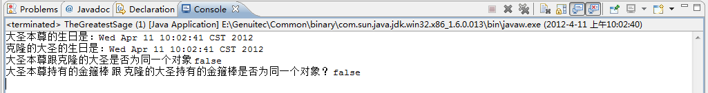


#### 带原型管理器的原型模式

在原型模式的基础上增加了一个原型管理器 PrototypeManager 类。该类用 HashMap 保存多个复制的原型（实现同一接口的），Client 类可以通过管理器的 get(String id) 方法从中获取复制的原型。

```java
interface Shape extends Cloneable
{
    public Object clone();    //拷贝
    public void countArea();    //计算面积
}
class Circle implements Shape
{
    public Object clone(){
        ...
    }
    public void countArea(){
        ...
    }
}
class Square implements Shape
{
    public Object clone(){
        ...
    }
    public void countArea(){
        ...
    }
}
class ProtoTypeManager
{
    private HashMap<String, Shape>ht=new HashMap<String,Shape>(); 
    public ProtoTypeManager()
    {
        ht.put("Circle",new Circle());
        ht.put("Square",new Square());
    } 
    public void addshape(String id,Shape obj)
    {
        ht.put(id,obj);
    }
    public Shape getShape(String id)
    {
        Shape temp=ht.get(id);
        return (Shape) temp.clone();
    }
}
public class ProtoTypeShape
{
    public static void main(String[] args)
    {
        ProtoTypeManager pm=new ProtoTypeManager();    
        Shape obj1=(Circle)pm.getShape("Circle");
        obj1.countArea();          
        Shape obj2=(Shape)pm.getShape("Square");
        obj2.countArea();     
    }
}
```


### 工厂模式

定义一个创建产品对象的工厂接口，将产品对象的实际创建工作推迟到具体子工厂类当中。这满足创建型模式中所要求的“创建与使用相分离”的特点。我们把被创建的对象称为**产品**，把创建产品的对象称为**工厂**

工厂中也可以使用一个Map来缓存产品，下次创建直接从Map中获取，这就成了**享元模式**。

**工厂模式分类**

- 简单工厂模式：多个产品实现相同接口，工厂根据id生产具体类型的产品

  

  ```java
  public class ShapeFactory {
     //使用 getShape 方法获取形状类型的对象
     public Shape getShape(String shapeType){
        if(shapeType == null){
           return null;
        }        
        if(shapeType.equalsIgnoreCase("CIRCLE")){
           return new Circle();
        } else if(shapeType.equalsIgnoreCase("RECTANGLE")){
           return new Rectangle();
        } else if(shapeType.equalsIgnoreCase("SQUARE")){
           return new Square();
        }
        return null;
     }
  }
  ```

  

- 工厂方法模式：多个产品实现相同接口，工厂中不同方法生产不同的产品

  

  ```java
  public class SendFactory {  
      public static Sender produceMail(){  
          return new MailSender();  
      }  
      public static Sender produceSms(){  
          return new SmsSender();  
      }  
  }  
  ```

  

### 抽象工厂模式

提供一个创建一系列相关或相互依赖对象的接口，而无需指定它们具体的类，绕一个超级工厂创建其他工厂。该超级工厂又称为其他工厂的工厂。

**和工厂模式不同之处**

工厂模式：仅仅针对产品的生成

抽象工厂模式：针对产品族中的产品，即选择哪个工厂，就只能使用该工厂提供的产品

进一步说明：车的种类有汽车、摩托车、货车，飞机的种类有客机，战斗机，车和飞机的品牌有奔驰、宝马。

工厂模式只能选择车的种类

抽象工厂模式先选择车的品牌（生产商），然后再选择车的种类

```java
// ------------------------------产品1
interface Car{
    void run();
}
public class Automobile implements Car{
    @Override
    public void run(){
        ...
    }
}
public class Trunk implements Car{
    @Override
    public void run(){
        ...
    }
}
public class Motorbike implements Car{
    ...
}
// ---------------------------------产品2
interface Plane{
    void fly();
}
public class Airliner implements Plane{
    ...
}
public class Warcraft implements Plane{
    ...
}
// ----------------------------------工厂
public interface Brand{
    Car produceCar();
    Plane producePlane();
}
public class BMW implements Brand{
    ...
}
public class Benz implements Brand{
    ...
}
```


### 建造者模式

建造者模式是用于构建复杂对象，且复杂对象通常由多个子部件**按一定的步骤组合**而成

**建造者模式的主要角色**

1. 产品角色（Product）：它是包含多个组成部件的复杂对象，由具体建造者来创建其各个部件（实际产品）。
2. 抽象建造者（Builder）：它是一个包含创建产品各个子部件的抽象方法的接口，通常还包含一个返回产品的方法 getResult()。
3. 具体建造者(Concrete Builder）：实现 Builder 接口，完成复杂产品的各个部件的具体创建方法。
4. 指挥者（Director）：它调用建造者对象中的部件构造与装配方法完成复杂对象的创建，在指挥者中不涉及具体产品的信息（实现构造复杂对象时的**逻辑**）。

```java
//产品 ---------------------------
public class Product
{
    private String partA;//必要
    private String partB;//必要
	private String partC;//可选
    private String partD;//可选
    public Product(String partA,String partB){
        this.partA = partA;
        this.partB = partB;
    }
    public void setPartC(String partC){
        this.partC = partC;
    }
    public void setPartD(String partD){
        this.partD = partD;
    }
}
//抽象建造者 ------------------------
interface class Builder
{
    void setPartC();
    void setPartD();
    //创建产品对象
    Product getProduct();
}
//具体建造者 --------------------------
public class ConcreteBuilder implements Builder{
    private Product product;
    public ConcreteBuilder(String partA,String partB){
        product = new Product(partA,partB);
    }
    @Override
    public void setPartC(){
        product.setPartC("PartC");//这里是默认配置
    }
    @Override
    public void setPartD(){
        product.setPartD("PartC");//这里是默认配置
    }
    @Override
    public Product getProduct(){
        return product;
    }
}
//指挥者 --------------------------------
public class Director
{
    private Builder builder;
    public Director(Builder builder)
    {
        this.builder=builder;
    }
    //产品构建与组装方法，返回产品
    public Product construct()
    {
        // 组件C和组件D有特定的构建顺序
        builder.buildPartC();
        builder.buildPartD();
        return builder.getProduct();
    }
}
//主函数 -------------------------
public static void mian(String[] args){
    Builder builder = new Builder(partA,partB);
    Product product = new Director(builder);
}
```

**改进的建造者模式**

为了简化系统结构，可以把指挥者和抽象建造者进行结合

==这样做确实简化了系统结构，但同时也加重了抽象建造者类的职责，也不是太符合单一职责原则，如果construct() 过于复杂，建议还是封装到 Director==

```csharp
interface class Builder { 
    void setPartC();
    void setPartD();
    //创建产品对象
    Product getProduct();
    
    /** 
    * 把指挥者中的construct()方法合并到抽象建造者类中 
    * 
    * @return 具体产品对象 
    */ 
    default Product construct() { 
        //特定顺序
        this.setPartC(); 
        this.setPartD(); 
        return this.getProduct(); 
    } 
} 
```


#### 重构传统实例化方式

对于一些子部件不需要特定步骤组合但是传入参数很多的复杂对象构建，传统方式构建可读性很差，可以使用builder模式重构

```java
//产品 ---------------------------
public class Product
{
    private String partA;//必要
    private String partB;//必要
	private String partC;//可选
    private String partD;//可选
    public Product(Builder builder){
        partA = builder.partA;
        partB = builder.partB;
        partC = builder.partC;
        partD = builder.partD;
    }
    
    public static final class Builder { 
        private String partA; 
        private String partB; 
        private String partC; 
        private String partD; 
        
        public Builder(String partA,String partB) {
            this.partA = partA;
            this.partB = partB;
        } 

        public Builder setPartC(String partC) { 
            this.partC = partC; 
            return this; 
        } 
        public Builder setPartD(String partD) { 
            this.partD = partD; 
            return this; 
        } 
        public Product build() {
            return new Product(this);} 
        }
	}
}
```


## 结构型模式(7种)

结构型模式描述如何将类或对象按某种布局组成更大的结构。它分为**类结构型模式**和**对象结构型模式**，前者采用**继承**机制来组织接口和类，后者釆用**组合或聚合**来组合对象。

由于组合关系或聚合关系比继承关系耦合度低，满足“合成复用原则”，所以**对象结构型模式比类结构型模式具有更大的灵活性**。


### 代理模式

访问对象不适合或者不能直接引用目标对象，代理对象作为访问对象和目标对象之间的中介。同时，代理方式还可以用来对代码前后添加一些逻辑处理


#### 静态代理

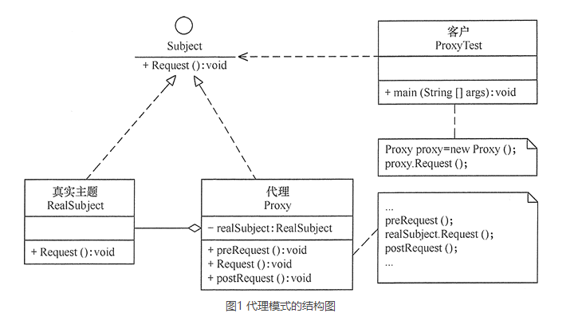

#### 动态代理

利用JDK动态代理类通过接口创建代理类

```java
//接口
interface Subject{
    void func1();
    String func2(String str);
}
//被代理对象
public class RealSubject implements Subject{
    @Override
    public void func1(){
        ...
    }
    @Override
    public String func2(String str){
        ...
    }
}
//动态代理类
public class DynamicProxyHandler implements InvocationHandler {
	//被代理对象
    private Object object;

    public DynamicProxyHandler(final Object object) {
        this.object = object;
    }
    /**
    * @return 代理类对象
    */
	public Object newProxyInstance(){
        /**
        * @param ClassLoader 被代理对象使用的类加载器
        * @param Class<?>[] 被代理对象实现的接口的类型,使用泛型方式确认类型
        * @param InvocationHandler 指定动态处理器，执行目标对象的方法时,会触发事件处理器的方法
        */
        Object result = Proxy.newProxyInstance(target.getClass().getClassLoader(),target.getClass().getInterfaces(), this);
        return result;
    }
    /** 
    * 执行被代理对象的任何接口方法都会经过该方法 
    * @param proxy 代理对象的引用 
    * @param method 代理对象当前执行的方法 
    * @param args 代理对象当前执行方法所需的参数 
    * @return 和被代理对象方法有相同的返回值 
    * @throws Throwable */
    @Override
    public Object invoke(Object proxy, Method method, Object[] args) throws Throwable {
        Object result = null;
        try{
            //方法调用前的逻辑处理
            result = method.invoke(object, args);
            //方法调用后的逻辑处理
        }catch (Exception e){
            e.printTranstack();
            throw e;
        }
        return result;
    } 
}
```

动态代理实际上也是由字节码来生成一个代理类（保存在内存中）

==public final class $Proxy0 extends Proxy implements Subject 通过生成的代理类对象可以看出，该类已经继承了JDK的Proxy类，所以不能再继承其他类，所以必须通过实现接口来完成代理==

```java
class Proxy{
    protected InvocationHandler h;
    ...
    protected Proxy(InvocationHandler h){
        Objects.requireNonNull(h);
        this.h = h;
    }
    ...
}

//真正生成的代理类
public final class $Proxy0 extends Proxy implements Subject {
    private static Method m1;
	private static Method m2;
    private static Method m3;
	private static Method m4;
	private static Method m5;
 
    public $Proxy0(InvocationHandler handler) {
    	super(paramInvocationHandler);
    }

    public final boolean equals(Object paramObject)
    {
        try
        {
            //this将代理对象传入到了方法中
            return ((Boolean)this.h.invoke(this, m3, new Object[] { paramObject })).booleanValue();
        }
        catch (Error|RuntimeException localError)
        {
            throw localError;
        }
        catch (Throwable localThrowable)
        {
            throw new UndeclaredThrowableException(localThrowable);
        }
    }
    ...
    public final void func1(String var1) throws  {        
        try {            
            super.h.invoke(this, m1, new Object[]{var1, var2});                                                            
        } catch (RuntimeException | Error var4) {            
            throw var4;
        } catch (Throwable var5) {           
            throw new UndeclaredThrowableException(var5);
        }
    }
    
    //这个静态块本来是在最后的，我把它拿到前面来，方便描述
    static
    {
        try
        {
            m1 = Class.forName("com.cn.proxy.Subject").getMethod("func1", new Class[0]);
            m2 = Class.forName("com.cn.proxy.Subject").getMethod("func2", new Class[0]{Class.forName("java.lang.String")});
            m3 = Class.forName("java.lang.Object").getMethod("equals", new Class[] { Class.forName("java.lang.Object") });
            m4 = Class.forName("java.lang.Object").getMethod("toString", new Class[0]);
            m5 = Class.forName("java.lang.Object").getMethod("hashCode", new Class[0]);
            return ;
        }
        catch (NoSuchMethodException localNoSuchMethodException)
        {
            throw new NoSuchMethodError(localNoSuchMethodException.getMessage());
        }
        catch (ClassNotFoundException localClassNotFoundException)
        {
            throw new NoClassDefFoundError(localClassNotFoundException.getMessage());
        }
    }
}

```


#### Cglib代理

通过字节码技术为一个类创建子类，并在子类中采用**方法拦截的技术**拦截所有父类方法的调用，顺势织入横切逻辑。因为采用的是**继承**，所以不能对final修饰的类进行代理。

cglib 是基于asm 字节修改技术。导入 cglib 会间接导入 asm, ant, ant-launcher 三个jar 包。

Spring框架的spring-core.jar包中已经集成了cglib与asm。

```xml
<!-- cglib 动态代理依赖 begin -->
<dependency>
    <groupId>cglib</groupId>
    <artifactId>cglib</artifactId>
    <version>3.2.5</version>
</dependency><!-- cglib 动态代理依赖 stop -->
```


```java
//被代理对象
public class Subject{
    public void func(){
        ...
    }
}
//Cglib代理类
public class CglibMethodInterceptor implements MethodInterceptor {    
    /**
    * 用于生成 Cglib 动态代理类工具方法
    * @param target 代表需要 被代理的 委托类的 Class 对象
    * @return 代理类对象
    */
    public Object CglibProxyGeneratory(Class target) {
        // 创建加强器，用来创建动态代理类
        Enhancer enhancer = new Enhancer();        
        // 为代理类指定需要代理的类，也即是父类
        enhancer.setSuperclass(target);        
        // 设置方法拦截器回调引用，对于代理类上所有方法的调用，都会调用CallBack，而Callback则需要实现intercept() 方法进行拦截
        enhancer.setCallback(this);        
        // 获取动态代理类对象并返回
        return enhancer.create();
    }    
    /**
    * @param obj    代理类对象
    * @param method 被代理类方法
    * @param args   方法参数
    * @param proxy  代理类方法
    * @return 方法返回结果
    * @throws Throwable
    */
    @Override
    public Object intercept(Object obj, Method method, Object[] args, MethodProxy proxy) throws Throwable {
        //方法调用前的逻辑处理
        //注意这里的写法，使用被代理类来执行父类方法
        Object result = proxy.invokeSuper(obj, args);
        //方法调用后的逻辑处理   
        return result;
    }
}
```


```java
//真正生成代理类
public class Subject$$EnhancerByCGLIB$$be45efdd extends HelloService implements Factory {
    ...  
    private MethodInterceptor CGLIB$CALLBACK_0;
    private static final Method CGLIB$func$0$Method;
    private static final MethodProxy CGLIB$func$0$Proxy;
    ...
    
    static void CGLIB$STATICHOOK1() {
        ...
        Class var0 = Class.forName("com.jpeony.spring.proxy.cglib.HelloService$$EnhancerByCGLIB$$be45efdd");
        Class var1;
        CGLIB$sayHello$0$Method = ReflectUtils.findMethods(new String[]{"func", "()V"}, (var1 = Class.forName("com.cn.proxy.Subject")).getDeclaredMethods())[0];
        CGLIB$func$0$Proxy = MethodProxy.create(var1, var0, "()V", "func", "CGLIB$func$0");
    }
    
     final void CGLIB$sayHello$0() {
        super.sayHello();
    }
 
    public final void sayHello() {
        MethodInterceptor var10000 = this.CGLIB$CALLBACK_0;
        if (var10000 == null) {
            CGLIB$BIND_CALLBACKS(this);
            var10000 = this.CGLIB$CALLBACK_0;
        }
 
        if (var10000 != null) {
            var10000.intercept(this, CGLIB$func$0$Method, CGLIB$emptyArgs, CGLIB$sayHello$0$Proxy);
        } else {
            super.sayHello();
        }
    }
    ...
}
```

**为什么intercept中不能使用method.invoke(obj,args)**

这种方式是无法调用到父类的方法的，子类有方法重写，隐藏了父类的方法，父类的方法已经不可见，如果硬调arg1.invoke(arg0, ...)很明显会死循环。

**使用proxy.invokeSuper(obj,args)原理**

cglib采用了fastclass机制，不仅巧妙的避开了调不到父类方法的问题，还加速了方法的调用。

fastclass基本原理是，给每个方法编号，通过编号找到方法执行避免了通过反射调用。

#### 动态代理和Cglib的区别

- jdk创建对象的速度远大于cglib，这是由于cglib创建对象时需要操作字节码。
- cglib执行速度略大于jdk，所以比较适合单例模式。
- 由于CGLIB的大部分类是直接对Java字节码进行操作，这样生成的类会在Java的永久堆中。如果动态代理操作过多，容易造成永久堆满，触发OutOfMemory异常。spring默认使用jdk动态代理，如果类没有接口，则使用cglib。


### 适配器模式

将一个类的接口转换成客户希望的另外一个接口，使得原本由于接口不兼容而不能一起工作的那些类能一起工作。

**适配器模式分类**

- 类结构型模式，java没有多继承，所以只能继承和实现结合使用

  ```java
  package adapter;
  //目标接口
  interface Target
  {
      public void request();
  }
  //适配者接口
  class Adaptee
  {
      public void specificRequest()
      {       
          System.out.println("适配者中的业务代码被调用！");
      }
  }
  //类适配器类
  class ClassAdapter extends Adaptee implements Target
  {
      public void request()
      {
          specificRequest();
      }
  }
  //客户端代码
  public class ClassAdapterTest
  {
      public static void main(String[] args)
      {
          System.out.println("类适配器模式测试：");
          Target target = new ClassAdapter();
          target.request();
      }
  }
  ```

  

- 对象结构型模式，推荐使用

  ```java
  package adapter;
  //对象适配器类
  class ObjectAdapter implements Target
  {
      private Adaptee adaptee;
      public ObjectAdapter(Adaptee adaptee)
      {
          this.adaptee=adaptee;
      }
      public void request()
      {
          adaptee.specificRequest();
      }
  }
  //客户端代码
  public class ObjectAdapterTest
  {
      public static void main(String[] args)
      {
          System.out.println("对象适配器模式测试：");
          Adaptee adaptee = new Adaptee();
          Target target = new ObjectAdapter(adaptee);
          target.request();
      }
  }
  ```


### 桥接模式

将抽象与实现分离，使它们可以独立变化。它是用**组合关系**代替继承关系来实现，从而降低了抽象和实现这两个可变维度的耦合度。

当某个类存在多个维度变化时，如果全部使用继承，则会有n*m种子类，使用组合方式来实现，则只会有n+m个子类

**示例**

包按用途分为钱包（Wallet）和挎包（HandBag），按颜色分为黄色（Yellow）和红色（Red）


### 装饰模式

在不改变现有对象结构的情况下，动态地给该对象增加一些职责（即增加其额外功能）的模式，它属于对象结构型模式。（感觉和静态代理模式很像）

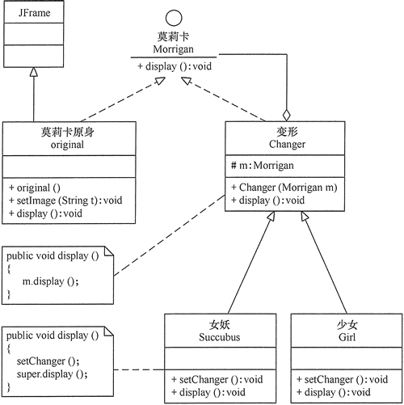


### 外观模式

一种通过为多个复杂的子系统提供一个统一的接口，而使这些子系统更加容易被访问的模式。


**优点**

- 降低了子系统与客户端之间的耦合度，使得子系统的变化不会影响调用它的客户类
- 对客户屏蔽了子系统组件，减少了客户处理的对象数目，并使得子系统使用起来更加容易。
- 降低了大型软件系统中的编译依赖性，简化了系统在不同平台之间的移植过程，因为编译一个子系统不会影响其他的子系统，也不会影响外观对象

**缺点**

- 不能很好地限制客户使用子系统类。
- 增加新的子系统可能需要修改外观类或客户端的源代码，违背了“开闭原则”。

**示例**

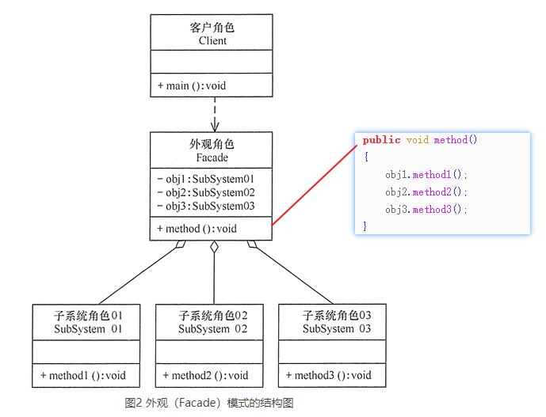


### 享元模式

通过缓存对象来大幅度减少需要创建的对象数量，从而提高系统资源的利用率。

**享元模式的主要角色**

1. 抽象享元角色（Flyweight）

   是所有的具体享元类的基类，为具体享元规范需要实现的公共接口，非享元的外部状态以参数的形式通过方法传入。

2. 具体享元（Concrete Flyweight）角色

   可共享的角色，需实现抽象享元角色中所规定的接口。

   ==如果只有一个种类，但是由于参数不同而产生不同对象的享元角色，其实并不需要构建抽象享元角色，如java基本数据类型包装类的缓存，只是值不同，就不需要构建抽象类；还有连接池和线程池==

   - Byte, Short, Long 缓存的范围都是 -128~127
   - Character 缓存的范围是 0~127
   - Integer的默认范围是 -128~127
     最小值不能变
     但最大值可以通过调整虚拟机参数 `
     -Djava.lang.Integer.IntegerCache.high` 来改变
   - Boolean 缓存了 TRUE 和 FALSE  

3. 非可共享享元（Unsharable Flyweight)角色

   是**不可以共享**的外部状态，它以参数的形式注入具体享元的相关方法中。

4. 享元工厂（Flyweight Factory）角色

   负责创建和管理（缓存）享元角色。当客户对象请求一个享元对象时，享元工厂检査系统中是否存在符合要求的享元对象，如果存在则提供给客户；如果不存在的话，则创建一个新的享元对象。

**示例**

棋子，作为**抽象享元角色**，分为白子和黑子，白子和黑子对象可以作为可共享对象，充当**具体享元角色**，棋子的坐标由于一直变化，所以是不可共享对象，作为**参数传入**

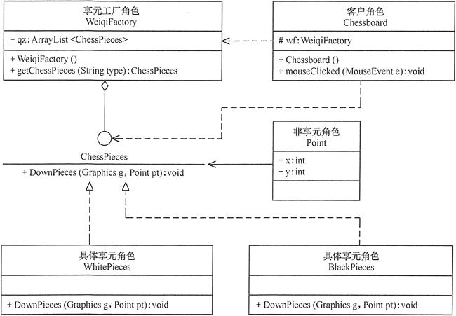


### 组合模式

又叫作**部分-整体**模式，它是一种将对象组合成树状的层次结构的模式，用来表示“部分-整体”的关系，使用户对单个对象和组合对象具有一致的访问性。

对于组合模式而言，在安全性和透明性上，==会更看重透明性==，毕竟组合模式的功能就是要让用户对叶子对象和组合对象的使用具有一致性。

#### 透明式的组合模式

抽象构件声明了所有子类中的全部方法，所以客户端无须区别树叶对象和树枝（容器）对象，对客户端来说是透明的。

**缺点**

树叶构件本来没有 Add()、Remove() 及 GetChild() 方法，却要实现它们（空实现或抛异常）


**示例**


```java
public class CompositePattern
{
    public static void main(String[] args)
    {
        Component branch1=new Branch(); 
        Component branch2=new Branch(); 
        Component leaf1=new Leaf("1"); 
        Component leaf2=new Leaf("2"); 
        Component leaf3=new Leaf("3");          
        branch1.add(leaf1); 
        branch1.add(branch2);
        branch2.add(leaf2); 
        branch2.add(leaf3);          
        branch1.operation(); 
    }
}
//抽象构件
abstract class Component
{
    public void add(Component c){ }
    public void remove(Component c){ }
    public Component getChild(int i){
        return null;
    }
    public abstract void operation();
}
//树叶构件
class Leaf implements Component
{
    private String name;
    public Leaf(String name)
    {
        this.name=name;
    }
    @Override
    public void operation()
    {
        System.out.println("树叶"+name+"：被访问！"); 
    }
}
//树枝构件
class Branch implements Component
{
    private ArrayList<Component> children=new ArrayList<Component>();
    @Override
    public void add(Component c)
    {
        children.add(c);
    }
    @Override
    public void remove(Component c)
    {
        children.remove(c);
    }
    @Override
    public Component getChild(int i)
    {
        return children.get(i);
    }
    @Override
    public void operation()
    {
        for(Object obj:children)
        {
            ((Component)obj).operation();
        }
    }    
}
```


#### 安全式的组合模式

将管理子构件的方法移到树枝构件中，抽象构件和树叶构件没有对子对象的管理方法，这样就避免了上一种方式的安全性问题。

**缺点**

由于叶子和分支有不同的接口，客户端在调用时要知道树叶对象和树枝对象的存在，所以失去了透明性。


**示例**

```java
/*
李先生到韶关“天街e角”生活用品店购物
用 1 个红色小袋子装了 2 包婺源特产（单价 7.9 元）、1 张婺源地图（单价 9.9 元）；
用 1 个白色小袋子装了 2 包韶关香藉（单价 68 元）和 3 包韶关红茶（单价 180 元）；
用 1 个中袋子装了前面的红色小袋子和 1 个景德镇瓷器（单价 380 元）；
用 1 个大袋子装了前面的中袋子、白色小袋子和 1 双李宁牌运动鞋（单价 198 元）。
最后“大袋子”中的内容有：
{
	1 双李宁牌运动鞋（单价 198 元）、
	白色小袋子{
		2 包韶关香菇（单价 68 元）、

		3 包韶关红茶（单价 180 元）
	}、
	中袋子{
		1 个景德镇瓷器（单价 380 元）、
		红色小袋子{
			2 包婺源特产（单价 7.9 元）、
			1 张婺源地图（单价 9.9 元）
		}
	}
}，现在要求编程显示李先生放在大袋子中的所有商品信息并计算要支付的总价。
*/
public class ShoppingTest
{
    public static void main(String[] args)
    {
        float s=0;
        Bags BigBag,mediumBag,smallRedBag,smallWhiteBag;
        Goods sp;
        BigBag=new Bags("大袋子");
        mediumBag=new Bags("中袋子");
        smallRedBag=new Bags("红色小袋子");
        smallWhiteBag=new Bags("白色小袋子");               
        sp=new Goods("婺源特产",2,7.9f);
        smallRedBag.add(sp);
        sp=new Goods("婺源地图",1,9.9f);
        smallRedBag.add(sp);       
        sp=new Goods("韶关香菇",2,68);
        smallWhiteBag.add(sp);
        sp=new Goods("韶关红茶",3,180);
        smallWhiteBag.add(sp);       
        sp=new Goods("景德镇瓷器",1,380);
        mediumBag.add(sp);
        mediumBag.add(smallRedBag);       
        sp=new Goods("李宁牌运动鞋",1,198);
        BigBag.add(sp);
        BigBag.add(smallWhiteBag);
        BigBag.add(mediumBag);
        System.out.println("您选购的商品有：");
        BigBag.show();
        s=BigBag.calculation();       
        System.out.println("要支付的总价是："+s+"元");
    }
}
//抽象构件：物品
interface Articles
{
    public float calculation(); //计算
    public void show();
}
//树叶构件：商品
class Goods implements Articles
{
    private String name;     //名字
    private int quantity;    //数量
    private float unitPrice; //单价
    public Goods(String name,int quantity,float unitPrice)
    {
        this.name=name;
        this.quantity=quantity;
        this.unitPrice=unitPrice;
    }   
    public float calculation()
    {
        return quantity*unitPrice; 
    }
    public void show()
    {
        System.out.println(name+"(数量："+quantity+"，单价："+unitPrice+"元)");
    }
}
//树枝构件：袋子
class Bags implements Articles
{
    private String name;     //名字   
    private ArrayList<Articles> bags=new ArrayList<Articles>();   
    public Bags(String name)
    {
        this.name=name;       
    }
    public void add(Articles c)
    {
        bags.add(c);
    }   
    public void remove(Articles c)
    {
        bags.remove(c);
    }   
    public Articles getChild(int i)
    {
        return bags.get(i);
    }   
    public float calculation()
    {
        float s=0;
        for(Object obj:bags)
        {
            s+=((Articles)obj).calculation();
        }
        return s;
    }
    public void show()
    {
        for(Object obj:bags)
        {
            ((Articles)obj).show();
        }
    }
}
```


#### 组合模式扩展

对树叶和树枝进行抽象，然后继承得到不同的树叶和树枝

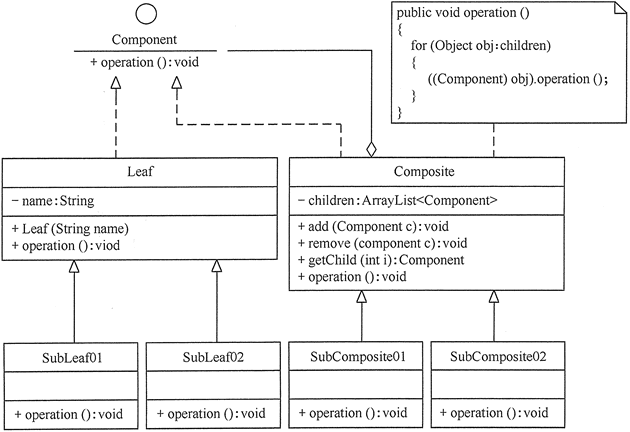


## 行为型模式(11种)

行为型模式用于描述程序在运行时复杂的**流程控制**，即描述多个类或对象之间怎样**相互协作**共同完成单个对象都无法单独完成的任务，它**涉及算法与对象间职责的分配**。

分为**类行为模式**和**对象行为模式**，前者采用**继承机制**来在类间分派行为，后者采用**组合或聚合**在对象间分配行为。


### 模板方法

定义一个操作中的算法骨架，而将算法的一些步骤延迟到子类中，使得子类可以不改变该算法结构的情况下重定义该算法的某些特定步骤。

抽象类中方法类型

- 抽象方法：在抽象类中申明，由具体子类实现。
- 具体方法：在抽象类中已经实现，在具体子类中可以继承或重写它。
- 钩子方法：在抽象类中已经实现，表示默认方式，但是子类也可以重写，表示自定义方法


**示例**

```java
package templateMethod;
public class TemplateMethodPattern
{
    public static void main(String[] args)
    {
        AbstractClass tm=new ConcreteClass();
        tm.TemplateMethod();
    }
}
//抽象类
abstract class AbstractClass
{
    public final void TemplateMethod() //为防止恶意操作，一般模板方法都加上 final 关键词
    {
        SpecificMethod();
        abstractMethod1();          
        abstractMethod2();
    }  
    public void SpecificMethod() //具体方法
    {
        System.out.println("抽象类中的具体方法被调用...");
    }   
    public abstract void abstractMethod1(); //抽象方法1
    public abstract void abstractMethod2(); //抽象方法2
}
//具体子类
class ConcreteClass extends AbstractClass
{
    public void abstractMethod1()
    {
        System.out.println("抽象方法1的实现被调用...");
    }   
    public void abstractMethod2()
    {
        System.out.println("抽象方法2的实现被调用...");
    }
}
```


### 策略模式

该模式定义了一系列算法，并将每个算法封装起来，使它们可以相互替换，且算法的变化不会影响使用算法的客户。

策略模式属于**对象行为模式**，它通过对算法进行封装，把使用算法的责任和算法的实现分割开来，并委派给不同的对象对这些算法进行管理。

**策略模式的主要角色**

1. 抽象策略（Strategy）类

   定义了一个公共接口，各种不同的算法以不同的方式实现这个接口，环境角色使用这个接口调用不同的算法，一般使用接口或抽象类实现。

2. 具体策略（Concrete Strategy）类

   实现了抽象策略定义的接口，提供具体的算法实现。

3. 环境（Context）类

   持有一个策略类的引用，最终给客户端调用。


**示例**


#### 策略工厂模式

当需要频繁切换策略时，可以使用策略工厂模式来缓存策略对象，减少生成对象的时间

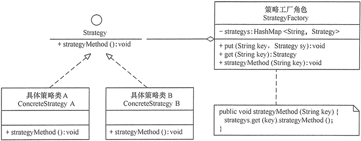


### 命令模式

将一个请求封装为一个对象，使发出请求的责任和执行请求的责任分割开。这样两者之间通过命令对象进行沟通，这样方便对**命令对象**进行储存、传递、调用、增加与管理（日志记录）。

**示例**


```java
package command;
public class CommandPattern
{
    public static void main(String[] args)
    {
        Command cmd=new ConcreteCommand();
        Invoker invoker=new Invoker();
        invoker.setCommand(cmd);
        System.out.println("客户访问调用者的call()方法...");
        ir.call();
    }
}
//调用者
class Invoker
{
    private Command command;
    public Invoker(){
    }
    public void setCommand(Command command)
    {
        this.command=command;
    }
    public void call()
    {
        System.out.println("调用者执行命令command...");
        command.execute();
    }
}
//抽象命令
interface Command
{
    public abstract void execute();
}
//具体命令
class ConcreteCommand implements Command
{
    private Receiver receiver;
    ConcreteCommand()
    {
        receiver=new Receiver();
    }
    public void execute()
    {
        receiver.action();
    }
}
//接收者
class Receiver
{
    public void action()
    {
        System.out.println("接收者的action()方法被调用...");
    }
}
```


#### 宏命令模式

也叫组合命令模式，将命令模式与组合模式联合使用。宏命令包含了一组命令，它充当了具体命令与调用者的双重角色，执行它时将递归调用它所包含的所有命令

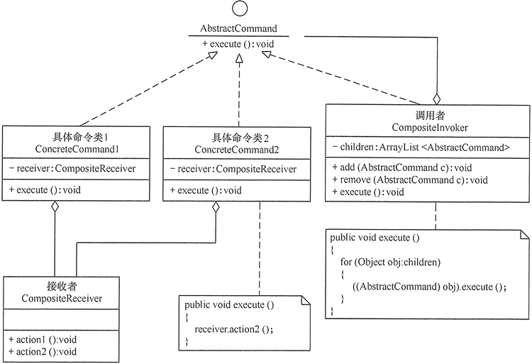

```java
public class CompositeCommandPattern
{
    public static void main(String[] args)
    {
        AbstractCommand cmd1=new ConcreteCommand1();
        AbstractCommand cmd2=new ConcreteCommand2();
        CompositeInvoker ir=new CompositeInvoker();
        ir.add(cmd1);
        ir.add(cmd2);
        System.out.println("客户访问调用者的execute()方法...");
        ir.execute();
    }
}
//抽象命令
interface AbstractCommand
{
    public abstract void execute();
}
//树叶构件: 具体命令1
class ConcreteCommand1 implements AbstractCommand
{
    private CompositeReceiver receiver;
    ConcreteCommand1()
    {
        receiver=new CompositeReceiver();
    }
    public void execute()
    {       
        receiver.action1();
    }
}
//树叶构件: 具体命令2
class ConcreteCommand2 implements AbstractCommand
{
    private CompositeReceiver receiver;
    ConcreteCommand2()
    {
        receiver=new CompositeReceiver();
    }
    public void execute()
    {       
        receiver.action2();
    }
}
//树枝构件: 调用者
class CompositeInvoker implements AbstractCommand
{
    private ArrayList<AbstractCommand> children = new ArrayList<AbstractCommand>();   
    public void add(AbstractCommand c)
    {
        children.add(c);
    }   
    public void remove(AbstractCommand c)
    {
        children.remove(c);
    }   
    public AbstractCommand getChild(int i)
    {
        return children.get(i);
    }   
    public void execute()
    {
        for(Object obj:children)
        {
            ((AbstractCommand)obj).execute();
        }
    }    
}
//接收者
class CompositeReceiver
{
    public void action1()
    {
        System.out.println("接收者的action1()方法被调用...");
    }
    public void action2()
    {
        System.out.println("接收者的action2()方法被调用...");
    }
}
```


### 责任链模式

为了避免请求发送者与多个请求处理者耦合在一起，将所有请求的处理者通过前一对象记住其下一个对象的引用而连成一条链；当有请求发生时，可将请求沿着这条链传递，直到有对象处理它为止。

**职责链模式主要包含以下角色**

1. 抽象处理者（Handler）角色

   定义一个处理请求的接口，包含抽象处理方法和一个后继连接。

2. 具体处理者（Concrete Handler）角色

   实现抽象处理者的处理方法，判断能否处理本次请求，如果可以处理请求则处理，否则将该请求转给它的后继者。

3. 客户类（Client）角色

   创建处理链，并向链头的具体处理者对象提交请求，它不关心处理细节和请求的传递过程


**示例**

规定学生请假小于或等于 2 天，班主任可以批准；小于或等于 7 天，系主任可以批准；小于或等于 10 天，院长可以批准；其他情况不予批准；

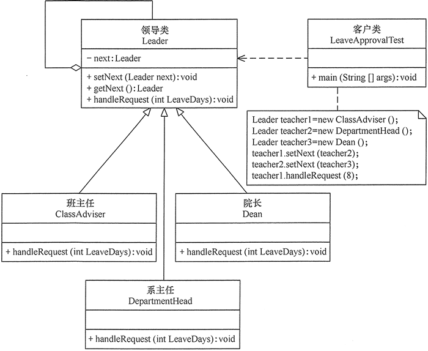

```java
public class LeaveApprovalTest
{
    public static void main(String[] args)
    {
        //组装责任链 
        Leader teacher1=new ClassAdviser();
        Leader teacher2=new DepartmentHead();
        Leader teacher3=new Dean();
        //Leader teacher4=new DeanOfStudies();
        teacher1.setNext(teacher2);
        teacher2.setNext(teacher3);
        //teacher3.setNext(teacher4);
        //提交请求 
        teacher1.handleRequest(8);
    }
}
//抽象处理者：领导类
abstract class Teacher
{
    private Leader next;
    public void setNext(Leader next)
    {
        this.next=next; 
    }
    public Leader getNext()
    { 
        return next; 
    }   
    //处理请求的方法
    public abstract void handleRequest(int LeaveDays);       
}
//具体处理者1：班主任类
class ClassAdviser extends Teacher
{
    public void handleRequest(int LeaveDays)
    {
        if(LeaveDays<=2) 
        {
            System.out.println("班主任批准您请假" + LeaveDays + "天。");       
        }
        else
        {
            if(getNext() != null) 
            {
                getNext().handleRequest(LeaveDays);             
            }
            else
            {
                  System.out.println("请假天数太多，没有人批准该假条！");
            }
        } 
    } 
}
//具体处理者2：系主任类
class DepartmentHead extends Teacher
{
    public void handleRequest(int LeaveDays)
    {
        if(LeaveDays<=7) 
        {
            System.out.println("系主任批准您请假" + LeaveDays + "天。");       
        }
        else
        {
            if(getNext() != null) 
            {
                  getNext().handleRequest(LeaveDays);             
            }
            else
            {
                System.out.println("请假天数太多，没有人批准该假条！");
           }
        } 
    } 
}
//具体处理者3：院长类
class Dean extends Teacher
{
    public void handleRequest(int LeaveDays)
    {
        if(LeaveDays<=10) 
        {
            System.out.println("院长批准您请假" + LeaveDays + "天。");       
        }
        else
        {
              if(getNext() != null) 
            {
                getNext().handleRequest(LeaveDays);             
            }
            else
            {
                  System.out.println("请假天数太多，没有人批准该假条！");
            }
        } 
    } 
}
//具体处理者4：教务处长类
class DeanOfStudies extends Teacher
{
    public void handleRequest(int LeaveDays)
    {
        if(LeaveDays<=20) 
        {
            System.out.println("教务处长批准您请假"+LeaveDays+"天。");       
        }
        else
        {
              if(getNext()!=null) 
            {
                getNext().handleRequest(LeaveDays);          
            }
            else
            {
                  System.out.println("请假天数太多，没有人批准该假条！");
            }
        } 
    } 
}
```


### 状态模式

有些对象可能会根据不同的情况做出不同的行为，我们把这种对象称为有状态的对象，而把影响对象行为的一个或多个动态变化的属性称为状态。

状态（State）模式的定义：对有状态的对象，把复杂的“判断逻辑”提取到不同的状态对象中，允许状态对象在其内部状态发生改变时改变其行为。

**状态模式包含以下主要角色**

1. 环境（Context）角色

   也称为上下文，它定义了客户感兴趣的接口，维护一个当前状态，并将与状态相关的操作委托给当前状态对象来处理。

2. 抽象状态（State）角色

   定义一个接口，用以封装环境对象中的特定状态所对应的行为。

3. 具体状态（Concrete  State）角色

   实现抽象状态所对应的行为。

**示例**


```java
package state;
public class StatePatternClient
{
    public static void main(String[] args)
    {       
        Context context=new Context();    //创建环境       
        context.Handle();    //处理请求
        context.Handle();
        context.Handle();
        context.Handle();
    }
}
//环境类
class Context
{
    private State state;
    //定义环境类的初始状态
    public Context()
    {
        this.state=new ConcreteStateA();
    }
    //设置新状态
    public void setState(State state)
    {
        this.state=state;
    }
    //读取状态
    public State getState()
    {
        return(state);
    }
    //对请求做处理
    public void Handle()
    {
        state.Handle(this);
    }
}
//抽象状态类
abstract class State
{
    public abstract void Handle(Context context);
}
//具体状态A类
class ConcreteStateA extends State
{
    public void Handle(Context context)
    {
        //A状态下的逻辑
        //A状态-->B状态
        context.setState(new ConcreteStateB());
    }
}
//具体状态B类
class ConcreteStateB extends State
{
    public void Handle(Context context)
    {
        //B状态下的执行逻辑
        //B状态-->A状态
        context.setState(new ConcreteStateA());
    }
}
```

#### 享元状态模式

当状态较多时，结合享元模式来缓存状态对象

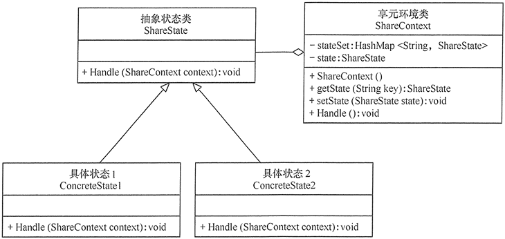


### 观察者模式

指多个对象间存在**一对多的依赖关系**，当一个对象的状态发生改变时，所有依赖于它的对象都得到通知并被**自动更新**。这种模式有时又称作**发布-订阅模式**、模型-视图模式，它是对象行为型模式。

**示例**


```java
public class ObserverPattern
{
    public static void main(String[] args)
    {
        Subject subject=new ConcreteSubject();
        Observer obs1=new ConcreteObserver1();
        Observer obs2=new ConcreteObserver2();
        subject.add(obs1);
        subject.add(obs2);
        subject.notifyObserver();
    }
}
//抽象目标
abstract class Subject
{
    protected List<Observer> observers=new ArrayList<Observer>();   
    //增加观察者方法
    public void add(Observer observer)
    {
        observers.add(observer);
    }    
    //删除观察者方法
    public void remove(Observer observer)
    {
        observers.remove(observer);
    }   
    public abstract void notifyObserver(); //通知观察者方法
}
//具体目标
class ConcreteSubject extends Subject
{
    public void notifyObserver()
    {
        System.out.println("具体目标发生改变...");
        System.out.println("--------------");       
       
        for(Observer obs:observers)
        {
            obs.response();
        }
       
    }          
}
//抽象观察者
interface Observer
{
    void response(); //反应
}
//具体观察者1
class ConcreteObserver1 implements Observer
{
    public void response()
    {
        System.out.println("具体观察者1作出反应！");
    }
}
//具体观察者1
class ConcreteObserver2 implements Observer
{
    public void response()
    {
        System.out.println("具体观察者2作出反应！");
    }
}
```


### 中介者模式

定义一个**中介对象**来封装一系列对象之间的交互，使原有对象之间的耦合松散，且可以独立地改变它们之间的交互。中介者模式又叫调停模式，它是迪米特法则的典型应用。

**和观察者模式区别**

观察者模式分为被观察者和观察者，由被观察者通知观察者

中介者模式每个对象即使观察者又是被观察者


**示例**


```java
//抽象中介者
abstract class Mediator
{
    public abstract void register(Colleague colleague);
    public abstract void relay(Colleague cl); //转发
}
//具体中介者
class ConcreteMediator extends Mediator
{
    private List<Colleague> colleagues=new ArrayList<Colleague>();
    public void register(Colleague colleague)
    {
        if(!colleagues.contains(colleague))
        {
            colleagues.add(colleague);
            colleague.setMedium(this);
        }
    }
    public void relay(Colleague cl)
    {
        for(Colleague ob:colleagues)
        {
            if(!ob.equals(cl))
            {
                ((Colleague)ob).receive();
            }   
        }
    }
}
//抽象同事类
abstract class Colleague
{
    protected Mediator mediator;
    public void setMedium(Mediator mediator)
    {
        this.mediator=mediator;
    }   
    public abstract void receive();   
    public abstract void send();
}
//具体同事类
class ConcreteColleague1 extends Colleague
{
    public void receive()
    {
        System.out.println("具体同事类1收到请求。");
    }   
    public void send()
    {
        System.out.println("具体同事类1发出请求。");
        mediator.relay(this); //请中介者转发
    }
}
//具体同事类
class ConcreteColleague2 extends Colleague
{
    public void receive()
    {
        System.out.println("具体同事类2收到请求。");
    }   
    public void send()
    {
        System.out.println("具体同事类2发出请求。");
        mediator.relay(this); //请中介者转发
    }
}
```


#### 简化中介者模式

1. 不定义中介者接口，把具体中介者对象实现成为单例。
2. 同事对象不持有中介者，而是在发消息时直接获取中介者对象并调用。

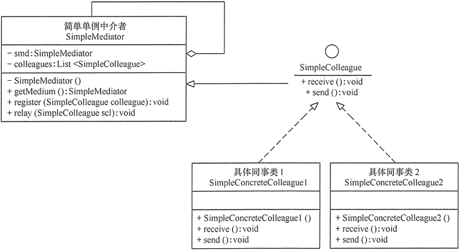


### 迭代器模式

提供一个对象来顺序访问聚合对象中的一系列数据，而不暴露聚合对象的内部表示。迭代器模式是一种对象行为型模式

**优点**

1. 访问一个聚合对象的内容而无须暴露它的内部表示。
2. 遍历任务交由迭代器完成，这简化了聚合类。
3. 它支持以不同方式遍历一个聚合，甚至可以自定义迭代器的子类以支持新的遍历。
4. 增加新的聚合类和迭代器类都很方便，无须修改原有代码。
5. 封装性良好，为遍历不同的聚合结构提供一个统一的接口

**示例**


```java
public class IteratorPattern
{
    public static void main(String[] args)
    {
        Aggregate ag=new ConcreteAggregate(); 
        ag.add("中山大学"); 
        ag.add("华南理工"); 
        ag.add("韶关学院");
        System.out.print("聚合的内容有：");
        Iterator it=ag.getIterator(); 
        while(it.hasNext())
        { 
            Object ob=it.next(); 
            System.out.print(ob.toString()+"\t"); 
        }
        Object ob=it.first();
        System.out.println("\nFirst："+ob.toString());
    }
}
//抽象聚合
interface Aggregate
{ 
    public void add(Object obj); 
    public void remove(Object obj); 
    public Iterator getIterator(); 
}
//具体聚合
class ConcreteAggregate implements Aggregate
{ 
    private List<Object> list=new ArrayList<Object>(); 
    public void add(Object obj)
    { 
        list.add(obj); 
    }
    public void remove(Object obj)
    { 
        list.remove(obj); 
    }
    public Iterator getIterator()
    { 
        return(new ConcreteIterator(list)); 
    }     
}
//抽象迭代器
interface Iterator
{
    Object first();
    Object next();
    boolean hasNext();
}
//具体迭代器
class ConcreteIterator implements Iterator
{ 
    private List<Object> list=null; 
    private int index=-1; 
    public ConcreteIterator(List<Object> list)
    { 
        this.list=list; 
    } 
    public boolean hasNext()
    { 
        if(index<list.size()-1)
        { 
            return true;
        }
        else
        {
            return false;
        }
    }
    public Object first()
    {
        index=0;
        Object obj=list.get(index);
        return obj;
    }
    public Object next()
    { 
        Object obj=null; 
        if(this.hasNext())
        { 
            obj=list.get(++index); 
        } 
        return obj; 
    }   
}
```


#### 迭代器模式扩展

将迭代器模式和组合模式结合，实现对组合模式构成的树的遍历。迭代器存放在树枝组件中

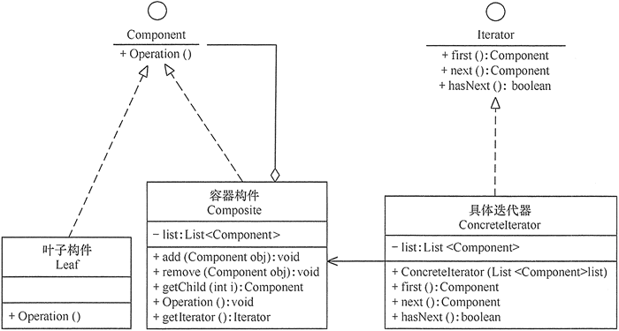


### 访问者模式

有些集合对象中存在多种不同的元素，且每种元素也存在多种不同的访问者和处理方式。

访问者（Visitor）模式就是将作用于某种数据结构中的**各元素的操作分离出来封装成独立的类**，使其在**不改变数据结构的前提**下可以添加作用于这些元素的新的操作，为数据结构中的**每个元素提供多种访问方式**。它将对数据的操作与数据结构进行分离，是行为类模式中最复杂的一种模式。

**示例**


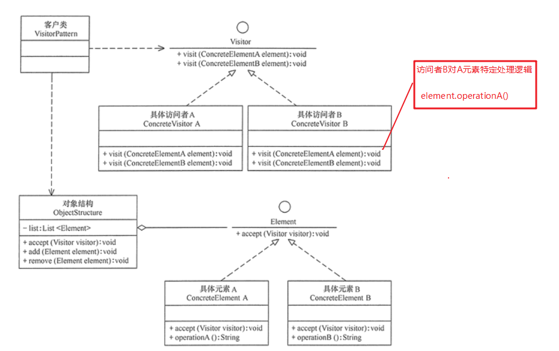

```java
public class VisitorPattern
{
    public static void main(String[] args)
    {
        ObjectStructure os=new ObjectStructure();
        os.add(new ConcreteElementA());
        os.add(new ConcreteElementB());
        Visitor visitor=new ConcreteVisitorA();
        os.accept(visitor);
        System.out.println("------------------------");
        visitor=new ConcreteVisitorB();
        os.accept(visitor);
    }
}
//抽象访问者
interface Visitor
{
    void visit(ConcreteElementA element);
    void visit(ConcreteElementB element);
}
//具体访问者A类
class ConcreteVisitorA implements Visitor
{
    public void visit(ConcreteElementA element)
    {
        System.out.println("具体访问者A访问-->"+element.operationA());
    }
    public void visit(ConcreteElementB element)
    {
        System.out.println("具体访问者A访问-->"+element.operationB());
    }
}
//具体访问者B类
class ConcreteVisitorB implements Visitor
{
    public void visit(ConcreteElementA element)
    {
        System.out.println("具体访问者B访问-->"+element.operationA());
    }
    public void visit(ConcreteElementB element)
    {
        System.out.println("具体访问者B访问-->"+element.operationB());
    }
}
//抽象元素类
interface Element
{
    void accept(Visitor visitor);
}
//具体元素A类
class ConcreteElementA implements Element
{
    public void accept(Visitor visitor)
    {
        visitor.visit(this);
    }
    public String operationA()
    {
        return "具体元素A的操作。";
    }
}
//具体元素B类
class ConcreteElementB implements Element
{
    public void accept(Visitor visitor)
    {
        visitor.visit(this);
    }
    public String operationB()
    {
        return "具体元素B的操作。";
    }
}
//对象结构角色
class ObjectStructure
{   
    private List<Element> list=new ArrayList<Element>();   
    public void accept(Visitor visitor)
    {
        //迭代器
        Iterator<Element> i=list.iterator();
        while(i.hasNext())
        {
            ((Element) i.next()).accept(visitor);
        }      
    }
    public void add(Element element)
    {
        list.add(element);
    }
    public void remove(Element element)
    {
        list.remove(element);
    }
}
```


#### 访问者模式扩展

**和迭代器模式联合**

当对象结构中的聚合类没有提供迭代器时，可以用迭代器模式自定义一个。

**和组合模式联合**

访问者（Visitor）模式中的“元素对象”可能是叶子对象或者是容器对象，如果元素对象包含容器对象，就必须用到组合模式

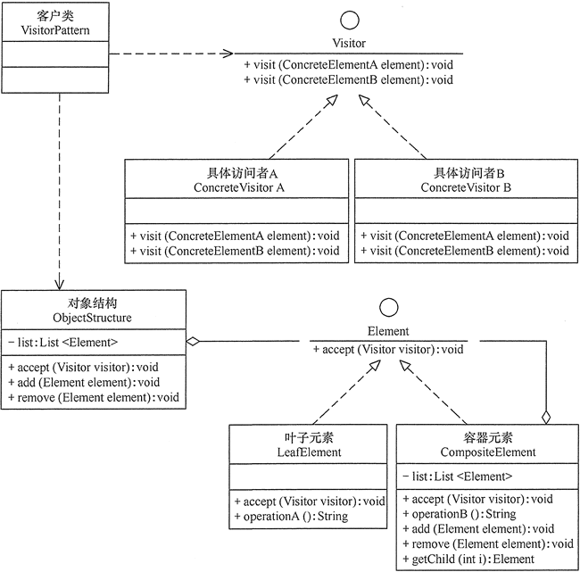


### 备忘录模式

在不破坏封装性的前提下，捕获一个对象的内部状态，并在该对象之外保存这个状态，以便以后当需要时能将该对象恢复到原先保存的状态。该模式又叫快照模式。

**主要角色**

1. 发起人（Originator）角色

   记录当前时刻的内部状态信息，提供**创建**备忘录和**恢复**备忘录数据的功能，实现其他业务功能，它可以**访问**备忘录里的所有信息。

2. 备忘录（Memento）角色

   负责**存储**发起人的内部状态，在需要的时候提供这些内部状态给发起人。

3. 管理者（Caretaker）角色

   对备忘录进行管理，提供**保存与获取**备忘录的功能，但其**不能对备忘录的内容进行访问与修改**。

```java
//备忘录
class Memento
{ 
    private String state;//State也可以单独作为一个类，里面可以维护一个版本号作为key
    public Memento(String state)
    { 
        this.state=state; 
    }
    public void setState(String state)
    { 
        this.state=state; 
    }
    public String getState()
    { 
        return state; 
    }
}
//发起者
class Originator
{ 
    private String state;
    //设置当前状态
    public void setState(String state)
    { 
        this.state=state; 
    }
    //显示当前状态
    public String getState()
    { 
        return state; 
    }
    //创建备忘录
    public Memento createMemento()
    { 
        return new Memento(state); 
    }
    //恢复，从备忘录中读取状态
    public void restoreMemento(Memento m)
    { 
        this.setState(m.getState()); 
    } 
}
//管理者
class Caretaker
{ 
    Map<String,Memento> mementos = new HashMap<>();
    //添加备忘录
    public void addMemento(String key,Memento memento)
    { 
        mementos.put(key,memento);
    }
    //获取指定备忘录
    public Memento getMemento(String key)
    { 
        return mementos.get(key); 
    }
}
```


#### 备忘录模式扩展

**备忘录模式和原型模式联合**

在备忘录模式中，备忘录就是用来保存发起人内部信息的类，如果**发起人内部所有信息都要被记录**，则可以直接使用**原型模式的clone方法**(浅拷贝)，来复制一个相同的类，然后**将该类作为备忘录**保存在管理者类中。

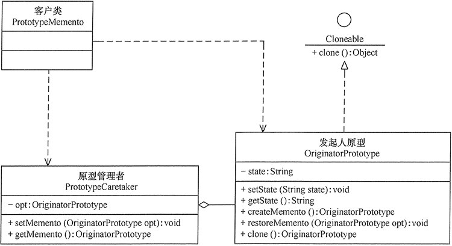


### 解释器模式

给分析对象定义一个语言，并定义该语言的文法表示，再设计一个解析器来解释语言中的句子

由于效率很低，不常用


**示例**

```java
/*文法规则
  <expression> ::= <city>的<person>
  <city> ::= 韶关|广州
  <person> ::= 老人|妇女|儿童
*/
public class InterpreterPatternDemo
{
    public static void main(String[] args)
    {
        Context bus=new Context();
        bus.freeRide("韶关的老人");
        bus.freeRide("韶关的年轻人");
        bus.freeRide("广州的妇女");
        bus.freeRide("广州的儿童");
        bus.freeRide("山东的儿童");
    }
}
//抽象表达式类
interface Expression
{
    public boolean interpret(String info);
}
//终结符表达式类
class TerminalExpression implements Expression
{
    private Set<String> set= new HashSet<String>();
    public TerminalExpression(String[] data)
    {
        for(int i=0;i<data.length;i++)set.add(data[i]);
    }
    public boolean interpret(String info)
    {
        if(set.contains(info))
        {
            return true;
        }
        return false;
    }
}
//非终结符表达式类
class AndExpression implements Expression
{
    private Expression city=null;    
    private Expression person=null;
    public AndExpression(Expression city,Expression person)
    {
        this.city=city;
        this.person=person;
    }
    public boolean interpret(String info)
    {
        String s[]=info.split("的");       
        return city.interpret(s[0])&&person.interpret(s[1]);
    }
}
//环境类
class Context
{
    private String[] citys={"韶关","广州"};
    private String[] persons={"老人","妇女","儿童"};
    private Expression cityPerson;
    public Context()
    {
        Expression city=new TerminalExpression(citys);
        Expression person=new TerminalExpression(persons);
        cityPerson=new AndExpression(city,person);
    }
    public void freeRide(String info)
    {
        boolean ok=cityPerson.interpret(info);
        if(ok) System.out.println("您是"+info+"，您本次乘车免费！");
        else System.out.println(info+"，您不是免费人员，本次乘车扣费2元！");   
    }
}
```


### Java 常用解析器

Java 提供了以下强大的数学公式解析器：Expression4J、MESP(Math Expression String Parser) 和 Jep (Java expression parser )等，它们可以解释一些复杂的文法，功能强大，使用简单。

**示例**

```java
//使用Jep
import com.singularsys.jep.*;
public class JepDemo
{
    public static void main(String[] args) throws JepException
    {
        Jep jep=new Jep();
        //定义要计算的数据表达式
        String 存款利息="本金*利率*时间";
        //给相关变量赋值
        jep.addVariable("本金",10000);
        jep.addVariable("利率",0.038);
        jep.addVariable("时间",2);
        jep.parse(存款利息);    //解析表达式
        Object accrual=jep.evaluate();    //计算
        System.out.println("存款利息："+accrual);
    }
}
```


# UML类图


## UML图分类

- 用例图
- 静态结构图：类图、对象图、包图、组件图、部署图
- 动态行为图：交互图（时序图与协作图）、状态图、活动图


## UML类图简介

用于描述系统中**类本身组成**和**类之间的各种静态关系**

**类本身组成**

在UML类图中，类使用包含**类名**、**属性(field)** 和**方法(method)** 且带有分割线的**矩形**来表示，比如下图表示一个Employee类，它包含name,age和email这3个属性，以及modifyInfo()方法。

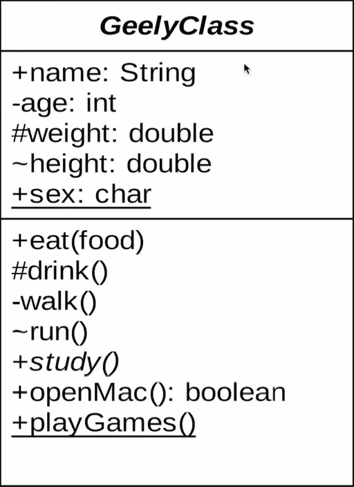

符号解释

```
-表示private  
#表示protected 
~表示default,也就是包权限  
_下划线表示static  
斜体表示抽象
```


**类之间的关系**

1. 依赖(下面几种其实都是特殊的依赖关系)
2. 泛化
3. 实现
4. 关联
5. 聚合
6. 组合


## 依赖

**介绍**

对于两个相对独立的对象，当一个对象负责构造另一个对象的实例，或者依赖另一个对象的服务时，这两个对象之间主要体现为依赖关系

**表示方法**

依赖关系用**虚线箭头**表示。

**示例**
动物依赖氧气和水。调用新陈代谢方法需要氧气类与水类的实例作为参数


## 泛化(继承)

**介绍**

继承表示是一个类（称为子类）继承另外的一个类（称为父类）的功能，并可以增加它自己的新功能的能力。

**表示方法**

继承使用**空心三角形+实线**表示。

**示例**

鸟类继承抽象类动物

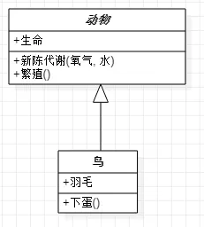


## 实现

**介绍**

实现表示一个class类实现interface接口（可以是多个）的功能。

**表示方法**

使用**空心三角形+虚线**表示

**示例**

大雁和飞机需要飞行，就要实现飞()接口

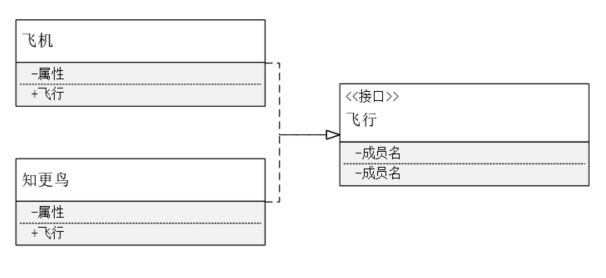


## 关联

**介绍**

对于两个相对独立的对象，当一个对象的实例与另一个对象的一些特定实例存在固定的对应关系时，这两个对象之间为关联关系

### 关联的性质

- 导航性
  - 单向关联
  - 双向关联
  - 自关联
- 多重性
  - “1”有且仅有一个
  - “0...”0个或多个
  - “0,1”0个或者1个
  - “n...m”范围[n,m]中的一个
  - “m...*”范围[m,+∞)中的一个

### 单向关联

**表示方法**

使用**带箭头的直线**表示

**示例**

每个顾客都有一个地址，这通过让Customer类持有一个类型为Address的成员变量类实现

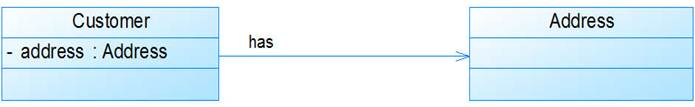

### 双向关联

**表示方法**

使用**不带箭头的直线**表示

**示例**

在Customer类中维护一个Product[]数组，表示一个顾客购买了那些产品；在Product类中维护一个Customer类型的成员变量表示这个产品被哪个顾客所购买

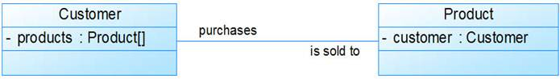

### 自关联

是一个特殊的单向关联

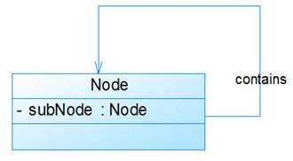


## 聚合

**介绍**

表示一种弱的‘拥有’关系，即has-a的关系，体现的是A对象可以包含B对象，但B对象不是A对象的一部分。 **两个对象具有各自的生命周期**。

**表示方法** 

聚合关系用**空心的菱形+实线箭头**表示。

**示例**

每一只大雁都属于一个大雁群，一个大雁群可以有多只大雁。当大雁死去后大雁群并不会消失，两个对象生命周期不同。

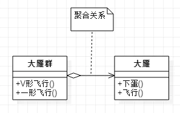


## 组合

**介绍**

组合是一种强的‘拥有’关系，是一种contains-a的关系，体现了严格的部分和整体关系，**部分和整体的生命周期一样**。

**表示方法**

组合关系用**实心的菱形+实线箭头**表示，还可以使用连线两端的数字表示某一端有几个实例。

**示例**

鸟和翅膀就是组合关系，因为它们是部分和整体的关系，并且翅膀和鸟的生命周期是相同的。

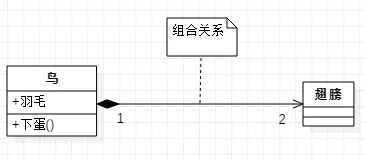