# Java

## 基础

[java集合框架](https://github.com/Snailclimb/JavaGuide/blob/master/docs/java/collection/Java%E9%9B%86%E5%90%88%E6%A1%86%E6%9E%B6%E5%B8%B8%E8%A7%81%E9%9D%A2%E8%AF%95%E9%A2%98.md)

Java中的容器都有哪些，各自特点如何

- `List`(对付顺序的好帮手)： 存储的元素是有序的、可重复的。
- `Set`(注重独一无二的性质): 存储的元素是无序的、不可重复的。
- `Map`(用 Key 来搜索的专家): 使用键值对（kye-value）存储，类似于数学上的函数 y=f(x)，“x”代表 key，"y"代表 value，Key 是无序的、不可重复的，value 是无序的、可重复的，每个键最多映射到一个值。

### List

- `Arraylist`： `Object[]`数组
- `Vector`：`Object[]`数组，线程安全
- `LinkedList`： 双向链表(JDK1.6 之前为循环链表，JDK1.7 取消了循环)

### Set

- `HashSet`（无序，唯一）: 基于 `HashMap` 实现的，底层采用 `HashMap` 来保存元素
- `LinkedHashSet`：`LinkedHashSet` 是 `HashSet` 的子类，并且其内部是通过 `LinkedHashMap` 来实现的。有点类似于我们之前说的 `LinkedHashMap` 其内部是基于 `HashMap` 实现一样，不过还是有一点点区别的
- `TreeSet`（有序，唯一）： 红黑树(自平衡的排序二叉树)

再来看看 `Map` 接口下面的集合。

### Map

- `HashMap`： JDK1.8 之前 HashMap 由数组+链表组成的，数组是 HashMap 的主体，链表则是主要为了解决哈希冲突而存在的（“拉链法”解决冲突）。JDK1.8 以后在解决哈希冲突时有了较大的变化，当链表长度大于阈值（默认为 8）（将链表转换成红黑树前会判断，如果当前数组的长度小于 64，那么会选择先进行数组扩容，而不是转换为红黑树）时，将链表转化为红黑树，以减少搜索时间
- `LinkedHashMap`： `LinkedHashMap` 继承自 `HashMap`，所以它的底层仍然是基于拉链式散列结构即由数组和链表或红黑树组成。另外，`LinkedHashMap` 在上面结构的基础上，增加了一条双向链表，使得上面的结构可以保持键值对的插入顺序。同时通过对链表进行相应的操作，实现了访问顺序相关逻辑。详细可以查看：[《LinkedHashMap 源码详细分析（JDK1.8）》](https://www.imooc.com/article/22931)
- `Hashtable`： 数组+链表组成的，数组是 HashMap 的主体，链表则是主要为了解决哈希冲突而存在的。线程安全
- `TreeMap`： 红黑树（自平衡的排序二叉树）

### 有哪些集合是线程不安全的？怎么解决呢？

我们常用的 `Arraylist` ,`LinkedList`,`Hashmap`,`HashSet`,`TreeSet`,`TreeMap`，`PriorityQueue` 都不是线程安全的。解决办法很简单，可以使用线程安全的集合来代替。

如果你要使用线程安全的集合的话， `java.util.concurrent` 包中提供了很多并发容器供你使用：

1. `ConcurrentHashMap`: 可以看作是线程安全的 `HashMap`，CAS
2. `CopyOnWriteArrayList`:可以看作是线程安全的 `ArrayList`，在读多写少的场合性能非常好，远远好于 `Vector`.ReentrantLock
3. `ConcurrentLinkedQueue`:高效的并发队列，使用链表实现。可以看做一个线程安全的 `LinkedList`，这是一个非阻塞队列。CAS
4. `BlockingQueue`: 这是一个接口，JDK 内部通过链表、数组等方式实现了这个接口。表示阻塞队列，非常适合用于作为数据共享的通道。
5. `ConcurrentSkipListMap` :跳表的实现。这是一个`Map`，使用跳表的数据结构进行快速查找。CAS
6. 也可以使用Collections工具类创建一个synchronizeArrayList等方法，其内部是通过synchronized加锁实现

基础

- [1.1. 正确使用 equals 方法](https://github.com/fang123123/JavaGuide/blob/master/docs/java/Java疑难点.md#_11-正确使用-equals-方法)
- [1.2. 整型包装类值的比较](https://github.com/fang123123/JavaGuide/blob/master/docs/java/Java疑难点.md#_12-整型包装类值的比较)
- 1.3. BigDecimal
  - [1.3.1. BigDecimal 的用处](https://github.com/fang123123/JavaGuide/blob/master/docs/java/Java疑难点.md#_131-bigdecimal-的用处)
  - [1.3.2. BigDecimal 的大小比较](https://github.com/fang123123/JavaGuide/blob/master/docs/java/Java疑难点.md#_132-bigdecimal-的大小比较)
  - [1.3.3. BigDecimal 保留几位小数](https://github.com/fang123123/JavaGuide/blob/master/docs/java/Java疑难点.md#_133-bigdecimal-保留几位小数)
  - [1.3.4. BigDecimal 的使用注意事项](https://github.com/fang123123/JavaGuide/blob/master/docs/java/Java疑难点.md#_134-bigdecimal-的使用注意事项)
  - [1.3.5. 总结](https://github.com/fang123123/JavaGuide/blob/master/docs/java/Java疑难点.md#_135-总结)
- [1.4. 基本数据类型与包装数据类型的使用标准](https://github.com/fang123123/JavaGuide/blob/master/docs/java/Java疑难点.md#_14-基本数据类型与包装数据类型的使用标准)

集合

- 2.1. Arrays.asList()使用指南
  - [2.1.1. 简介](https://github.com/fang123123/JavaGuide/blob/master/docs/java/Java疑难点.md#_211-简介)
  - [2.1.2. 《阿里巴巴Java 开发手册》对其的描述](https://github.com/fang123123/JavaGuide/blob/master/docs/java/Java疑难点.md#_212-阿里巴巴java-开发手册对其的描述)
  - [2.1.3. 使用时的注意事项总结](https://github.com/fang123123/JavaGuide/blob/master/docs/java/Java疑难点.md#_213-使用时的注意事项总结)
  - [2.1.4. 如何正确的将数组转换为ArrayList?](https://github.com/fang123123/JavaGuide/blob/master/docs/java/Java疑难点.md#_214-如何正确的将数组转换为arraylist)
- [2.2. Collection.toArray()方法使用的坑&如何反转数组](https://github.com/fang123123/JavaGuide/blob/master/docs/java/Java疑难点.md#_22-collectiontoarray方法使用的坑如何反转数组)
- [2.3. 不要在 foreach 循环里进行元素的 remove/add 操作](https://github.com/fang123123/JavaGuide/blob/master/docs/java/Java疑难点.md#_23-不要在-foreach-循环里进行元素的-removeadd-操作)


### ArrayList

#### 构造函数

以无参数构造方法创建 ArrayList 时，实际上初始化赋值的是一个空数组。当真正对数组进行添加元素操作时，才真正分配容量。即向数组中添加第一个元素时，数组容量扩为10

#### 插入

- 当我们要 add 进第1个元素到 ArrayList 时，elementData.length 为0 （因为还是一个空的 list），因为执行了 `ensureCapacityInternal()` 方法 ，所以 minCapacity 此时为10。此时，`minCapacity - elementData.length > 0 `成立，所以会进入 `grow(minCapacity)` 方法。
- 当add第2个元素时，minCapacity 为2，此时e lementData.length(容量)在添加第一个元素后扩容成 10 了。此时，`minCapacity - elementData.length > 0 `不成立，所以不会进入 （执行）`grow(minCapacity)` 方法。
- 添加第3、4···到第10个元素时，依然不会执行grow方法，数组容量都为10。
- 直到添加第11个元素，minCapacity(为11)比elementData.length（为10）要大。进入grow方法进行扩容。

grow

- 当add第1个元素时，oldCapacity 为0，经比较后第一个if判断成立，newCapacity = minCapacity(为10)。但是第二个if判断不会成立，即newCapacity 不比 MAX_ARRAY_SIZE大，则不会进入 `hugeCapacity` 方法。数组容量为10，add方法中 return true,size增为1。
- 当add第11个元素进入grow方法时，newCapacity为15，比minCapacity（为11）大，第一个if判断不成立。新容量没有大于数组最大size，不会进入hugeCapacity方法。数组容量扩为15，add方法中return true,size增为11。


### HashMap

#### JDK7和JDK8的区别

| JDK7                               | JDK8                                                |
| ---------------------------------- | --------------------------------------------------- |
| 实例化的同时初始化数组，默认长度16 | 实例化后，第一次调用put方法时初始化数组，默认长度16 |
| 底层是Entry[]+链表（头插法）       | 底层是Node[]+链表（尾插法）\|红黑树                 |


Java反射的理解

- 


Java动态代理

​	

Java中如何判断两个对象是否属于同一个类？

​	类.class获取运行时类

Java中为何要有泛型？

​	减少重复代码

什么是BIO/NIO/AIO？

什么是内存泄漏？Java中存在内存泄漏吗？
Java8 有什么新特性
18.HashMapput方法的流程是什么？
19.ConcurrentHashMap的size()方法是如何计算的？
20.Arrays.sort()的实现？
21.方法覆盖与重载的区别？
22.Java中类修饰符、成员变量修饰符、方法修饰符的种类与类别？

26.SpringBuilder 与SpringBuffer的区别？
27.Java中如何正常终止线程？
28.主线程可以捕获子线程抛出的异常吗？
29.主线程结束与子线程结束有关吗？
30.如何查看某个Java进程有几个子线程？ 3.treemap了解吗
 4.ArrayList底层原理
 \- 扩充流程
 \- 扩充和别的有什么区别
 \- 你觉得应该怎么改进
 9.linkedhashmap的底层实现

Collection框架了解吗
 \- 有哪些类

hashmap的1.7/1.8的实现不同

- 初始化时不同，一个是直接初始化数组，一个是在put时，创建数组
- 存储方式不同，一个是数组+链表+头插法，一个是数组+链表+红黑树+尾插法
- 散列方法不同

 15.为什么不用AVL树

 18.NIO框架有哪些
 19.LRU了解吗？
 \- 实现一下，hashmap+linkedlist
 \- 实现一下o1的时间复杂度
 \- 实现一下单链表


1. ArrayList 和 LinkedList 的区别

2. HashMap & ConcurrentHashMap 的比较  : 线程安全问题等等
   深入一些 ： HashMap 为什么线程不安全？ 能否举例 = { 并发resize()触发闭环结构 ，覆盖put操作 }

3. 【高频】 HashMap 的 相关问题      // HashMap系列需要通过关键源码理解，比较重要
   为什么 HashMap的size 为 2的幂次方 ？
   HashMap resize()过程能否介绍 ？
   HashMap效率受什么影响 (负载因子、hash数组size)？
   HashMap中扰动函数的作用 ？

4. Hashtable 和 HashMap的区别 ： { 底层数据结构 (JDK1.8后不同)、父类不同  、扩容方法不同 、 线程上锁范围不同（重点） }


equals 和 == 区别

- equals是判断两个变量或者实例指向同一个内存空间的值是不是相同
  - 用于类比较
- ==是判断两个变量或者实例是不是指向同一个内存空间
  - 用户基本数据类型比较

为啥重写equals要重写hashCode()

- hashCode方法的重写原则就是保证equals方法认定为相同的两个对象拥有相同的哈希值，如果不重写，Object类中的hashcode使用地址值计算，肯定是不同的
- 在必须HashMap的put方法中会认为两个对象只有哈希值 & (地址值相同 | 值相同)，所以哈希值不重写，这里的结果肯定不对


String StringBuffer StringBuilder  区别 和各自使用场景

- String： 不可变的字符序列； 底层用 char[]型数组存储，同时声明为final常量。
- StringBuffer： 可变的字符序列；   线程安全，StringBuffer里面的方法都使用sychronized标志为同步方法。效率较低。 底层用 char[]型数组存储，会动态扩容。
- StringBulider： 可变的字符序列；	线程不安全。效率较高。 底层用 char[]型数组存储，会动态扩容。
- 三者效率对比（不考虑线程安全）：	StringBulider  >  StringBuffer  >  String


String 是如何实现它不可变的？ 为什么要设置String为不可变对象

- 字符串常量池的需要
  - 如果可变，则其他使用相同地址的字符串都会受影响
- 允许String对象缓存HashCode
  - Java中String对象的哈希码被频繁地使用, 比如在hashMap 等容器中。字符串不变性保证了hash码的唯一性，因此可以放心地进行缓存，这也是一种性能优化手段，意味着不必每次都去计算新的哈希码
- 安全性
  - 不可变对象对于多线程是安全的

接口和抽象类区别
1.     接口中都是抽象方法，抽象类中可以没有抽象方法
2.     接口没有构造函数，抽象类有无参构造函数

重写和重载的区别

- 重载(overloading) 是在一个类里面，方法名字相同，而参数不同。返回类型可以相同也可以不同。
- 重写是子类对父类的允许访问的方法的实现过程进行重新编写, 返回值和形参都不能改变。**即外壳不变，核心重写！**

深拷贝和浅拷贝区别
- 深拷贝会复制对象中的引用的引用，一直递归下去
- 浅拷贝只是复制当前引用和数据

Java三大特性

- 封装

- 继承
- 多态

Object的方法

- finalize
- clone
- getClass
- equals
- hashCode

lru如何实现一个线程安全的方法


## 设计模式

单例模式
介绍单例模式里两种模式的区别

单例模式 、 工厂模式 、 装饰者模式 、 代理模式 、 策略模式

单例模式为什么采用双检测机制 ？ 单例为什么用Volatile修饰？ 装饰模式和代理模式区别？


## 并发

[并发基础](https://github.com/Snailclimb/JavaGuide/blob/master/docs/java/Multithread/JavaConcurrencyBasicsCommonInterviewQuestionsSummary.md)

[并发高级](https://github.com/fang123123/JavaGuide/blob/master/docs/java/Multithread/JavaConcurrencyAdvancedCommonInterviewQuestions.md)

### 并发线程三个特性

1. **原子性** : 一个的操作或者多次操作，要么所有的操作全部都得到执行并且不会收到任何因素的干扰而中断，要么所有的操作都执行，要么都不执行。`synchronized `可以保证代码片段的原子性。
2. **可见性** ：当一个变量对共享变量进行了修改，那么另外的线程都是立即可以看到修改后的最新值。`volatile` 关键字可以保证共享变量的可见性。
3. **有序性** ：代码在执行的过程中的先后顺序，Java 在编译器以及运行期间的优化，代码的执行顺序未必就是编写代码时候的顺序。`volatile` 关键字可以禁止指令进行重排序优化。

### 线程状态迁移图

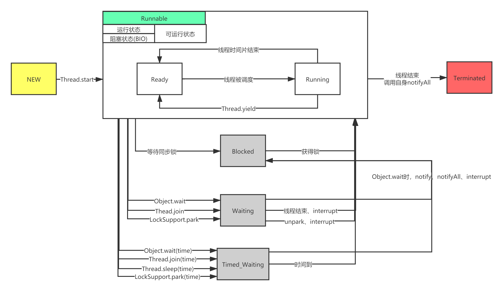


### Java对象头

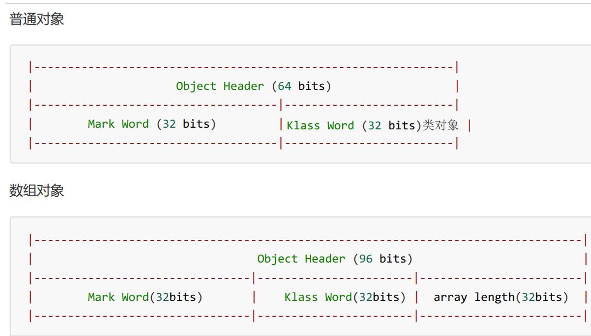

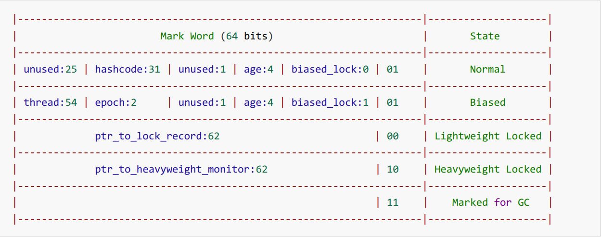


### synchronize锁

**synchronized关键字最主要的三种使用方式：**

- **修饰实例方法:** 作用于当前对象实例加锁，进入同步代码前要获得当前对象实例的锁
  -  `synchronized(this)`
- **修饰静态方法:** 也就是给当前类加锁，会作用于类的所有对象实例，因为静态成员不属于任何一个实例对象，是类成员（ static 表明这是该类的一个静态资源，不管new了多少个对象，只有一份）。所以如果一个线程 A 调用一个实例对象的非静态 synchronized 方法，而线程 B 需要调用这个实例对象所属类的静态 synchronized 方法，是允许的，不会发生互斥现象，**因为访问静态 synchronized 方法占用的锁是当前类的锁，而访问非静态 synchronized 方法占用的锁是当前实例对象锁**。
  -  `synchronized(Object.class)`
- **修饰代码块:** 指定加锁对象，对给定对象加锁，进入同步代码库前要获得给定对象的锁。

#### 轻量级锁

一、创建锁记录（Lock Record）对象，每个线程都的栈帧都会包含一个锁记录的结构，内部可以存储锁定对象的Mark Word  

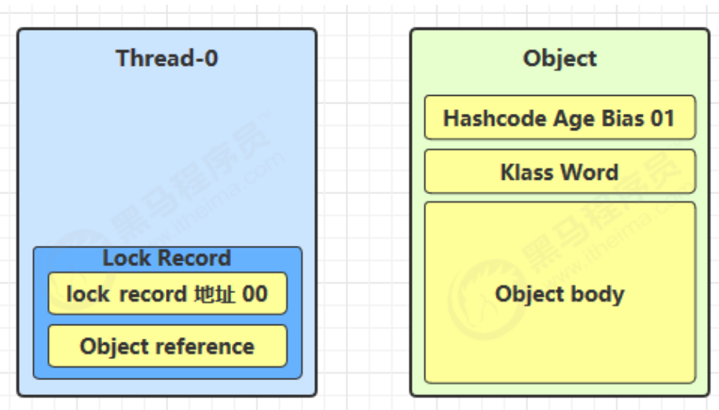

二、让锁记录中 Object reference 指向锁对象，并**尝试用 cas 替换 Object 的 Mark Word**，将 Mark Word 的值存入锁记录  

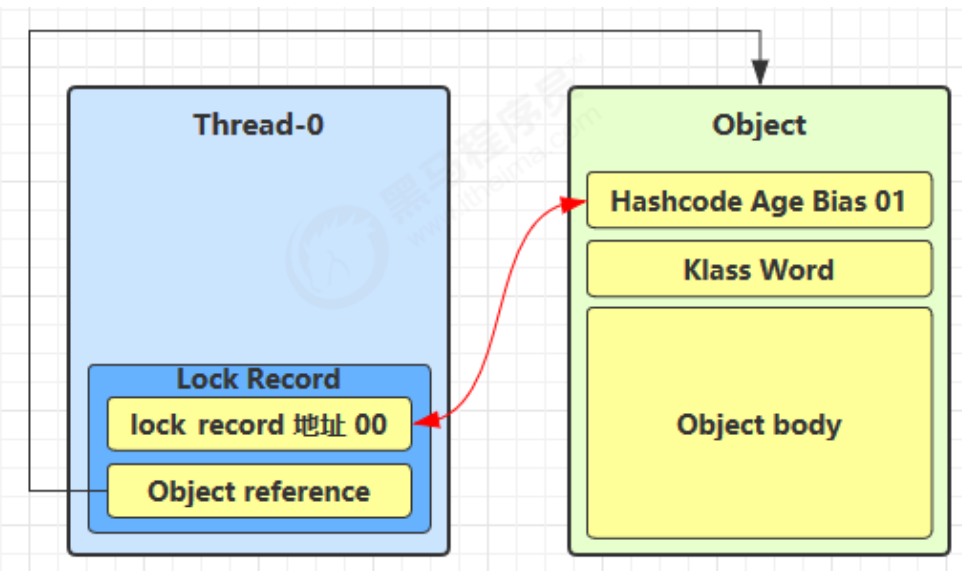

三、如果 cas 替换成功，对象头中存储了 锁记录地址和状态 00 ，表示由该线程给对象加锁  


四、如果 cas 失败，有两种情况

- 如果是其它线程已经持有了该 Object 的轻量级锁，这时表明有竞争，进入锁膨胀过程
- 如果是自己执行了 synchronized 锁重入，那么再添加一条 Lock Record 作为重入的计数  
  - 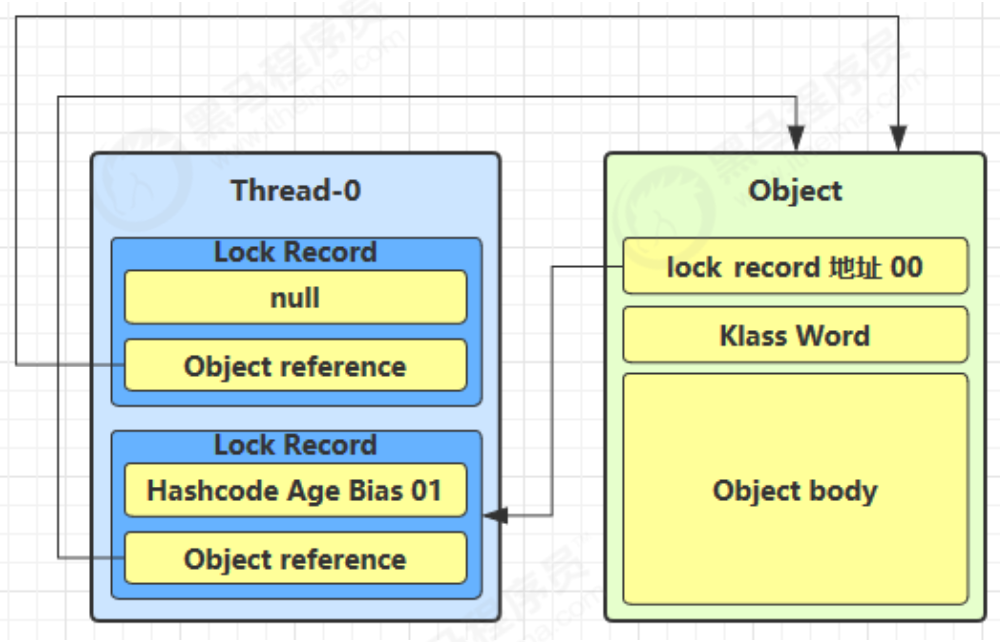

五、当退出 synchronized 代码块（解锁时）如果有取值为 null 的锁记录，表示有重入，这时重置锁记录，表示重入计数减一  

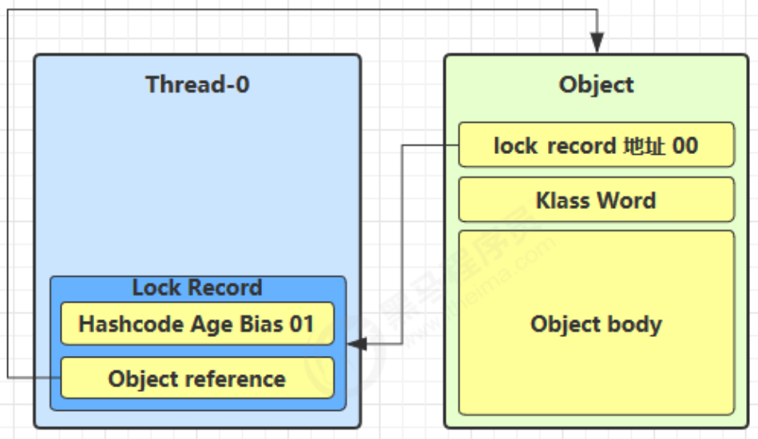

六、当退出 synchronized 代码块（解锁时）锁记录的值不为 null，这时使用 cas 将 Mark Word 的值恢复给对象头

- 成功，则解锁成功
- 失败，说明轻量级锁进行了锁膨胀或已经升级为重量级锁，进入重量级锁解锁流程  


#### 锁膨胀，升级为重量级锁

如果在尝试加轻量级锁的过程中，CAS 操作无法成功，这时一种情况就是有其它线程为此对象加上了轻量级锁（有竞争），这时需要进行锁膨胀，将轻量级锁变为重量级锁  


初始条件

当 Thread-1 进行轻量级加锁时，Thread-0 已经对该对象加了轻量级锁


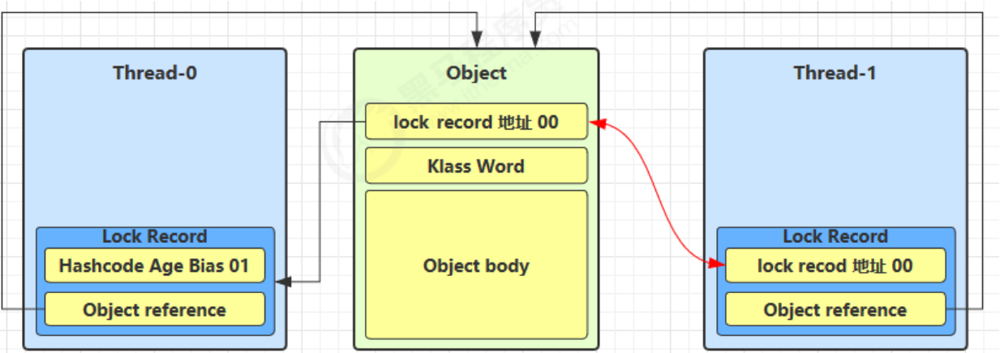  

一、 Thread-1 加轻量级锁失败，进入锁膨胀流程。即为 Object 对象申请 Monitor 锁，让 Object 指向重量级锁地址，然后自己进入 Monitor 的 EntryList BLOCKED  

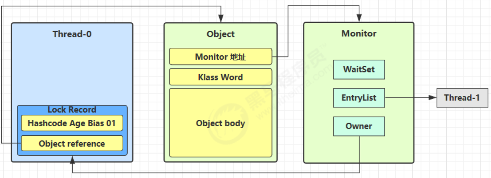

二、当 Thread-0 退出同步块解锁时，**使用 cas 将 Mark Word 的值恢复给对象头**，失败。这时会进入重量级解锁流程，即按照 Monitor 地址找到 Monitor 对象，设置 Owner 为 null，唤醒 EntryList 中 BLOCKED 线程  


#### 自旋优化

重量级锁竞争的时候，还可以使用自旋来进行优化，如果当前线程自旋成功（即这时候持锁线程已经退出了同步块，释放了锁），这时当前线程就可以避免阻塞。

自旋会占用 CPU 时间，单核 CPU 自旋就是浪费，多核 CPU 自旋才能发挥优势。
在 Java 6 之后自旋锁是自适应的，比如对象刚刚的一次自旋操作成功过，那么认为这次自旋成功的可能性会高，就多自旋几次；反之，就少自旋甚至不自旋，总之，比较智能。
Java 7 之后不能控制是否开启自旋功能    

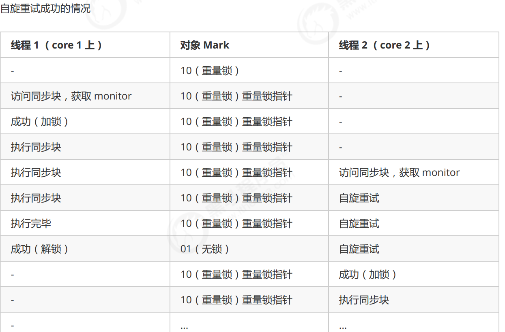

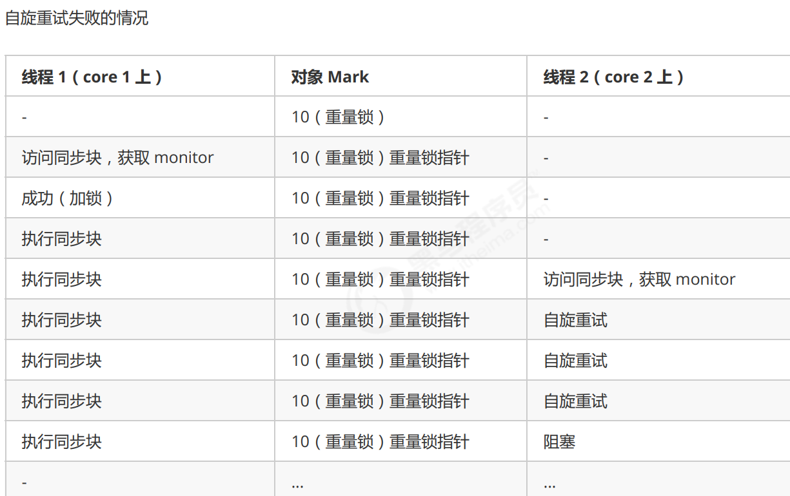


#### 偏向锁

轻量级锁在没有竞争时（就自己这个线程），每次重入仍然需要执行 CAS 操作（比较并交换）。

Java 6 中引入了偏向锁来做进一步优化：只有第一次使用 CAS 将线程 ID 设置到对象的 Mark Word 头，之后发现这个线程 ID 是自己的就表示没有竞争，不用重新 CAS。以后只要不发生竞争，这个对象就归该线程所有  

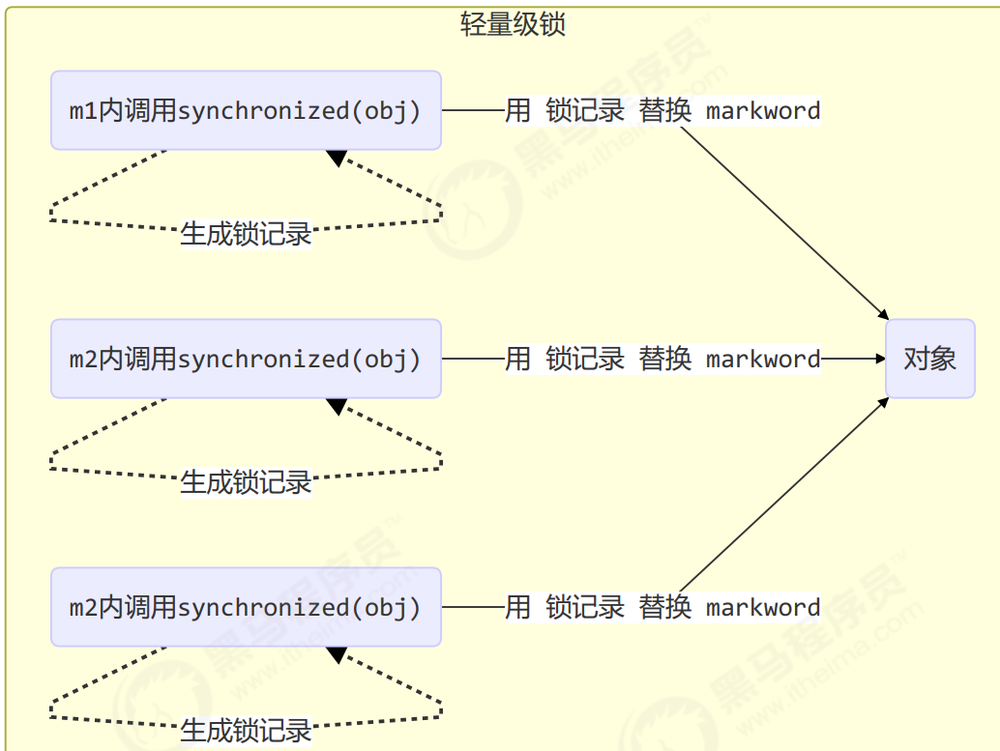

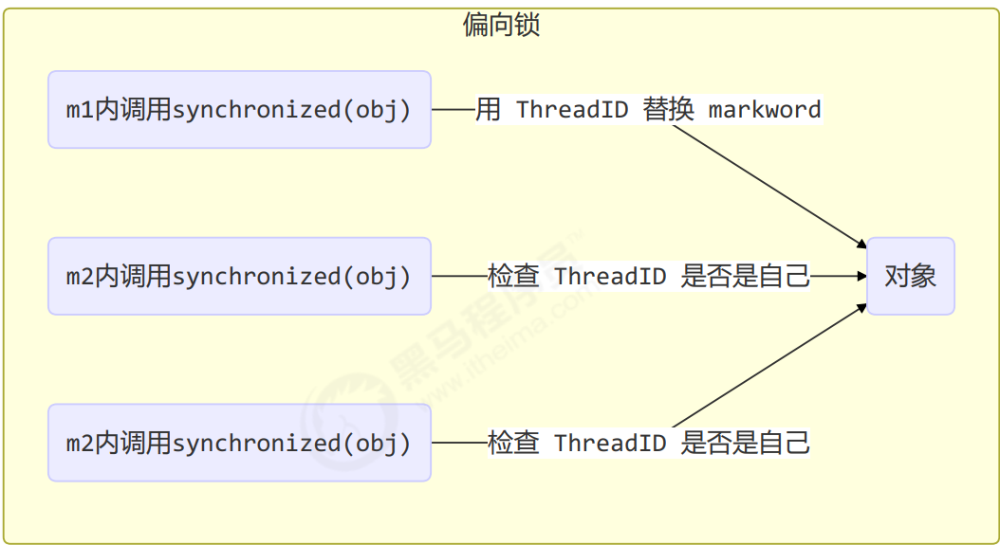

偏向状态

因为程序启动时，需要加载许多类，可能竞争比较大，使用偏向锁没有意义

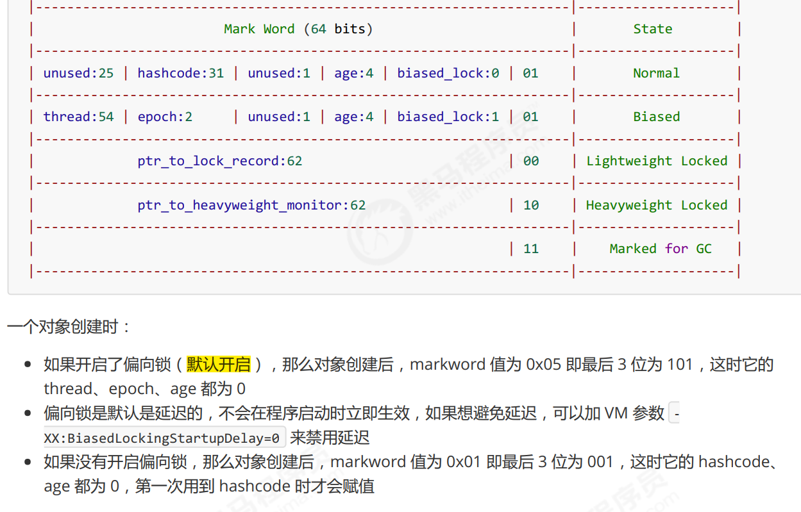


##### 偏向锁细节

使用偏向锁时

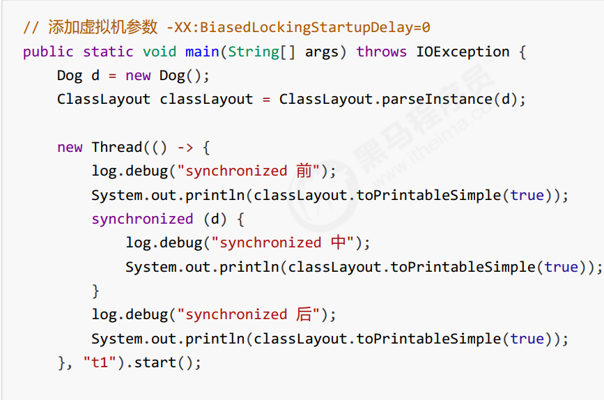

可以看到

- 最后三位是101

- hashcode确实在使用对象d时（ `synchronized` ），才会被赋值
- 处于偏向锁的对象解锁后，线程 id 仍存储于对象头中

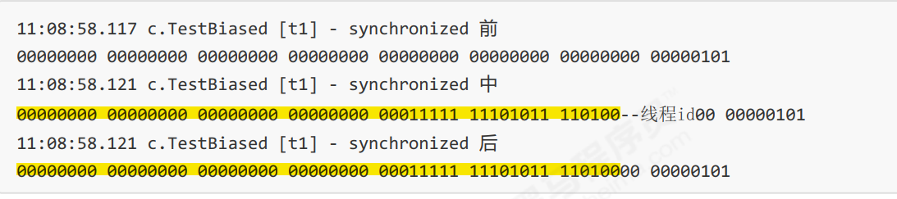

**禁用偏向锁后**

最后三位是001

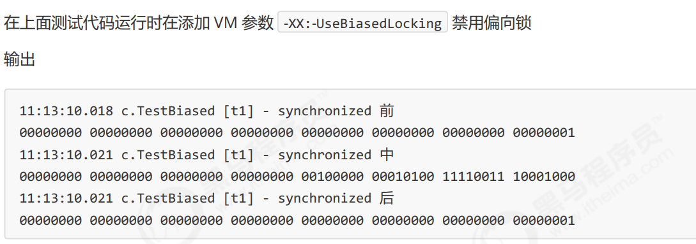


##### 偏向锁失效

- 调用了锁对象hashcode，但偏向锁的对象 MarkWord 中存储的是线程 id，如果调用 hashCode 会导致偏向锁被撤销
  - 轻量级锁会在锁记录中记录 hashCode
  - 重量级锁会在 Monitor 中记录 hashCode  

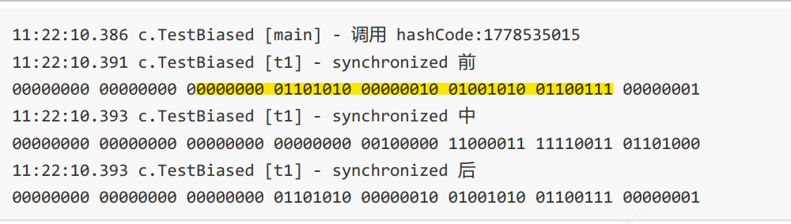


- 当有其它线程使用偏向锁对象，但没有产生竞争时，会将偏向锁升级为轻量级锁  
- 产生竞争，直接晋升重量级锁

##### 批量重偏向

当撤销偏向锁次数大于等于20 次 ，jvm会重新将**该类的所有对象上的偏向锁**偏向至当前**使用锁的线程**

##### 批量撤销

当撤销偏向锁阈值大于等于 40 次，**整个类的所有对象**都会变为**不可偏向**的，新建的对象也是不可偏向的 


#### 锁消除

对当前对象加多次锁，可以使用锁粗化方式解决，也叫锁重入


### 线程阻塞

- wait/notify notifyAll
- join
- park 


### interrupte打断

- 获取打断状态Thread.currentThread().isInterrupted()

- 打断sleep，会清空打断状态
- 打断正常线程，不会清空打断状态
- 打断park，不会清空打断状态
  - 如果打断状态为true，park失效，不会再阻塞线程


### 普通线程和守护线程

普通线程运行未结束，表示java程序未结束

普通线程全部结束，java程序接受，守护线程即使没有执行完，也随之结束


### 常见线程安全类

- String
- Integer
  - String和Integer都是不可变类，所以线程安全
- StringBuffer
- Random
- Vector
- Hashtable
- java.util.concurrent 包下的类  
- 线程安全的是指，多个线程调用它们同一个实例的某个方法时，是线程安全的
  - 它们多个方法的组合不是原子的，即不安全的

### synchronized和 volatile的区别

`synchronized` 关键字和 `volatile` 关键字是两个互补的存在，而不是对立的存在：

- **volatile关键字**是线程同步的**轻量级实现**，所以**volatile性能肯定比synchronized关键字要好**。但是**volatile关键字只能用于变量而synchronized关键字可以修饰方法以及代码块**。synchronized关键字在JavaSE1.6之后进行了主要包括为了减少获得锁和释放锁带来的性能消耗而引入的偏向锁和轻量级锁以及其它各种优化之后执行效率有了显著提升，**实际开发中使用 synchronized 关键字的场景还是更多一些**。
- **多线程访问volatile关键字不会发生阻塞，而synchronized关键字可能会发生阻塞**
- **volatile关键字能保证数据的可见性，但不能保证数据的原子性。synchronized关键字两者都能保证。**
- **volatile关键字主要用于解决变量在多个线程之间的可见性，而 synchronized关键字解决的是多个线程之间访问资源的同步性。**


### 同步模式

#### 保护性暂停

```java
class GuardedObjectV2 {
    private Object response;
    private final Object lock = new Object();
    public Object get(long millis) {
    synchronized (lock) {
        // 1) 记录最初时间
        long begin = System.currentTimeMillis();
        // 2) 已经经历的时间
        long timePassed = 0;
        while (response == null) {
            // 4) 假设 millis 是 1000，结果在 400 时唤醒了，那么还有 600 要等
            long waitTime = millis - timePassed;
            log.debug("waitTime: {}", waitTime);
            if (waitTime <= 0) {
                log.debug("break...");
                break;
            }
            try {
                lock.wait(waitTime);
            } catch (InterruptedException e) {
                e.printStackTrace();
            }
            // 3) 如果提前被唤醒，这时已经经历的时间假设为 400
            timePassed = System.currentTimeMillis() - begin;
            log.debug("timePassed: {}, object is null {}",
                      timePassed, response == null);
        }
        return response;
    }
    }
    public void complete(Object response) {
        synchronized (lock) {
            // 条件满足，通知等待线程
            this.response = response;
            log.debug("notify...");
            lock.notifyAll();
        }
    }
}
```


### Reentrantlock

相对于 synchronized 它具备如下特点

- 可中断

  - 普通线程打断不了，只有一个打断标记

  - 存在可被打断和不可被打断两种方式

  - ```
    //阻塞式方法
    //lockInterruptibly() 可被打断
    //lock() 不可被打断
    ```

- 可以设置超时时间，超时自动放弃争抢

  - ```
    //非阻塞方法
    //tryLock()  申请锁成功，返回true；失败返回flase
    //lock.tryLock(1, TimeUnit.SECONDS) 1秒内申请锁成功，返回true；失败返回flase
    ```

- 可以设置为公平锁，先进先出

  - 默认是不公平锁，即后来线程会抢占之前的线程

  - ```
    ReentrantLock lock = new ReentrantLock(true);
    ```

- 支持多个条件变量，可以等待多个条件

  - 通过对条件变量

  - ```java
    static ReentrantLock lock = new ReentrantLock();
    static Condition waitCigaretteQueue = lock.newCondition();
    static Condition waitbreakfastQueue = lock.newCondition();
    //waitCigaretteQueue.await()和waitCigaretteQueue.signal()表示条件的申请和释放
    static volatile boolean hasCigrette = false;//信号量
    static volatile boolean hasBreakfast = false;//信号量
    ```

    

```java
ReentrantLock lock = new ReentrantLock();

//获取锁方式和之前不一样
Thread t1 = new Thread(() -> {
    try {
        //没有竞争，获取锁
        //有竞争，进入等待队列，会被打断
        lock.lockInterruptibly();//申请锁，可被打断
    } catch (InterruptedException e) {
        e.printStackTrace();
        log.debug("等锁的过程中被打断");
        return;
    }
    try {
        log.debug("获得了锁");
    } finally {
        lock.unlock();
    }
}, "t1");

lock.lock();//申请锁，不能被打断
log.debug("获得了锁");
t1.start();
try {
    sleep(1);
    t1.interrupt();
    log.debug("执行打断");
} finally {
    lock.unlock();
}
```


### ReentrantLock和synchronized的不同

| 比较方面       | SynChronized                                                 | ReentrantLock（实现了 Lock接口）                             |
| -------------- | ------------------------------------------------------------ | :----------------------------------------------------------- |
| 原始构成       | 它是java语言的关键字，是原生语法层面的互斥，需要jvm实现      | 它是JDK 1.5之后提供的API层面的互斥锁类                       |
| 实现           | 通过JVM加锁解锁                                              | api层面的加锁解锁，需要手动释放锁。                          |
| 代码编写       | 采用synchronized不需要用户去手动释放锁<br />当synchronized方法或者synchronized代码块执行完之后，系统会自动让线程释放对锁的占用，更安全， | ReentrantLock则必须要用户去手动释放锁<br />如果没有主动释放锁，就有可能导致出现死锁现象。需要lock()和unlock()方法配合try/finally语句块来完成 |
| 灵活性         | 锁的范围是整个方法或synchronized块部分                       | Lock因为是方法调用，可以跨方法，灵活性更大                   |
| 等待可中断     | 不可中断，除非抛出异常(释放锁方式：    <br />1.代码执行完，正常释放锁；    <br />2.抛出异常，由JVM退出等待) | 持有锁的线程长期不释放的时候，正在等待的线程可以选择放弃等待,(方法：<br/>1.设置超时方法 tryLock(long timeout, TimeUnit unit)，时间过了就放弃等待；<br/>2.lockInterruptibly()放代码块中，调用interrupt()方法可中断，而synchronized不行) |
| 是否公平锁     | 非公平锁                                                     | 两者都可以，默认非公平锁，构造器可以传入boolean值，true为公平锁，false为非公平锁， |
| 条件Condition  |                                                              | 通过多次newCondition可以获得多个Condition对象,可以简单的实现比较复杂的线程同步的功能. |
| 提供的高级功能 |                                                              | 提供很多方法用来监听当前锁的信息，如：<br/> getHoldCount() <br/> getQueueLength()<br/> isFair()<br/>isHeldByCurrentThread()<br/>isLocked() |
| 便利性         | Synchronized的使用比较方便简洁，由编译器去保证锁的加锁和释放 | 需要手工声明来加锁和释放锁，                                 |
| 适用情况       | 资源竞争不是很激烈的情况下，偶尔会有同步的情形下，synchronized是很合适的。原因在于，编译程序通常会尽可能的进行优化synchronize，另外可读性非常好 | ReentrantLock提供了多样化的同步，比如有时间限制的同步，可以被Interrupt的同步（synchronized的同步是不能Interrupt的）等。在资源竞争不激烈的情形下，性能稍微比synchronized差点点。但是当同步非常激烈的时候，synchronized的性能一下子能下降好几十倍。而ReentrantLock确还能维持常态。 |
|                |                                                              |                                                              |
|                |                                                              |                                                              |
|                |                                                              |                                                              |


### CAS

CompareAndSwap，比较并交换，是一个原子操作

```java
public void withdraw(Integer amount) {
    while(true) {
        // 需要不断尝试，直到成功为止
        while (true) {
            // 比如拿到了旧值 1000
            int prev = balance.get();
            // 在这个基础上 1000-10 = 990
            int next = prev - amount;
            /*
            compareAndSet 正是做这个检查，在 set 前，先比较 prev 与当前balance中的值
                - 不一致了，next 作废，返回 false 表示失败
                    比如，别的线程已经做了减法，当前值已经被减成了 990
                    那么本线程的这次 990 就作废了，进入 while 下次循环重试
                - 一致，以 next 设置为新值，返回 true 表示成功
            */
            //原子操作
            if (balance.compareAndSet(prev, next)) {
                break;
            }
        }
    }
}
```

CAS 的底层是 lock cmpxchg 指令（X86 架构），在单核 CPU 和多核 CPU 下都能够保证【比较-交换】的原子性  

在多核状态下，某个核执行到带 lock 的指令时，==CPU 会让总线锁住==，当这个核把此指令执行完毕，再开启总线。这个过程中不会被线程的调度机制所打断，保证了多个线程对内存操作的准确性，是原子的  

==CAS 必须借助 volatile 才能读取到共享变量的最新值来实现【比较并交换】的效果==  


#### CAS和Synchronized的区别

- CAS 是基于乐观锁的思想：最乐观的估计，不怕别的线程来修改共享变量，就算改了也没关系，我吃亏点再
  重试呗。
  - CAS 体现的是无锁并发、无阻塞并发，请仔细体会这两句话的意思
    因为没有使用 synchronized，所以线程不会陷入阻塞，这是效率提升的因素之一
    但如果竞争激烈，可以想到重试必然频繁发生，反而效率会受影响 
  - CAS 和 volatile 可以实现无锁并发，适用于线程数少、多核 CPU 的场景下。
    - 线程数少：线程竞争小
    - 多核CPU：单线程一个处理CAS，也不会影响其他线程的正常运行
- Synchronized 是基于悲观锁的思想：最悲观的估计，得防着其它线程来修改共享变量，我上了锁你们都别想
  改，我改完了才解开锁，你们才有机会。


#### Java中提供CAS方法

Unsafe中compareAndSwap系列方法

Unsafe类只能通过反射获取

```
public static Unsafe getUnsafeInstance() throws Exception
{
        // 通过反射获取rt.jar下的Unsafe类
        Field theUnsafeInstance = Unsafe.class.getDeclaredField("theUnsafe");
        theUnsafeInstance.setAccessible(true);
        // return (Unsafe) theUnsafeInstance.get(null);是等价的
        return (Unsafe) theUnsafeInstance.get(Unsafe.class);
}
```


#### Java原子类

原子整数

- AtomicBoolean
- AtomicInteger

```java
// setup to use Unsafe.compareAndSwapInt for updates（更新操作时提供“比较并替换”的作用）
private static final Unsafe unsafe = Unsafe.getUnsafe();
private static final long valueOffset;

static {
    try {
        //UnSafe 类的 objectFieldOffset() 方法是一个本地方法，这个方法是用来拿到“原来的值”的内存地址，返回值是 valueOffset。
        //另外 value 是一个volatile变量，在内存中可见，因此 JVM 可以保证任何时刻任何线程总能拿到该变量的最新值。
        valueOffset = unsafe.objectFieldOffset
            (AtomicInteger.class.getDeclaredField("value"));
    } catch (Exception ex) { throw new Error(ex); }
}

private volatile int value;
```


- AtomicLong  

原子引用

- AtomicReference

- AtomicMarkableReference

- AtomicStampedReference

- 用于一些引用类型的数据处理

- ```java
  class DecimalAccountSafeCas implements DecimalAccount {
      AtomicReference<BigDecimal> ref;
      public DecimalAccountSafeCas(BigDecimal balance) {
          ref = new AtomicReference<>(balance);
      }
      @Override
      public BigDecimal getBalance() {
          return ref.get();
      }
      @Override
      public void withdraw(BigDecimal amount) {
          while (true) {
              BigDecimal prev = ref.get();
              BigDecimal next = prev.subtract(amount);
              if (ref.compareAndSet(prev, next)) {
                  break;
              }
          }
      }
  }
  ```

#### ABA问题

如果要考虑ABA问题

加上版本号

- AtomicStampedReference 

  - ```java
    //设置值为A，版本号为0
    static AtomicStampedReference<String> ref = new AtomicStampedReference<>("A", 0);
    // 获取值 A
    String prev = ref.getReference();
    // 获取版本号
    int stamp = ref.getStamp();
    log.debug("版本 {}", stamp);
    // 如果中间有其它线程干扰，发生了 ABA 现象
    ...other();
    sleep(1);
    // 尝试改为 C
    //参数为 旧值、新值、旧版本、新版本
    //先比较旧值和当前值，旧版本和当前版本，如果不同，就相同就设置新值和新版本
    log.debug("change A->C {}", ref.compareAndSet(prev, "C", stamp, stamp + 1)); 
    ```

- AtomicMarkableReference  


原子数组

- AtomicIntegerArray
- AtomicLongArray
- AtomicReferenceArray 

字段更新器

- AtomicReferenceFieldUpdater // 域 字段
- AtomicIntegerFieldUpdater
- AtomicLongFieldUpdater  

- 利用字段更新器，可以针对对象的某个域（Field）进行原子操作，只能配合 volatile 修饰的字段使用，否则会出现异常  

- ```java
  //类对象，属性数据类型，属性名
  AtomicIntegerFieldUpdater fieldUpdater = AtomicIntegerFieldUpdater.newUpdater(Test5.class,String.class, "field");
  Test5 test5 = new Test5();
  fieldUpdater.compareAndSet(test5, 0, 10);
  // 修改成功 field = 10
  System.out.println(test5.field);
  ```

  

原子累加器  

- LongAdder  
  - 相比AtomicLong性能更好
  - 主要原理：设置多个共享变量，然后对多个变量cell[]上进行累加，避免在同一个变量上进行累加造成线程阻塞情况增加，共享变量的数量不超过CPU核心数  
  - 防止伪共享：
  - @sun.misc.Contended 用来解决这个问题，它的原理是在使用此注解的对象或字段的前后各增加 128 字节大小的
    padding，从而让 CPU 将对象预读至缓存时占用不同的缓存行，这样，不会造成对方缓存行的失效  


### final 变量的原理

将变量添加到常量池，获取直接从常量池获取(对于小于32768的整数，是直接添加到栈中)  


### ThreadLoacl类

`ThreadLocal`类主要解决的就是让每个线程绑定自己的值，可以将`ThreadLocal`类形象的比喻成存放数据的盒子，盒子中可以存储每个线程的私有数据。

如果你创建了一个`ThreadLocal`变量，那么**访问这个变量的每个线程都会有这个变量的本地副本**，这也是`ThreadLocal`变量名的由来。他们可以使用 `get（）` 和 `set（）` 方法来获取默认值或将其值更改为当前线程所存的副本的值，从而避免了线程安全问题。

```java
public class ThreadLocalExample implements Runnable{

    // SimpleDateFormat 不是线程安全的，所以每个线程都要有自己独立的副本
    private static final ThreadLocal<SimpleDateFormat> formatter = ThreadLocal.withInitial(() -> new SimpleDateFormat("yyyyMMdd HHmm"));

    public static void main(String[] args) throws InterruptedException {
        ThreadLocalExample obj = new ThreadLocalExample();
        for(int i=0 ; i<10; i++){
            Thread t = new Thread(obj, ""+i);
            Thread.sleep(new Random().nextInt(1000));
            t.start();
        }
    }

    @Override
    public void run() {
        System.out.println("Thread Name= "+Thread.currentThread().getName()+" default Formatter = "+formatter.get().toPattern());
        try {
            Thread.sleep(new Random().nextInt(1000));
        } catch (InterruptedException e) {
            e.printStackTrace();
        }
        //formatter pattern is changed here by thread, but it won't reflect to other threads
        formatter.set(new SimpleDateFormat());

        System.out.println("Thread Name= "+Thread.currentThread().getName()+" formatter = "+formatter.get().toPattern());
    }
}
```

虽然formatter是一个类变量，但是对于每个线程而言，使用的都是单独的副本

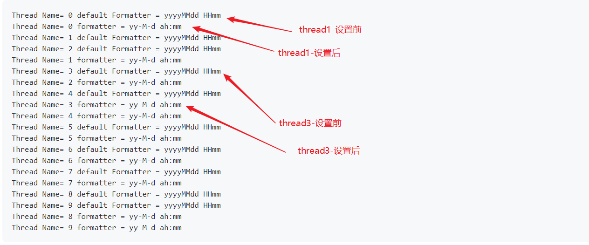

**原理**

可以看到，每一个线程都有一个ThreadLocalMap用于存储放入的变量

每个`Thread`中都具备一个`ThreadLocalMap`，而`ThreadLocalMap`可以存储以`ThreadLocal`为key ，Object 对象为 value的键值对。

```java
public class Thread implements Runnable {
    ......
    //与此线程有关的ThreadLocal值。由ThreadLocal类维护
    ThreadLocal.ThreadLocalMap threadLocals = null;

    //与此线程有关的InheritableThreadLocal值。由InheritableThreadLocal类维护
    ThreadLocal.ThreadLocalMap inheritableThreadLocals = null;
    ......
}

//ThreadLocal类
public void set(T value) {
    //ThreadLocal类实际上是获取的当前Thread类中的threadLocals变量，也就是一个ThreadLocalMap
    Thread t = Thread.currentThread();
    ThreadLocalMap map = getMap(t);
    if (map != null)
        //ThreadLocalMap可以存储以ThreadLocal为key ，Object 对象为 value的键值对。
        map.set(this, value);
    else
        createMap(t, value);
}
ThreadLocalMap getMap(Thread t) {
    return t.threadLocals;
}
```

所以我们在同一个线程中声明了两个 `ThreadLocal` 对象的话，会使用 `Thread`内部都是使用仅有那个`ThreadLocalMap` 存放数据的，`ThreadLocalMap`的 key 就是 `ThreadLocal`对象，value 就是 `ThreadLocal` 对象调用`set`方法设置的值。

图中,ThreadLocal1和ThreadLocal2连接的Entry都是存在Thread的ThreadLocalMap中


#### ThreadLocal 内存泄露问题

`ThreadLocalMap` 中使用的 key 为 `ThreadLocal` 的弱引用,而 value 是强引用。所以，如果 `ThreadLocal` 没有被外部强引用的情况下，在垃圾回收的时候，key 会被清理掉，而 value 不会被清理掉。这样一来，`ThreadLocalMap` 中就会出现key为null的Entry。假如我们不做任何措施的话，value 永远无法被GC 回收，这个时候就可能会产生内存泄露。ThreadLocalMap实现中已经考虑了这种情况，在调用 `set()`、`get()`、`remove()` 方法的时候，会清理掉 key 为 null 的记录。使用完 `ThreadLocal`方法后 最好手动调用`remove()`方法

```java
static class Entry extends WeakReference<ThreadLocal<?>> {
    /** The value associated with this ThreadLocal. */
    Object value;

    Entry(ThreadLocal<?> k, Object v) {
        super(k);
        value = v;
    }
}
```


### 线程池

**好处**

- **降低资源消耗**。通过重复利用已创建的线程降低线程创建和销毁造成的消耗。
- **提高响应速度**。当任务到达时，任务可以不需要的等到线程创建就能立即执行。
- **提高线程的可管理性**。线程是稀缺资源，如果无限制的创建，不仅会消耗系统资源，还会降低系统的稳定性，使用线程池可以进行统一的分配，调优和监控。


#### 线程池状态

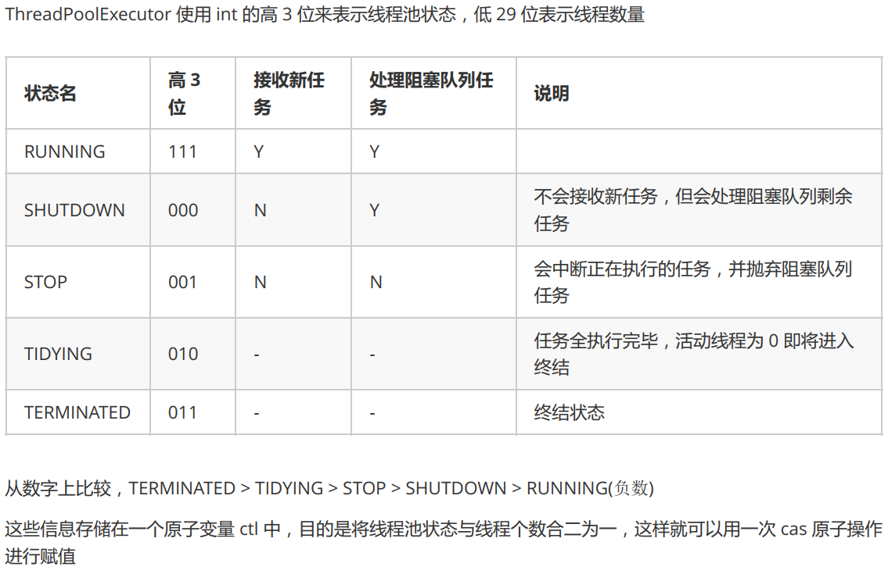


#### 执行execute()方法和submit()方法的区别是什么呢？

1. **`execute()`方法用于提交不需要返回值的任务，所以无法判断任务是否被线程池执行成功与否；**
2. **`submit()`方法用于提交需要返回值的任务。线程池会返回一个 `Future` 类型的对象，通过这个 `Future` 对象可以判断任务是否执行成功**，并且可以通过 `Future` 的 `get()`方法来获取返回值，`get()`方法会阻塞当前线程直到任务完成，而使用 `get（long timeout，TimeUnit unit）`方法则会阻塞当前线程一段时间后立即返回，这时候有可能任务没有执行完。

我们以**`AbstractExecutorService`**接口中的一个 `submit` 方法为例子来看看源代码：

```java
public Future<?> submit(Runnable task) {
    if (task == null) throw new NullPointerException();
    RunnableFuture<Void> ftask = newTaskFor(task, null);
    execute(ftask);
    return ftask;
}
protected <T> RunnableFuture<T> newTaskFor(Runnable runnable, T value) {
    return new FutureTask<T>(runnable, value);
}
public void execute(Runnable command) {
    ...
}
```


#### 创建线程池

- 通过ThreadPoolExecutor类构造方法实现

```java
import java.util.Date;

/**
 * 这是一个简单的Runnable类，需要大约5秒钟来执行其任务。
 * @author shuang.kou
 */
public class MyRunnable implements Runnable {

    private String command;

    public MyRunnable(String s) {
        this.command = s;
    }

    @Override
    public void run() {
        System.out.println(Thread.currentThread().getName() + " Start. Time = " + new Date());
        processCommand();
        System.out.println(Thread.currentThread().getName() + " End. Time = " + new Date());
    }

    private void processCommand() {
        try {
            Thread.sleep(5000);
        } catch (InterruptedException e) {
            e.printStackTrace();
        }
    }

    @Override
    public String toString() {
        return this.command;
    }
}
public class ThreadPoolExecutorDemo {

    private static final int CORE_POOL_SIZE = 5;
    private static final int MAX_POOL_SIZE = 10;
    private static final int QUEUE_CAPACITY = 100;
    private static final Long KEEP_ALIVE_TIME = 1L;
    public static void main(String[] args) {

        //使用阿里巴巴推荐的创建线程池的方式
        //通过ThreadPoolExecutor构造函数自定义参数创建
        ThreadPoolExecutor executor = new ThreadPoolExecutor(
                CORE_POOL_SIZE,
                MAX_POOL_SIZE,
                KEEP_ALIVE_TIME,
                TimeUnit.SECONDS,
                new ArrayBlockingQueue<>(QUEUE_CAPACITY),
                new ThreadPoolExecutor.CallerRunsPolicy());

        for (int i = 0; i < 10; i++) {
            //创建WorkerThread对象（WorkerThread类实现了Runnable 接口）
            Runnable worker = new MyRunnable("" + i);
            //执行Runnable
            executor.execute(worker);
        }
        //终止线程池
        executor.shutdown();
        while (!executor.isTerminated()) {
        }
        System.out.println("Finished all threads");
    }
}
```


- 通过Executor 框架的工具类Executors默认提供三种线程池
  - **FixedThreadPool** ： 该方法返回一个**固定线程数量**的线程池。该线程池中的线程数量始终不变。当有一个新的任务提交时，线程池中若有空闲线程，则立即执行。若没有，则新的任务会被暂存在一个任务队列中，待有线程空闲时，便处理在任务队列中的任务。
  - **SingleThreadExecutor：** 方法返回一个只有**一个线程**的线程池。若多余一个任务被提交到该线程池，任务会被保存在一个任务队列中，待线程空闲，按先入先出的顺序执行队列中的任务。
  - **CachedThreadPool：** 该方法返回一个**可根据实际情况调整线程数量**的线程池。线程池的线程数量不确定，但若有空闲线程可以复用，则会优先使用可复用的线程。若所有线程均在工作，又有新的任务提交，则会创建新的线程处理任务。所有线程在当前任务执行完毕后，将返回线程池进行复用。
  - **ScheduledThreadPool：**任务调度线程池。传统任务调度线程池使用Timer，但是Timer完全是单线程串行执行，效率低。

适用Executor创建线程池的弊端

- **FixedThreadPool 和 SingleThreadExecutor** ： 允许请求的队列长度为 Integer.MAX_VALUE ，可能堆积大量的请求，从而导致OOM。
- **CachedThreadPool 和 ScheduledThreadPool** ： 允许创建的线程数量为 Integer.MAX_VALUE ，可能会创建大量线程，从而导致OOM。


#### ThreadPoolExecutor 类分析

`ThreadPoolExecutor` 类中提供的四个构造方法。我们来看最长的那个，其余三个都是在这个构造方法的基础上产生（其他几个构造方法说白点都是给定某些默认参数的构造方法比如默认制定拒绝策略是什么）

最重要的三个参数

- corePoolSize : 核心线程数线程数定义了最小可以同时运行的线程数量。
- maximumPoolSize : 当队列中存放的任务达到队列容量的时候，当前可以同时运行的线程数量变为最大线程数。
- workQueue: 阻塞队列。当新任务来的时候会先判断当前运行的线程数量是否达到核心线程数，如果达到的话，新任务就会被存放在队列中。

其他参数

- keepAliveTime:当线程池中的线程数量大于 corePoolSize 的时候，如果这时没有新的任务提交，**救急线程**(核心线程外的线程)不会立即销毁，而是会等待，直到等待的时间超过了 keepAliveTime才会被回收销毁；
- unit : keepAliveTime 参数的时间单位。
- threadFactory :executor 创建新线程的时候会用到。
- handler :饱和策略。关于饱和策略下面单独介绍一下

```java
/**
* 用给定的初始参数创建一个新的ThreadPoolExecutor。
*/
public ThreadPoolExecutor(int corePoolSize,
                          int maximumPoolSize,
                          long keepAliveTime,
                          TimeUnit unit,
                          BlockingQueue<Runnable> workQueue,
                          ThreadFactory threadFactory,
                          RejectedExecutionHandler handler) {
    if (corePoolSize < 0 ||
        maximumPoolSize <= 0 ||
        maximumPoolSize < corePoolSize ||
        keepAliveTime < 0)
        throw new IllegalArgumentException();
    if (workQueue == null || threadFactory == null || handler == null)
        throw new NullPointerException();
    this.corePoolSize = corePoolSize;
    this.maximumPoolSize = maximumPoolSize;
    this.workQueue = workQueue;
    this.keepAliveTime = unit.toNanos(keepAliveTime);
    this.threadFactory = threadFactory;
    this.handler = handler;
}
```


#### ThreadPoolExecutor拒绝策略

如果当前同时运行的线程数量达到最大线程数量并且队列也已经被放满了任时，`ThreadPoolTaskExecutor` 定义一些策略:

- **`ThreadPoolExecutor.AbortPolicy`**：抛出 `RejectedExecutionException`来拒绝新任务的处理。
- **`ThreadPoolExecutor.CallerRunsPolicy`**：调用执行自己的线程运行任务，也就是**直接在调用execute方法的线程**中运行(`run`)被拒绝的任务，如果执行程序已关闭，则会丢弃该任务。因此这种策略会降低对于新任务提交速度，影响程序的整体性能。如果您的应用程序可以承受此延迟并且你要求任何一个任务请求都要被执行的话，你可以选择这个策略。
- **`ThreadPoolExecutor.DiscardPolicy`：** 不处理新任务，直接丢弃掉。
- **`ThreadPoolExecutor.DiscardOldestPolicy`：** 此策略将丢弃最早的未处理的任务请求。


#### 线程池执行流程

1. 判断线程数少于corePoolSize时，当一个任务提交给线程池后，线程池会创建一个新线程来执行任务。否则，执行2
2. 线程数达到 corePoolSize且没有空闲线程时，判断等待队列是否已满，如果没有，新加的任务会被加入workQueue 队列排队，直到有空闲的线程。否则，执行3
3. 如果队列选择了有界队列，那么任务超过了等待队列大小时，会创建 maximumPoolSize - corePoolSize 数目的线程来救急。
4. 如果线程到达 maximumPoolSize 仍然有新任务这时会执行拒绝策略。拒绝策略 jdk 提供了 4 种实现


```java
// 存放线程池的运行状态 (runState) 和线程池内有效线程的数量 (workerCount)
private final AtomicInteger ctl = new AtomicInteger(ctlOf(RUNNING, 0));

private static int workerCountOf(int c) {
    return c & CAPACITY;
}

private final BlockingQueue<Runnable> workQueue;

public void execute(Runnable command) {
    // 如果任务为null，则抛出异常。
    if (command == null)
        throw new NullPointerException();
    // ctl 中保存的线程池当前的一些状态信息
    int c = ctl.get();

    //  下面会涉及到 3 步 操作
    // 1.首先判断当前线程池中并行的任务数量是否小于 corePoolSize
    // 如果小于的话，通过addWorker(command, true)新建一个线程，并将任务(command)添加到该线程中；然后，启动该线程从而执行任务。
    if (workerCountOf(c) < corePoolSize) {
        if (addWorker(command, true))
            return;
        c = ctl.get();
    }
    // 2.如果当前并行的任务数量大于等于 corePoolSize 的时候就会走到这里
    // 通过 isRunning 方法判断线程池状态，线程池处于 RUNNING 状态并且队列可以加入任务，该任务才会被加入进去
    if (isRunning(c) && workQueue.offer(command)) {
        int recheck = ctl.get();
        // 再次获取线程池状态，如果线程池状态不是 RUNNING 状态（不能接受新任务，也就表示线程池已经满了）
        //就需要从任务队列中移除任务，并尝试判断线程是否全部执行完毕。同时执行拒绝策略。
        if (!isRunning(recheck) && remove(command))
            reject(command);
        // 如果当前线程池为空（没有线程空闲）就新创建一个线程并执行。
        else if (workerCountOf(recheck) == 0)
            addWorker(null, false);
    }
    //3. 通过addWorker(command, false)新建一个线程，并将任务(command)添加到该线程中；然后，启动该线程从而执行任务。
    //如果addWorker(command, false)执行失败，则通过reject()执行相应的拒绝策略的内容。
    else if (!addWorker(command, false))
        reject(command);
}
```

创建Work，启动一个线程执行任务

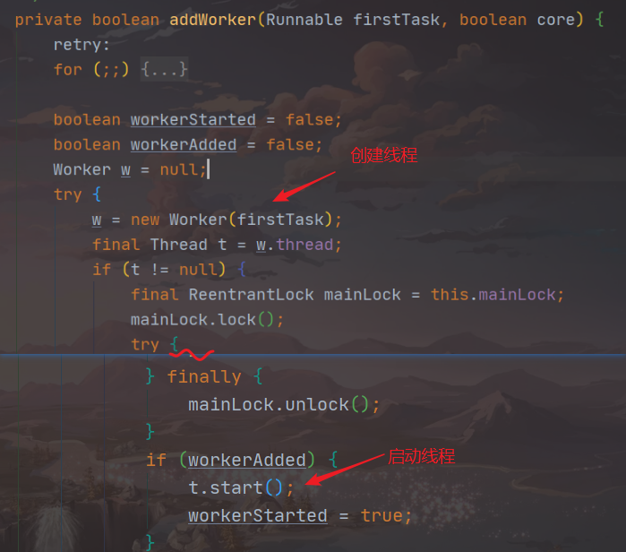


执行任务的是否会不断查看当前等待队列是否有任务，如果有，继续执行

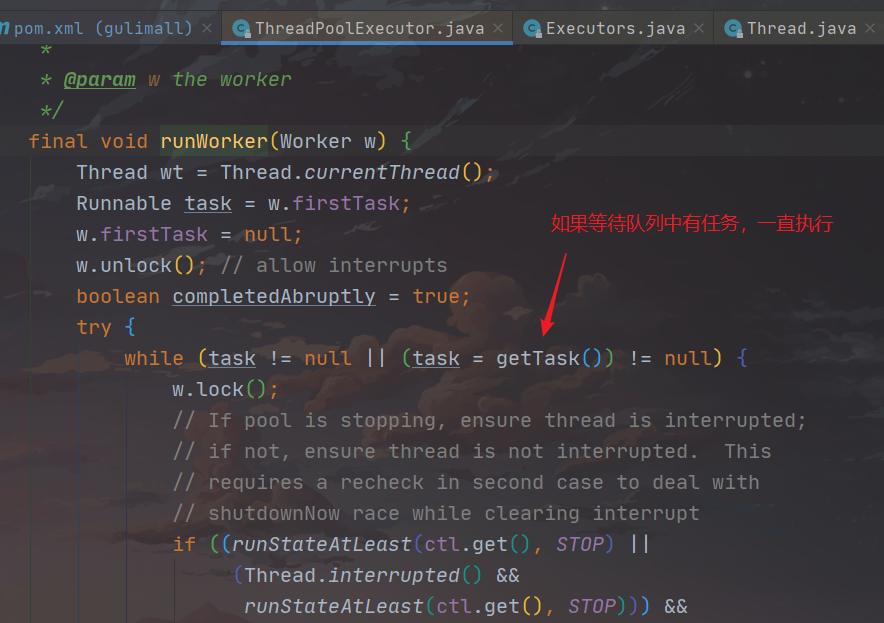


### 阻塞队列和非阻塞队列

阻塞队列与普通队列的区别

阻塞队列

- 当队列是空的时，从队列中获取元素的操作将会被阻塞，直到其他的线程往空的队列插入新的元素。
- 当队列是满时，往队列里添加元素的操作会被阻塞，直到其他的线程从队列取出元素

#### 常用阻塞队列

**无界队列**

队列大小无限制，常用的为无界的LinkedBlockingQueue，使用该队列做为阻塞队列时要尤其当心，当任务耗时较长时可能会导致大量新任务在队列中堆积最终导致OOM。阅读代码发现，Executors.newFixedThreadPool 采用就是 LinkedBlockingQueue，而楼主踩到的就是这个坑，当QPS很高，发送数据很大，大量的任务被添加到这个无界LinkedBlockingQueue 中，导致cpu和内存飙升服务器挂掉。

**有界队列**

常用的有两类，一类是遵循FIFO原则的队列如ArrayBlockingQueue，另一类是优先级队列如PriorityBlockingQueue。PriorityBlockingQueue中的优先级由任务的Comparator决定。 
使用有界队列时队列大小需和线程池大小互相配合，线程池较小有界队列较大时可减少内存消耗，降低cpu使用率和上下文切换，但是可能会限制系统吞吐量。

在我们的修复方案中，选择的就是这个类型的队列，虽然会有部分任务被丢失，但是我们线上是排序日志搜集任务，所以对部分对丢失是可以容忍的。

- ArrayBlockingQueue 添加删除使用ReentrantLock实现

**同步移交队列**

如果不希望任务在队列中等待而是希望将任务直接移交给工作线程，可使用SynchronousQueue作为等待队列。SynchronousQueue不是一个真正的队列，而是一种线程之间移交的机制。要将一个元素放入SynchronousQueue中，必须有另一个线程正在等待接收这个元素。只有在使用无界线程池或者有饱和策略时才建议使用该队列。

**延迟运行队列**
它对应的线程池分别是 ScheduledThreadPool 和 SingleThreadScheduledExecutor，这两种线程池的最大特点就是可以延迟执行任务，比如说一定时间后执行任务或是每隔一定的时间执行一次任务。DelayedWorkQueue 的特点是内部元素并不是按照放入的时间排序，而是会按照延迟的时间长短对任务进行排序，内部采用的是“堆”的数据结构。之所以线程池 ScheduledThreadPool 和 SingleThreadScheduledExecutor 选择 DelayedWorkQueue，是因为它们本身正是基于时间执行任务的，而延迟队列正好可以把任务按时间进行排序，方便任务的执行。


#### 常用非阻塞队列

ConcurrentLinkedQueue

ConcurrentLinkedQueue : 是一个适用于高并发场景下的队列，通过无锁的方式，实现了高并发状态下的高性能，通常ConcurrentLinkedQueue性能好于BlockingQueue.它是一个基于链接节点的无界线程安全队列。该队列的元素遵循先进先出的原则。头是最先加入的，尾是最近加入的，该队列不允许null元素。

使用CAS

### AQS

AbstractQueuedSynchronizer

它提供了一种实现阻塞锁和一系列依赖FIFO等待队列的同步器的框架，ReentrantLock、Semaphore、CountDownLatch、CyclicBarrier等并发类均是基于AQS来实现的，具体用法是通过继承AQS实现其模板方法，然后将子类作为同步组件的内部类。

#### 核心思想

- 如果被请求的共享资源空闲，则将当前请求资源的线程设置为有效的工作线程，并且将共享资源设置为锁定状态。
- 如果被请求的共享资源被占用，那么就需要一套线程阻塞等待以及被唤醒时锁分配的机制
  - 这个机制AQS是用CLH队列锁实现的，即将暂时获取不到锁的线程加入到队列中。
  - CLH是FIFO的双端双向队列
  - CLH锁也是一种基于链表的可扩展、高性能、公平的自旋锁，申请线程只在本地变量上自旋，它不断轮询前驱的状态，如果发现前驱释放了锁就结束自旋。


#### 实现

AQS使用一个int成员变量来表示同步状态，通过内置的FIFO队列来完成获取资源线程的排队工作。

AQS使用CAS对该同步状态进行原子操作实现对其值的修改。

```
private volatile int state;//共享变量，使用volatile修饰保证线程可见性
```

状态信息通过protected类型的getState，setState，compareAndSetState进行操作

```
//返回同步状态的当前值
protected final int getState() {  
        return state;
}
 // 设置同步状态的值
protected final void setState(int newState) { 
        state = newState;
}
//原子地（CAS操作）将同步状态值设置为给定值update如果当前同步状态的值等于expect（期望值）
protected final boolean compareAndSetState(int expect, int update) {
        return unsafe.compareAndSwapInt(this, stateOffset, expect, update);
}
```

#### AQS 对资源的共享方式

**AQS定义两种资源共享方式**

- **Exclusive**（独占）：只有一个线程能执行，如**ReentrantLock**。又可分为公平锁和非公平锁：
  - 公平锁：按照线程在队列中的排队顺序，先到者先拿到锁
  - 非公平锁：当线程要获取锁时，无视队列顺序直接去抢锁，谁抢到就是谁的
- **Share**（共享）：多个线程可同时执行，如**Semaphore/CountDownLatc**h。**Semaphore**、**CountDownLatch**、 **CyclicBarrier**、**ReadWriteLock** 我们都会在后面讲到。

不同的自定义同步器争用共享资源的方式也不同。自定义同步器在实现时只需要实现**共享资源 state 的获取与释放方式**即可，至于具体线程等待队列的维护（如获取资源失败入队/唤醒出队等），AQS已经在顶层实现好了。

#### AQS底层使用了模板方法模式

同步器的设计是基于模板方法模式的，如果需要自定义同步器一般的方式是这样（模板方法模式很经典的一个应用）：

1. 使用者继承AbstractQueuedSynchronizer并重写指定的方法。（这些重写方法很简单，无非是对于共享资源state的获取和释放）
2. 将AQS组合在自定义同步组件的实现中，并调用其模板方法，而这些模板方法会调用使用者重写的方法。

**AQS使用了模板方法模式，自定义同步器时需要重写下面几个AQS提供的模板方法：**

```
isHeldExclusively()//该线程是否正在独占资源。只有用到condition才需要去实现它。
tryAcquire(int)//独占方式。尝试获取资源，成功则返回true，失败则返回false。
tryRelease(int)//独占方式。尝试释放资源，成功则返回true，失败则返回false。
tryAcquireShared(int)//共享方式。尝试获取资源。负数表示失败；0表示成功，但没有剩余可用资源；正数表示成功，且有剩余资源。
tryReleaseShared(int)//共享方式。尝试释放资源，成功则返回true，失败则返回false。
```


#### AQS组件总结

**ReentrantLock**(可重入锁)-单线程使用

- 默认非公平锁

- state初始化为0，表示未锁定状态。A线程lock()时，会调用tryAcquire()独占该锁并将state+1。
- 此后，其他线程再tryAcquire()时就会失败，直到A线程unlock()到state=0（即释放锁）为止，其它线程才有机会获取该锁。
  - 线程的阻塞和恢复时使用park和unpark实现，这样即使unpark先于park执行，依然有效

- 当然，释放锁之前，A线程自己是可以重复获取此锁的（state会累加），这就是可重入的概念。但要注意，获取多少次就要释放多么次，这样才能保证state是能回到零态的。
- 公平锁和非公平锁只有两处不同：
  1. 非公平锁在调用 lock 后，首先就会调用 CAS 进行一次抢锁，如果这个时候恰巧锁没有被占用，那么直接就获取到锁返回了。
  2. 非公平锁在 CAS 失败后，和公平锁一样都会进入到 tryAcquire 方法，在 tryAcquire 方法中，如果发现锁这个时候被释放了（state == 0），非公平锁会直接 CAS 抢锁，但是公平锁会判断等待队列是否有线程处于等待状态，如果有则不去抢锁，乖乖排到后面
- ReentrantLock和synchronized都是通过对计数器进行修改来实现锁重入的，只有当计数器为0时，其他线程才可以使用

**Semaphore(信号量)-允许多个线程同时访问：** synchronized 和 ReentrantLock 都是一次只允许一个线程访问某个资源，Semaphore(信号量)可以指定**多个线程同时访问某个资源。**

**CountDownLatch （倒计时器）：** CountDownLatch是一个同步工具类，用来协调多个线程之间的同步。这个工具通常用来控制线程等待，它可以让某一个线程等待直到倒计时结束，再开始执行。
- 以CountDownLatch以例，任务分为N个子线程去执行，state也初始化为N（注意N要与线程个数一致）。
- 这N个子线程是并行执行的，每个子线程执行完后countDown()一次，state会CAS(Compare and Swap)减1。
- 等到所有子线程都执行完后(即state=0)，会unpark()**主调用线程**，然后主调用线程就会从await()函数返回，继续后余动作。

**CyclicBarrier(循环栅栏)：** CyclicBarrier 和 CountDownLatch 非常类似，它也可以实现线程间的技术等待，但是它的功能比 CountDownLatch 更加复杂和强大。主要应用场景和 CountDownLatch 类似。CyclicBarrier 的字面意思是可循环使用（Cyclic）的屏障（Barrier）。它要做的事情是，让一组线程到达一个屏障（也可以叫同步点）时被阻塞，直到最后一个线程到达屏障时，屏障才会开门，所有被屏障拦截的线程才会继续干活。CyclicBarrier默认的构造方法是 CyclicBarrier(int parties)，其参数表示屏障拦截的线程数量，每个线程调用await()方法告诉 CyclicBarrier 我已经到达了屏障，然后当前线程被阻塞。


### 题目

说说Java中的锁

- synchronized和ReentrantLock
- Synchronized分为偏向锁、轻量级锁、自旋锁、重量级锁

concurrenthashmap的底层实现

- 使用CAS来进行

volatile是原子性的吗？

- 不是，只保证了可见性和有序性

CAS是什么？

- CAS的原理是拿期望的值和原本的一个值作比较，如果相同则更新成新的值。

CAS的相关类有使用过吗？

```
底层：
Unsafe.compareAndSwapInt
java.util.concurrent
//原子证书
AtomicInteger
AtomicBoolean
AtomicLong
//原子引用
AtomicReference
AtomicMarkableReference
AtomicStampedReference
//原子数组
AtomicIntegerArray
AtomicLongArray
AtomicReferenceArray
//原子字段更新器
AtomicReferenceFieldUpdater // 域 字段
AtomicIntegerFieldUpdater
AtomicLongFieldUpdater 
//原子累加器
LongAddr
```

线程切换代价为什么小

- 除了共享内存外线程切换并不会清空CPU和主存之间的缓存

死锁必要条件、如何避免死锁

- 资源互斥、请求保持、不可剥夺、循环等待
- 一次性申请所有资源；申请部分资源，使用完毕后，必须释放
- 当持有资源，但下次申请资源得不到满足时，必须释放已经保持的资源
- 给资源编号，当资源申请编号为i的资源后，下次申请只能申请编号大于i 的资源

线程的状态

- new ,runnalbe ,Blocked,Waiting,Timed-Waiting, terminated 

进程 、 线程 、 协程 的含义和区别

- 进程是CPU资源分配基本单位，一个进程有多个线程
- 线程是CPU调度基本单位，一个线程有多个协程
- 协程切换是一个特殊的函数，这个函数可以在某个地方挂起，并且可以重新在挂起处外继续运行。
- 进程的切换者是**操作系统**，切换时机是根据操作系统自己的切换策略，**用户是无感知的**。进程的切换内容包括页**全局目录、内核栈、硬件上下文**，切换内容保存在内存中。进程切换过程是由“**用户态到内核态到用户态**”的方式，切换效率低。

- 线程的切换者是**操作系统**，切换时机是根据操作系统自己的切换策略，**用户无感知**。线程的切换内容包括**内核栈和硬件上下文**。线程切换内容保存在内核栈中。线程切换过程是由“**用户态到内核态到用户态**”， 切换效率中等。

- 协程的切换者是**用户**（编程者或应用程序），切换时机是**用户自己的程序所决定的**。协程的切换内容是**硬件上下文**，切换内存保存在用户自己的变量（用户栈或堆）中。**协程的切换过程只有用户态**，即没有陷入内核态，因此切换效率高。

进程间通信方式 

- 管道 、FIFO 、 信号量 、 共享内存 、 消息队列 、 Socket

如何避免死锁 ？ 死锁的四个必要条件

- 资源互斥、请求保持、不可剥夺、循环等待

Sleep和wait的区别

- Sleep是让当前线程进入等待状态，但是并没有释放锁。等待时间结束，就直接进入就绪队列运行
- wiat是让当前线程进入等待状态，并释放锁。通过notify和notifyAll唤醒后，还需要重新申请锁

Sychronized 和 lock（ReentrantLock） 的区别 

- 相同点：可重入锁
- 不同点：lock可以使用多个信号量，Synchronized只有一个信号量。lock是可打断

Sychronized的底层优化 ： 

- 无锁、偏向锁、轻量级锁 、重量级锁

volatile的作用

- 保证变量可见性
- 防止指令重拍，加了一个内存写屏障，写屏障之前代码运行正确

ThreadLocal 底层原理


线程池

线程池构造器涉及哪些参数 :

- corePoolSize 核心线程数
- maximumPoolSzie 最大线程数
- keepAlive 救急线程存活时间
- timeUnit  时间单位
- RejectHandler 拒绝策略
  - 拒绝放入队列并返回异常
  - 直接拒绝
  - 移除队列中第一个，然后重新加入队列
- 等待队列
- 阻塞队列
- 线程工厂
  - 新建线程使用

介绍线程池工作过程

1. 检查当前运行线程数是否小于corePoolSize。如果小于，创建普通线程执行任务。大于，执行2
2. 检查当前阻塞队列是否已满。如果未满，加入阻塞队列中。如果已满，执行3
3. 检查当前线程数是否小于maximumPoolSize。如果小于，创建救急线程执行任务。如果大于，执行4
4. 执行拒绝策略

线程池拒绝策略那些

1. AbortPolicy  丢弃任务，并抛出异常
2. CallerRunsPolicy  由调用线程方法的线程执行
3. DiscardPolicy  直接丢弃任务。如果线程队列已满，则后续提交的任务都会被丢弃，且是静默丢弃。
4. DiscardOldestPolicy   丢弃等待队列最前面的任务，然后重新提交被拒绝的任务

AQS 框架原理和源码理解

- 线程访问共享资源，有则给；没有则阻塞，待资源释放被唤醒
- 使用CLH队列锁来实现同步等待

线程池如何保证线程的复用

- Work在执行任务时，会不断从等待队列中获取任务，直到等待队列中没有任务


wait和sleep的区别

- Wait 通常被用于线程间交互/通信，sleep 通常被用于暂停执行。
- wait() 方法被调用后，线程不会自动苏醒，需要别的线程调用同一个对象上的 notify() 或者 notifyAll() 方法。sleep() 方法执行完成后，线程会自动苏醒。或者可以使用 wait(long timeout)超时后线程会自动苏醒。

run()、start()的区别

- 调用 start 方法方可启动线程并使线程进入就绪状态，而 run 方法只是 thread 的一个普通方法调用，还是在主线程里执行。

Thread、Runnable的区别

- Thread是一个类，继承Thread后就不能继承其他类了
- Runnable是一个接口，实现该接口还可以继承其他类，增强了程序的扩展性，降低了程序的耦合性

线程池作用

线程池参数

阻塞队列、非阻塞队列区别


## JVM

JavaGC 的策略

- 引用计数法
- 可达性分析（目前使用

GC root有哪些

- java核心类对象
- 底层操作系统有关的类对象
- 线程局部表中引用的对象
- 作为同步锁的监视器对象

介绍一下JVM中的垃圾收集器

- Serial串行复制+Serial Old串行标记整理
- SerialNew并行复制算法
- Parallel Scavenge并行复制+ParallelOld并行标记整理
- CMS并发标记清除
  - 初始标记 单线程，stw
  - 并发标记，并发
  - 重新标记，多线程，用户线程不能同时践行
  - 标记清楚，并发
- G1 复制+标记整理

JVM如何判断一个对象已经死亡呢？

- 没有对象引用该对象

String类中intern()方法如何实现？

Java类初始化顺序

GC机制

- 就是用来将一些不使用的对象回收的内存管理机制。常用算法有标记清除、标记整理、复制、分代垃圾回收


1. 【高频】Java内存区域   ：
   { 程序计数器 ， 虚拟机栈 ，本地方法栈 ， 堆 ，方法区 ，元空间 }   // 每个区域要能介绍一下
2. Minor GC 触发条件 ：  eden区剩余内存是否足够 两种情况分开分析
   FULL GC  触发条件 ： Minor GC 平均晋升空间大小 > 老年代连续剩余空间，则触发FULL GC
3. 【高频】 判断对象死亡的方法 ： { 引用计数法 ，可达分析算法 }
   深入一些,：GC root对象有哪些？为什么选择他们做GC root对象
4. 垃圾收集算法  ： { 标记清除算法 、标记整理算法 、 复制算法、 分代收集算法 }
   深入一些： 各个算法的优点和适用场景
5. 垃圾收集器 ： { serial  、 parallel 、 CMS 、 G1  }
   CMS 、G1 重点 ， 介绍工作流程和优缺点


### java内存泄漏情况

- 原因 ： 长生命周期持有短生命周期引用

- **静态集合类**，
  - 静态变量随着类的加载而加载，
  - 如HashMap、LinkedList等等。如果这些容器为静态的，那么它们的生命周期与程序一致，则容器中的对象在程序结束之前将不能被释放，从而造成内存泄漏。简单而言，长生命周期的对象持有短生命周期对象的引用，尽管短生命周期的对象不再使用，但是因为长生命周期对象持有它的引用而导致不能被回收。

- **各种连接，如数据库连接、网络连接和IO连接等**。
  
- 在对数据库进行操作的过程中，首先需要建立与数据库的连接，当不再使用时，需要调用close方法来释放与数据库的连接。只有连接被关闭后，垃圾回收器才会回收对应的对象。否则，如果在访问数据库的过程中，对Connection、Statement或ResultSet不显性地关闭，将会造成大量的对象无法被回收，从而引起内存泄漏。
  
- **变量不合理的作用域**。
  
- 一般而言，一个变量的定义的作用范围大于其使用范围，很有可能会造成内存泄漏。另一方面，如果没有及时地把对象设置为null，很有可能导致内存泄漏的发生。
  
- **非静态内部类持有外部类**
  
- 非静态内部类会持有外部类的实例对象，这个外部类对象将不会被垃圾回收，这也会造成内存泄露。
  
  - 解决：使用静态内部类，静态内部类不会持有外部类实例对象引用
  
- **改变哈希值**

  - 当一个对象被存储进HashSet集合中以后，就不能修改这个对象中的那些参与计算哈希值的字段了，否则，对象修改后的哈希值与最初存储进HashSet集合中时的哈希值就不同了，在这种情况下，即使在contains方法使用该对象的当前引用作为的参数去HashSet集合中检索对象，也将返回找不到对象的结果，这也会导致无法从HashSet集合中单独删除当前对象，造成内存泄露

- **缓存泄漏**

  - 内存泄漏的另一个常见来源是缓存，一旦你把对象引用放入到缓存中，他就很容易遗忘，对于这个问题，可以使用WeakHashMap代表缓存，此种Map的特点是，当除了自身有对key的引用外，此key没有其他引用那么此map会自动丢弃此值

  - ```
    public static void init(){
            String ref1= new String("obejct1");
            String ref2 = new String("obejct2");
            String ref3 = new String ("obejct3");
            String ref4 = new String ("obejct4");
            wMap.put(ref1, "chaheObject1");
            wMap.put(ref2, "chaheObject2");
            map.put(ref3, "chaheObject3");
            map.put(ref4, "chaheObject4");
            System.out.println("String引用ref1，ref2会消失");
        }
    ```

- **监听器和回调**

  - 内存泄漏第三个常见来源是监听器和其他回调，如果客户端在你实现的API中注册回调，却没有显示的取消，那么就会积聚。需要确保回调立即被当作垃圾回收的最佳方法是只保存他的**弱引用**，例如将他们保存成为WeakHashMap中的键。

- 常见缓存泄露问题

- ```java
  public class Stack {
      private Object[] elements;
      private int size = 0;
      private static final int DEFAULT_INITIAL_CAPACITY = 16;
      public Stack() {
          elements = new Object[DEFAULT_INITIAL_CAPACITY];
      }
      public void push(Object e) {
          ensureCapacity();
          //elements没有释放
          elements[size++] = e;
      }
      //解决方式
      public Object pop() {
          if (size == 0)
              throw new EmptyStackException();
          Object result = elements[--size];
          elements[size] = null;
          return result;
      }
  
      public Object pop() {
          if (size == 0)
              throw new EmptyStackException();
          return elements[--size];
      }
      private void ensureCapacity() {
          if (elements.length == size)
              elements = Arrays.copyOf(elements, 2 * size + 1);
      }
  }
  
  
  ```


- ThreadLocal 内存泄露问题
- `ThreadLocalMap` 中使用的 key 为 `ThreadLocal` 的弱引用,而 value 是强引用。所以，如果 `ThreadLocal` 没有被外部强引用的情况下，在垃圾回收的时候，key 会被清理掉，而 value 不会被清理掉。这样一来，`ThreadLocalMap` 中就会出现key为null的Entry。假如我们不做任何措施的话，value 永远无法被GC 回收，这个时候就可能会产生内存泄露。ThreadLocalMap实现中已经考虑了这种情况，在调用 `set()`、`get()`、`remove()` 方法的时候，会清理掉 key 为 null 的记录。使用完 `ThreadLocal`方法后 最好手动调用`remove()`方法

7. 引用类型

   - 强引用
   - 软引用
   - 弱引用
   - 虚引用

8. 类加载过程

   加载 ， 连接 ， 初始化
   有哪些类加载器 ， 能否自定义 Java.Object.String 的类加载器 ？

9. 双亲委派机制 介绍 & 作用


# J2EE

[J2EE基础知识](https://github.com/Snailclimb/JavaGuide/blob/master/docs/java/J2EE%E5%9F%BA%E7%A1%80%E7%9F%A5%E8%AF%86.md)


# 网络

[基础知识](https://github.com/Snailclimb/JavaGuide/blob/master/docs/network/%E5%B9%B2%E8%B4%A7%EF%BC%9A%E8%AE%A1%E7%AE%97%E6%9C%BA%E7%BD%91%E7%BB%9C%E7%9F%A5%E8%AF%86%E6%80%BB%E7%BB%93.md)

[面试题](https://github.com/Snailclimb/JavaGuide/blob/master/docs/network/%E8%AE%A1%E7%AE%97%E6%9C%BA%E7%BD%91%E7%BB%9C.md)


说说socket的基本步骤

- 服务端监听：通过一对socket套接字来监听请求

- 客户端请求：使用套接字来向服务端发送请求

- 连接确认：服务端收到请求后，将客户端套接字详情发送给客户端，客户端确认后连接建立

进程间通信方式 

- 管道 半双工
- 消息队列
- 信号量
- 共享内存

TCP和UDP区别

- TCP面向连接，可靠，全双工通信，面向字节流，一对一通信
- UDP面向无连接，不可靠，半双工通信，面向报文，支持一对一、一堆多通信

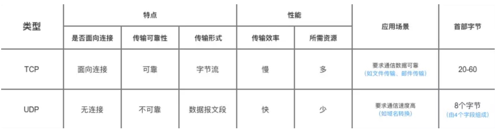

TCP属于哪一层 

​	传输层

网络层有什么协议

- ip、icmp
- 路由协议：OSPF、RIP、EGP、BGP

http请求头有什么关键字段

```
http请求头，HTTP客户程序（例如浏览器），向服务器发送请求的时候必须指明请求类型（一般是GET或者POST）。如有必要，客户程序还可以选择发送其他的请求头。
- Accept：浏览器可接受的MIME类型。
- Accept-Charset：浏览器可接受的字符集。
- Accept-Encoding：浏览器能够进行解码的数据编码方式，比如gzip。Servlet能够向支持gzip的浏览器返回经gzip编码的HTML页面。许多情形下这可以减少5到10倍的下载时间。
- Accept-Language：浏览器所希望的语言种类，当服务器能够提供一种以上的语言版本时要用到。
- Authorization：授权信息，通常出现在对服务器发送的WWW-Authenticate头的应答中。
- Connection：表示是否需要持久连接。如果Servlet看到这里的值为“Keep-Alive”，或者看到请求使用的是HTTP 1.1（HTTP 1.1默认进行持久连接），它就可以利用持久连接的优点，当页面包含多个元素时（例如Applet，图片），显著地减少下载所需要的时间。要实现这一点，Servlet需要在应答中发送一个Content-Length头，最简单的实现方法是：先把内容写入ByteArrayOutputStream，然后在正式写出内容之前计算它的大小。
- Content-Length：表示请求消息正文的长度。
- Cookie：这是最重要的请求头信息之一
- From：请求发送者的email地址，由一些特殊的Web客户程序使用，浏览器不会用到它。
- Host：初始URL中的主机和端口。
- If-Modified-Since：只有当所请求的内容在指定的日期之后又经过修改才返回它，否则返回304“Not Modified”应答。
- Pragma：指定“no-cache”值表示服务器必须返回一个刷新后的文档，即使它是代理服务器而且已经有了页面的本地拷贝。
- Referer：包含一个URL，用户从该URL代表的页面出发访问当前请求的页面。
- User-Agent：浏览器类型，如果Servlet返回的内容与浏览器类型有关则该值非常有用。
```

https了解

- 在tcp和http之间的会话层添加ssl/tls协议，保证信息传输安全

https怎么加密的，对称和非对称加密说一下

- 对称加密，加密和解密使用相同密钥
- 非对称加密，加密和解密使用公约和私钥
- https明文是选择对称加密的，而对称加密密钥是由非对称加密算法加密的

session和cookie区别，如何实现登录

- 都是用来跟踪用户浏览器身份的会话方式，cookie一般用于保存用户身份信息，session用于跟踪用户实时状态
- cookie保存在客户端，其生命周期可以由用户选择
- session保存在服务端，其生命周期仅限于本次浏览器访问

TCP三次握手写序号


DNS

一个http请求的整个处理过程

- dns
- http

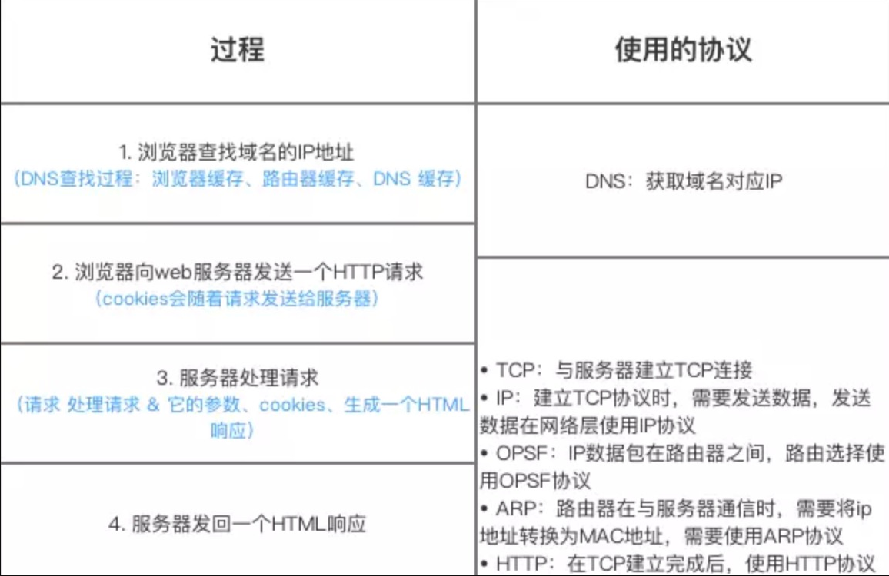


ARP协议

- ip转mac

DNS协议

- 域名转ip

数据链路层、数据报

TCP和UDP怎样把优势结合起来，你要怎么重写协议
你这个和tcp有什么区别？
拥塞控制是什么

TCP/IP 模型  & OSI模型

应用层、传输层、网络层常见协议 ： {  DNS 、 HTTP 、FTP、 STMP 、SSL、 TCP、 UDP、 ARP、 IP   }

【高频】 TCP 三次握手 、 TCP四次挥手

深入一些 :     为什么三次握手，能否两次？

四次挥手中什么是 time_wait 状态 ？ close-wait 状态?

time_wait状态什么场景下过多 ， 会造成什么问题？

TCP可靠性 ： {   ARQ 、 流量控制 、 拥塞控制 、 校验和  }

【高频】输入URL显示主页的过程        // 个人仅遇过一次，但是看面经感觉问的挺多

HTTPS 和HTTP 区别     // 字节专属问题

1. **端口** ：HTTP的URL由“http://”起始且默认使用端口80，而HTTPS的URL由“https://”起始且默认使用端口443。

2. 安全性和资源消耗：

   HTTP协议运行在TCP之上，所有传输的内容都是明文，客户端和服务器端都无法验证对方的身份。HTTPS是运行在SSL/TLS之上的HTTP协议，SSL/TLS 运行在TCP之上。所有传输的内容都经过加密，加密采用对称加密，但对称加密的密钥用服务器方的证书进行了非对称加密。所以说，HTTP 安全性没有 HTTPS高，但是 HTTPS 比HTTP耗费更多服务器资源。

   - 对称加密：密钥只有一个，加密解密为同一个密码，且加解密速度快，典型的对称加密算法有DES、AES等；
   - 非对称加密：密钥成对出现（且根据公钥无法推知私钥，根据私钥也无法推知公钥），加密解密使用不同密钥（公钥加密需要私钥解密，私钥加密需要公钥解密），相对对称加密速度较慢，典型的非对称加密算法有RSA、DSA等。

深入一些 ： HTTPS 加密过程介绍 ？

Cookie和Session的区别

Http1.0 和HTTP1.1 和 Http2.x 的区别

get和post的区别

- get是请求服务器资源
- post是向发送资源

常见的状态码

说说socket的基本步骤
进程间通信方式
TCP和UDP区别
TCP属于哪一层
网络层有什么协议
http请求头有什么关键字段
https了解吗，说说
https怎么加密的，对称和非对称加密说一下（不知道）

问了一下TCP、UDP区别

http 头部，tcp ip

http头部

https 的具体实现

cookie session  禁用cookie 怎么办

如何实现cookie，session

网络层级

tcp和udp

tcp 三次挥手，四次握手

三次握手、为什么多了第三次

第三次

四次挥手、多了哪一次、为什么

http协议了解吗？（不是很了解）

常见的http的状态码

http和https的区别

tcp怎么保证可靠传输

什么是粘包，怎么设计避免粘包

get、post了解吗（不了解）

OSI七层模型

http常用方法

post请求返回的100状态码是协议规定的还是浏览器规定的

8.TCP流量控制、拥塞控制
9.TCP流量控制是通过接收端发送带有接受窗口剩余大小的ACK来实现的，那么如果接收端的TCP没有CPU调度会发送ACK吗，会不会因为接受窗口满了并且不能及时发送ACK导致数据丢失，这个问题讨论了好久，不得不说，这个面试官真的好

什么是粘包？怎么解决

- TCP粘包就是指发送方发送的若干包数据到达接收方时粘成了一包，从接收缓冲区来看，后一包数据的头紧接着前一包数据的尾，出现粘包的原因是多方面的，可能是来自发送方，也可能是来自接收方。

- 原因

  - 发送方原因

    - TCP默认使用Nagle算法（主要作用：减少网络中报文段的数量），而Nagle算法主要做两件事：

    - 只有上一个分组得到确认，才会发送下一个分组；
    - 收集多个小分组，在一个确认到来时一起发送

  - 接收方原

    - TCP接收到数据包时，并不会马上交到应用层进行处理，或者说应用层并不会立即处理。
    - 实际上，TCP将接收到的数据包保存在接收缓存里，然后应用程序主动从缓存读取收到的分组。这样一来，如果TCP接收数据包到缓存的速度大于应用程序从缓存中读取数据包的速度，多个包就会被缓存，应用程序就有可能读取到多个首尾相接粘到一起的包

- 解决

  - 发送方
    - 对于发送方造成的粘包问题，可以通过关闭Nagle算法来解决，使用TCP_NODELAY选项来关闭算法。
  - 接收方
    - 解决办法：循环处理，应用程序从接收缓存中读取分组时，读完一条数据，就应该循环读取下一条数据，直到所有数据都被处理完成，但是如何判断每条数据的长度呢？
      - 格式化数据：每条数据有固定的格式（开始符，结束符），这种方法简单易行，但是选择开始符和结束符时一定要确保每条数据的内部不包含开始符和结束符。
      - 发送长度：发送每条数据时，将数据的长度一并发送，例如规定数据的前4位是数据的长度，应用层在处理时可以根据长度来判断每个分组的开始和结束位置。

- UDP会不会产生粘包问题呢？

  - TCP为了保证可靠传输并减少额外的开销（每次发包都要验证），采用了基于流的传输，基于流的传输不认为消息是一条一条的，是无保护消息边界的（保护消息边界：指传输协议把数据当做一条独立的消息在网上传输，接收端一次只能接受一条独立的消息）。
  - UDP则是面向消息传输的，是有保护消息边界的，接收方一次只接受一条独立的信息，所以不存在粘包问题。
    - 举个例子：有三个数据包，大小分别为2k、4k、6k，如果采用UDP发送的话，不管接受方的接收缓存有多大，我们必须要进行至少三次以上的发送才能把数据包发送完，但是使用TCP协议发送的话，我们只需要接受方的接收缓存有12k的大小，就可以一次把这3个数据包全部发送完毕。

# MySQL

[基础知识](https://github.com/Snailclimb/JavaGuide/blob/master/docs/database/MySQL.md)

 2.mysql索引：种类、数据结构、最左匹配、覆盖索引

 5.mysql查询：
 \- 查询所有两门及两门以上不及格的人 name、subject、score （having by）
 \- 查询所有合格人的名单

 20.mysql的索引、慢查询

1.     【高频】MyISAM 和 InnoDB的区别    ： {是否支持行锁 、 是否支持事务 、 是否支持 MVCC 、 底层索引结构不同 }

2.     事务特性ACID
       深入一些 ： 为什么要有一致性 ？ AID不是已经保证了一致性了吗 ？

3.     并发事务带来的问题 ： {    脏读 、 修改丢失 、 不可重复读 、 幻影读    }

4.     【高频】事务的隔离级别

5 【高频】 MVCC机制

6 .    【高频】索引

为什么索引使用B+树结构，而不是B树

为什么索引使用B+树结构，而不是红黑树 ： {  磁盘预读取 、红黑树高度 }

7.    聚簇索引和非聚簇索引区别？ 主键索引和二级索引了解吗？

8 .    为什么不对每个列创建索引呢？

9     【高频】SQL语句优化 ，SQL题目（字节要求撸代码）

10.    explain中 rows type key extra字段的含义？
11.    count(1) count(*) count(列值)的区别

事务是什么，四个性质，索引和联合索引，引擎有哪些

2、抖音实现关注和被关注，数据库怎么建表

sql与nosql区别
mysql与nosql优化
简单聊一下事务

1.b树和b+树
2.什么是联合索引
3.聚簇索引和非聚簇索引
4.mysql的锁
5.innodb和myisam两种引擎的区别
6.悲观锁和乐观锁
7.数据库联合查询
8.出了个索引的题（我说只熟悉理论，实操不会）

MySQL隔离级别

10.数据库隔离级别
11.MVCC
12.InnoDB索引实现
13.联合索引
14.MySQL字段类型的长短会对性能有影响吗
15.前缀匹配

# Redis

[常见问题总结](https://github.com/Snailclimb/JavaGuide/blob/master/docs/database/Redis/redis-all.md)

Redis原理 epoll             +1

redis分布式锁怎么实现

redis 跳表，bgsave 日志复制，集群模式

redis 限流
热点数据

redis 哨兵

Redis持久化方式
Redis单进程还是多进程？？我印象挺深的，为什么面试官要说单进程而不是单线程
Redis集群策略、分槽
Redistribution集群中不同节点如何通信
Gossip协议
跳表结构

Redis读写分离
场景题：Redis主从部署，在写请求特别多的场景下，如何保证在从节点读到的数据不是脏数据，我当时被这题问懵了，就说对从Redis上锁，同步完之后在进行回调，面试官笑了，说你还能改Redis源码啊🤣事后问大佬，一个可行解是给数据加上时间戳，然后在代码层面进行时间戳的比较，总之就是有点MVCC的味道
Redis是单进程单线程，那为什么RDB时候不会阻塞

Redis RDB持久化机制会阻塞主进程，这样主进程就无法响应客户端请求。

我们知道Redis对客户端响应请求的工作模型是单进程和单线程的，如果在主进程内启动一个线程，这样会造成对数据的竞争条件，为了避免使用锁降低性能。基于以上两点这就是为什么Redis通过启动一个进程来执行RDB了。

Redis基本类型

- String
- hash
- set
- zset
- list

Redis zset怎么实现

- 在set的基础上给每个数据加上一个score，然后对score进行排序

18.Redis持久化方式

- rdb redis数据库备份
- aof

19.全量复制、部分复制
20.复制积压缓冲区

1.缓存作用
2.分级缓存如何保证数据一致性
3.面试官一直深入分级缓存的数据一致性，比如什么时候删除脏数据、Redis主从部署怎么保证之类的，总之问的挺深，面试官逻辑非常缜密


# SpingBoot

9.Spring中的IOC、AOP怎么理解？
10.AOP与动态代理的关系？


# 消息队列

redis分布式锁怎么实现

mq消息可靠性 重复消费

mq怎么实现延迟队列

mq基本组件


# 数据结构

topK问题

设计小顶堆，每次与堆顶元素比较，如果大于，就插入


- merge k list 面试官让我自己实现一个heap 忘了heap的数据结构了没写出来


- 千万数据查一个id的出现次数 要求时间空间复杂度尽量优化


 6.算法题：最短路径和，leetcode64

 11.算法题：字符串数组的前K个频率字符串 - 要求时间复杂度NlogK，leetcode 347

​	- 我当时以为堆是NlogN，所以用了hashmap，对entry定向快排了，对时间复杂度掌握是真差

对一些大数据场景题需要了解。 例如 1亿数据取top10 ， 1亿数据取出现频率top10，1亿URL取出重复URL
64匹马，8个跑道，最少比赛几次选出前八？等智力题(字节常考)

反转链表

1、给二叉树的前序遍历和中序遍历，还原二叉树并输出后序遍历。（秒）

2、给出链表 1->2->3->4->5，输出 1->5->2->4->3，就是输出一前一后的遍历顺序，要求空间复杂度 O(n)

想了半天不知道怎么还原，给出了一个复杂度较高的做法，中间面试官提示了一下，没明白他的意思，然后面试官让我实现一下我的写法，然后我写了个递归每次取前一个再取后一个，遍历长度/2 的次数，直接返回链表后顺序输出。

3、给n个篮子（不是环），每个篮子ai个苹果，每次只能移动一个苹果到相邻的位置，求每个篮子苹果相等的最小操作次数，只要求说了代码思路（前面直接说了一个错误贪心方法，然后在面试官的提示下改对了思路，没让写代码）

1、判断一个数是否是完全平方数（秒）

2、给一个数开根号，小数点五位（秒）

1、打ACM竞赛碰到的最大挑战

2、淘宝天猫经常放出大量优惠卷（满200减100），其中有些优惠卷只能用于指定商品，怎么求出最大的优惠价格

一个射击运动员打靶，靶一共有10环，打10枪打中80环的可能性有多少种（秒，让说了一下dp的思路）

1、给一个矩阵，求最长下降路径长度。（从小到大排序，遍历一次，或者记忆化搜索）

2、有n个人，这些人之中有m个红帽子，剩下的人都是白帽子，每个人可以看到别人的帽子，这些人之中一定有一个红帽子，如果这些人知道了自己的帽子颜色，他们就会离开，问这n个人什么时候离开（从1个红帽子推到第2个红帽子，然后同样的思维应用数学归纳法）


1.遍历螺旋矩阵
2.求一个微服务系统中进行一次服务调用的最长时间，就是lc里的课程表二，是一个图的遍历问题

1.带有随机指针链表的深拷贝

1.带权重抽奖：100万个人，100个奖品，每个人中奖倍率不同，抽完为止，每人最多中奖一次。首先肯定是set去重作为返回值，我先用古典概型写了一个：基础中奖几率*中奖倍率，但是这样做对前面的人有优势，于是重新思考后用几何概型写了一个，List表示线段，List中存对应人的id。

1.算法：中文数字转阿拉伯数字，字符串处理问题

.二叉树的性质，以及满二叉树多少个节点
2.avl树和红黑树

lc112 验证二叉树路径和

1.链表节点两两反转
2.链表n个节点为一组反转

删除字符串中ab，保证最后字符串没有连接的ab，例aaabbb

.带有随机指针链表的深拷贝

匹配字符串

算法题：
1.输入n，k，输出n的字典序的第k位数字，若n=15，k=7，1 10 11 12 13 14 15 2 3 4 5 6 7 8 9，输出15      这道题浪费了好多时间，我刚开始还傻乎乎的重写Comparactor+StringBuilder来定义字典序，然后转化成topk问题解决，面试官说还有更优解，当时一直没想出来，也浪费了好多时间，最后面试官可能有事吧，等到1h时候面试官说可以了，今天面试先到这里吧，然后就挂了。。。事后我才知道可以用Trie树或dfs直接找到第k个数，然后就感觉特别可惜，因为我觉得自己前半段发挥挺好的，就因为这道题，以至于颓废了两三天，但最后结果还是好的，三面四天后收到了部门的意向书🤣

1.买卖股票二
2.买卖股票三


.你有一个日志，里面有用户的登入登出时间，用户id，找到某个用户登录的峰值（直接说了思路）
.好，那么你来写下这个代码
（OMG，当场我就懵逼了，让我写场景题的代码，我想了半天不知道输入的接口参数怎么设置，面试官和我说是三维的，OMG又蒙圈了，明明是一个很简单的的算法，但是不知道接口，迟迟动不了笔，后来面试官就没让我写了）


# Linux和操作系统

Linux的文件管理是怎样的

- 所有可操作的计算机资源都存在于目录树这个结构中，对计算资源的访问，可以看做是对这棵目录树的访问。

Linux的IO复用底层是怎样的

缺页中断到底发生了什么

- 从磁盘上找出所缺页面
- 在内存中找出一个空闲的块。如果没有，就是用页面置换算法，淘汰一个块
- 将页面读入内存
- 重新启动用户进程

用户态和内核态的区别

- 内核态(核心态,特权态): **内核态是操作系统内核运行的模式。** 内核态控制计算机的硬件资源，如硬件设备，文件系统等等，并为上层应用程序提供执行环境。
  - **对于那些危险的指令只允许内核及其相关模块调用，对于那些不会造成危险的指令，就允许用户应用程序调用。**
- 用户态: **用户态是用户应用程序运行的状态。** 应用程序必须依托于内核态运行,因此用户态的态的操作权限比内核态是要低的， 如磁盘，文件等，访问操作都是受限的。

用户态切换到内核态的几种方式

- 系统调用: 系统调用是用户态主动要求切换到内核态的一种方式， 用户应用程序通过操作系统调用内核为上层应用程序开放的接口来执行程序。
- 异常: 当cpu在执行用户态的应用程序时，发生了某些不可知的异常。 于是当前用户态的应用进程切换到处理此异常的内核的程序中去。
- 硬件设备的中断: 当硬件设备完成用户请求后，会向cpu发出相应的中断信号， 这时cpu会暂停执行下一条即将要执行的指令，转而去执行与中断信号对应的应用程序， 如果先前执行的指令是用户态下程序的指令，那么这个转换过程也是用户态到内核台的转换。

fork()作用

- 在父进程的基础上，创建一个一模一样的子进程，子进程会克隆父进程的资源，然后执行一样的操作

Select poll epoll的区别


虚拟内存作用？ 内存分页的作用？

- 逻辑上扩充了内存大小，以时间换空间

- 内存分页，方便管理和维护

OOM问题和 StackOverFlow的区别
进程线程区别

- 进程是CPU调度的基本单位，线程是资源分配的基本单位


线程的通讯

- 线程间的通信目的主要是用于线程同步

- 锁机制
- 信号量机制
- 信号机制

进程的通讯

- 管道(pipe)
  管道是一种半双工的通信方式，数据只能单向流动，而且只能在具有亲缘关系的进程间使用。进程的亲缘关系通常是指父子进程关系。
- 有名管道 (namedpipe)
  有名管道也是半双工的通信方式，但是它允许无亲缘关系进程间的通信。

- 信号量(semaphore)
  信号量是一个计数器，可以用来控制多个进程对共享资源的访问。它常作为一种锁机制，防止某进程正在访问共享资源时，其他进程也访问该资源。因此，主要作为进程间以及同一进程内不同线程之间的同步手段。

- 消息队列(messagequeue)
  消息队列是由消息的链表，存放在内核中并由消息队列标识符标识。消息队列克服了信号传递信息少、管道只能承载无格式字节流以及缓冲区大小受限等缺点。

- 信号 (sinal)
  信号是一种比较复杂的通信方式，用于通知接收进程某个事件已经发生。

- 共享内存(shared memory)
  共享内存就是映射一段能被其他进程所访问的内存，这段共享内存由一个进程创建，但多个进程都可以访问。共享内存是最快的 IPC 方式，它是针对其他进程间通信方式运行效率低而专门设计的。它往往与其他通信机制，如信号量，配合使用，来实现进程间的同步和通信。

- 套接字(socket)
  套接口也是一种进程间通信机制，与其他通信机制不同的是，它可用于不同设备及其间的进程通信。

进程怎么共享内存的

- 信号量+共享内存

进程线程切换的代价

- 进程需要切换内存地址和硬件上下文（程序计数器
- 线程只需要切换硬件上下文，线程共享进程内存空间

linux查看进程所占内存命令

```
ps -ef
```

怎么查看cpu占有率

```
top
```

Linux查看具体端口是否被占用

```
lsof -i:端口号
```

操作系统分页和分段的区别


# 消息中间件

​	mq消息可靠性 重复消费

​	mq怎么实现延迟队列

​	mq基本组件


# HR面

​	1.自我介绍

​	2.实习时长

​	3.优点有什么

​	4.最大的缺点是什么

​	5.为什么跨考计算机（本人之前机械）

​	6.职业规划

​	7.为什么来头条

​	8.了解自己投递的部门吗

​	9.你想在实习中学到什么


hr面：（15分钟）
1.介绍自己
2.平常的学习方式
3.学这个多久了
4.打算怎么弥补自己的不足
5.以后打算在哪工作以及目标公司
6.你有什么想问的
7.介绍了我面试的部门的团队，沟通了实习时间，到岗时间，薪资等


# 美团一面

JVM垃圾回收机制

为什么不使用运用计数法，该方法的优缺点

jvm运行时数据区

堆中除了新生代、老年代这些还有什么？

- 应该是还有字符串常量池

java集合基本框架

- hashmap,hashset,vector,arraylist,linkedlist

java内存泄露的情况？

- 静态集合类
- 非静态内部类
- 各种连接
- 作用域不正确的变量
- 哈希值改变

一道算法题

- 给个升序可重复的数字序列，如果统计出绝对值不同的数？
- 例：-7 -7 -4 0 3 4  8 10
- 这里面有8个数，但是-7重复，-4和4绝对值重复，所以结果为6

